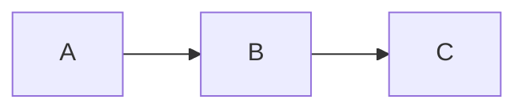

# {Topic} — Design

> **Date**: {YYYY-MM-DD}
> **Author**: {full model name, e.g. Opus / GPT-5.4 / Claude Sonnet}
> **Status**: Draft
> **Prior doc**: {optional relative link, e.g. [xxx](../refactor/xxx.md); delete this line if none}

---

## Context

<!--
Answer three things, in order:
1. What the current system / module looks like — facts, cite `path:line` when useful.
2. What problem appeared — concrete and verifiable, not "performance is bad".
3. Why do it now — what does it unblock, or what does it pave the way for?
-->

{current state + problem + timing}

### Constraints & assumptions

- {constraint 1, e.g. "external URLs stay unchanged"}
- {constraint 2}

---

## Principles

<!--
3–6 items that guide every option choice below.
Examples:
- No layer leakage: external callers only see WorldContext.
- Hard refactor, no compatibility kept.
- The LLM emits semantic judgments only; execution policy is derived in code.
-->

1. **{principle 1}**: {one-line explanation}
2. **{principle 2}**: {one-line explanation}
3. **{principle 3}**: {one-line explanation}

---

## Options

<!--
Even if you end up with one option, lay out at least 2 candidates ("do nothing"
counts) and make the trade-off explicit.
-->

### Option A: {name}

- **Idea**: {core approach}
- **Pros**:
  - {pro 1}
  - {pro 2}
- **Cons**:
  - {con 1}
- **Risk**: {risk}

### Option B: {name}

- **Idea**:
- **Pros**:
- **Cons**:
- **Risk**:

### Choice

**Adopt option {A / B}.**

**Rationale**: {why this one, what is sacrificed, what is gained}

---

## Design

### 1. Target structure

<!--
Use mermaid or text + code block to show the final shape.
Contrast "before / after" when useful.
-->

### 2. Core types & responsibilities

| Type / Module | Responsibility | Out of scope |
|---|---|---|
| `{TypeA}` | {what it does} | {what it does not do} |
| `{TypeB}` | {what it does} | {what it does not do} |

### 3. Key flows

{describe 1–N key flows step by step, 3–8 steps each}

### 4. Key decisions

- **Decision 1**: {question} → {choice} → {reason}
- **Decision 2**:

---

## Impact

- **Code**: {crates / directories / files affected}
- **Config**: {prompts / yaml / env}
- **Data**: {DB schema / storage format}
- **External interface**: {HTTP / WS / events}

---

## Risks & mitigations

| Risk | Likelihood | Impact | Mitigation |
|---|---|---|---|
| {risk 1} | {high/med/low} | {high/med/low} | {mitigation} |

---

## Roadmap

<!--
Optional. If the design lands in phases, list phases + dependencies.
Each phase maps to a separate spec; just hold the place here.
-->

- **Phase 0**: {what} → spec `doc/exec/{date}-{topic}-phase-0-spec-{model}.md`
- **Phase 1**:
- **Phase 2**:

---

## Appendix (optional)

<!--
References, glossary, supporting data, early options that were rejected.
Keep the main body clean; push details here.
-->
