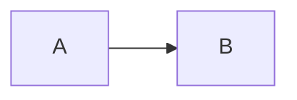

# {Topic} — Refactor

> **Date**: {YYYY-MM-DD}
> **Author**: {full model name}
> **Status**: Draft
> **Scope**: {crates / directories affected, e.g. `src/core/director/`}
> **Prior doc**: {optional; e.g. the related review or earlier design}

---

## Context

<!--
A refactor's Context is more focused than a design's: state exactly where the
current implementation is broken. Back every point with `path:line` or a snippet.
-->

{list the concrete problems in the current implementation, each backed by evidence}

### 1. {problem area 1}

- {concrete problem 1}
- {concrete problem 2}

### 2. {problem area 2}

- {concrete problem}

---

## Refactor principles

<!--
AISE defaults to hard refactors (R-REFACTOR-01/02). If you keep
compatibility, state why explicitly.
Typical:
- No fallback: the old path is deleted entirely, no degradation kept.
- No backward compatibility: structs, signatures, event types may be renamed freely.
- Archive only: deleted old code is archived under doc/references/ if needed.
-->

1. **{principle 1}**: {one line}
2. **{principle 2}**: {one line}
3. **Hard refactor / keep compatibility**: {explicit choice + reason}
4. **Migration cadence**: {one-shot switch / phased / module-by-module}

---

## Change list

<!--
Table every file to change and the nature of the change, with priority / phase.
-->

| # | File / Module | Change | Priority | Phase | Note |
|---|---|---|---|---|---|
| 1 | `{path}` | add / rewrite / delete / migrate / rename | P1 | Phase 1 | {brief} |
| 2 | `{path}` | | | | |

### Deletions

- `{module/file removed}` — {reason: replaced by which new module}

### Additions

- `{new module/file}` — {responsibility}

### Renames

- `{old name}` → `{new name}` — {reason}

---

## Target structure

### 1. Module relationships



### 2. Core type definitions

```rust
// Signatures only; no full implementation needed.
pub struct NewType {
    // ...
}
```

### 3. Key flow (after)

{describe the new flow as steps or a sequence diagram, contrasted with the old flow in Context}

---

## Migration steps

<!--
Each step must be independently committable and independently testable.
Avoid "one commit changes thousands of lines".
-->

1. **{step 1}**: {what} — {acceptance: {checkable condition}}
2. **{step 2}**: {what} — {acceptance}
3. **{step 3}**: {what} — {acceptance}

---

## External impact

- **HTTP / WS URLs**: {changed? list all paths if so}
- **DB schema / storage**: {migration needed? data compatibility}
- **Prompt assets**: {asset id / template changes}
- **Config files**: {env / yaml / toml diffs}
- **Downstream**: {other crates / callers to adjust}

---

## Risks & rollback

| Risk | Mitigation | Rollback cost |
|---|---|---|
| {risk 1} | {mitigation} | {high/med/low} |

<!--
If this is a hard refactor with no rollback, state it:
"This is a hard refactor with no rollback path; on failure, revert commit range {range}."
-->

---

## Acceptance checklist

- [ ] {condition 1, e.g. `cargo test` passes}
- [ ] {condition 2, e.g. {key behavior} verified end to end}
- [ ] {condition 3, e.g. old module fully removed, `rg 'OldType' src/` returns nothing}
- [ ] {condition 4, e.g. docs updated (AGENTS.md / references)}

---

## Appendix

<!--
Optional:
- Key logic of deleted code archived (or linked to doc/references/).
- Refactor directions considered but not taken.
-->
