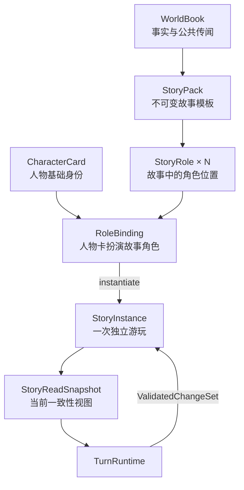

# AISE Story Pack Design v3.0

> 本文定义 AISE 原生故事包、人物卡、知识模型、Narrative Graph 及其与 Turn Runtime
> 的集成边界。本文是资产与运行时集成设计，不包含数据库表、迁移编号或具体序列化
> 实现。Turn 执行仍以
> [AISE Turn Runtime 架构](./2026-08-04-Architecture-gpt.md) 为准。

## 0. v3.0 修订重点

本文是独立、完整的 v3.0 设计，不依赖 v2.0 才能阅读或实施。本版明确收敛以下三项
规则：

1. **System Prompt 由项目内部配置**：各 Pipeline 可以通过项目内部可信 `prompt`
   模块选择、组合和版本化 System Prompt；Story Pack、Character Card、World Book、
   玩家输入、存档和 LLM 输出都只能作为 Runtime Context 数据，不能提供、选择、填充
   或修改 System Prompt。
2. **只支持 AISE 原生资产**：人物卡、世界书和故事包必须按照 v3 Schema 从头制作；
   不定义外部卡片格式的导入、映射、兼容、回退或无损转换语义。
3. **故事角色与人物卡正交组合**：Story Pack 可以包含多个 `StoryRole`，并为每个
   StoryRole 指定默认 `CharacterCard`。StoryRole 只提供目标、关系、初始状态、秘密和
   Seed Memory 等故事相关信息；姓名、外观、人格、价值观和说话方式始终来自被绑定的
   CharacterCard。玩家可以从可玩 StoryRole 中选择一个，并使用自己的 AISE 原生人物卡
   扮演该角色。

以上规则必须落实到 Schema、类型、实例化流程和 Validation 中，不能只依赖 Prompt
约定。

## 1. 核心结论

Story Pack 是一份**不可变、可复用、完全不可信的故事内容模板**，只描述：

- 故事是什么。
- 世界初始是什么样。
- 有哪些故事角色、每个角色在本故事中的职责与初始状态。
- 默认由哪些人物卡扮演这些故事角色，以及哪些角色可由玩家选择扮演。
- 故事从哪里开始。
- 世界中有哪些事实、公共传闻和角色初始记忆。
- Narrative Graph 希望故事向哪些方向发展。

Story Pack 不描述：

- System Prompt、Developer Prompt 或任何 Prompt 片段。
- 消息角色、Prompt 顺序、注入位置或上下文模板。
- 模型、temperature、token、stop、Tool 或 Skill 配置。
- Retrieval 算法、预算、并发、超时、Validation 开关或日志策略。
- 数据库命令、状态 Patch、脚本、宏或可执行表达式。

系统必须遵守以下五条硬性原则：

1. **内容与权限分离**：Story Pack、Character Card、World Book、玩家输入及 LLM
   输出全部是不可信数据，永远不能成为 System Prompt，也不能改变消息角色。
2. **模板与实例分离**：Story Pack 是不可变模板；Story Instance 是一次独立游玩的
   可变状态，两者使用不同 ID、生命周期和导入导出格式。
3. **故事角色与人物身份分离**：`StoryRole` 只定义故事内职责、目标、关系、记忆和
   初始状态；`CharacterCard` 只定义姓名、人格、说话方式等基础身份；二者通过
   `RoleBinding` 组合，任何一方都不能覆盖另一方拥有的字段。
4. **真相与认知分离**：知识只分为 `Fact`、`Rumor`、`Memory` 三类；事实不等于
   角色知道，角色认知也不等于事实。
5. **叙事意图与状态修改分离**：Narrative Graph 只能产生 `GlobalEventIntent` 和
   `CharacterImpulse` 两种可执行影响，不能直接写故事、控制角色或修改权威状态。

## 2. 信任边界与 Prompt 安全

### 2.1 System Prompt 只属于项目内部 Prompt 模块

每类 LLM Pipeline 使用哪个 System Prompt，只能由项目内部可信的 `prompt` 模块
配置和生成。该模块可以从随项目发布的代码、静态资源或受信配置中加载、组合和版本化
Prompt，但其输入边界必须完全位于引擎内部。Story Pack、Character Card、World
Book、玩家输入、存档内容和 LLM 输出都不能参与 System Prompt 的选择或插值。

任何面向故事内容层的接口只要接受任意 `system: String`、`Vec<Message>`、消息角色或
Prompt 模板，就违反本设计。

概念接口如下：

```rust
pub enum PromptProfile {
    WriterPlanner,
    CharacterThink,
    StoryGenerator,
    StoryRepairer,
    NarrativeValidator,
}

pub struct ModelRequest<C> {
    pub profile: PromptProfile,
    pub context: C,
}
```

`LlmGateway` 根据 `PromptProfile` 请求项目内部 `prompt` 模块生成可信 System
Prompt，再把类型化 Context 序列化为不可信数据消息。内容层调用者不能提交自定义
System Prompt。

`PromptProfile` 由当前 Pipeline 类型固定选择，不能由 Story Pack 或玩家输入选择。
`prompt` 模块使用的动态参数也只能来自受信的项目配置；不能包含任何从故事内容、
人物卡、用户数据或模型输出插值而来的值。

```text
Project Prompt Module
        |
        v
Trusted System Prompt  +  Typed Runtime Context  ->  Model Request
                               ^
                               |
              Story Pack / Character Card / Player Input
                         untrusted data only
```

### 2.2 Context Builder 只组装数据

严格来说，`BaselineContextBuilder` 与 Retrieval 相关组件组装的是
`TypedRuntimeContext`，不是允许内容作者参与拼接的 Prompt。

Context Builder 可以：

- 从一致性 Snapshot 读取故事、世界、角色和 Narrative 状态。
- 根据 `WriterPlan.retrieval_requests` 按需召回知识。
- 按稳定规则执行权限过滤、去重、冲突保留、排序和预算裁剪。
- 把数据放入引擎预定义的语义段。
- 使用规范 JSON 或等价的确定性编码转义内容，不拼接原始消息头或自定义分隔符。

Context Builder 不可以：

- 把任何内容插入 System Prompt。
- 接受故事包指定的消息角色、物理位置、深度或模板。
- 执行故事包中的变量、宏、脚本、正则或表达式。
- 让故事包提高预算、关闭校验或启用工具。

固定语义段至少包括：

```text
Story Profile
Canonical Facts
Shared Rumors
Character Memories
Current Perception
Active Narrative
Recent Story
Player Input
```

具体物理顺序和 Provider 消息格式由引擎决定，不属于 Story Pack 协议。

### 2.3 原生格式禁止 Prompt 相关字段

`aise_char_v3`、`aise_world_v3`、`aise_story_v3` 必须使用严格 Schema，并默认拒绝
未知字段。以下字段或等价语义不得出现在可执行资产模型中：

```text
system_prompt
developer_prompt
prompt
post_history_instructions
jailbreak
message_role
template
position
depth
injection_order
stop
model
tools
skills
temperature
max_tokens
```

未知扩展不得透传进运行时，也不得以 `metadata`、`extensions` 或原始 JSON 等形式绕过
Schema。Runtime、Context Builder 和 LLM Pipeline 只能读取验证后的 AISE 原生模型。

### 2.4 只接受 AISE 原生资产

AISE v3 只有一条资产制作路径：所有人物卡、世界书和故事包都必须从头按照
`aise_char_v3`、`aise_world_v3` 和 `aise_story_v3` 规范制作，并通过严格 Schema
校验后才能导入和运行。

- 导入入口只解析原生字段和文件约定。
- 不提供旧格式回退路径或运行时双协议。
- 用户自己制作或选择的人物卡也必须是有效的 AISE 原生 Character Card。
- 引用的 Character Card 与 World Book 必须在发布或实例化时固定版本和内容摘要。
- 不符合原生规范的资产直接返回可诊断的导入错误，由作者显式重制。

这既是安全边界，也是格式边界：AISE 只维护一套明确语义，不猜测未定义字段应当如何
映射为身份、事实、传闻、记忆或故事状态。

### 2.5 不依赖模型自觉保证安全

把内容标记为“数据而非指令”是必要措施，但不是最终安全边界。任意自然语言仍可能
包含诱导模型越权的文本，因此系统还必须保证：

1. LLM 只能产生不可信 `StoryProposal`。
2. Proposal 必须经过 Schema、引用、权限、知识边界和领域不变量校验。
3. 只有 `ValidatedChangeSet` 可以进入 `TurnCommitter`。
4. Story Pack 不能授予 Tool、网络、文件、数据库或其他外部权限。
5. 所有资源数量、文本长度、Context 大小和 Graph 规模都受引擎硬预算限制。

安全目标不是假设 LLM 永远不会被内容诱导，而是确保即使模型产生越权输出，该输出
也无法取得权限或写入权威状态。

### 2.6 容器与资源安全

原生文本格式为 `story.aise.json`。需要图片、音频等资源时，可使用
`story.aise-pack` 容器，内部为 `manifest.json + assets/`。

导入器必须：

- 拒绝绝对路径、`..`、符号链接、重复路径和越界资源引用。
- 限制压缩后大小、解压后大小、压缩比、文件数量和单文件大小。
- 只允许明确列入白名单的静态 MIME 类型，不执行 HTML、脚本或二进制程序。
- 不自动访问远程 URL，不接受本地文件路径；资源只能通过包内 `asset_id` 引用。
- 校验内容摘要，避免同一资源 ID 指向不同内容。

## 3. 资产层级与生命周期



| 对象 | 身份 | 生命周期 | 是否可变 | 主要内容 |
| --- | --- | --- | --- | --- |
| `CharacterCard` | `CharacterAssetKey + version` | 可跨故事复用 | 否 | 姓名、外观、人格、价值观、说话方式 |
| `WorldBook` | `WorldBookKey + version` | 可跨故事复用 | 否 | Fact Seed、Rumor Seed |
| `StoryRole` | `RoleKey`（Pack 内） | 随 Story Pack | 否 | 故事职责、目标、关系、记忆、初始状态 |
| `StoryPack` | `PackId` | 发布版本级 | 否 | 故事、开场、Roles、Default Cast、Narrative Graph |
| `RoleBinding` | `RoleKey -> CharacterId` | 一次游玩 | 创建后固定 | 哪张人物卡扮演哪个故事角色、由玩家还是 AI 控制 |
| `StoryInstance` | `StoryId` | 一次游玩 | 是 | 当前世界、角色状态、记忆、Graph 状态、历史 Turn |
| `StoryReadSnapshot` | `StoryId + revision` | 单 Turn | 否 | 当前 Turn 的一致性只读视图 |

### 3.1 StoryRole、CharacterCard 与 RoleBinding

StoryRole 与 CharacterCard 是“角色”和“演员”的关系，不是继承关系，也不是两份人物
资料的覆盖合并：

| 数据范围 | 唯一所有者 | 示例 | 组合规则 |
| --- | --- | --- | --- |
| 人物基础身份 | `CharacterCard` | 姓名、外观、人格、价值观、恐惧、说话方式、对话示例 | StoryRole 不得声明或覆盖 |
| 故事角色信息 | `StoryRole` | 叙事职责、当前目标、初始位置、状态、关系、秘密、Seed Memory | 物化到本次 Story Instance，不回写人物卡 |
| 扮演与控制关系 | `RoleBinding` | `RoleKey -> CharacterId`、Player / AI Controller | 创建 Story Instance 时确定 |

概念模型如下：

```rust
pub enum RoleController {
    Player(PlayerId),
    Ai,
}

pub struct RoleBinding {
    pub role_key: StoryRoleKey,
    pub character_id: CharacterId,
    pub character_asset: FrozenCharacterAssetRef,
    pub controller: RoleController,
}
```

`FrozenCharacterAssetRef` 至少包含 CharacterAssetKey、版本和内容摘要；它只固定本次
游玩使用的人物卡版本，不把人物卡复制回 Story Pack。

因此，故事包可以定义“灰林守护者”这个 StoryRole，并默认让 Seraphina 人物卡扮演；
玩家也可以选择自己的 AISE 人物卡扮演该角色。无论绑定哪张卡：

- 姓名、性格和说话方式始终来自被绑定的 CharacterCard。
- “守护灰林”“隐瞒仪式真相”等目标来自 StoryRole。
- 祭坛仪式的经历、与其他故事角色的关系等 Seed Memory 来自 StoryRole，并绑定到
  本次实例中的 CharacterId。
- StoryRole 不修改 CharacterCard 原文件，也不会影响该人物卡在其他故事中的使用。

两类模型使用互不重叠的字段集合，从 Schema 层消除覆盖歧义。StoryRole 中出现
`name`、`personality`、`speaking_style`、`dialogue_examples` 等人物卡字段时，导入必须
失败，而不是按优先级静默覆盖。

人物卡的人格或价值观可能与故事目标存在张力，例如善良人物被迫扮演需要隐瞒真相的
角色。这种张力应由 Character Think 自主处理，不得用 StoryRole 改写人格来消除。

### 3.2 Story Pack 与 Story Instance

导入 Story Pack 只创建不可变 `PackId`，不创建可游玩的 `StoryId`。创建 Story
Instance 时才执行以下操作：

1. 玩家从 `playable_role_keys` 中选择要扮演的 StoryRole。
2. 玩家选择使用该角色的默认人物卡，或绑定自己制作的 AISE 原生 Character Card。
3. 其余 StoryRole 使用 `default_cast` 绑定；每个 StoryRole 都必须提供默认人物卡。
4. 为每个 RoleBinding 生成稳定 `CharacterId`，并记录 Player / AI Controller。
5. 将 StoryRole 的初始状态、关系与 Seed Memory 物化到对应 CharacterId。
6. 将 Fact Seed 物化为 `WorldFact { source: Seed }`。
7. 将 Rumor Seed 物化为当前故事的公共认知。
8. 将 `start` 写入初始 Scene 和开场记录。
9. 创建独立 `NarrativeRuntimeState`。

第一个 Turn 开始前，每个 StoryRole 必须恰好绑定一个有效 CharacterId。玩家选择的
人物卡只替换所选 StoryRole 的默认绑定，不改变 Story Pack，也不影响其他角色。
Story Instance 必须固定该人物卡的 Key、版本和内容摘要，保证存档可重放。

玩家控制的 RoleBinding 不进入 `CharacterThinkPipeline`。Narrative Graph 针对该
StoryRole 产生的 `CharacterImpulse` 必须标记为不适用并停止分发，不能转成玩家台词、
动作或隐性决定；同一角色由 AI 控制时则正常分发给绑定的人物卡。

`start`、初始角色状态、Seed Knowledge 和 Graph 初态只应用一次。后续 Turn 只能读取
`StoryReadSnapshot` 中的当前状态，不能重新从 Story Pack 覆盖运行状态。

### 3.3 版本与可重复游玩

- `meta.title` 只用于展示，不能作为业务 ID。
- Pack 内所有角色、知识、场景、节点和边必须使用稳定 Key。
- `PackId` 由导入层分配；幂等性使用规范化内容摘要与包版本判断。
- 修改 Story Pack 必须发布新版本；已有 Story Instance 始终固定到创建时的版本。
- RoleBinding 在 Story Instance 创建后固定；换人物卡必须创建新的 Story Instance。
- 同一个 Pack 可以创建任意多个彼此隔离的单人存档、多人房间或分支实例。

## 4. 原生资产模型

### 4.1 Character Card：只描述“这个角色是谁”

`aise_char_v3` 只保存可跨故事复用的角色定义：

```jsonc
{
  "spec": "aise_char_v3",
  "spec_version": "3.0",
  "character_key": "character.seraphina",
  "meta": {
    "name": "Seraphina",
    "creator": "SeraphinaStudio",
    "version": "3.0.0",
    "tags": ["elf", "ranger"]
  },
  "profile": {
    "description": "银发精灵游侠，习惯独自旅行并先观察后行动。",
    "personality": ["谨慎", "克制", "重视承诺"],
    "values": ["保护弱者", "不伤害无辜"],
    "fears": ["自己的判断令无辜者受害"],
    "speaking_style": {
      "register": "calm",
      "verbosity": "concise",
      "traits": ["少用夸张语气", "先观察再回应"]
    },
    "dialogue_examples": [
      {
        "situation": "陌生人询问遗迹入口",
        "response": "有些门关闭，并不是为了隐瞒。"
      }
    ]
  }
}
```

Character Card 不包含：

- 当前故事场景。
- 当前目标、生命、位置、关系或阵营状态。
- Memory、知识边界或世界书。
- 开场白。
- Prompt、思考指令或运行参数。

这些故事相关内容由 `StoryPack.roles` 提供，并在创建 Story Instance 时物化。

### 4.2 StoryRole：只描述“在这个故事里扮演什么”

StoryRole 是 Story Pack 内部的故事位置，不是人物卡。它只保存与当前故事相关的
信息：

```jsonc
{
  "role_key": "role.guardian",
  "role_label": "灰林守护者",
  "narrative_function": "守护结界并掌握仪式真相的人",
  "initial_state": {
    "location": "location.grey_forest_gate",
    "goals": ["确认来访者的真实来意", "阻止结界失控"],
    "attributes": {
      "health": 100,
      "trust_visitor": 20
    }
  },
  "initial_relationships": [
    {
      "target_role_key": "role.visitor",
      "kind": "stranger",
      "trust": 20
    }
  ],
  "seed_memories": [
    {
      "memory_key": "memory.guardian.last_ritual",
      "kind": "fragmented_observation",
      "content": "月光曾落在祭坛上，但仪式之后的经历已经模糊。",
      "tags": ["祭坛", "仪式", "月光"],
      "salience": 90
    }
  ]
}
```

- `role_label` 是故事位置的展示名，不是人物姓名。
- `narrative_function` 是作者对该角色在故事结构中作用的描述，不是人格指令。
- `initial_state`、关系和 Memory Seed 都通过 RoleBinding 物化到当前 Story Instance。
- StoryRole 之间只能使用 `RoleKey` 引用，不能假设最终绑定的人物姓名或
  `CharacterAssetKey`。
- StoryRole 不允许包含人物外观、性格、说话方式或对话示例。

### 4.3 World Book：Fact 与 Rumor 的可复用种子

`aise_world_v3` 是知识内容资产，只包含 `facts` 与 `rumors`。两类知识通过集合类型
确定语义，不再使用容易混淆的 `authority: canonical | lore` 字符串。

```jsonc
{
  "spec": "aise_world_v3",
  "spec_version": "3.0",
  "world_book_key": "world.eldoria",
  "meta": {
    "name": "Eldoria",
    "version": "3.0.0"
  },
  "facts": {
    "fact.grey_forest.boundary": {
      "subject": "location.grey_forest",
      "predicate": "boundary_protection",
      "value": "ancient_ward",
      "content": "灰林边界由古老结界维持。",
      "entities": ["location.grey_forest"],
      "tags": ["结界", "灰林"],
      "salience": 80
    }
  },
  "rumors": {
    "rumor.guardian.curse": {
      "claim": {
        "subject": "role.guardian",
        "predicate": "ward_cost",
        "value": "memory"
      },
      "content": "人们都说，守护者每使用一次结界就会失去一段记忆。",
      "entities": ["role.guardian", "location.grey_forest"],
      "tags": ["守护者", "诅咒", "记忆"],
      "salience": 70
    }
  }
}
```

`entities`、`tags` 和 `salience` 只是有界的检索提示。它们不能指定检索算法、模型、
预算、Prompt 位置或强制注入；最终召回行为由引擎配置与当前 `RetrievalRequest`
决定。

Fact 的 `subject + predicate + value` 是可选的结构化命题，可供确定性状态判断；
`content` 是对应的叙事表达。Rumor 的 `claim` 只表示公共说法，不声明它为真。

知识条目不得使用 `CharacterAssetKey` 表示“当前扮演某个故事角色的人物”，因为人物卡
绑定可以在实例化时被玩家替换。故事特有的角色引用使用 `RoleKey`，运行时再通过
RoleBinding 解析为 CharacterId；跨 Story Pack 复用的知识应使用稳定的世界实体 Key。

### 4.4 Story Pack：完整故事模板

`aise_story_v3` 可以内嵌人物卡和世界书，也可以引用打包时已固定版本及摘要的 AISE
原生资产。发布后的 Pack 必须自包含或能在导入时完成依赖固定，不能在运行中跟随所
引用资产的后续变化。
以下示例以包含封面资源的 `.aise-pack` manifest 为例；纯 JSON 格式可以省略
`cover_asset` 与 `assets`。

```jsonc
{
  "spec": "aise_story_v3",
  "spec_version": "3.0",
  "meta": {
    "pack_key": "seraphina-studio.grey-forest-whispers",
    "title": "灰林的低语",
    "author": "SeraphinaStudio",
    "version": "3.0.0",
    "description": "旅人进入灰林后，逐步发现守护者遗失记忆的真相。",
    "tags": ["fantasy", "mystery"],
    "cover_asset": "asset.cover"
  },
  "story": {
    "premise": "古老结界正在衰弱，守护者却不记得自己曾经付出的代价。",
    "language": "zh-CN",
    "genre": ["fantasy", "mystery"],
    "themes": ["记忆与责任", "真相与公共认知"],
    "style": {
      "tone": ["mysterious", "restrained"],
      "point_of_view": "second_person",
      "tense": "present"
    }
  },
  "character_assets": {
    "character.seraphina": {
      "spec": "aise_char_v3",
      "spec_version": "3.0",
      "character_key": "character.seraphina",
      "meta": {
        "name": "Seraphina",
        "version": "3.0.0"
      },
      "profile": {
        "description": "银发精灵游侠，习惯先观察后行动。",
        "personality": ["谨慎", "克制", "重视承诺"],
        "values": ["保护弱者", "不伤害无辜"],
        "speaking_style": {
          "register": "calm",
          "verbosity": "concise"
        }
      }
    },
    "character.arin": {
      "spec": "aise_char_v3",
      "spec_version": "3.0",
      "character_key": "character.arin",
      "meta": {
        "name": "Arin",
        "version": "1.0.0"
      },
      "profile": {
        "description": "年轻的人类学者，对古代遗迹有强烈好奇心。",
        "personality": ["好奇", "坦率", "行动果断"],
        "values": ["追寻真相", "兑现承诺"],
        "speaking_style": {
          "register": "direct",
          "verbosity": "moderate"
        }
      }
    }
  },
  "roles": {
    "role.guardian": {
      "role_label": "灰林守护者",
      "narrative_function": "守护结界并掌握仪式真相的人",
      "initial_state": {
        "location": "location.grey_forest_gate",
        "goals": ["确认来访者的真实来意", "阻止结界失控"],
        "attributes": {
          "health": 100,
          "trust_visitor": 20
        }
      },
      "initial_relationships": [
        {
          "target_role_key": "role.visitor",
          "kind": "stranger",
          "trust": 20
        }
      ],
      "seed_memories": [
        {
          "memory_key": "memory.guardian.last_ritual",
          "kind": "fragmented_observation",
          "content": "月光曾落在祭坛上，但仪式之后的经历已经模糊。",
          "tags": ["祭坛", "仪式", "月光"],
          "salience": 90
        }
      ]
    },
    "role.visitor": {
      "role_label": "灰林来访者",
      "narrative_function": "从外部进入灰林并逐步揭开真相的人",
      "initial_state": {
        "location": "location.grey_forest_gate",
        "goals": ["查明结界异常的原因"],
        "attributes": {
          "health": 100
        }
      },
      "initial_relationships": [
        {
          "target_role_key": "role.guardian",
          "kind": "stranger",
          "trust": 10
        }
      ],
      "seed_memories": [
        {
          "memory_key": "memory.visitor.village_warning",
          "kind": "reported_information",
          "content": "村民警告过你：最近不要靠近灰林结界。",
          "tags": ["村民", "警告", "结界"],
          "salience": 70
        }
      ]
    }
  },
  "default_cast": {
    "role.guardian": {
      "character_ref": "character.seraphina"
    },
    "role.visitor": {
      "character_ref": "character.arin"
    }
  },
  "play": {
    "player_count": 1,
    "playable_role_keys": ["role.guardian", "role.visitor"]
  },
  "world_book": {
    "spec": "aise_world_v3",
    "spec_version": "3.0",
    "world_book_key": "world.eldoria.grey_forest",
    "facts": {},
    "rumors": {}
  },
  "start": {
    "scene_key": "scene.grey_forest_gate",
    "location_key": "location.grey_forest_gate",
    "time": "黄昏",
    "description": "灰林入口被低雾覆盖，结界发出间歇性的微光。",
    "opening": "低雾覆盖着灰林入口，结界的微光映出两个在黄昏中相遇的身影。"
  },
  "narrative": {
    "entry_nodes": ["node.arrival"],
    "nodes": {
      "node.arrival": {
        "title": "抵达灰林",
        "objective": "让来访者与守护者首次接触，并让双方意识到结界异常。",
        "activate_when": { "type": "story_started" },
        "complete_when": {
          "type": "event_occurred",
          "event_key": "event.guardian_met_visitor"
        },
        "skip_when": null,
        "effects": {
          "on_activate": [
            {
              "type": "global_event",
              "event_key": "event.grey_forest.fog_rises",
              "category": "environment",
              "description": "入口的雾突然变浓，结界短暂熄灭。"
            },
            {
              "type": "character_impulse",
              "target_role_key": "role.guardian",
              "goal": "判断来者是否会威胁灰林",
              "emotion": "警惕",
              "urgency": "high"
            },
            {
              "type": "character_impulse",
              "target_role_key": "role.visitor",
              "goal": "在结界再次变化前接近守护者并获得信息",
              "emotion": "紧迫",
              "urgency": "high"
            }
          ],
          "on_complete": []
        },
        "terminal": false
      }
    },
    "edges": []
  },
  "assets": {
    "asset.cover": {
      "path": "assets/cover.png",
      "mime_type": "image/png",
      "digest": "sha256:..."
    }
  }
}
```

`story.premise`、主题、风格、节点目标等仍然是故事内容，而不是 Prompt。引擎可以把
它们放入固定的 `Story Profile` 或 `Active Narrative` 数据段，但不能把它们拼进
System Prompt。

`default_cast` 是 Story Pack 推荐的默认选角，不是不可替换的人物身份。假设玩家选择
`role.guardian` 并使用自己的 `character.kai` 人物卡，实例化结果概念上是：

```text
role.guardian -> character.kai       -> Player Controller
role.visitor  -> character.arin      -> AI Controller
```

此时 `character.kai` 保留自己的姓名、人格和说话方式，同时获得 `role.guardian` 的
故事目标、关系、初始状态和 Seed Memory。Seraphina 人物卡与 Story Pack 均不被修改。
`opening` 是 Story Pack 唯一的正式故事开篇，不依赖玩家选择的 Role。它必须避免替任何可玩角色作出尚未发生的选择；若不同玩家身份需要互不相容的故事开端，应拆分为不同 Story Pack，而不是提供按 Role 分叉的开篇。

## 5. 知识模型

### 5.1 三类知识

| 类型 | 表示什么 | 与角色的关系 | 真实性 | 召回规则 |
| --- | --- | --- | --- | --- |
| `Fact` | 世界当前的权威事实 | 不与角色绑定；角色不自动知道 | 由系统视为真 | 按当前情形召回给全局 Writer / Validator |
| `Rumor` | 故事中的公共认知或共同说法 | 所有角色均视为已知 | 可能真、假或部分正确 | 按当前情形召回给 Writer 或任意角色 |
| `Memory` | 某个角色的主观记忆与认知 | 必须绑定一个 `CharacterId` | 可能真、假、残缺或自相矛盾 | 按角色身份与当前情形共同召回 |

这三类知识是三个独立的认知层：

```text
Fact    = 世界实际上是什么
Rumor   = 大家普遍认为是什么
Memory  = 这个角色自己认为或记得是什么
```

同一个命题可以同时出现在多个层中，并具有不同内容。例如：

- Fact：结界消耗的是守护者的记忆。
- Rumor：人们认为结界依靠守护者的寿命维持。
- 扮演守护者的人物的 Memory：其相信自己只是在仪式后过度疲劳。

系统必须保留这种冲突，不能用 Fact 自动“修正”Rumor 或 Memory。Fact 只决定世界
状态的真相；角色仍应依据自己可见的 Rumor、Memory 和 Current Perception 决策。

### 5.2 角色何时知道事实

Fact 本身不保存 `known_by`，也不因为被召回给 Writer 就自动进入角色上下文：

- 某个角色观察或获知一项事实后，为该角色产生或更新 Memory。
- 一项说法成为全世界公共认知后，产生或更新 Rumor。
- 只有部分角色听说的内容仍然是这些角色各自的 Memory，不应创建 Rumor。
- Rumor 即使碰巧为真，也不会自动升级为 Fact。
- Memory 即使非常确信，也不会自动覆盖 Fact。

这使“世界真相”和“角色知道什么”不再依赖容易泄漏的可见性布尔值。
Rumor 的“所有角色都知道”表示当前与未来角色都具备该公共认知；为了控制 Context
大小，运行时仍只召回与当前情形相关的 Rumor，而不是每 Turn 注入全部 Rumor。

### 5.3 Current Perception 与历史不属于第四类知识

`CurrentPerception` 是角色当前直接观察到的临时输入；它可以在 Turn 提交时形成
Memory，但在提交前不是持久知识。

`NarrativeHistory`、`NarrativeSummary`、`CharacterThought` 和
`PlannerHypothesis` 是其他 Context 来源，不属于知识存储模型：

- History 是已提交故事记录。
- Summary 是可重建投影。
- Thought 与 Hypothesis 只存在于当前 Turn。
- Thought 不能直接成为 Fact 或 Memory，必须通过 Proposal、Validation 和 Commit。

### 5.4 按受众召回

Retrieval 请求必须明确受众，不能先检索全部内容再交给 Prompt 自行区分：

```rust
pub enum KnowledgeAudience {
    GlobalWriter,
    Character(CharacterId),
    Validator,
}

pub struct KnowledgeQuery {
    pub audience: KnowledgeAudience,
    pub scene: SceneId,
    pub entities: Vec<EntityId>,
    pub topics: Vec<TopicKey>,
}
```

权限矩阵：

| 受众 | Fact | Rumor | Memory |
| --- | --- | --- | --- |
| Global Writer / Planner | 相关项 | 相关项 | 仅当前计划涉及角色的相关项 |
| Character Think：角色 A | 不直接提供 | 相关项 | 只提供角色 A 的相关项 |
| Validator | 相关项 | 相关项 | 仅校验涉及角色的相关项 |

Character Think 还会获得该角色的 Current Perception，但绝不能获得其他角色 Memory
或未通过 Rumor / Memory / Perception 被该角色知晓的 Fact。

召回顺序为：

1. `WriterPlanner` 根据当前 Snapshot 与玩家输入产生 `RetrievalRequest`。
2. Retrieval 按 `KnowledgeAudience` 先做权限过滤。
3. 在允许集合内做关键词、实体、向量或其他引擎配置的相关性检索。
4. 保留知识类型、来源 ID、Story revision、角色范围、相关度和 token 成本。
5. 按 `TurnBudget` 去重、裁剪并稳定排序。

Story Pack 只能提供内容及检索提示，不能决定第 3 步使用哪个算法，也不能修改第 5
步的预算。

### 5.5 权威源与写入规则

- Story Pack 中的 Fact 只在实例化时物化为 `FactSource::Seed`。
- 运行时 Fact 只能由经过验证的世界变更产生，来源为 `CommittedTurn`。
- Rumor 是 Story Instance 的权威公共认知状态，不与 Fact 表合并。
- Memory 由 Character Memory Store 按 `CharacterId` 持有。
- Embedding、关键词索引和摘要是可重建投影，不是权威源。
- Fact、Rumor、Memory 的新增、修改和删除都必须进入 `ValidatedChangeSet` 并原子提交。

## 6. Narrative Graph

### 6.1 定位

Narrative Graph 保存作者设计的叙事骨架，负责回答：

- 当前有哪些剧情节点可以激活。
- 当前节点希望达成什么叙事目标。
- 节点何时完成、跳过或进入后继节点。
- 为推动剧情，可以向世界或角色施加什么有限意图。

Narrative Graph 不负责：

- 直接生成故事正文、对白或角色动作。
- 替代 Character Think 做角色决策。
- 直接修改 World、Character、Memory 或 Scene。
- 强制玩家执行某个选择。
- 构造 Prompt 或调用 LLM、Tool、Store。

### 6.2 Definition 与 Runtime State 分离

`NarrativeGraphDefinition` 属于不可变 Story Pack，包含节点、边、条件和效果定义。

`NarrativeRuntimeState` 属于 Story Instance，至少包含：

```rust
pub enum NarrativeNodeState {
    Inactive,
    Active,
    Completed,
    Skipped,
}

pub struct NarrativeRuntimeState {
    pub graph_revision: u64,
    pub node_states: BTreeMap<NarrativeNodeKey, NarrativeNodeState>,
    pub activation_turns: BTreeMap<NarrativeNodeKey, TurnId>,
}
```

节点状态只能经验证后提交，不能在 Planner 评估时原地修改。
`on_activate`、`on_complete` Effect 只在对应的已验证状态转换中触发一次，不能因
节点连续多个 Turn 保持 Active 而重复执行。

v3.0 的 Narrative Graph 是有向无环图：

- 支持分支、汇合、并行激活和多个结局。
- 不允许无界循环。
- 终局节点用 `terminal: true` 标记。
- 若未来需要循环剧情，应引入显式、有限次数的结构，而不是允许任意环。

### 6.3 条件必须类型化

节点激活、完成、跳过和边条件必须使用引擎定义的有界条件 AST，例如：

```text
all / any / not
story_started
node_state
event_occurred
fact_state_equals
character_state_equals
relationship_reaches
turn_reaches
player_action_occurred
role_controller_is
```

条件只能读取 Snapshot 中的稳定 ID 和已提交状态，不允许：

- 自定义脚本、SQL、正则或模板表达式。
- 任意自然语言条件交给 LLM 决定。
- 读取未提交 Proposal 或临时 Character Thought。
- 通过条件执行任何副作用。

需要语义判断的剧情结果，应先由正常 Turn 产生明确 Canonical Event，再由后续节点
使用 `event_occurred` 判断。

Graph Definition 中涉及角色状态、关系、玩家控制权或 Effect 目标时一律引用
`RoleKey`，不能引用默认人物卡。`NarrativeDirector` 在当前 Story Instance 中通过
RoleBinding 将其解析为 CharacterId，因此玩家替换人物卡不会破坏 Graph 引用。

### 6.4 仅允许两种可执行影响

#### GlobalEventIntent

表达“世界中应该发生一件事”，例如天气突变、组织行动、物品出现或某条消息开始
传播。

它是世界事件**意图**，不是已发生事件，也不是状态 Patch：

- 可以带事件 Key、类别、参与实体、地点和描述。
- 由 Story Generator 转换为 Proposed Event。
- 必须经过权限、Schema 和领域规则校验。
- 只有 Commit 后才成为 Canonical Event，并进一步形成 Fact、Perception 或 Memory。
- “Global”表示它进入世界的全局因果链，不表示所有角色都会自动感知。

#### CharacterImpulse

表达 Director 施加给某个角色的“内心声音”，例如目标、情绪压力、担忧或行动倾向。

它只作为该角色 Character Think 的私有输入：

- Graph Definition 必须使用 `target_role_key`，运行时再通过 RoleBinding 解析为
  `target_character_id`。
- 可以包含目标、原因、情绪、紧迫度和有效期。
- 不能直接指定对白、动作结果或状态修改。
- 角色仍依据 Personality、Memory、Rumor、Perception 和当前目标自主决策。
- Impulse 不是 Fact、Memory 或 Character State；若产生持久影响，仍需正常提案与提交。
- 只有目标 RoleBinding 由 AI 控制时才允许分发到 Character Think。
- 目标由玩家控制时必须产生明确的 `NotApplicable(PlayerControlled)` 结果并停止分发；
  该结果只表示 Effect 已处理，不得转换为玩家的目标、台词、动作或选择。

### 6.5 为什么两种影响足够

| 叙事需要 | 实现方式 |
| --- | --- |
| 环境变化、危机、巧合、组织行动 | `GlobalEventIntent` |
| NPC 主动推动、犹豫、隐瞒、背叛或帮助 | `CharacterImpulse` → Character Think |
| 同一角色改由玩家扮演 | 不分发该角色的 `CharacterImpulse`，等待玩家输入 |
| 秘密被发现 | 世界事件形成 Perception，或角色受 Impulse 驱动后主动揭示 |
| 场景推进 | 已提交的世界事件或角色/玩家行动改变 Scene |
| 玩家分支 | Graph 等待玩家已提交行为，再沿条件边推进 |
| 结局 | 终局节点条件满足，Graph 状态完成，Generator 依据结果生成结局文本 |

节点 `objective`、stakes 等进入 `ActiveNarrative`，只是 Planner 的只读协调上下文；
节点激活、完成和跳过只是 Graph 自身状态。因此它们都不是第三种对故事世界的可执行
影响。

如果未来出现无法由“世界发生什么”或“角色想做什么”表达的核心叙事需求，再扩展
Effect 枚举；v3.0 不预留任意字符串 Effect 或插件执行入口。

### 6.6 Narrative 安全边界

Narrative Graph 明确禁止：

- `DirectStoryText`：直接指定本 Turn 输出正文。
- `ForceCharacterAction`：绕过 Character Think 强制角色行动。
- `ForcePlayerAction`：替玩家选择、说话或改变其状态。
- `PlayerImpulse`：把 Character Impulse、隐藏目标或模型决定施加给玩家控制的角色。
- `StatePatch`：直接修改 World、Character、Memory、Scene 或 Graph State。
- `PromptFragment`：向任何 Pipeline 注入 Prompt。
- `ToolCall`：触发外部工具或网络操作。

## 7. 与 Turn Runtime 的集成

### 7.1 Snapshot 扩展

`StoryReadSnapshot` 应在一次一致性读取中提供：

- 固定版本的 `StoryProfile`。
- 固定版本的 StoryRole Definitions，以及当前 RoleBindings 与 Controller 类型。
- 每个 RoleBinding 对应的人物卡基础身份和当前角色状态。
- 当前 World Facts 与 Shared Rumors 的权威视图。
- 当前 Scene、Relationships 和所需 Memory。
- `NarrativeGraphDefinition` 的固定版本引用。
- 当前 `NarrativeRuntimeState`。
- 已有 Canonical Events、Recent Turns、Summary 和 active engine constraints。

原架构中的 `story_instructions` 应改名为 `story_profile` 或
`story_content_profile`，避免把 Story Pack 数据误认为可信指令。

原架构中的 `StoryConfig` 必须拆分：

| 类型 | 所有者 | 内容 |
| --- | --- | --- |
| `PromptModuleConfig` | 项目内部 `prompt` 模块 | System Prompt、Prompt Profile、可信模板版本 |
| `EngineConfig` / `TurnConfig` | 引擎部署 | 模型、预算、Retrieval、Validation、并发、超时 |
| `StoryProfile` | Story Pack | premise、genre、theme、language、POV、tone 等故事内容 |

Story Pack 不能选择或覆盖 `PromptModuleConfig`，也不能覆盖或放宽 `EngineConfig`。

### 7.2 固定 Pipeline 中的职责

Narrative Graph 不新增可互相调用的 Pipeline。它由现有固定流程承接：

1. `TurnInitializer` 只初始化 Turn 临时状态，不加载 Pack、Knowledge 或 Graph。
2. `BaselineContextBuilder` 一次读取 Story Snapshot，构建基础数据 Context。
3. `WriterPlanner` 使用纯领域组件 `NarrativeDirector` 评估 Graph 条件，产生：
   - Active Narrative Goals。
   - `RetrievalRequest[]`。
   - `GlobalEventIntent[]`。
   - `CharacterImpulse[]`。
   - Proposed Narrative Transitions。
4. `ContextRetrievalPipeline` 按受众与情形召回 Fact、Rumor、Memory。
5. `CharacterThinkPipeline` 只处理 AI 控制的 RoleBinding：将 `target_role_key` 解析为
   CharacterId，分发对应 Impulse，并执行知识过滤；玩家控制的角色完全跳过。
6. `StoryGenerator` 根据 Global Event Intent 与 Character Thought 生成
   `StoryProposal`。
7. `ValidationPipeline` 校验知识泄漏、Graph 权限、事件合法性与叙事一致性；
   `StoryRepairer` 只能修复 Proposal，不能修改 Graph Definition。
8. `TurnCommitter` 原子提交 Validated Story、Event、Fact、Rumor、Memory、Character、
   Scene 与 Narrative State 变更。

所有 Pipeline 仍只通过 `&mut TurnExecutionContext` 交换当前 Turn 数据，不能彼此
直接调用。

### 7.3 WriterPlan、Proposal 与 ChangeSet

概念上需要补充以下类型：

```rust
pub struct NarrativePlan {
    pub active_nodes: Vec<NarrativeNodeKey>,
    pub global_event_intents: Vec<GlobalEventIntent>,
    pub character_impulses: Vec<CharacterImpulse>,
    pub proposed_transitions: Vec<ProposedNarrativeTransition>,
}
```

`NarrativePlan` 是 Planner 输出，不是权威状态。`StoryProposal` 可以增加：

```text
Proposed Rumor Change DTO
Proposed Narrative Change DTO
```

Validation Pass 后才能转换为：

```text
Validated Rumor Changes
Validated Narrative Changes
```

并进入 `ValidatedChangeSet`。Graph revision 必须与 `base_revision` 一起做并发校验。

### 7.4 Context 的知识隔离

Pipeline 所见数据必须按职责裁剪：

- Writer Planner 可以读取相关 Fact 和 Graph，用于保持全局一致性。
- Character Think 不能读取未被该角色知道的 Fact，也不能读取其他角色 Memory。
- Story Generator 可以读取全局事实与角色 Thought，但必须保留每项数据的来源与
  可见范围，不能把全知信息写进角色对白。
- Validator 使用同一来源元数据检查知识越界，不依赖再次猜测文本来源。

任何 Context Item 至少保留：

```text
source_id
knowledge_kind
story_revision
role_scope
character_scope
relevance_score
token_cost
```

## 8. 导入与导出

### 8.1 命令语义

```text
aise pack validate <file>        -> ValidationReport
aise pack import <file>          -> PackId
aise story create --pack <id> --player-role <role_key> [--character <character_key>]
                                    -> StoryId
aise pack export --pack <id>     -> StoryPack
aise save export --story <id>    -> StorySave
```

- Pack import 不创建 Story Instance。
- `--player-role` 必须指向 `playable_role_keys` 中的 StoryRole。
- 未指定 `--character` 时使用该角色的 `default_cast`；指定时只接受已验证的 AISE 原生
  Character Card，并替换本次实例中的默认绑定。
- Pack export 只导出不可变模板，不携带运行状态。
- Save export 才包含当前 Story Instance 状态与历史。
- 同一 Pack 可以创建多个 StoryId。

### 8.2 原生导入校验

原生 v3 导入必须至少检查：

- 只接受 `aise_char_v3`、`aise_world_v3`、`aise_story_v3`；`spec`、`spec_version`、
  稳定 Key 和版本必须合法。
- 默认拒绝未知字段和所有禁止字段。
- 每个 StoryRole 都有唯一 RoleKey 和 `default_cast`，且引用有效的原生 Character Card。
- StoryRole 不含姓名、外观、人格、说话方式或对话示例等人物卡字段。
- `playable_role_keys` 全部存在，`start.opening` 是唯一且非空的 Story Opening。
- 关系、知识、事件和 Graph 中的故事角色引用使用 RoleKey，不依赖默认人物卡 Key。
- 所有知识、资源、节点和边引用完整。
- Key 在各自命名空间内唯一，展示名称不参与引用。
- 文本长度、集合数量、嵌套深度、资源大小和总包大小有界。
- `salience` 等提示值在允许范围内。
- Narrative Graph 是 DAG，entry、terminal、分支与汇合均可达且引用合法。
- 所有条件来自允许的类型化 AST。
- 所有效果只能是 `global_event` 或 `character_impulse`。
- Character Impulse 的 `target_role_key` 存在；玩家控制时按
  `NotApplicable(PlayerControlled)` 处理，不能进入 Character Think。
- 所引用的 AISE 人物卡与世界书均已固定版本和内容摘要。

## 9. 确定性不变量

以下规则必须由代码保证，不能只写在 Prompt 中：

1. System Prompt 只能由项目内部 `prompt` 模块使用受信项目配置产生。
2. Story Pack、Character Card、World Book、用户输入、存档和 LLM 输出都不能构造
   System Prompt、消息角色或修改 Prompt Profile。
3. Runtime 只接受通过当前 AISE 原生 Schema 校验的资产，不存在旧格式回退或双协议路径。
4. StoryRole 与 CharacterCard 的字段集合互不重叠；StoryRole 不能覆盖人物基础身份。
5. 每个 StoryRole 在第一个 Turn 前恰好绑定一个 CharacterId，RoleBinding 在实例创建后
   固定。
6. 玩家选择的人物卡只替换所选 StoryRole 的默认绑定；人物身份取自 CharacterCard，
   故事状态取自 StoryRole。
7. Graph、关系和故事知识中的 RoleKey 必须通过当前 RoleBinding 解析，不能依赖默认
   CharacterAssetKey。
8. Character Think 不能处理玩家控制的角色，也不能看到其他角色 Memory 或隐藏 Fact。
9. Character Thought、Rumor、Memory 和 Narrative Intent 不能直接升级为 Fact。
10. Narrative Graph 不能直接修改权威状态或控制玩家；发给玩家角色的
    CharacterImpulse 必须停止分发。
11. Story Pack 不能改变 PromptModuleConfig、EngineConfig、TurnBudget 或 Validation
    策略。
12. 只有 Validation Pass 才能产生 `ValidatedChangeSet`。
13. Pack Seed 只在创建 Story Instance 时应用一次。
14. 运行状态不能反向覆盖已发布 Story Pack 或 Character Card。
15. Graph、Knowledge、History、Context 和所有 LLM 调用均有硬上限。

## 10. 验收标准

满足以下条件后，Story Pack v3.0 才视为完整：

1. `aise_story_v3` 中不存在 Prompt、消息角色、注入位置、模型、工具或预算配置。
2. System Prompt 可由项目内部 `prompt` 模块配置，但任何故事内容和用户数据都无法
   参与其选择、模板填充或修改。
3. 导入只接受三种 AISE 原生 Schema；未知字段、旧格式、越界资源、非法引用、脚本
   表达式和非允许 Effect 会直接失败。
4. Story Pack 可以定义多个 StoryRole，并为每个角色提供有效的默认人物卡。
5. 玩家可以选择任一 `playable_role_keys`，并使用默认人物卡或自己的 AISE 原生人物卡
   扮演它。
6. 玩家换卡后，姓名、人格和说话方式来自新 CharacterCard；目标、关系、初始状态和
   Seed Memory 仍来自所选 StoryRole。
7. StoryRole 无法声明或覆盖人物卡拥有的基础身份字段，且不会回写人物卡。
8. 每个可选玩家角色都有对应开场；Graph、关系与知识使用 RoleKey，不绑定默认人物名。
9. 每个 StoryRole 在首个 Turn 前恰好形成一个 RoleBinding，并在实例生命周期内保持
   稳定。
10. 同一 Story Pack 可以创建多个使用不同玩家角色或人物卡、且彼此隔离的 Story
    Instance。
11. 开场、Seed Fact、Seed Rumor、Seed Memory 与 Graph 初态只应用一次。
12. 后续 Turn 只从同一 revision 的 `StoryReadSnapshot` 构建 Context。
13. Fact、Rumor、Memory 分别拥有明确的权威源、范围与写入路径。
14. Fact 不会因为被 Writer 召回而自动暴露给 Character Think。
15. Character Think 只能读取公共 Rumor、自己的 Memory 和当前 Perception。
16. Fact、Rumor、Memory 冲突时保留各自语义，不相互覆盖。
17. Narrative Graph 支持分支、汇合、并行节点与多个终局。
18. Narrative Graph 的可执行 Effect 只有 Global Event Intent 与 Character Impulse。
19. Global Event Intent 必须转为 Proposal 并通过验证后才能成为 Canonical Event。
20. Character Impulse 不会直接成为角色动作、Memory 或 Character State；目标角色由
    玩家控制时不会进入 Character Think。
21. 玩家行动只能来自玩家输入；Graph 只能等待并响应已提交的玩家行为。
22. Narrative 状态与 Story、World、Character、Rumor、Memory 变更在同一 Turn
    事务中原子提交。
23. Retrieval 策略与预算只有引擎一个权威来源，Story Pack 只能提供内容提示。

## 11. 总结

Story Pack v3.0 的本质是一份“故事内容与叙事结构模板”，不是 Prompt 预设，也不是
运行存档：

```text
Story Pack 决定故事里有什么
StoryRole 决定故事中的角色需要经历什么
Character Card 决定由谁、以怎样的人格扮演该角色
RoleBinding 决定本次游玩中的选角与控制权
Context Builder 决定当前需要哪些数据
Project Prompt Module 决定模型遵守什么规则
Narrative Graph 决定剧情意图向哪里推进
Character Think 决定 AI 控制的角色想做什么
Story Generator 提出本 Turn 可能发生什么
Validation 决定这些内容是否有权发生
Turn Committer 决定哪些结果成为权威状态
```

这样可以同时保留故事作者的表达能力、Narrative Graph 的结构化叙事能力和角色的
自主性，也允许玩家用自己的原生人物卡进入同一个故事角色。与此同时，Prompt、
权限、预算、状态修改与外部副作用仍被牢牢控制在引擎可信边界内。
