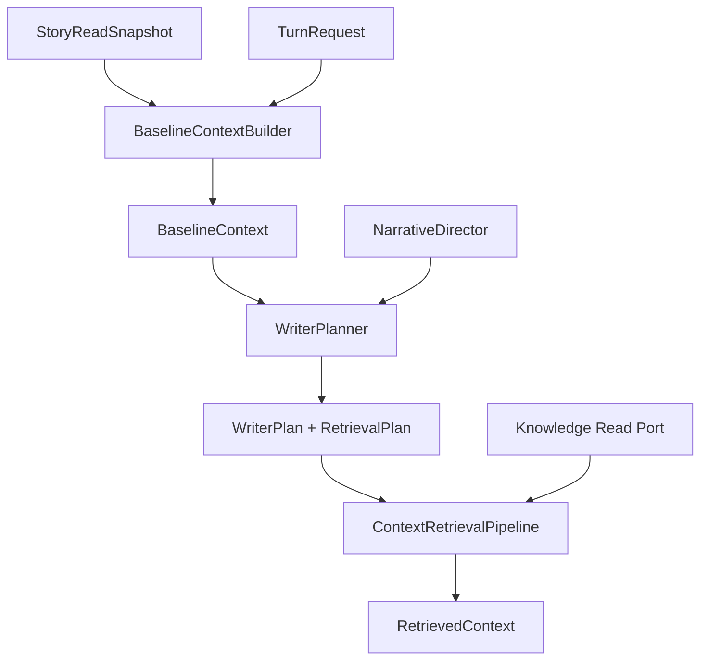

# Context Preparation and Retrieval — Design

> **Date**: 2026-08-08
> **Author**: GPT-5.6 Codex
> **Status**: Draft
> **Prior docs**: [AISE Architecture v3.1](./2026-08-04-Architecture-gpt.md), [Story Pack Design v3.0](./2026-08-06-StoryPackDesign-gpt.md)

---

## Context

AISE 的固定 Turn 流程已经确定为：`BaselineContextBuilder -> WriterPlanner -> ContextRetrievalPipeline -> CharacterThinkPipeline -> StoryGenerator`。现有架构要求所有阶段只通过当前 Turn 的 `TurnExecutionContext` 交换数据，并对 Context、历史与召回结果设置硬预算。[`2026-08-04-Architecture-gpt.md`](./2026-08-04-Architecture-gpt.md):455-471

当前 Context 设计仍停留在 Story Pack v3.0 之前：

- 架构文档仍将 `Story Instructions`、笼统的 `Story Configuration` 和复制后的 `Player Input` 列为 Baseline 内容。[`2026-08-04-Architecture-gpt.md`](./2026-08-04-Architecture-gpt.md):502-529
- `BaselineContext` 仍使用 `story_instructions`、旧 `StoryConfig`、全量 `relevant_characters` 和 `Vec<String>` 形式的 `active_constraints`。[`turn_data.rs`](../../crates/aise/src/core/turn_data.rs):103-143
- `BaselineContextBuilder` 仍直接从 Snapshot 复制这些旧字段和所有角色。[`baseline_ctx_builder.rs`](../../crates/aise/src/context/baseline_ctx_builder.rs):53-78
- `ContextRetrievalPipeline` 当前遍历已载入的历史、世界事实和玩家记忆，再进行按空格切词的文本匹配；它尚未使用 World Book 的 Entity、Topic、Audience 或稳定知识 ID。[`retrieval_pipeline.rs`](../../crates/aise/src/context/retrieval_pipeline.rs):20-96
- 当前 Runtime 中 Retrieval 与 Character Think 处于临时关闭状态。[`turn_context.rs`](../../crates/aise/src/core/turn_context.rs):295-310

Story Pack v3.0 已经建立新的硬边界：Story Pack、Character Card、World Book、玩家输入和存档都是不可信数据；System Prompt 只能由项目内部 `prompt` 模块按固定 `PromptProfile` 生成。[`2026-08-06-StoryPackDesign-gpt.md`](./2026-08-06-StoryPackDesign-gpt.md):62-107

因此需要在实现 Context 模块前统一四件事：

1. 每类 Context 数据的权威来源与生命周期。
2. `StorySummary` 与 `RecentStory` 如何按故事段落无缝衔接。
3. `WriterPlanner` 在调用 LLM 前如何获得不可放宽的故事约束。
4. World Book 如何以逐条 Entry 为基础，结合确定性 Entity/Topic 信号与 Planner 的语义请求按需召回。

本文定义目标设计，并作为后续修订架构文档第 10、11 节和生成 Context 模块实现 Spec 的来源。

### Constraints & assumptions

- 固定八步 Turn Pipeline、`TurnRuntime` 编排权和 `TurnExecutionPipeline` 契约保持不变。
- Pipeline 不互相调用；所有阶段产物只写入当前 Turn 的 `TurnExecutionContext`。
- Story Pack 是不可变模板；Turn Runtime 只读取已经物化的 `StoryInstance` 当前状态。
- 每个成功提交的 Turn 产生一个按故事顺序排列的新 `StorySegment`。
- Story Pack、World Book 与运行时数据不能提供 Prompt 片段、消息角色、插入位置、检索算法或预算。
- 第一版 Retrieval 只实现 Entity 与 Topic 召回；BM25 与 Embedding 只保留扩展边界。
- Context、请求数、候选数、单项大小、总 token 和每个受众的结果数都必须有硬上限。
- Summary 的生成算法与持久化调度不属于本文；本文只定义 Summary 与 Recent Story 的连续性契约。

---

## Principles

1. **可信指令与故事数据分离**：`prompt` 模块生成可信 System Prompt；Context 模块只准备类型化、不可信的数据。
2. **一个概念只有一个权威来源**：Player Input、角色状态、故事正文、约束和知识条目不得在多个对象中保存可独立变化的副本。
3. **Baseline 确定事实，Planner 表达缺口，Retrieval 执行策略**：Planner 不选择 Tag、BM25 或 Embedding，World Book 也不控制检索行为。
4. **先隔离受众，再召回内容**：角色只能检索自己的 Memory、相关 Rumor 和 Current Perception；Writer 获得全局相关信息不代表角色知道这些信息。
5. **段落连续、检索确定、结果有界**：历史不得重复或缺失；相同 Snapshot 与相同请求必须产生稳定的候选顺序。
6. **索引是派生数据**：Topic、关键词和向量索引可重建；Fact、Rumor、Memory 及其稳定来源 ID 才是权威数据。

---

## Options

### Option A: 将全部 World Book 放入 Baseline

- **Idea**：Baseline Builder 在 Turn 开始时加载全部 Fact、Rumor 和 Memory，使 Planner 与 Generator 都能直接读取。
- **Pros**:
  - Planner 可以在一次 LLM 调用中看到所有背景知识。
  - 实现简单，不需要独立检索计划和候选接口。
- **Cons**:
  - 每 Turn 的开销随 World Book 总规模增长，违反热路径和 Context 有界原则。
  - 大量无关内容占用 token，并增加知识泄漏与注意力漂移。
  - Retrieval Pipeline 失去实际职责。
- **Risk**：故事包规模稍大后，Context 大小和延迟不可预测。

### Option B: 完全由 Planner 生成自由文本检索请求

- **Idea**：Baseline 不产生任何自动信号；Planner LLM 根据 Summary、Recent Story、Scene 和 Player Input 生成自由文本查询。
- **Pros**:
  - Planner 能表达复杂、抽象的知识缺口。
  - Baseline Builder 保持较小。
- **Cons**:
  - 明确出现的角色、地点和 Topic 仍可能被 LLM 漏掉。
  - 同一输入的请求稳定性较差。
  - 第一版没有 BM25/Embedding 时，自由文本查询无法可靠映射到 Entry。
- **Risk**：召回质量完全受 Planner 输出质量影响，并且难以诊断漏召回原因。

### Option C: 自动信号与 Planner 请求合并

- **Idea**：Baseline 产生确定性的 Entity/Topic 信号；`NarrativeDirector` 提供当前 Narrative 引用；Planner LLM 只表达额外的语义缺口；`ContextRetrievalPipeline` 统一决定如何检索、过滤、排序和裁剪。
- **Pros**:
  - 显式实体与 Topic 不依赖 LLM 猜测。
  - Planner 仍能请求字面信号未覆盖的背景信息。
  - 第一版 Entity/Topic 召回可工作，未来可以无缝增加 BM25/Embedding。
  - 检索策略、预算和权限仍由引擎集中控制。
- **Cons**:
  - 需要 `RetrievalSignals`、`RetrievalPlan`、Topic Dictionary 和候选接口等明确类型。
  - 自动请求与 Planner 请求需要去重和稳定合并。
- **Risk**：若 Topic 与别名维护质量较差，自动召回仍会漏项。

### Choice

**Adopt option C.**

**Rationale**：该方案同时保留确定性召回和 LLM 的语义判断能力，并且不破坏固定 Pipeline。它比全量 Baseline 更有界，比 Planner-only 更稳定；代价是需要更清晰的数据模型和索引边界，而这些结构也是后续 BM25/Embedding 所必需的。

---

## Design

### 1. Target structure



职责边界如下：

```text
BaselineContextBuilder  = 构建本 Turn 必然需要的类型化基础数据与确定性召回信号
NarrativeDirector       = 根据 Graph Definition 与 Runtime State 计算当前 NarrativePlan
WriterPlanner           = 生成故事目标、语义知识缺口与角色推演请求
ContextRetrievalPipeline= 执行受众过滤、候选召回、排名、去重和预算裁剪
Prompt Module           = 选择可信 PromptProfile，并编码阶段专用的类型化 Context
```

### 2. Core types & responsibilities

| Type / Module | Responsibility | Out of scope |
|---|---|---|
| `StoryReadSnapshot` | 提供当前 Turn 的一致性故事视图和版本化知识读取范围 | 不保存 Prompt；不把全部知识正文强制载入内存 |
| `BaselineContextBuilder` | 从 Snapshot 与 Request 派生固定基础数据和 `RetrievalSignals` | 不调用 LLM；不检索 World Book 正文；不更新状态 |
| `BaselineContext` | 保存 Planner、Generator 等阶段共同需要的类型化基础数据 | 不保存 System Prompt、重复 Player Input 或全部场外角色详情 |
| `StoryContinuity` | 保证 Summary 与 Recent Segments 在故事顺序上无重叠、无缺口 | 不决定 Summary 的生成模型或调度方式 |
| `ActiveStoryConstraint` | 表示 StoryInstance 当前必须遵守的结构化故事边界 | 不覆盖 Engine Rule；不包含 Prompt 片段 |
| `RetrievalSignals` | 保存从当前场景、玩家输入、最近正文和显式引用中确定性提取的 Entity/Topic | 不保存召回结果；不选择检索算法 |
| `NarrativePlan` | 保存本 Turn 的 Active Goals、Event Intents、Character Impulses 和候选状态迁移 | 不是权威 Narrative State；不能直接提交 |
| `WriterPlan` | 保存故事目标、`NarrativePlan`、`RetrievalPlan` 和角色推演请求 | 不保存知识正文；不修改约束 |
| `RetrievalPlan` | 合并自动请求、Narrative 请求和 Planner 语义请求 | 不执行检索；不包含 Provider 开关 |
| `CandidateRetriever` | 以统一契约返回一种检索方法的候选项 | 不执行最终权限判断、全局排名或预算裁剪 |
| `ContextRetrievalPipeline` | 统一过滤、召回、融合、去重、排序和裁剪 | 不生成故事；不把知识升级为世界事实 |
| `RetrievedContext` | 按 Writer 与 Character 分区保存最终 Context Item | 不跨 Turn 持久化；不混合不同角色的私有 Memory |
| `PromptProfile` / `RuntimeContextEncoder` | 生成可信指令并把类型化 Context 编码为不可信数据消息 | 不接受 Story Pack 提供的 Prompt 或消息结构 |

### 3. Context sources and ownership

| Context 内容 | 权威来源 | 进入阶段 | 规则 |
|---|---|---|---|
| Trusted System Instructions | 项目内部 `prompt` 模块 | 每个 LLM Pipeline 构建请求时 | 不进入 Snapshot 或 Baseline |
| `StoryProfile` | Frozen Story Pack | Baseline | 包含 premise、language、genre、themes、tone、POV、tense |
| `InstanceSettings` | StoryInstance | Baseline | 只表示本次游玩实际生效的设置；不得放宽 Engine Rule |
| Player Character | StoryInstance | Baseline | 通过稳定 ID 解析，不依赖集合顺序 |
| Current Scene Characters | StoryInstance | Baseline | 提供当前场景需要的身份、Role 与实例状态 |
| Off-scene Characters | StoryInstance | `CharacterIndex` 或按需读取 | Baseline 只保留轻量索引；完整状态按计划加载 |
| `StoryContinuity` | StoryInstance 的已提交正文与 Summary 投影 | Baseline | Summary 和 Recent Segments 必须连续 |
| `ActiveStoryConstraint[]` | StoryInstance | Baseline | 定义可来自 Story Pack 或已验证变更；当前激活集合以 Instance 为准 |
| Narrative Definition | Frozen Story Pack | Snapshot / `NarrativeStateView` | 固定版本，不由 LLM 修改 |
| Narrative Runtime State | StoryInstance | Snapshot / `NarrativeStateView` | 由已验证提交推进 |
| Fact / Rumor / Memory | StoryInstance Knowledge Store | Retrieval | 逐条 Entry、按受众和当前情形召回 |
| Player Input | `TurnRequest` | 各阶段专用 Context | 不复制进 Snapshot、Baseline 或 WriterPlan |

动态生成的 Character 通过 `StoryProposal -> Validation -> ValidatedChangeSet -> Commit` 成为 StoryInstance Character。后续 Turn 与 Pack Seed Character 使用相同读取路径；任何动态 Character 都不能反向修改 Story Pack。

### 4. Story continuity

故事历史使用故事段落顺序，不使用数据库 revision 表示 Summary 覆盖范围：

| Type | Meaning |
|---|---|
| `StorySequence` | StoryInstance 内单调递增的故事正文顺序 |
| `StorySegment` | 一个已提交 Turn 产生的正文，包含 `sequence`、`turn_id` 和 `text` |
| `StorySummary` | 某个连续正文前缀的压缩投影，记录 `summarized_through` |
| `StoryContinuity` | 一份 Summary 加紧随其后的 Recent Segments |

连续性关系为：

```text
StorySummary      = StorySegment [1 ... K] 的压缩结果
RecentStory       = StorySegment [K+1 ... N] 的原文
Current Turn      = 生成并提交 StorySegment N+1
```

必须满足以下不变量：

1. `recent_segments` 按 `StorySequence` 升序排列。
2. Summary 非空时，第一条 Recent Segment 必须是 `summarized_through + 1`。
3. Recent Segments 之间不得出现重复 Sequence 或缺口。
4. 生成下一段时，Summary 与 Recent Story 不得覆盖同一个 Segment。
5. Recent Story 超出预算时，只能把最早的连续前缀合并进 Summary，不能跳跃压缩。
6. `StoryRevision` 只用于 Snapshot 一致性、乐观并发和 Commit 冲突检测；它不表示故事正文顺序。

当前 `StoryTurn` 只有时间戳，没有显式故事顺序；目标实现需要增加稳定 Sequence，而不能依赖时间戳解决同毫秒写入或重放顺序。[`narrative.rs`](../../crates/aise/src/domain/narrative.rs):4-11

### 5. BaselineContext

目标 `BaselineContext` 包含：

| Field | Content |
|---|---|
| `story_profile` | Frozen Story Pack 的故事内容画像 |
| `instance_settings` | 本 StoryInstance 生效的游玩设置 |
| `player_character` | 当前玩家扮演角色的组合视图 |
| `current_scene` | 当前场景权威视图 |
| `scene_characters` | 当前场景中的角色组合视图 |
| `character_index` | 场外角色的轻量 ID、名称、Role、Location 索引 |
| `story_continuity` | 同一 Snapshot 中的 Summary 与连续 Recent Segments |
| `active_story_constraints` | 当前生效的结构化故事约束 |
| `narrative_state_view` | Narrative Definition 引用与 Runtime State |
| `retrieval_signals` | 确定性 Entity/Topic/Scene/Role 信号 |

Baseline 明确排除：

- `story_instructions` 或任何生成后的 Prompt 字符串。
- 含义混杂的通用 `StoryConfig`。
- 全量 World Book、Fact、Rumor 或所有 Character Memory 正文。
- 所有场外 Character 的完整状态。
- Player Input 的第二份文本副本。
- `Vec<String>` 形式、没有来源和生命周期的通用 `active_constraints`。

`StoryReadSnapshot` 可以持有 Baseline 所需的权威状态，但不应为了“一致性读取”把全部知识正文加载到内存。它应提供 `KnowledgeSnapshotRef`，使后续 Retrieval 在相同 Pack Digest 与 `base_revision` 范围内读取 Entry。Narrative Graph 确定性条件需要的结构化状态可以放入有界的 Condition State View，不要求把所有 Lore 文本交给 Planner。

### 6. Planner constraints

Planner LLM 调用前必须已经具备不可放宽的边界条件。约束分为五层：

| Layer | Source | Planner visibility | Enforcement |
|---|---|---|---|
| Engine Rules | `prompt` 模块与 Validator | 可信 System Prompt 中的通用规则 | Prompt + deterministic validation |
| `StoryProfile` | Story Pack | Baseline 数据 | Planner、Generator、Validator 共同读取 |
| `InstanceSettings` | StoryInstance | Baseline 数据 | Pipeline 与 Validator 共同读取 |
| `ActiveStoryConstraint[]` | StoryInstance 当前状态 | Baseline 数据 | Planner、Generator、Repairer、Validator 共同读取 |
| `NarrativePlan` | Definition + Runtime State，经 `NarrativeDirector` 计算 | Planner 调用前生成 | Proposal 验证通过后才能提交状态迁移 |

`ActiveStoryConstraint` 至少表达：

```text
stable id
source
scope
typed requirement
lifecycle
```

约束定义可以来自 Story Pack，运行时约束也可以由已验证的故事变更产生；但“当前哪些约束生效”始终是 StoryInstance 的权威状态。Narrative Graph 当前目标不是自由字符串约束，而是单独的 `NarrativePlan`。

`WriterPlanner` 的内部顺序为：

1. 读取 `BaselineContext` 与原始 Player Input。
2. 使用纯领域组件 `NarrativeDirector` 确定性评估 Graph。
3. 组装 `PlannerContext = BaselineContext + NarrativePlan + Player Input`。
4. 由固定的 `PromptProfile::WriterPlanner` 生成可信 System Prompt。
5. LLM 输出 Story Goal、语义 Context Gaps 和 Character Think Requests。
6. 引擎验证输出并与自动请求合并，形成最终 `WriterPlan`。

LLM 不能创建、删除、覆盖或放宽 `ActiveStoryConstraint`。同一组约束必须继续进入 Story Generator、Story Repairer 和 Validator，不能只约束 Planner。

在固定的单次 Planner 调用流程中，Planner 不读取随后才产生的 Retrieved Context。它负责表达目标和知识缺口，Story Generator 才使用召回正文完成内容生成。若未来需要“先召回、再基于证据重新规划”，应作为显式的流程变更重新设计，不能在现有 Planner 内隐藏第二次调用。

### 7. RetrievalSignals and RetrievalPlan

`RetrievalSignals` 只保存可验证的检索线索，不保存知识正文：

```text
scene key
location key
present character ids
active role keys
referenced entity keys
resolved topic keys
bounded source fragments with source priority
```

自动信号按以下优先级提取：

1. Player Input 中解析出的显式 Entity 与 Topic。
2. Current Scene、Location、Present Characters 与 RoleBindings 的结构化 Key。
3. `NarrativePlan` 显式引用的节点、角色、地点、事件与 Topic。
4. 最近一至两个 Story Segment 中仍在延续的实体与 Topic。
5. Story Summary 只用于背景消歧和低优先级补充，不遍历后无限扩散历史主题。

最终计划为：

```text
RetrievalPlan
    = Automatic Requests from RetrievalSignals
    + Narrative Requests from NarrativePlan
    + Planner Requests from Context Gaps
```

每个 `RetrievalRequest` 至少包含：

| Field | Meaning |
|---|---|
| `audience` | `GlobalWriter` 或具体 `CharacterId` |
| `knowledge_kinds` | Fact、Rumor、Memory 中允许检索的集合 |
| `entities` | 已解析的稳定 Entity Keys |
| `topics` | 已解析的稳定 Topic Keys |
| `query_text` | Planner 的有界语义描述，供 Topic 解析及未来全文/向量检索使用 |
| `reason` | 该信息为何是当前 Turn 所需 |
| `origin` | Automatic、Narrative 或 Planner |

Planner 只表达“需要什么、给谁使用、为什么需要”，不能输出：

```text
use_tag_search
use_bm25
use_embedding
top_k
token_budget
```

这些字段属于引擎 Retrieval 配置。是否执行 Retrieval 从最终 `RetrievalPlan.requests` 是否为空推导；Planner 请求为空但 Automatic Request 非空时仍必须执行 Retrieval。

### 8. World Book entry and topic model

World Book 继续采用逐条 Entry：Fact 与 Rumor 具有稳定 Key、内容、Entity、Topic 与 Salience。现有 `FactSeed` 和 `RumorSeed` 已经符合这一基本方向。[`world_book.rs`](../../crates/aise/src/domain/asset/world_book.rs):33-55

为了把自然语言稳定映射到 `TopicKey`，需要一份受 Story Asset 校验的 Topic Dictionary：

| Type | Fields | Responsibility |
|---|---|---|
| `TopicDefinition` | `key`、`label`、`aliases` | 将同义词、简称和中文表达映射到稳定 Topic |
| `TopicDictionary` | `TopicKey -> TopicDefinition` | 导入时校验唯一性，运行时构建匹配索引 |

示例关系：

```text
“黑魔法” / “禁术” / “邪术”
          -> topic.forbidden_magic
          -> all entries tagged topic.forbidden_magic
```

相比在每条 Entry 中重复 `trigger_terms`，集中 Topic Dictionary 更适合复用、重命名和中文同义词维护。Entry 仍只保存稳定 `TopicKey`。

运行时 Fact、Rumor 与 Memory 必须保留召回所需的共享索引元数据：

```text
source id
entities
topics
salience
knowledge kind
source revision
```

当前 `WorldFact` 尚未保留 Topic、Entity 和 Salience，而 `SharedRumor` 与 `MemoryEntry` 的索引元数据也不完整一致；后续实现必须统一这些字段。[`fact.rs`](../../crates/aise/src/domain/knowledge/fact.rs):15-23 [`rumor.rs`](../../crates/aise/src/domain/knowledge/rumor.rs):8-22 [`memory.rs`](../../crates/aise/src/domain/knowledge/memory.rs):8-20

该设计与 SillyTavern World Info 的共同点是：知识由独立 Entry 组成，基础召回依赖关键词或结构化过滤，向量匹配不是 World Book 成立的前提。AISE 的差异是：

- Entry 只能表示 Fact、Rumor 或 Memory 数据，不能注入 Prompt。
- Entry 不能指定插入位置、消息角色、扫描深度、预算或模型。
- 第一版不实现递归 Entry 激活，避免无界级联。
- 权限过滤由 Knowledge Audience 强制执行，而不是依赖模型自行区分。
- BM25 是 AISE 的可选增强能力，不是 SillyTavern Entry 模型的必要组成。

### 9. Candidate retrieval and ranking

`CandidateRetriever` 是检索方法的统一扩展边界：

| Provider | Initial status | Input | Output |
|---|---|---|---|
| `EntityCandidateRetriever` | Implement | Stable Entity Keys + Snapshot Scope | Entity-matched candidates |
| `TopicCandidateRetriever` | Implement | Stable Topic Keys + Snapshot Scope | Topic-matched candidates |
| `Bm25CandidateRetriever` | Reserved | Query Text + Snapshot Scope | Ranked lexical candidates |
| `EmbeddingCandidateRetriever` | Reserved | Query Text + Snapshot Scope | Ranked semantic candidates |

第一版只实现 Entity 与 Topic Provider。预留统一接口不等于添加返回空结果的假实现，也不需要在 Story Pack 中增加 `enable_bm25` 或 `enable_embedding`。

`ContextRetrievalPipeline` 按以下顺序执行：

1. 验证 `RetrievalPlan`、`KnowledgeSnapshotRef`、受众和所有数量/长度上限。
2. 根据 Audience 与 Knowledge Kind 先缩小允许读取的集合。
3. 使用 Topic Dictionary 与已知实体索引规范化每个请求。
4. 调用已配置的 Candidate Retrievers；Provider 数量和每路候选数均有上限。
5. 为候选保留 `source_id`、kind、scope、revision、match reason、salience、score 和 token cost。
6. 按稳定 `source_id` 去重；Fact、Rumor、Memory 之间即使文本相似也保留语义冲突。
7. 第一版按确定性等级排序：Entity+Topic 同时命中优先，其次 Entity 命中，再次 Topic 命中；同等级按信号优先级、Salience 和稳定 Source ID 排序。
8. 按每个 Audience 的预算和 Turn 总预算裁剪，产生 `RetrievedContext`。

将来加入 BM25 或 Embedding 后，各 Provider 产生独立排名；Pipeline 使用排名融合，例如 RRF，再叠加有限的 Entity/Topic 精确命中与 Salience 权重。不同 Provider 的原始分数不能直接相加。

BM25 索引和向量索引使用 `EntryId + ContentHash` 构建，是可重建基础设施数据，不写入 Story Pack 权威模型。Embedding 调用必须经过共享 `LlmGateway` 和统一并发限制器。

### 10. Audience isolation

`RetrievedContext` 不再是扁平 `Vec<ContextItem>`，而是两个隔离区域：

```text
writer: ContextItem[]
characters: CharacterId -> ContextItem[]
```

权限矩阵为：

| Audience | Fact | Rumor | Memory | Current Perception |
|---|---|---|---|---|
| Global Writer / Generator | 相关项 | 相关项 | 仅当前计划涉及角色的相关项 | 按需要读取 |
| Character Think：角色 A | 不直接提供 | 相关项 | 仅角色 A 的相关项 | 仅角色 A |

规则：

1. Fact 被 Writer 召回不代表任何 Character 知道该 Fact。
2. Character A 不能获得 Character B 的 Memory。
3. Character Think 需要知晓的事实必须已经表现为该角色的 Memory、公共 Rumor 或 Current Perception。
4. Generator 可以看到 Writer Context 与 Character Thoughts，但每个 Context Item 必须保留来源和可见范围，供 Validator 检查知识越界。
5. 去重不能把 Fact、Rumor 和 Memory 的冲突“合并”为一个真相。

当前代码已经出现带受众 Scope 和稳定 Source ID 的新版 `context::ContextItem`，但 Turn Context 仍使用旧的扁平 `core::turn_data::ContextItem`；目标实现只能保留一套模型。[`context_item.rs`](../../crates/aise/src/context/context_item.rs):6-60 [`turn_data.rs`](../../crates/aise/src/core/turn_data.rs):146-166

### 11. Snapshot consistency

World Book 按需召回不能依赖跨越 LLM 调用的长数据库事务。Snapshot 应携带版本化读取范围：

这细化了 Story Pack v3.0 的 Snapshot 约定：一致性视图要求所有知识读取属于同一 Pack Digest 和 Story Revision，但不要求在 Baseline 阶段急切物化全部 Fact、Rumor 与 Memory 正文。

```text
KnowledgeSnapshotRef
    story_id
    frozen pack digest
    base_revision
```

所有 Candidate Retriever 必须使用同一 `KnowledgeSnapshotRef`：

- Pack Seed Entry 按固定 Digest 读取。
- Instance Fact、Rumor、Memory 只能读取不晚于 `base_revision` 的有效版本。
- Retrieved Item 保留稳定 Source ID 与 Source Revision。
- Story 级串行化继续阻止同一 Story 的并发 Turn 写入。
- Commit 仍使用 `base_revision` 做乐观并发检查。

这样可以保证 Turn 内一致性，同时避免 Snapshot 随 World Book 总规模线性增长。

### 12. Stage-specific runtime contexts

Context 模块输出类型化数据；`prompt` 模块负责可信指令和确定性编码。各 LLM 阶段读取不同视图：

| Stage Context | Data |
|---|---|
| `PlannerContext` | Baseline、NarrativePlan、Player Input |
| `CharacterThinkContext` | 目标 Character、Current Scene、该角色的 Retrieved Context、Current Perception、Character Impulse、Player Input |
| `GenerationContext` | Baseline、WriterPlan、Writer Retrieved Context、Character Thoughts、Player Input |
| `RepairContext` | Generation Context、被拒 Proposal、Validation Issues |
| `ValidationContext` | Snapshot、Active Constraints、Proposal、Context provenance |

每个 Pipeline 固定选择自己的 `PromptProfile`。Story 数据只能由 `RuntimeContextEncoder` 编码为不可信 Context Message；不能再次出现从 `BaselineContext.story_instructions` 拼接 System Prompt 的路径。当前 `RuntimeContextEncoder` 已具备类型化序列化入口，可以作为该边界的基础。[`runtime_context_encoder.rs`](../../crates/aise/src/prompt/runtime_context_encoder.rs):5-12

### 13. Key flows

#### Baseline preparation

1. `BaselineContextBuilder` 使用一次一致性读取获得 `StoryReadSnapshot`。
2. Builder 校验 Summary/Recent Segment 连续性和所有 Baseline 上限。
3. Builder 从 StoryInstance 组合 Story Profile、Scene、Character、Constraints 与 Narrative State View。
4. Builder 从 Request 与 Snapshot 派生 `RetrievalSignals`，但不读取知识正文。
5. Builder 将 Snapshot 与 Baseline 作为唯一阶段产物写入 `TurnExecutionContext`。

#### Planning

1. `WriterPlanner` 从 Context 读取 Baseline 与 Player Input。
2. `NarrativeDirector` 确定性生成 `NarrativePlan`。
3. Prompt Module 使用固定 Planner Profile 组装可信指令和类型化 Planner Context。
4. LLM 输出 Story Goal、Context Gaps 和 Character Requests。
5. Planner 校验输出并将 Automatic、Narrative、Planner 请求合并为 `RetrievalPlan`。
6. `WriterPlan` 一次写入 Context；Runtime 根据最终请求集合决定后续可选阶段。

#### Retrieval

1. Pipeline 读取 `WriterPlan.retrieval_plan` 与 Snapshot Scope。
2. 每个 Request 先按 Audience 与 Kind 限制候选范围。
3. Entity 与 Topic Provider 返回有界候选。
4. Pipeline 统一去重、保留冲突、稳定排序和预算裁剪。
5. Pipeline 生成按 Writer/Character 隔离的 `RetrievedContext`。
6. Runtime 将阶段推进到 Character Think 或 Context Ready。

### 14. Key decisions

- **Story Instructions 放在哪里**：不属于 Baseline；每个 LLM 阶段由项目内部 `prompt` 模块根据固定 `PromptProfile` 生成可信指令。
- **Story Configuration 如何拆分**：Story Pack 内容使用 `StoryProfile`；实例级设置使用 `InstanceSettings`；引擎预算与模型使用 `EngineConfig` / `TurnConfig`。
- **Summary 覆盖边界使用什么**：使用 `StorySequence`，不用 `StoryRevision`。
- **Active Constraints 是否保留在 Baseline**：保留结构化 `ActiveStoryConstraint[]`；删除含义模糊的 `Vec<String>`。
- **World Book 正文放在哪里**：不进入 Baseline；由 `ContextRetrievalPipeline` 按 Entry 召回。
- **谁决定需要什么知识**：Baseline 提供确定性信号，NarrativePlan 提供显式引用，Planner 表达语义缺口。
- **谁决定如何检索**：Retrieval Pipeline；Planner 和 Story Pack 都不能选择算法或预算。
- **第一版实现哪些方法**：Entity + Topic；BM25 + Embedding 只预留 Provider 接口与索引边界。
- **Retrieved Context 如何组织**：Writer 与每个 Character 分区，禁止先扁平召回再依赖 Prompt 区分权限。
- **如何保持一致性**：Snapshot 保存版本化 `KnowledgeSnapshotRef`，不持有跨 LLM 调用的数据库事务。

---

## Impact

- **Code**:
  - `domain/narrative.rs`：增加 `StorySequence`、`StorySegment` 和 Summary 覆盖边界。
  - `domain/story_instance/snapshot.rs`：收敛 Baseline 权威状态，增加 `KnowledgeSnapshotRef`，避免强制加载全部知识正文。
  - `domain/knowledge/*`：统一 Entry 的 Entity、Topic、Salience、Source ID 与 Revision 元数据。
  - `core/turn_data.rs`：替换旧 `BaselineContext`、`ContextRequest`、扁平 `ContextItem` 和 `WriterPlan`。
  - `context/`：实现 Retrieval Signals、Topic Matcher、Candidate Retriever、Audience Filter、Ranking 与 `RetrievedContext`。
  - `planning/writer_planner.rs`：在 LLM 调用前接入 `NarrativeDirector`，并合并三类 Retrieval Request。
  - `prompt/`：使用阶段专用类型化 Context，删除从 Baseline 拼接 System Prompt 的路径。
  - `persistence/`：提供 revision-scoped Knowledge Read Port 与 Entity/Topic 索引查询。
- **Config**:
  - 删除 `max_story_instructions_bytes` 等已失去语义的旧限制。
  - Retrieval 的请求数、每路候选数、每受众结果数、单项大小和 token 上限由 Engine Config 统一提供。
  - BM25/Embedding 未实现前不增加无效开关。
- **Data**:
  - Story Segment 需要稳定 Sequence。
  - Story Summary 需要 `summarized_through`。
  - World Book 需要 Topic Dictionary 或等价的稳定别名索引来源。
  - Runtime Knowledge Entry 需要完整的索引元数据与版本范围。
  - BM25/Embedding 索引未来作为可重建派生数据保存。
- **External interface**:
  - HTTP / WebSocket Turn API 无需因本设计改变。
  - AISE 原生 World Book 与 StoryInstance 持久化 Schema 将发生变化；迁移方式由后续 Refactor/Spec 定义。
  - Story Pack 仍不能提供 Prompt、Retrieval 配置或 Provider 选择。

---

## Risks & mitigations

| Risk | Likelihood | Impact | Mitigation |
|---|---|---|---|
| Planner 在 Retrieval 前看不到召回正文，Story Goal 可能缺少 Lore 细节 | Medium | Medium | 自动召回显式 Entity/Topic；Planner 只确定目标与缺口，Generator 使用最终 Retrieved Context 完成正文 |
| Topic Dictionary 或别名质量不足导致漏召回 | Medium | High | 导入校验、集中维护别名、记录未解析 Query 与零结果请求指标 |
| Summary 与 Recent Story 重复或缺段 | Low | High | 使用 `StorySequence` 与连续性不变量，在 Baseline 阶段拒绝不一致 Snapshot |
| Writer 知识泄漏到 Character | Medium | High | Audience 过滤先于候选召回；结果按 Character 分区；Validator 使用 provenance 检查 |
| Retrieval 每 Turn 扫描全部 World Book | Low | High | Entity/Topic 索引查找、候选硬上限、禁止无命中时回退到全量扫描 |
| 多 Provider 分数不可比较导致排序漂移 | Medium | Medium | 第一版使用确定性等级；未来使用排名融合，不直接相加原始分数 |
| Future Embedding 绕过统一并发与预算 | Low | High | Provider 通过共享 `LlmGateway` 注入，所有 Embedding 调用使用同一 limiter |
| 新旧 Context 类型长期并存 | Medium | High | 后续按 hard refactor 一次替换并删除旧字段、旧 Prompt 拼接与扁平 Context 路径 |

---

## Roadmap

- **Phase 0 — Contract alignment**：修订总架构第 10、11 节，确定 `StoryContinuity`、`BaselineContext`、`RetrievalPlan` 和 `RetrievedContext` 的最终契约。
- **Phase 1 — Baseline and continuity**：实现 Story Sequence、Summary 边界、结构化 Constraints、Scene Character View 与 Retrieval Signals。
- **Phase 2 — Entry retrieval**：实现 Topic Dictionary、Entity/Topic Candidate Retrievers、Audience Filter、稳定排名和预算裁剪。
- **Phase 3 — Planner and prompt integration**：接入 NarrativePlan、三类 Retrieval Request 合并和阶段专用 Runtime Context。
- **Phase 4 — Optional retrieval providers**：根据真实召回指标决定是否实现 BM25、Embedding 与排名融合；它们不是第一版前置条件。

---

## Appendix

### Glossary

| Term | Definition |
|---|---|
| Baseline | 当前 Turn 在 Planner 调用前必然可得、无需语义检索的类型化基础数据 |
| Retrieval Signal | 从结构化状态或有界文本中确定性提取的 Entity/Topic 线索 |
| Context Gap | Planner 对“还需要知道什么”的语义描述 |
| Candidate | 某个 Retriever 返回、尚未经过全局排序和预算裁剪的知识 Entry |
| Retrieved Context | 完成受众过滤、去重、排序和裁剪后的当前 Turn 知识视图 |
| Story Sequence | StoryInstance 内故事正文段落的稳定顺序 |
| Story Revision | StoryInstance 权威状态版本，只用于一致性和并发控制 |

### Explicit non-goals

- 不定义 Summary 使用哪一个 LLM、何时异步生成或如何压缩文本。
- 不定义 BM25 tokenizer、Embedding model、向量数据库或 RRF 的具体参数。
- 不定义数据库迁移 SQL。
- 不改变 Turn Runtime 的固定阶段顺序。
- 不允许 Story Pack 兼容 SillyTavern 的 Prompt 注入、位置控制或递归激活语义。
