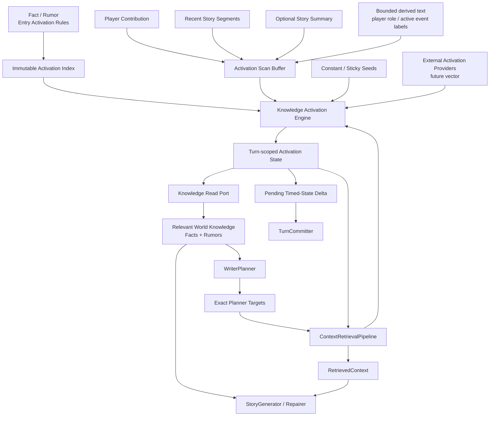
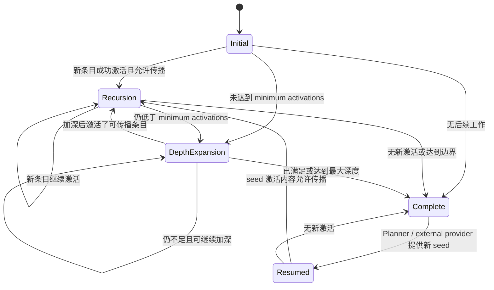

# World Info Entry Activation Refactor — Design

> **Date**: 2026-09-05
> **Author**: GPT-5.6 Sol
> **Status**: Draft
> **Prior docs**: [Context Preparation and Retrieval](./2026-08-08-context-preparation-retrieval-design-gpt.md) · [Current Scene Removal](./CSI-RC-FTI/2026-08-17-current-scene-removal-design-gpt.md) · [Story Context Simplification](./CSI-RC-FTI/2026-08-17-story-context-simplification-design-gpt.md) · [Narrative、Knowledge 与 Retrieval Context 收敛](./CSI-RC-FTI/2026-08-17-narrative-knowledge-retrieval-design-gpt.md)

---

## Context

AISE 当前使用两段式 Entity/Topic 知识召回：

1. `RetrievalSignalBuilder` 从玩家输入、玩家 Role 状态和最近 Story Segment 中解析 `KnowledgeEntity` 与 `TopicKey` 信号。
2. `BaselineContextBuilder` 和 `ContextRetrievalPipeline` 使用 `knowledge_entry_entities`、`knowledge_entry_topics` 两组索引查找 Fact、Rumor 和 Memory。

这条路径分布在 World Book Schema、Snapshot、Planner DTO、Knowledge Read Port、SQLite junction table 和两个 Candidate Retriever 中。主要实现位于：

- `crates/aise/src/context/retrieval_signal_builder.rs:21-167`
- `crates/aise/src/context/baseline_ctx_builder.rs:144-386`
- `crates/aise/src/context/entity_candidate_retriever.rs:1-103`
- `crates/aise/src/context/topic_candidate_retriever.rs:1-78`
- `crates/aise/src/persistence/sqlite_knowledge_reader.rs:175-361`

该设计与近期确立的“故事正文是当前叙事语义的主要来源”不再一致。运行时 `CurrentScene` 已被删除，Story Profile 也不再保存会过期的 Premise；当前情境由连续的 `Story Summary + Recent Story + Player Contribution` 表达。继续依赖 Location、Scene、Event、NarrativeNode 和 Topic 等稳定内部 key 进行召回，会重新制造一套与正文并行的语义索引。

当前实现还存在可验证的作者体验和召回问题：

- Role 可以通过 `role_label` 或 Character 名匹配，但 Location、Scene、Event 等只使用内部 key 字面值。自然语言“西湖”不会匹配 `west_lake`。
- Topic 的文本入口位于全局 `TopicDefinition.label/aliases`，Fact/Rumor 又通过 `TopicKey` 关联 Topic。作者必须同时维护字典、稳定 key 和条目引用。
- `examples/snake_pack.json:322-335` 的 Topic 字典 key 为 `bai_identity`，Fact 却引用 `"白素贞的身份"`；文本匹配产生的 key 与数据库索引值不相等，但导入仍能通过。
- Baseline 先执行 Entity 查询并允许其占满全部结果上限，只有剩余容量才查询 Topic，导致 Topic-only 条目可能在全局排名前被饿死。`crates/aise/src/context/baseline_ctx_builder.rs:250-375`
- `retrieval_hint`、Topic label/alias、Entity key 和 Fact/Rumor key 分别承担发现、匹配、索引与身份职责，作者难以判断哪一个字段会真正触发内容。

SillyTavern World Info 采用更直接的条目激活模型：每个 Entry 自带 primary keys、secondary keys、组合逻辑、匹配选项和激活策略；运行时扫描近期故事文本，激活条目后把条目内容加入递归缓冲区，再经过 group、probability 和 token budget 过滤。核心状态机位于 `E:/Projects/aise/SillyTavern/public/scripts/world-info.js:4597-5163`。

本设计采用 ST 的条目级激活思想，彻底删除 Topic 与通用 Entity 召回模型，同时保留 AISE 的 Fact、Rumor、Audience、Snapshot、一致性和 Prompt 数据边界。目标不是兼容 SillyTavern JSON，也不是复制其 Prompt 注入系统，而是把其成熟的触发能力重建为服务端、确定性、有界且可扩展的 Knowledge Activation Engine。

现在实施该重构可以：

- 在继续扩大 World Book 资产规模前消除错误抽象和双重索引。
- 让作者在 Fact/Rumor 条目旁直接维护触发条件。
- 在不恢复 Current Scene 的前提下，以故事文本驱动知识选择。
- 为后续向量激活提供稳定 Provider 边界。
- 在 Memory 移入 Role 内部前先解除其对 Entity/Topic junction table 的依赖。

### Constraints & assumptions

- 采用一次性硬重构，遵守 `R-REFACTOR-01/02`；不保留 Entity/Topic fallback、Feature Flag、兼容解析或双写。
- Fact 与 Rumor 继续作为不同的世界知识类型；Rumor 不因被激活而升级为 Fact。
- `KnowledgeSourceId`、`salience`、`retrieval_hint`、`KnowledgeDelivery`、`KnowledgeSnapshotRef` 和 Writer/Character 结果分区继续保留。
- Memory 本次不迁移到 Role 内部，但必须删除其 Entity/Topic 字段与索引；过渡期只按 owner `RoleId` 直接读取。
- `CurrentScene`、Topic Dictionary、Entity Catalog 和 Scene presence 不得以别名形式重新出现。
- Role、Location、NarrativeNode、Event 等领域对象可以继续拥有各自所属领域的稳定 ID；禁止再通过一个通用 `KnowledgeEntity` 把它们聚合成知识检索键。
- Story Pack 与运行时数据仍是不可信数据，只能提供知识内容和激活数据，不能提供 System Prompt、消息角色或 Prompt 插入位置。
- 固定 Turn Pipeline、`TurnRuntime` 编排权、`TurnExecutionPipeline` 契约和原子 Turn Commit 不变。
- 自动激活、递归、正则、概率、分组和时序效果必须具有硬性工作量、数量、字节与 token 上限。
- 相同 Story Snapshot、Turn Number、Player Contribution 和配置必须得到相同结果；retry、repair 和 dry-run 不得改变选择。
- 向量检索不在首轮实现中，但目标合同必须允许它以后作为外部激活来源接入。

---

## Principles

1. **故事正文优先**：自动激活主要扫描 Player Contribution、Recent Story 和必要的 Summary，不再依赖 Scene/Entity/Topic 状态镜像。
2. **触发规则归条目所有**：每个 Fact/Rumor 在同一位置声明内容、发现提示和激活规则，作者无需维护跨表 Topic Dictionary。
3. **激活不改变知识语义**：Activation 只决定本 Turn 是否加载 Entry；Fact/Rumor kind、Audience、provenance 和 truth semantics 独立执行。
4. **能力对齐 ST，运行时服从 AISE 约束**：保留 secondary、regex、recursion、constant、group、timed effects、probability 和 external activation，但删除无限循环、无上限预算与非确定性随机。
5. **索引是派生数据**：作者只维护 Entry Activation Rule；literal、regex 和 future vector index 均可从权威 Entry 重建。
6. **显式扩展，不留空实现**：向量能力通过稳定 Provider 契约预留；未实现前不提供返回空结果的假 Retriever 或无效配置。
7. **一次激活，多阶段复用**：同一 Turn 的激活状态由 `TurnExecutionContext` 有界持有，Planner 前自动激活与 Planner 后外部激活共享同一去重、递归、分组和预算规则。
8. **可解释优先**：每个激活项都保留 bounded evidence；零命中、规则抑制、预算丢弃和递归停止原因可观察、可测试。

---

## Options

### Option A: 修补 Entity/Topic 模型

- **Idea**：保留 Topic Dictionary、KnowledgeEntity、两组 SQLite junction table 和双 Retriever，只增加 Entity label/alias、Topic 引用校验与统一排名。
- **Pros**:
  - 对当前代码和数据库改动较小。
  - 稳定 key 的精确查询仍然简单。
  - 不需要新的递归激活状态机。
- **Cons**:
  - 作者仍需跨 Topic Dictionary 与 Entry 维护引用。
  - 不能自然表达 per-entry secondary、NOT、regex、constant 和 recursion。
  - 继续依赖内部结构解释自然语言，与正文优先方向冲突。
  - Future vector provider 仍需与 Entity/Topic 排名融合，保留已经失去产品价值的复杂度。
- **Risk**：召回精度有所改善，但根本作者体验和语义双轨问题不变。

### Option B: 原样复制 SillyTavern World Info

- **Idea**：复制 ST 的 JSON 字段、前端逐条扫描、Prompt position、decorator、随机概率、无上限递归和 content injection。
- **Pros**:
  - 与 ST Lorebook 作者经验接近。
  - 功能面完整，参考行为和测试来源丰富。
  - 可以直接复用大量已知概念。
- **Cons**:
  - 每 Turn 遍历全部 Entry 与全部 key，工作量随 World Book 总规模增长。
  - `Math.random()`、`max_recursion_steps = 0` 和 `ignoreBudget` 与 AISE 的确定性和硬预算冲突。
  - before/after/atDepth/outlet、message role 和 content decorator 会允许资产控制 Prompt 结构。
  - ST 的 chat message、browser metadata 和多 Lorebook merge 语义不适合服务端 StoryInstance。
- **Risk**：获得短期兼容表象，但破坏层次、预算、可重放性和可信 Prompt 边界。

### Option C: AISE 原生 Entry Activation Engine

- **Idea**：Fact/Rumor 自带 ST 风格的激活规则；以故事文本构造 Scan Buffer，通过可重建多模式索引执行 primary/secondary/regex 匹配，并使用有界确定性状态机处理 constant、external activation、recursion、group、probability、timed effects 和 budget。
- **Pros**:
  - 作者直接在知识条目旁声明触发条件。
  - 保留 ST 最有价值的激活能力，而不引入 Prompt 注入权限。
  - 通过派生索引避免逐条全量扫描。
  - Fact/Rumor、Audience、Snapshot 和 Turn 原子性继续由 AISE 强制。
  - Future vector provider 可以复用 external activation 入口和统一后处理。
- **Cons**:
  - 需要同时替换资产、领域、Persistence、Context、Planning、Config、测试和文档。
  - 递归、timed state 与 deterministic probability 增加新的状态机复杂度。
  - 动态新增 Fact/Rumor 必须拥有受校验的激活规则。
- **Risk**：若索引快照、Continuation 或 pending timed state 的所有权不清晰，可能出现跨 Turn 泄漏或 retry 漂移。

### Choice

**Adopt option C.**

**Rationale**：Option A 延长了 Entity/Topic 的生命周期，无法满足条目级条件和正文驱动召回；Option B 把客户端 Prompt 注入器的无限与非确定性语义带入服务端。Option C 保留 ST 的作者模型和状态机优点，同时用 AISE 的类型化 Knowledge、派生索引、硬预算、Snapshot 和原子 Commit 修正其不适合服务端的部分。

---

## Design

### 1. Target structure



目标路径分为两个连续阶段：

1. **Planner 前自动激活**：故事文本、constant、sticky 和可用的前置 Provider 产生初始激活，结果进入 `BaselineContext.relevant_world_knowledge`。
2. **Planner 后补充激活**：Planner exact target 和未来 semantic/vector provider 作为 external activation seed，恢复同一 Turn 的 Activation State，继续执行 group、recursion 和 budget，结果进入 `RetrievedContext`。

两阶段不是两套算法。`TurnExecutionContext` 保存同一份 bounded Activation Continuation，使每个 Entry 在一个 Turn 中最多激活一次，并保持统一 evidence、排序和预算。

### 2. 删除旧概念后的领域边界

以下概念完全删除：

- `TopicKey`
- `TopicDefinition`
- Topic Dictionary 与 alias collision 校验
- `KnowledgeEntity`
- `EntitySignal`
- `TopicSignal`
- `RetrievalSignals`
- `KnowledgeIndexMatch::Entity`
- `KnowledgeIndexMatch::Topic`
- `MatchLevel::Entity/Topic/EntityAndTopic`
- `EntityCandidateRetriever`
- `TopicCandidateRetriever`
- `EntityKnowledgeQuery`
- `TopicKnowledgeQuery`
- `StoryReadSnapshot.entity_catalog`
- `StoryReadSnapshot.topic_dictionary`
- `knowledge_entry_entities`
- `knowledge_entry_topics`
- `story_packs.topic_dictionary_json`

删除通用 `KnowledgeEntity` 不等于删除所属领域的稳定身份：

- `RoleId` 继续归 Role Domain 所有。
- `LocationKey` 仅在仍需要结构化角色位置时归 Story Role State 所有。
- `NarrativeNodeKey` 与 Event identity 继续归 Narrative Graph 所有。
- Fact/Rumor 不再引用这些 ID 作为召回 metadata。
- Narrative participant 若仍需结构化引用，使用 Narrative Domain 自己的 participant 类型，不再复用 `KnowledgeEntity`。
- `Proposition.subject` 与 `Claim.subject` 不再使用 `KnowledgeEntity`。如果保留 proposition/claim，它们的 subject 改为 bounded natural-language subject；不重新创建另一个通用 Entity 枚举。

该边界防止未来因为“某领域仍有 ID”而重新建立跨领域知识 Entity Catalog。

### 3. World Book Entry 模型

World Book 继续由 `facts` 与 `rumors` 两个稳定 key map 组成，但删除顶层 `topics`，Fact/Rumor 删除 `entities` 与 `topics`。

每个 Fact/Rumor Entry 保留：

| Field | Responsibility |
|---|---|
| stable seed key | Story Pack 内稳定身份，实例化后映射到 `KnowledgeSourceId` |
| content | 提供给 Planner/Generator 的 Fact 或 Rumor 正文 |
| retrieval hint | 未自动激活时进入 Knowledge Index，帮助 Planner 选择 exact target |
| salience | 同激活优先级下的稳定相关性排序 |
| proposition / claim | 可选结构化语义；subject 不再使用 `KnowledgeEntity` |
| activation rule | 作者可维护的自动激活与传播策略 |

Activation Rule 采用以下概念分组，避免把所有 ST 字段平铺到 Fact/Rumor 根级：

| Group | Fields | Meaning |
|---|---|---|
| match | `keys`, `secondary_keys`, `secondary_logic`, `case_sensitive`, `match_whole_words`, `scan_depth` | 文本触发规则 |
| mode | `enabled`, `constant` | 是否参与自动激活、是否恒定激活 |
| recursion | `exclude_recursion`, `prevent_recursion`, `delay_until_recursion` | 递归轮进入与传播控制 |
| selection | `order`, `probability`, `groups`, `group_override`, `group_weight`, `use_group_scoring` | 候选优先级、确定性概率与互斥选择 |
| timing | `sticky_turns`, `cooldown_turns`, `delay_turns` | 跨 Turn 激活时序 |
| scope | `generation_triggers` | 限制适用的生成类型 |
| budget | `budget_class` | 普通、保留或强制知识预算策略 |

字段语义借鉴 ST，但使用 AISE 原生 snake_case 和严格 Schema：

- 不保留 ST 的冗余 `selective`；存在 secondary keys 时直接应用 `secondary_logic`。
- 不保留 `useProbability`；`probability` 缺省等价于 100%。
- 不保留 `disable` 与 `enabled` 双表达；只保留 `enabled`。
- 不保留自由字符串 `group`；使用 bounded group key 数组。
- 不保留 `position`、`depth role`、Author's Note、Examples 或 outlet。
- 不保留 `@@activate`、`@@dont_activate` 等 content decorator；使用显式字段或 Engine-owned external activation。
- 不允许资产选择 Retriever、模型、top-k、token budget 或 Provider 参数。

Entry 满足下列任一条件才允许没有 primary keys：

1. `constant = true`
2. 只允许 external activation，例如未来 Provider 规则允许的 semantic-only Entry
3. 仅供 Planner exact target 发现，不参与自动激活

空 key、重复 key、超过长度限制的 key、无效 regex、未知 generation trigger、冲突 timing 值和超过数量上限的 group 必须在导入或动态 mutation 校验时拒绝。

### 4. Primary、Secondary 与 Match 语义

#### 4.1 Primary keys

- `keys` 是 OR：任意一个 primary pattern 命中即可进入 secondary 判断。
- 同一 Entry 的所有命中 pattern 都记录为 evidence，不能在首个命中后丢失计分信息。
- Primary key 不表达“所有 key 必须命中”；需要附加约束时使用 secondary。

#### 4.2 Secondary keys

存在 `secondary_keys` 时使用以下四种逻辑：

| Logic | Activation condition after primary match |
|---|---|
| `and_any` | 至少一个 secondary 命中 |
| `and_all` | 所有 secondary 命中 |
| `not_any` | 所有 secondary 均不命中 |
| `not_all` | 至少一个 secondary 不命中 |

`and_any` 是带 secondary keys 时的默认值，与 ST 默认行为一致。Secondary pattern 与 Primary 使用相同 Scan Buffer、宏展开和 match options。

#### 4.3 Literal patterns

- 默认大小写不敏感，使用 Unicode lowercase/case folding 的确定性实现。
- 默认不要求 whole-word，以适配中文等无空格语言。
- 启用 whole-word 时使用 Unicode-aware 边界，不复制 ST 基于 JavaScript `\W` 的 ASCII 偏差。
- 多词短语必须作为完整规范化短语匹配；不得跨 Scan Fragment 边界拼接命中。
- 连续 Unicode whitespace 规范化为一个 ASCII space，首尾 trim。
- 标点保留，不执行 stemming、拼音、同义词或 fuzzy matching。

#### 4.4 Regex patterns

- 作者沿用 ST 易识别的 `/pattern/flags` 形式；普通字符串保持 literal。
- Regex 在资产导入或动态 mutation 校验时编译，运行时不接受“编译失败后退回 literal”。
- 只允许受支持且确定性的 flags；大小写 flag 由 regex 自身决定，并覆盖 Entry 的 literal case option。
- Regex pattern、捕获复杂度、总数量和编译产物大小具有固定上限。
- 使用保证线性时间或等价抗回溯风险的 Engine；禁止引入可产生灾难性回溯的实现。
- Regex 只判断是否命中，不允许替换 Scan Buffer、执行脚本或产生 Prompt 内容。

#### 4.5 Bounded macros

ST 在 key 匹配前执行 `substituteParams`。AISE 保留其作者便利性，但缩小能力：

- 只支持 Engine-owned、白名单化、纯文本宏，例如玩家角色名称与 label。
- 宏只能出现在 literal pattern；展开结果按 literal 转义，不改变 regex 结构。
- 未知宏在导入时拒绝，不允许运行时静默保留。
- 宏展开值受单项和总字节上限约束。
- 宏解析不读取 Prompt、不调用 LLM、不执行模板表达式。

具体宏词表由后续实现 Spec 固定，资产不能注册自定义宏。

### 5. Activation Scan Buffer

Scan Buffer 是按来源和时间深度排列的 bounded text fragments，不是一个无结构大字符串。

默认来源：

| Source | Depth | Rule |
|---|---:|---|
| Player Contribution | 0 | 每 Turn 必含，优先扫描 |
| newest Recent Story Segment | 1 | 原始故事正文 |
| older Recent Story Segments | 2..N | 按时间逆序逐步加深 |
| Story Summary | summary zone | 默认不参与浅层扫描；只有配置允许或 minimum activation 深度扩展到末端时加入 |
| derived player Role text | 0 | 只包含玩家 Role label 与有效 Character name |
| derived Narrative text | 0 | 只包含本 Turn 已确定的 active direction、event display name 或 description |

“必要结构化信息转换成文本”受以下限制：

- Derived fragment 必须来自已有权威 Domain 对象的显示文本，不得使用内部 key。
- Derived fragment 只增加文本匹配语料，不产生 typed Knowledge key。
- 不自动加入全部 Role、全部 Event、全部 Narrative Node 或全部 Location；否则会使所有相关知识每 Turn 激活。
- Role mention 解析使用 Role name/label 的独立 bounded matcher，仅用于选择 Relevant Roles，不产生 `KnowledgeEntity`。
- 新 Derived Source 必须在设计或 Spec 中列入白名单，不能由资产任意指定对象路径。

每个 Fragment 保留：

- source kind
- recency depth
- stable order
- bounded text

Matcher 分 Fragment 执行，禁止一个 pattern 的前半部分来自一段 Story、后半部分来自另一段 Story。Recursion content 使用独立 Fragment，防止跨 Entry 内容形成虚假短语。

Entry 的 `scan_depth` 只限制它可见的 Recent Story 深度：

- 缺省使用 Engine 全局 depth。
- 不能扩大到 Engine hard maximum 之外。
- constant、sticky 和 external activation 不依赖文本深度，但仍受 scope、group 与 hard budget。

### 6. Derived Activation Index

AISE 不复制 ST 每 Turn 对全部 Entry 和全部 key 做嵌套遍历的实现。权威 Entry Activation Rule 在导入和 Commit 后投影成可重建索引：

| Index component | Responsibility |
|---|---|
| literal multi-pattern index | 一次扫描 Fragment，返回命中的 pattern 与 Entry ID |
| regex set | 对允许 regex 的 bounded 集合执行批量匹配 |
| constant entry set | 直接提供 constant seed |
| secondary rule map | 仅对 primary candidate 计算组合逻辑 |
| scope/timing/group metadata | 在候选后处理时执行过滤 |
| dynamic overlay | 保存当前 StoryInstance 运行时新增或更新 Fact/Rumor 的规则 |

索引分为：

1. **Frozen Pack index**：以 Pack Digest 为身份，在资产导入时校验并构建。
2. **Story overlay index**：只包含运行时新增、更新或删除的 Fact/Rumor，在 Turn Commit 中原子更新。
3. **ActivationIndexSnapshotRef**：当前 Turn 读取 Frozen + Overlay 的不可变组合视图，与 `KnowledgeSnapshotRef.base_revision` 对齐。

所有 cache 必须：

- 有明确 owner。
- 按 Pack Digest / Story Revision 标识。
- 有最大 entry、pattern、compiled bytes 和 cached story 数量。
- 使用 bounded LRU 或等价 eviction。
- cache miss 可以从权威 Entry 重建，但不得退化成无上限 Prompt Context 或跨 Turn 隐式状态。
- 动态 overlay 更新只在成功 Commit 后对后续 Turn 可见。

Turn 热路径不得加载全部 Fact/Rumor 正文。Index 只包含匹配和策略 metadata；正文仅在 Entry 成为候选并通过前置过滤后按稳定 ID 有界读取。

#### 6.1 Fragment Match Cache

Recent Story Segment 与 Story Summary 的正文跨多个 Turn 保持不变时，不应重复执行相同的 literal/regex 扫描。Activation Coordinator 可以为每个 Scan Fragment 保存可重建的 `FragmentMatchCache`，但缓存对象是匹配事实，不是最终激活结果。

缓存键至少绑定：

- fragment identity、source kind 与 content hash
- Frozen Pack Digest
- Overlay Activation Index version
- matcher normalization/config version
- 影响 literal macro 展开的 bounded macro digest；无法稳定标识时，该类 pattern 不进入缓存

缓存值只保存：

- 命中的 pattern identity 与 `KnowledgeSourceId`
- primary/secondary match kind
- fragment-local bounded evidence 与命中计分数据

缓存不得保存 Entry 正文、最终 activated/rejected 状态、probability 结果、group winner、budget 决策、timed state 或 recursion continuation。Secondary logic 使用整个 Scan Buffer；尤其 `and_all`、`not_any` 与 `not_all` 必须先合并当前所有可见 Fragment 的缓存命中，再在 Turn 级求值。`scan_depth`、source priority 与 recency depth 也在读取缓存后按本 Turn 的 Scan Buffer 重新应用。

每 Turn 的自动激活流程为：

1. 对当前 Scan Buffer 的每个 Fragment 按缓存键查询匹配结果。
2. Cache miss 只扫描该 Fragment，并写入 bounded cache。
3. 合并所有可见 Fragment 的 pattern matches，计算 Entry primary/secondary 条件与 evidence。
4. 将候选交给统一状态机执行 scope、timing、group、probability、排序、budget 与 recursion。
5. 按 `KnowledgeSourceId` 去重后，才有界读取最终成功激活的 Fact/Rumor 正文。

Story continuity 压缩时，原始 Segment 从可扫描窗口移除，其 Fragment cache 同步删除或交由 bounded LRU 淘汰。新 Summary 作为新的 summary-zone Fragment，使用新 content hash 重新建立缓存；不得合并旧 Segment 的 Entry ID 作为 Summary cache，因为摘要改写后实际可匹配文本已经变化。Story/Summary 权威写入仍由 `TurnCommitter` 原子提交，Fragment cache 是提交后可重建的派生数据，cache miss 不改变激活语义。

Entry 或 Activation Rule 发生新增、修改、删除时，受影响的 Index version 必须变化。旧 Fragment cache 因版本不匹配失效，避免后来新增的 Entry 无法匹配既有故事正文。Frozen Pack 与 Story Overlay 的匹配缓存可以分层保存，以允许 Overlay 变化时继续复用未变化的 Frozen Pack 扫描结果，但合并结果必须来自同一 `ActivationIndexSnapshotRef`。

`FragmentMatchCache` 由 Context/Activation 基础设施拥有，不写入 Story Segment 或 Story Summary 的领域权威模型。它必须限制 cached stories、fragments、matches、evidence bytes 与总内存/存储占用，并支持从 Fragment 正文和 Activation Index 完整重建。

### 7. Activation State Machine

目标状态机保留 ST 的 INITIAL、RECURSION、MIN_ACTIVATIONS 思路，并增加显式 continuation 与 hard stop。



每轮固定执行：

1. 从新增 Scan Fragment、constant/sticky set 或 external seed 获得候选。
2. 跳过已处理、disabled、scope 不符或 timed suppression 的 Entry。
3. 对普通候选执行 primary 与 secondary；forced/constant/sticky 跳过关键词条件。
4. 计算 group score 并执行 inclusion group。
5. 执行 deterministic probability。
6. 按稳定 rank 尝试纳入 knowledge budget。
7. 有界加载成功激活 Entry 的 Fact/Rumor 正文。
8. 将未设置 `prevent_recursion` 的正文作为独立 recursion fragments。
9. 更新 Activation State、evidence、工作量计数和 pending timed-state delta。
10. 根据新激活、minimum activation 和 recursion delay level 决定下一状态。

硬性不变量：

- 同一 `KnowledgeSourceId` 每 Turn 最多成功激活一次。
- 概率失败的 Entry 在同一 Turn 不重新掷骰。
- 因 group、scope 或 budget 被拒的 Entry 记录一次终局原因，不在后续相同条件下无限重试。
- recursion fragments 只包含成功纳入的 Entry content，不包含被 budget 丢弃的正文。
- `prevent_recursion` 阻止本 Entry content 触发其他 Entry。
- `exclude_recursion` 阻止本 Entry 在 recursion round 被关键词触发。
- `delay_until_recursion` 按正整数 level 解锁；不存在 ST 的 `true`/number 双类型。
- minimum activation depth expansion 不读取 recursion buffer，避免通过递归内容虚假满足最少激活数。
- 达到任一 work、step、entry、byte 或 token hard limit 后停止或返回 typed error；不存在 `0 = unlimited`。

### 8. Constant、External Activation 与 Resume

#### Constant

`constant = true` 的 Entry 每 Turn 都作为 Initial candidate：

- 不要求 primary key。
- 仍受 `enabled`、generation scope、inclusion group 和 hard context budget。
- 使用 `budget_class = mandatory` 时优先于普通知识；如果全部 mandatory content 超过 hard budget，Turn 以可诊断错误失败，而不是静默删除 mandatory Fact。
- constant content 可以参与 recursion，除非设置 `prevent_recursion`。

#### External activation

External activation 是 Engine-owned 输入，不是资产 Prompt decorator。来源包括：

- Planner exact target
- future vector provider
- Engine/test preview override
- 未来经过授权的 GM 或 Tool signal

External candidate 仍经过：

- kind 与 audience authorization
- inclusion group
- probability policy
- duplicate suppression
- knowledge budget
- recursion policy

它只跳过 primary/secondary 匹配，不绕过安全边界。

#### Resume

Planner 前 Initial pass 完成后，`TurnExecutionContext` 保存 bounded continuation：

- activated source IDs
- terminally rejected source IDs 与原因
- failed probability IDs
- group winners
- recursion level
- consumed work、entry 和 token budget
- bounded evidence summary
- pending timed-state delta

Planner 后 `ContextRetrievalPipeline` 只能恢复当前 Turn 的 continuation，不能创建第二份 Activation State 或重置预算。Snapshot revision、Pack Digest 或 Turn identity 不匹配时返回 invariant error。

### 9. Inclusion Groups 与 Group Scoring

ST 的 inclusion group 适合表示互斥知识，例如多个传闻版本、天气变体或同一谜底的不同揭示方式。AISE 保留：

- 一个 Entry 可以属于多个 bounded group。
- 同一 group 在一个 Turn 最多选出一个新 winner。
- sticky winner 优先继续保持。
- `group_override` 候选按 `order` 选择最高项。
- 启用 `use_group_scoring` 时，优先选择命中 pattern 数量最多的候选。
- 仍相等时可以按 `group_weight` 做 deterministic weighted selection。

处理顺序：

1. active sticky
2. group score
3. `group_override + order`
4. deterministic weight
5. stable source ID tie-break

Negative secondary logic 不增加 group score；只有实际命中的 primary 和 positive secondary pattern 计分。

Group 是激活控制，不是 Topic 替代品：

- 不参与语义检索。
- 不进入 Planner Prompt。
- 不作为 Fact/Rumor 内容分类。
- 不允许通过 group 查找知识。

### 10. Probability 与确定性选择

保留 ST 的 per-entry probability，但禁止进程随机：

- probability 范围固定为 0%..100%。
- 缺省为 100%。
- 结果由 Story identity、base revision/Turn Number、Entry ID 和规则版本组成的稳定 seed 决定。
- 相同 Turn 的 retry、repair、resume 和 dry-run得到相同结果。
- sticky Entry 不重新计算 probability。
- probability 失败记录在 continuation 中，后续 recursion 或 external duplicate 不重试。
- group weighted choice使用同一确定性随机源，但使用独立 domain separator，避免与 entry probability 相互影响。

概率只用于作者明确选择的叙事变体。Fact 的客观真实性不能通过 probability 表达；概率控制的是“本 Turn 是否提供给生成器”，不是“事实是否为真”。

### 11. Sticky、Cooldown、Delay 与 Timed State

ST 使用 chat message 数计时；AISE 统一使用 committed Turn Number：

| Effect | AISE semantics |
|---|---|
| `sticky_turns` | Entry 首次激活后，在接下来 N 个成功提交 Turn 中继续作为 sticky candidate |
| `cooldown_turns` | sticky 结束或普通激活后，在 N 个成功提交 Turn 中抑制重新激活 |
| `delay_turns` | StoryInstance 创建后前 N 个成功提交 Turn 中禁止激活 |
| `delay_until_recursion` | 当前 Turn 达到指定 recursion level 前禁止激活 |

Timed State 是 StoryInstance 运行时状态，不写回 Frozen World Book。它由 `(StoryId, KnowledgeSourceId)` 标识，至少保存 effect kind、start Turn、end Turn 和 rule version。

原子性规则：

- Activation Engine 只产生 `PendingActivationStateDelta`。
- StoryGenerator、Extractor 或 Validation 失败时 delta 丢弃。
- `TurnCommitter` 在故事正文、Knowledge mutation 和 Narrative resolution 同一事务内提交 delta。
- dry-run 不读取会被预览修改的临时 state，也不写 timed state；它仍以 committed timed state 计算结果。
- Rule 更新使旧 timed state 失效或按明确版本规则迁移；不能凭 content hash 猜测 identity。

Sticky 可以绕过普通 key、cooldown、probability 和 recursion exclusion，但不能绕过 disabled、scope、authorization、group winner 与 hard budget。

### 12. Generation Scope

保留 ST 的 generation trigger 思路，但使用 AISE 自己的有限枚举：

- normal player turn
- continue
- regenerate/retry
- repair
- dry-run preview

具体枚举以 Turn Runtime 已有调用类型为准，不能由资产创造字符串。

Activation 默认在一个逻辑 Turn 的 Initial pass 计算一次；Story Repair 不重新扫描故事或重新选择概率。Repair 使用原 Turn continuation 与知识结果。只有真正创建新 Turn 的 continue/regenerate 行为才按对应 scope 重新计算。

ST 的 character filename/tag filter 不直接移植：

- AISE 的 Fact/Rumor 通过 `KnowledgeDelivery` 和 Role-scoped Context 强制 audience。
- Character-specific private state最终归 Role/Memory，不应由 World Book filename filter 表达。
- 若以后出现角色专属 Lorebook，应在 Character Asset 设计中定义，不在本次用自由 tag 恢复 Entity 模型。

### 13. Budget、排序与裁剪

Activation 使用两类独立预算。

#### Work budget

限制算法本身：

- maximum scan fragments
- maximum scan bytes/tokens
- maximum literal patterns
- maximum regex patterns
- maximum pattern matches
- maximum candidates per round
- maximum recursion steps
- maximum recursion fragments
- maximum recursion bytes/tokens
- maximum activated entries
- maximum depth expansion
- maximum external candidates

所有 maximum 必须为正数；不允许 `0 = unlimited`。

#### Knowledge context budget

限制最终提供给模型的正文：

- maximum items per audience
- maximum tokens per audience
- maximum total items
- maximum total tokens
- maximum single entry bytes
- optional World Info soft percentage
- mandatory/reserved budget cap

不复制 ST 的绝对 `ignoreBudget`。`budget_class` 只能：

- `normal`：受 soft 与 hard budget。
- `reserved`：可以使用预留额度，但仍受 hard budget。
- `mandatory`：优先纳入；无法满足 hard budget时明确失败。

候选稳定排序：

1. active sticky
2. authorized external force
3. mandatory constant
4. normal constant
5. literal/regex match
6. future vector match

同一 activation class 内依次使用：

1. `order` descending
2. group/match score descending
3. scan source priority与最近命中 depth
4. `salience` descending
5. provider rank
6. stable `KnowledgeSourceId`

Fact 与 Rumor 共享候选排序，但在结果中保持不同列表；文本相同也不跨 kind 合并。

### 14. Baseline、Planner 与 ContextRetrieval 集成

#### Planner 前

1. `BaselineContextBuilder` 读取与 `base_revision` 一致的 Story Snapshot、Knowledge Snapshot 和 Activation Index Snapshot。
2. Builder 在不增加 Pipeline 或 LLM 调用的前提下执行纯 `NarrativeProjector`，得到与该 Snapshot 一致的本 Turn Narrative Projection。
3. Builder 从 Player Contribution、Story Continuity、玩家 Role 显示文本与 Narrative Projection 中的白名单 display text 构造 Scan Buffer。
4. Activation Engine 执行 Initial/Recursion/DepthExpansion，得到 Activated Source IDs、evidence 与 continuation。
5. Knowledge Read Port 只加载成功激活且在预算内的 Fact/Rumor 正文。
6. Fact/Rumor 进入 `BaselineContext.relevant_world_knowledge`。
7. 未提供正文的 Fact/Rumor 继续以 `source_id + retrieval_hint` 进入有界 Knowledge Index。
8. Snapshot、Baseline、Narrative Projection 和 continuation 一次写入当前 Turn Context；continuation 不持久化。

#### WriterPlanner

1. Planner 读取已经激活的 Fact/Rumor 正文和剩余 Knowledge Index。
2. Planner 只表达 exact target、目标 audience 和 reason；不输出 key、regex、Provider、recursion、budget 或 top-k。
3. Narrative active node 不再转换成 `KnowledgeEntity::NarrativeNode` 请求。
4. WriterPlanner 读取 Baseline 阶段已经生成的 Narrative Projection，不再自行重复 Project。

#### Planner 后

1. `ContextRetrievalPipeline` 将 Planner exact target 转换成 authorized external activation seeds。
2. Future query/vector provider 也返回 external candidates，不直接返回 Prompt content。
3. Pipeline 恢复 continuation，执行统一 group、probability、budget 与 recursion。
4. 新增 Fact/Rumor 按 Writer/Character partition进入 `RetrievedContext`。
5. 同一 Source ID 已在 Baseline 中提供时不重复加入。
6. StoryGenerator 合并 Baseline Relevant World Knowledge 与 Retrieved World Knowledge；Prompt 只显示按 Fact/Rumor 分组的正文。

Planner exact target 不保证一定进入最终 Context；如果它违反 audience、group 或 hard budget，Pipeline 返回结构化拒绝原因。Mandatory exact target 无法满足时应失败，不能静默生成缺少所请求知识的故事。

### 15. Fact、Rumor 与 Memory

#### Fact

- 保留稳定 ID、key、content、optional proposition、retrieval hint、salience 和 source。
- 删除 entities/topics。
- 自动激活后进入 Writer World Knowledge。
- 不直接进入 Character Context。
- probability 不改变 Fact truth，只改变本 Turn context inclusion。

#### Rumor

- 保留稳定 ID、key、content、optional claim、retrieval hint、salience、source role、truth value 和 source。
- 删除 entities/topics。
- 自动激活后进入 Writer World Knowledge。
- 只有符合现有 audience/visibility 规则的 Rumor 才能进入 Character Known Rumors。
- 多个冲突 Rumor 可以通过 inclusion group 控制同 Turn 选择，也可以有意并存；Engine 不把它们归并为 Fact。

#### Memory transition

Memory 最终移入 Role 内部，不属于本设计的目标模型。本次只做解除旧索引所需的最小变更：

- 删除 Memory 的 entities/topics。
- 删除 `MemorySeed.topics`。
- 删除 `recompute_topics` 对 Memory 的调用。
- CharacterThink 的 Memory 读取改为 owner `RoleId` 精确查询。
- Memory 不进入 Entry Activation Index，不支持 World Info key、constant、recursion 或 group。
- 后续 Role Memory 重构直接替换 owner query，不需要再次清理 Topic/Entity 兼容路径。

### 16. Dynamic Fact/Rumor

StoryStateExtractor 仍可新增或更新运行时 Fact/Rumor。为保证它们后续可发现：

- 新增 Fact/Rumor 必须产生 bounded `retrieval_hint`。
- 新增 Entry 同时提供至少一个 literal primary key，或者明确标记为 exact-target-only。
- LLM 产生的动态规则只允许 literal keys 与默认 match options；不能直接产生 regex、constant、probability、group、timed effect、generation scope 或 budget class。
- 动态更新默认保留已有 activation rule；只有显式、受验证的 key mutation 才能替换 literal keys。
- 所有 key mutation 在 Validation 中检查数量、长度、重复和宏规则，并在 Turn Commit 中与 Knowledge 正文原子提交。
- Overlay Activation Index 只在成功 Commit 后更新。

这样既不让不可信 LLM 获得高级运行策略控制，也避免动态知识永久只能依赖 Planner exact target。

### 17. Vector Extension Boundary

向量检索后续通过 `ActivationSeedProvider` 等价边界接入：

| Input | Output |
|---|---|
| `KnowledgeSnapshotRef` | bounded candidate Source IDs |
| bounded Scan Buffer 或 Planner query text | provider rank / score |
| allowed Knowledge kinds / audience | match evidence |
| provider-specific hard limit | no content injection |

Provider 不负责：

- 最终 authorization
- inclusion group
- probability
- duplicate suppression
- recursion
- context budget
- Prompt composition

Future Embedding Provider 的行为：

1. 只查询 Provider policy 允许的 Entry；per-entry eligibility 字段在 Provider 真正实现时随资产版本明确加入，不提前放置无行为字段。
2. 索引 identity 使用 `KnowledgeSourceId + ContentHash + RuleVersion`。
3. 返回 candidate，不直接强制写入 Context。
4. Candidate 作为 external activation 进入统一状态机。
5. 成功激活的 content 可以按 Entry policy 参与 recursion。
6. Provider score 只在同 Provider 内排序；多 Provider 不直接相加原始 score。
7. Embedding 调用通过共享 `LlmGateway` 与统一 concurrency limiter，遵守 `R-CONC-04`。

首轮实现没有 Embedding Provider，因此：

- 不增加 provider endpoint、model、threshold、top-k 等资产字段。
- 不增加 `vectorized` 等 inert asset 字段；扩展准备由 `ActivationSeedProvider` 契约、candidate evidence 和统一 external activation 边界完成。
- 不创建空 Provider，不输出伪 evidence。

### 18. Persistence、Snapshot 与 Atomicity

权威数据变化：

- World Book spec 升级，删除顶层 topics 和 Entry entities/topics，增加 Entry Activation Rule。
- `knowledge_entries` 保存 Fact/Rumor canonical activation rule 或可完整恢复该规则的 payload。
- 删除 `knowledge_entry_entities` 与 `knowledge_entry_topics`。
- 删除 `story_packs.topic_dictionary_json`。
- Timed Activation State 使用独立 Story-scoped 表或等价权威存储。
- Activation index artifact、compiled regex 和 vector index是派生数据，不是资产权威内容。
- Fragment Match Cache 是按 fragment content 与 Activation Index version 标识的派生数据，不进入 Story 权威模型。

Snapshot 一致性：

- `KnowledgeSnapshotRef` 继续绑定 Story、Pack Digest、base revision 和 high-water。
- `ActivationIndexSnapshotRef` 必须绑定同一 Pack Digest 与 base revision。
- 读取 Entry content、rules、timed state 和 overlay 时不得跨 revision。
- 不持有跨 LLM 调用的数据库事务。
- continuation 只保存当前 Turn 所需的 bounded ID/evidence/state，不保存数据库 guard。

Atomic commit：

- 动态 Fact/Rumor mutation
- overlay index mutation
- timed activation delta
- story text
- narrative resolution
- knowledge high-water

以上变更必须在 `TurnCommitter` 的同一事务中提交。任何一项失败都回滚，避免“故事没有提交但 sticky/cooldown 已推进”。

### 19. Asset 与 Database Migration

本次采用破坏性版本升级：

- 新 World Book 只接受新 spec version。
- 旧 World Book 中的 Topic Dictionary、entities/topics 不做运行时兼容。
- 不自动把 Topic label/aliases 展开成每条 Entry keys，因为旧引用可能无效、碰撞或表达不同语义。
- 不自动把 Entity stable key 当作自然语言 trigger。
- 仓库内所有示例、fixture 和测试资产改写为显式 Entry Activation Rule。
- 已导入旧 Pack 保持不可变，不原地改写 JSON 或 Digest。
- 数据库迁移检测到旧 Pack/StoryInstance 时按项目既定资产升级策略明确失败并要求重新导入；不得静默丢失召回语义。
- fresh migration 与 supported upgrade migration 都必须最终不存在旧 junction table 和 topic dictionary column。

该策略满足硬重构要求，避免永久维护 v4→v5 适配器。

### 20. Errors、Observability 与 Dry-Run

#### Typed failures

至少区分：

- invalid activation rule
- invalid or unsupported regex
- activation index version mismatch
- activation snapshot mismatch
- scan work limit exceeded
- recursion step limit reached
- mandatory knowledge budget exceeded
- external target unauthorized
- continuation mismatch
- timed state inconsistency
- provider failure

达到配置允许的普通候选上限可以作为有记录的稳定裁剪；破坏 mandatory、Snapshot 或规则不变量时必须失败，不能静默继续。

#### Structured trace

使用 bounded structured spans：

- `knowledge.activation.prepare`
- `knowledge.activation.round`
- `knowledge.activation.resume`
- `knowledge.activation.provider`
- `knowledge.activation.commit`

聚合字段包括：

- story/turn identity
- base revision
- scan fragment count与bytes
- literal/regex match count
- candidate/activated/rejected count
- round/state/recursion level
- rejection reason counts
- provider candidate count
- consumed work/token budget
- status与error code

生产 trace 默认不记录完整 Story text、key、regex 或 Entry content。Debug trace可记录经过长度限制和敏感数据策略处理的 Source ID 与 match evidence。

#### Activation Preview

提供纯读 dry-run/preview 能力：

- 使用与真实 Turn 相同的 Snapshot、Scan Buffer、Index 和 deterministic seed。
- 返回 activated Source IDs、kind、matched evidence、round、rank、budget cost 和 rejection summary。
- 不调用 StoryGenerator。
- 不写 timed state、overlay、Story 或 Knowledge。
- 不触发外部副作用。
- preview 结果不得被当作后续真实 Turn 的 continuation。

该能力用于作者调试 secondary、regex、recursion 和 group，不依赖读取服务端日志。

### 21. ST Feature Disposition

| SillyTavern design | AISE decision | Adaptation |
|---|---|---|
| primary keys OR | Adopt | Entry-local literal/regex patterns |
| secondary keys | Adopt | 四种 selective logic |
| case-sensitive override | Adopt | Entry override + Engine default |
| whole-word override | Adopt | Unicode-aware boundary |
| `/regex/flags` | Adopt | Import-time validation and bounded regex set |
| macro substitution | Adopt with restriction | Engine-owned literal macros only |
| per-entry scan depth | Adopt | Story Segment depth |
| global scan depth | Adopt | Positive hard maximum |
| persona/character/scenario scan zones | Adapt | Whitelisted story/role/narrative text fragments |
| injection scan buffer | Reject | Asset/extension Prompt 不进入 Scan Buffer |
| constant | Adopt | Mandatory/normal budget class |
| external force activate | Adopt | Planner/vector/authorized Engine seeds |
| recursive activation | Adopt | Hard steps/work/tokens/cycle bounds |
| prevent recursion | Adopt | Content不进入 recurse fragments |
| exclude recursion | Adopt | Recursion round不匹配该 Entry |
| delay until recursion | Adopt | Positive recursion level |
| minimum activations | Adopt as optional | Segment depth expansion with hard max |
| probability | Adopt with modification | Deterministic seeded result |
| inclusion groups | Adopt | Bounded group keys |
| group scoring | Adopt | Positive key match count |
| group override | Adopt | order priority |
| group weighted choice | Adopt with modification | Deterministic weighted selection |
| sticky | Adopt with modification | Committed Turn count |
| cooldown | Adopt with modification | Committed Turn count |
| delay | Adopt with modification | Story Turn count |
| generation triggers | Adopt | AISE closed enum |
| character filename/tag filter | Reject in World Book | Audience/Role-owned assets承担职责 |
| ignoreBudget | Reject | Reserved/mandatory仍受hard cap |
| token percentage + cap | Adopt | 接入AISE Context Budget |
| order | Adopt | Stable candidate rank |
| prompt position / role | Reject | Prompt Module owns结构与消息角色 |
| AN/EM/outlet | Reject | AISE无对应数据职责 |
| content decorators | Reject | 显式字段和Engine override |
| vectorized flag | Defer | Provider实现时再加入有效asset policy，不提前增加dead field |
| vector force activation | Adopt boundary | Candidate进入统一状态机 |
| multi-lorebook merge strategy | Defer | Story Pack/Character Asset另行设计 |
| entry/content hash identity | Modify | Stable Source ID + rule/content version |
| dry-run | Adopt | Side-effect-free Activation Preview |
| scan events/hooks | Adapt | Typed trace and internal provider contracts |

### 22. Core Types & Responsibilities

| Type / Module | Responsibility | Out of scope |
|---|---|---|
| `KnowledgeActivationRule` | 保存 Entry-local match、recursion、selection、timing、scope 与 budget policy | 不保存 Prompt position、Provider配置或模型参数 |
| `ActivationScanBuffer` | 保存有序、分段、带depth的故事与derived文本 | 不解析Entity/Topic，不跨Turn持久化 |
| `ActivationIndexSnapshotRef` | 提供与Knowledge Snapshot一致的派生匹配索引视图 | 不保存Fact/Rumor正文 |
| `FragmentMatchCache` | 缓存版本化Scan Fragment的literal/regex匹配事实 | 不缓存最终激活、选择、预算或正文 |
| `KnowledgeActivationEngine` | 执行匹配、状态转移、group、probability、budget和evidence | 不直接访问SQLite，不构造Prompt |
| `KnowledgeActivationCoordinator` | 在Context层协调Index Port、Knowledge Read Port和Engine rounds | 不调用LLM，不提交Story状态 |
| `ActivationContinuation` | 保存同一Turn恢复所需的bounded状态 | 不跨Turn持久化，不成为cache |
| `ActivationSeedProvider` | 为future vector/query返回bounded external candidates | 不授权、不裁剪、不直接注入Context |
| `PendingActivationStateDelta` | 表示成功Turn需要提交的sticky/cooldown变化 | 不在生成或预览阶段直接写库 |
| `KnowledgeReadPort` | 按Source ID、owner和Snapshot读取bounded记录/索引 | 不实现match或Prompt排序 |
| `ContextRetrievalPipeline` | 处理Planner exact target、future provider和continuation resume | 不恢复Entity/Topic Retriever |
| `RelevantWorldKnowledge` | Planner前激活的Fact/Rumor正文 | 不包含Memory或激活规则 |
| `RetrievedContext` | Planner后补充的World/Role分区内容 | 不持久化activation continuation |

### 23. Key Decisions

- **是否保留 Topic Dictionary 作为 authoring sugar？** → 不保留 → 即使只作为 sugar，也会恢复跨 Entry 的第二触发来源和引用一致性问题。
- **是否保留 KnowledgeEntity 只给 proposition/narrative 使用？** → 不保留通用枚举 → 各领域使用自己的 ID 或 bounded文本，避免它重新进入召回。
- **Fact/Rumor key 是否成为触发词？** → 否 → key 是稳定身份；触发只来自 Activation Rule。
- **retrieval hint 是否参与关键词扫描？** → 否 → 它用于 Planner Index 与 future semantic provider，不能隐式扩大作者未声明的自动激活条件。
- **是否逐条扫描全部 World Book？** → 否 → 使用可重建 multi-pattern/regex index，满足热路径预算。
- **是否缓存每段故事的最终激活 Entry？** → 否 → 只缓存版本化 Fragment pattern matches；最终激活依赖整个 Scan Buffer 与 Turn 级 scope、timing、group、probability、budget和recursion。
- **递归是否默认开启？** → Engine config 决定且必须有正上限 → Entry policy只控制参与方式，不能取消全局hard limit。
- **constant 是否绝对绕过预算？** → 否 → 可获得mandatory优先级，但不能越过hard context cap。
- **Planner exact target 是否绕过激活后处理？** → 只绕过key匹配 → 仍经过authorization、group、probability、budget与recursion。
- **向量检索是否成为独立Context路径？** → 否 → Provider只产external activation candidate，统一后处理。
- **timed state何时写入？** → 成功Turn Commit → failed Turn、repair round和preview都不推进状态。
- **动态Fact/Rumor能否生成regex/constant？** → 不能 → LLM只可产生bounded literal keys，高级策略只能来自可信资产或明确管理接口。
- **Memory如何过渡？** → owner直接读取 → 不加入Activation Engine，不保留Entity/Topic临时兼容。
- **是否兼容ST JSON？** → 不兼容 → 借鉴语义而非资产格式；AISE保持严格版本化Schema。

---

## Impact

- **Code**:
  - `crates/aise/src/domain/asset/world_book.rs`：删除 Topic Dictionary 与 Entry entities/topics，增加 Activation Rule。
  - `crates/aise/src/domain/asset/entity.rs`：删除通用 `KnowledgeEntity`，非召回引用迁回所属领域。
  - `crates/aise/src/domain/knowledge/*`：Fact/Rumor 增加 canonical activation policy；Memory 删除索引 metadata。
  - `crates/aise/src/domain/turn/baseline.rs`：删除 `RetrievalSignals`，增加 bounded activation summary/continuation ownership。
  - `crates/aise/src/domain/turn/planning.rs`：删除 request entities/topics，只保留 exact target、audience、kind、origin和reason。
  - `crates/aise/src/domain/turn/retrieval.rs`：替换 Entity/Topic evidence与MatchLevel。
  - `crates/aise/src/context/retrieval_signal_builder.rs`：删除，由 Scan Buffer Builder、Role Mention Matcher和Activation Coordinator替代。
  - `crates/aise/src/context/entity_candidate_retriever.rs`、`topic_candidate_retriever.rs`：删除。
  - `crates/aise/src/context/baseline_ctx_builder.rs`：执行Planner前Entry Activation。
  - `crates/aise/src/planning/writer_planner.rs`：读取Baseline已生成的Narrative Projection，不再在LLM调用前重复Project。
  - `crates/aise/src/context/retrieval_pipeline.rs`：改为exact/external activation resume与最终partition。
  - `crates/aise/src/planning/retrieval_plan_builder.rs`：删除Narrative Entity请求和Entity/Topic去重键。
  - `crates/aise/src/story/instance_factory.rs`、`domain/turn/extraction.rs`：物化和更新Activation Rule，删除topic recomputation。
  - `crates/aise/src/validation/validators/reference.rs`：不再通过Entity Catalog验证Location；引用回到所属Domain权威来源。
  - `crates/aise-server/src/app.rs`：删除双Retriever装配，注入Activation Index/Provider contracts。
- **Config**:
  - 删除 `assets.max_topics`、`max_topic_aliases_per_topic`、`max_entities_per_entry`、`max_topics_per_entry`。
  - 删除 `context.max_entity_catalog`、`max_signal_entities`、`max_signal_topics`。
  - 删除 `planner.max_entities_per_request`、`max_topics_per_request`。
  - 删除 `retrieval.max_candidate_retrievers == 2` 的Entity/Topic硬编码。
  - 增加Activation Rule、Scan Buffer、regex、recursion、group、timed state、work和knowledge budget的typed配置。
  - Future vector provider配置在真正实现Provider时加入，不提前放进Story Pack。
- **Data**:
  - World Book spec破坏性升级。
  - 删除 Topic Dictionary、Entry entities/topics和Memory topics。
  - 删除SQLite Entity/Topic junction table与topic dictionary column。
  - 增加Entry activation policy与可选timed state持久化。
  - 增加可重建Frozen/Overlay Activation Index artifact或cache metadata。
  - 增加按fragment content hash与Index version标识的bounded Fragment Match Cache；Story/Summary模型不保存派生Entry ID。
- **Prompts**:
  - WriterPlanner Knowledge Index仍使用 `source_id + retrieval_hint`。
  - Relevant Knowledge仍只按Facts/Rumors显示正文，不显示key、regex、group或evidence。
  - Planner output不增加检索策略字段。
  - StoryStateExtractor为动态Fact/Rumor增加受限literal activation terms时，CSI/Schema必须强调它们是数据而非指令。
- **External interface**:
  - Turn HTTP/WebSocket主流程不要求变化。
  - Story Pack/World Book asset contract发生breaking change。
  - Debug/author tooling可以新增Activation Preview只读接口。
  - 不提供SillyTavern Lorebook import兼容；若未来需要，应是离线显式转换工具，不进入runtime。
- **Tests and docs**:
  - 删除Entity/Topic matcher、port、migration和ranking测试。
  - 新增literal/regex、secondary logic、fragment boundary、Fragment Match Cache hit/miss与版本失效、Summary压缩重建、recursion cycle、constant、external resume、group、deterministic probability、timed atomicity、budget与dry-run测试。
  - 重写 `examples/snake_pack.json`，让每个Fact/Rumor直接声明keys。
  - 当前Context Retrieval design/spec中Entity/Topic、Topic Dictionary和双Retriever章节由本文取代；后续Spec必须明确supersession。

---

## Risks & Mitigations

| Risk | Likelihood | Impact | Mitigation |
|---|---|---|---|
| 递归Entry形成环或爆炸 | High | High | Entry单Turn只激活一次；正数max steps/items/tokens/work；达到边界记录原因 |
| Regex导致CPU或内存异常 | Medium | High | 线性时间Engine、导入时编译、pattern/count/compiled-size硬上限 |
| 全量Entry扫描违反热路径预算 | High | High | Frozen/Overlay multi-pattern index；候选后才加载正文 |
| Fragment cache复用过期匹配导致漏召回或错误激活 | Medium | High | 绑定content hash、Pack Digest、Overlay/Matcher version与macro digest；miss可重建；最终决策不缓存 |
| 作者滥用constant导致Context被占满 | Medium | High | mandatory/reserved cap；导入与runtime预算；超hard cap明确失败 |
| Probability使retry结果漂移 | Medium | High | Story/Turn/Entry稳定seed；结果保存在continuation；repair不重算 |
| Sticky/Cooldown在失败Turn提前推进 | Medium | High | Pending delta只由TurnCommitter原子提交 |
| Planner exact target与自动激活重复 | High | Medium | 同一continuation按Source ID去重；Baseline已提供target不再加入Retrieved |
| Group误把语义相关Entry当Topic使用 | Medium | Medium | Group只控制互斥，不进入Prompt、查询或语义分类 |
| Dynamic Fact/Rumor没有可用trigger | Medium | High | 新增时要求literal keys或exact-target-only；retrieval hint继续进入Index |
| 删除Entity Catalog破坏Location校验 | Medium | High | Location引用只从Role/Story/Narrative所属Domain验证；无权威catalog时删除伪校验 |
| Memory过渡期无法召回 | Medium | High | owner Role直接查询；覆盖CharacterThink端到端测试 |
| Vector Provider以后绕过统一预算 | Medium | High | Provider只返回candidate；统一external activation后处理；Embedding共享limiter |
| 旧Pack无法导入 | High | Medium | 明确World Book版本升级；更新仓库资产；不伪装兼容 |
| Preview与真实Turn结果不一致 | Low | High | 共用Engine与seed；preview只禁副作用，不改算法；建立等价测试 |
| Activation evidence泄露故事正文 | Low | Medium | 生产trace只记录聚合与ID；debug evidence有长度和敏感数据策略 |

---

## Roadmap

- **Phase 0 — Source design**：本文确定目标模型、ST能力取舍、删除边界与一致性规则。
- **Phase 1 — Hard-refactor spec and cutover**：一个实现Spec覆盖World Book版本升级、Entity/Topic端到端删除、Entry Activation Engine、secondary/regex/constant/recursion/group/probability/timed state、Planner continuation、Persistence、Prompts、examples、tests和旧文档清理；实现不得拆成新旧双路径。
- **Phase 2 — Activation Preview tooling**：在核心Engine稳定后增加只读作者诊断接口和可视化trace，不改变激活语义。
- **Phase 3 — Vector activation provider**：基于真实召回数据选择Embedding模型和索引基础设施，接入`ActivationSeedProvider`并遵守共享并发限制。
- **Phase 4 — Role-owned Memory**：将Memory从全局Knowledge Store迁入Role内部，删除本次保留的owner query过渡路径。

后续单文件核心Spec建议使用：

`doc/exec/2026-09-05-world-info-entry-activation-spec-gpt.md`

Vector与Memory分别使用独立Source Design/Spec，不并入核心硬切换。

---

## Appendix

### A. Conceptual Authoring Example

以下示例仅说明作者心智模型，不固定最终序列化字段布局：

```yaml
facts:
  bai_is_thousand_year_snake:
    content: 白素贞是修行千年的白蛇，能够化作人形并施展法术。
    retrieval_hint: 白素贞的真实身份与能力。
    salience: 10
    activation:
      match:
        keys:
          - 白素贞
          - 白蛇
          - 白娘子
        secondary_keys:
          - 身份
          - 妖
        secondary_logic: and_any
        case_sensitive: false
        match_whole_words: false
      recursion:
        prevent_recursion: false
      selection:
        order: 100
```

作者不再定义：

```yaml
topics:
  bai_identity:
    label: 白素贞的身份
    aliases: [白蛇, 妖身]

entities:
  - kind: role
    key: bai_suzhen
```

### B. Example Activation Chain

```text
Player Contribution:
    “我问白素贞，她是否害怕法海。”

Initial scan:
    “白素贞” + “法海”
        -> Fact A: 白素贞真实身份
        -> Fact B: 法海察觉妖身

Recursion fragments:
    Fact B content contains “金山寺”
        -> Rumor C: 金山寺从不放过妖物

Group / probability / budget:
    Rumor C 与 Rumor D 同组
        -> 选择一个稳定winner

Planner context:
    Facts: A, B
    Rumors: selected C or D
```

整个流程没有 TopicKey、KnowledgeEntity、CurrentScene 或内部 Location/Event key参与匹配。

### C. Supersession

本文取代 [Context Preparation and Retrieval](./2026-08-08-context-preparation-retrieval-design-gpt.md) 中以下设计：

- §7 Entity/Topic预规划选择
- §8 Topic Dictionary与Entry Entity/Topic metadata
- §9 Entity/Topic Candidate Retrievers与MatchLevel
- §13 Baseline/ContextRetrieval中的Entity/Topic flow
- Roadmap中BM25/Embedding建立在Entity/Topic Provider之上的部分

本文同时取代后续Exec Spec中所有以下合同：

- automatic Entity/Topic requests
- `RetrievalSignals.entities/topics`
- Entity/Topic Knowledge Read Port
- Entity+Topic ranking
- Topic recomputation
- `entity_catalog` / `topic_dictionary` Snapshot字段

以下既有设计继续有效：

- Story Summary + Recent Story连续性
- Current Scene端到端删除
- Fact/Rumor/Memory语义隔离
- Writer/Character Audience
- Knowledge Source ID与Snapshot一致性
- Planner exact Knowledge Index target
- Typed Prompt数据边界
- Turn原子提交与validation/repair预算

### D. SillyTavern Source Reference

本设计参考的ST运行时行为：

- 全局设置与逻辑枚举：`E:/Projects/aise/SillyTavern/public/scripts/world-info.js:27-98`
- `WorldInfoBuffer`与match语义：`E:/Projects/aise/SillyTavern/public/scripts/world-info.js:199-474`
- timed effects：`E:/Projects/aise/SillyTavern/public/scripts/world-info.js:479-793`
- Prompt入口与dry-run：`E:/Projects/aise/SillyTavern/public/scripts/world-info.js:892-915`
- Entry默认字段：`E:/Projects/aise/SillyTavern/public/scripts/world-info.js:4002-4049`
- 多来源Entry加载：`E:/Projects/aise/SillyTavern/public/scripts/world-info.js:4363-4532`
- 主扫描状态机：`E:/Projects/aise/SillyTavern/public/scripts/world-info.js:4597-5163`
- inclusion group：`E:/Projects/aise/SillyTavern/public/scripts/world-info.js:5173-5356`
- vector external activation：`E:/Projects/aise/SillyTavern/public/scripts/extensions/vectors/index.js:1623-1726`

这些引用用于解释语义来源，不建立源码或资产兼容承诺。
