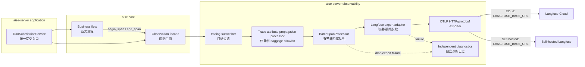
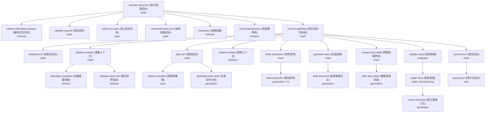

# Langfuse Trace 系统重构 — Design

> **Date**: 2026-09-23
> **Author**: GPT-5.6 Sol
> **Status**: Draft — architecture review fixes applied
> **Prior doc**: [AISE Architecture](./2026-08-04-Architecture-gpt.md)

---

## Context

当前系统已经接入 Langfuse，但 Langfuse 不是 Trace 的原生数据源。核心层先构造自定义 `TurnTrace`、`TraceSpan`、`SpanPayload` 和 `TraceRecorder`，再由服务端把整棵自定义树转换成 OTLP：

- `crates/aise/src/turn/turn_trace.rs:62-345` 定义完整的 Trace 数据模型、内存缓冲、父子栈和 sink 接口。
- `crates/aise/src/engine.rs:184-243` 在 Turn 中途才创建 recorder，结束后构造并复制完整 `TurnTrace`。
- `crates/aise-server/src/trace/writer.rs:118-227` 同时写逐 Span JSONL 和完整 JSON。
- `crates/aise-server/src/trace/langfuse.rs:99-322` 忽略实时 `write_span`，在 Turn 结束后手工重建 OTLP 根节点和父子关系。
- `crates/aise-server/src/main.rs:29-37` 把本地 writer 与 Langfuse sink 组合后注入业务引擎。
- `crates/aise/src/llm/gateway.rs:304-410`、`crates/aise/src/llm/gateway.rs:461-743` 同时维护自定义 LLM Span 和 `tracing` Span，形成两套链路。

该结构带来以下可验证问题：

1. **数据模型重复**：业务层、文件 sink、Langfuse 适配层和前端 Trace 页共同依赖自定义 Trace schema。
2. **故障覆盖不完整**：请求校验、协调器、Story 查询、幂等回放和预算构造等早期返回发生在 recorder 创建之前，不能进入 Langfuse。
3. **链路可能失真**：Langfuse exporter 跳过原始 `aise.turn` Span并合成新根节点；裸 JSON payload 又无法进入已有 `SpanPayload` 分支。
4. **热路径复制较多**：每个 Span 序列化并 clone 到 sink，Turn 结束时再次构建、clone 和序列化整棵 Trace。
5. **故障隔离不足**：启用 Langfuse 后，缺失凭据或配置错误会使 `ServerConfig::validate` 或启动流程失败。
6. **产品接口被旧 Trace 绑定**：`TraceCompleted`、`include_trace`、SSE Trace payload 和浏览器 Trace 页依赖本地 schema。
7. **实际流程与设计流程不一致**：`crates/aise/src/runtime/turn_runtime.rs:44-81` 当前未执行 Validation/Repair 循环。新 Trace 只能忠实记录实际执行路径，不能生成未执行的节点。

现在重构可以同时消除四套耦合：业务 Trace DTO、本地 Trace 文件、手写 OTLP 转换、前端 Trace viewer，并为后续恢复完整 Validation/Repair 流程提供稳定的观测契约。

### Constraints & assumptions

- 执行硬重构；旧 Trace 代码、配置、测试、API 和 UI 在同一变更中删除，不保留双路径、fallback 或兼容 adapter。
- 一次 Turn attempt 对应一条 Trace；一次连续的 Story 交互对应一个 Langfuse Session；Story 作为跨 Session 的持久化关联维度。
- Trace 必须反映实际执行路径；跳过的条件阶段不伪造 Span，改为在父节点记录 skip 原因。
- 业务结果不能因 Trace 初始化、序列化、队列、网络、认证、Langfuse Cloud 或自建服务故障而改变。
- Trace 热路径不得执行网络 I/O，不得等待 exporter，不得创建无界队列。
- Turn Trace 从服务端应用层统一提交入口开始；Axum transport extraction 失败不属于 Turn attempt，由普通 HTTP request tracing 记录。
- 非 HTTP 调用方不得绕过统一提交入口直接创建第二种 Trace 生命周期。
- 全部关键节点使用稳定、低基数、动词开头的双语名称，格式为 `english-name (中文名称)`。
- Langfuse Rust 原生 SDK 当前不存在；按 Langfuse 官方建议，Rust 使用原生 OpenTelemetry API 和 OTLP/HTTP。
- 目标依赖版本固定为 `opentelemetry`、`opentelemetry_sdk`、`opentelemetry-otlp`、`tracing-opentelemetry` `0.33.0`。这些版本的 MSRV 为 Rust 1.75，兼容项目 Rust 1.85。
- Langfuse 使用 OTLP ingestion v4；自建实例必须支持 `/api/public/otel`，生产目标为 Langfuse v4。

---

## Principles

1. **业务故障是 Trace 数据，不是 Trace 中断条件**：根 Span 在服务端应用层 `TurnSubmissionService::submit` 创建；Session 解析、请求校验、任务准入、成功、失败、取消、冲突和幂等回放都结束同一根 Span。
2. **Trace 故障旁路业务**：所有 Trace API 对业务调用方无错误返回；初始化失败退化为关闭 exporter，运行时失败只进入独立诊断日志。
3. **单一链路模型**：`tracing`/OpenTelemetry Span 是唯一运行时 Trace 模型；不再缓存或重建 `TurnTrace`。
4. **边界清晰**：核心 crate 只认识内部 Observation 语义；Langfuse 属性映射、认证、批处理和 OTLP exporter 全部位于 `aise-server` composition root。
5. **热路径有界**：关闭时近似零成本；启用时只创建 Span、物化有界字段并非阻塞入队；Langfuse 映射、最终脱敏和网络导出在队列后的 exporter worker 执行。
6. **稳定且可读**：名称集中注册、禁止动态值进入名称；输入、输出、状态、token、成本和错误按 Langfuse 数据模型放置。

---

## Options

### Option A: 保留 `TurnTrace`，替换 exporter

- **Idea**：继续由业务层构造自定义 Trace 树，仅把手写 HTTP exporter 替换为 OpenTelemetry exporter。
- **Pros**:
  - 改动较小。
  - 现有 SSE Trace 页可以继续工作。
- **Cons**:
  - 业务层仍承担 Trace 存储、父子关系和 payload schema。
  - 仍需在 Turn 结束时把自定义树转换为 OpenTelemetry。
  - 无法消除 clone、整树缓冲和双轨 `tracing`。
- **Risk**：形成长期兼容层，违反 `R-REFACTOR-01/02`。

### Option B: 直接调用 Langfuse ingestion API

- **Idea**：业务 Span 直接转换成 Langfuse HTTP 请求，不引入 OpenTelemetry SDK。
- **Pros**:
  - 完全控制 payload 和队列。
  - 可针对 Langfuse 数据模型做定制。
- **Cons**:
  - 继续自行维护批处理、重试、上下文传播、Span ID、协议升级和停机 flush。
  - Langfuse 已把旧 `/api/public/ingestion` 标为弃用，官方推荐 OTLP。
  - 与其它 Rust `tracing` 生态无法共享上下文。
- **Risk**：重复当前手写 exporter 的维护问题。

### Option C: `tracing` + 原生 OpenTelemetry + Langfuse OTLP

- **Idea**：业务只发出受控 `tracing` Span；服务端用 `tracing-opentelemetry` 接入 OpenTelemetry SDK，经官方 `opentelemetry-otlp` exporter 上报 Langfuse。
- **Pros**:
  - 一棵 Span 树同时覆盖 Turn、Pipeline、LLM、Tool、Retriever、Evaluator。
  - 官方 BatchSpanProcessor 已提供专用线程、有界队列、非阻塞 `try_send`、批处理和 shutdown。
  - Cloud、自建 Langfuse 或未来 Collector 只改变 endpoint 和凭据。
  - 不需要完整 Trace DTO、文件 sink、Composite sink 或手写 OTLP JSON。
- **Cons**:
  - Rust 没有 Langfuse SDK helper，需要集中维护一层属性映射。
  - `tracing` 的异步父子关系必须通过 `Instrument`/封装 API 正确传播。
- **Risk**：若属性命名或传播错误，Langfuse 会把字段放入不可筛选的通用 metadata。

### Option D: 应用只发 OTLP 到 OpenTelemetry Collector

- **Idea**：应用连接本地/同网 Collector，由 Collector 完成 masking、batch 和 Langfuse export。
- **Pros**:
  - 网络与后端故障隔离最强。
  - 多服务可统一策略。
- **Cons**:
  - 增加必须部署和运维的基础设施。
  - 本项目当前是单服务，收益不足以抵消复杂度。
- **Risk**：Collector 不可用时仍需定义应用侧队列和降级；并未消除应用插桩设计。

### Choice

**Adopt option C.**

**Rationale**：该方案删除旧 Trace 数据模型和手写协议，使用 Langfuse 官方推荐的非 Python/JS 集成路径，并复用现有 `tracing`。代价是维护一个很薄的 Langfuse 属性处理器，但该处理器位于外层模块，不进入业务层。Option D 保留为部署拓扑扩展：以后把 OTLP endpoint 指向 Collector 即可，核心插桩无需变化。

---

## Design

### 1. Target structure



目标目录：

```text
crates/aise/src/turn/observability/
  mod.rs
  fields.rs
  span.rs
  step.rs
  trace.rs

crates/aise-server/src/observability/
  mod.rs
  config.rs
  diagnostics.rs
  baggage_processor.rs
  langfuse_exporter.rs
  propagation.rs
  runtime.rs
  tests/

crates/aise-server/src/turn_submission/
  mod.rs
  service.rs
  tests/
```

`mod.rs` 只声明和 re-export。核心目录不包含 endpoint、凭据、队列或 Langfuse 类型；服务端目录不包含 Turn 业务判断。

普通日志和产品 Trace 使用同一个 subscriber registry，但使用不同 layer filter：

- `aise::observation` target 只进入 OpenTelemetry layer，不进入普通 fmt 日志。
- 普通业务日志进入 stdout/rolling file，不进入 Langfuse Trace 树。
- `aise::telemetry` 自诊断日志只进入普通日志，禁止回流 OpenTelemetry，避免递归。
- OpenTelemetry `internal-logs` 只进入普通日志；其 BatchSpanProcessor queue/export/shutdown 诊断是底层处理器的权威信号。

### 2. Core types & responsibilities

| Type / Module | Responsibility | Out of scope |
|---|---|---|
| `ObservationStep` | 集中定义稳定双语名称、Observation 类型和 schema version | 动态 ID、业务执行 |
| `ObservationFields` | 接受少量结构化开始字段；字段值延迟求值 | 保存完整 Trace |
| `ObservationFinish` | 记录 output、状态、error code、usage 和 cost | 改写业务 `Result` |
| `ObservationSpan` | 包装 `tracing::Span`，提供异步作用域和 RAII 结束保障 | 网络导出 |
| `ObservationTrace` | 拥有一次 Turn attempt 的根 Span、当前 Context 和晚绑定属性；在准入成功后一次性移交后台 task | 跨 Turn 持久化或共享 |
| `begin_span` / `end_span` | 提供简洁、无错误返回的业务调用面 | Langfuse 配置 |
| `observe_result` | 对标准 `Result` 异步步骤自动 begin、instrument、finish | 捕获 panic 后继续业务 |
| `BoundedContentEncoder` | 在调用线程以硬上限物化 input/output，不构建无界中间字符串 | Langfuse 字段映射和最终脱敏 |
| `ContentCapturePolicy` | 控制 metadata、redacted、full 三种内容级别和字节上限 | 保存 API key |
| `ObservabilityConfig` | 只从环境变量生成不可变 typed config | 混入业务 `AiseConfig` |
| `ObservabilityRuntime` | 唯一拥有 tracer provider、processor 和 shutdown | Turn 生命周期 |
| `TraceAttributePropagationProcessor` | 在 `on_start` 同步复制少量 baggage allowlist 后委托给 BatchSpanProcessor | JSON、脱敏、网络导出 |
| `LangfuseExportAdapter` | 在 BatchSpanProcessor worker 中把 `aise.*` 映射到 `langfuse.*`、执行最终脱敏，再委托 OTLP exporter | 业务判断和上下文传播 |
| `TelemetryDiagnostics` | 归一化初始化、mapping/masking、HTTP 和 shutdown 诊断并限频 | 终止服务或复制 BatchSpanProcessor 队列 |
| `TurnSubmissionService` | 在服务端应用层创建根 Trace，完成 Session 解析、语义校验、任务准入和后台上下文移交 | Axum body/path/header extraction |

业务调用保持两种短形式：

- 手动生命周期：`begin_span(step, start_fields)` → 在 Span 作用域执行 future → `end_span(span, finish_fields)`。
- 标准异步 `Result`：`observe_result(step, start_fields, future)`，由门面自动设置成功或错误状态。

两种形式都隐藏 Span 构造、属性名、序列化、OpenTelemetry context 和 Langfuse schema。`ObservationSpan` 被未完成地 drop 时记录 `incomplete`，防止早退产生无状态节点。异步代码不得持有 `span.enter()` guard 跨 `.await`；门面统一使用 `Instrument`。

`TraceAttributePropagationProcessor` 必须包装并独占 BatchSpanProcessor，provider 只注册该外层 processor。若把映射 processor 与 BatchSpanProcessor 分别注册，二者会收到独立的 Span 结束数据，映射结果不会进入导出链。`LangfuseExportAdapter` 位于 BatchSpanProcessor 的 `SpanExporter` 侧，因此 JSON 映射、最终 masking 和 OTLP 调用都不在业务线程执行。

### 3. Trace scope and identity

每次 Turn 提交 attempt 创建一条根 Trace。根节点由 `aise-server` 应用层 `TurnSubmissionService::submit` 创建，而不是由 Axum handler 或 `AiseEngine::execute_turn` 创建：

- Trace name：`execute-story-turn (执行故事回合)`。
- Observation type：`chain`。
- Trace ID：OpenTelemetry 随机 128-bit ID；不使用 Turn number 或幂等键生成确定性 ID。
- Session ID：成功解析后的 application `SessionId`，用于聚合一次连续交互中的多个 Turn。
- Input：按内容策略处理后的 `player_contribution`。
- Output：成功时为最终故事文本摘要或有界正文；失败时为 `{status, error_code, failure_kind, stage}`。
- Tags：`story-turn`。
- Trace metadata：`story_id`、可用后的 `turn_number`、幂等键不可逆 digest、`replayed`。
- Resource/trace attributes：`service.name=aise-server`、service version、environment、release、Trace schema version。

Axum 的 path/header/body extraction 在 handler 函数体执行前发生。malformed JSON、错误 `Content-Type`、无法提取 path 等 transport failure 不创建 Turn Trace，因为系统尚未接受一次 Turn attempt；它们由 `tower-http` request span 和结构化 API error 日志记录。handler 完成 transport extraction 后把原始 session ID、幂等键、请求 DTO、事件 sink 和 cancellation 交给 `TurnSubmissionService`，由该服务在任何业务语义校验前创建根 Trace。CLI、测试或未来其它 transport 也必须调用同一服务。

边界层级固定为：

```text
Story（持久化叙事聚合）
└── Interaction Session（一次连续交互）
    └── Turn Trace（一次回合提交 attempt）
        └── Observation（Pipeline / LLM / Retriever / Tool / Evaluator）
```

Story 不直接作为 Langfuse Session，原因是一个 Story 可以跨多次访问、跨天继续并包含大量 Turn。将整部 Story 合并为一个 Session 会使 replay 过长，也会让 session-level feedback 无法区分不同交互。需要查看完整 Story 时，通过所有 Trace 上的 `story_id` metadata 过滤和聚合。

Interaction Session 的边界为：

1. application Session 创建时开始。
2. 同一次连续交互中的多个 Turn 沿用同一个 `SessionId`。
3. Session 被显式删除、服务重启导致内存 Session 消失、用户开始新的游玩交互或切换 Story 时结束。
4. 同一 Story 的后续继续游玩创建新 Session，但沿用相同 `story_id` metadata。
5. 一个 Langfuse Session 不得跨 Story。现有 `bind_story` 若保留，必须轮换到新的 `SessionId`；更推荐切换 Story 时创建新 application Session，不能复用旧 ID。
6. 在 Session ID 非法或 Session 不存在等前置失败中仍创建 Trace，但不设置 `langfuse.session.id`，避免把无效标识写成真实 Session。

根 Span 在 Session 解析和请求校验前创建，因此以下路径仍会形成可诊断 Trace：

- invalid / missing Session；
- invalid request；
- missing / invalid idempotency key；
- Turn task admission/backpressure 失败；
- Story coordinator acquire 失败；
- Story not found 或 Store I/O 失败；
- idempotency replay 或 conflict；
- Turn number / budget / context 构造失败；
- Pipeline 失败、取消、deadline、commit conflict；
- 正常 committed。

API 前置阶段在当前请求任务中执行；进入后台 Turn task 后，根 Span 的 OpenTelemetry context 必须显式传播并由后台 task 持有到终态。任务准入失败时由提交服务结束根 Span；准入成功时提交服务把根 Span ownership 一次性移交给后台 task。`AiseEngine::execute_turn` 只创建根 Trace 下的业务子节点，不重复创建第二个根。

业务 `Result` 原样返回。Trace 状态只观察结果，不参与结果计算。

#### Late-bound trace attributes

Trace 级属性按可用时点分组，禁止承诺把晚到字段追溯写入已经结束的 Span：

| Availability | Attributes | Propagation |
|---|---|---|
| Root start | trace name、tags、environment、release、schema version | 根 Span 和所有后代 |
| Session resolved | `langfuse.session.id`、`story_id` | 根 Span、解析 Session 的当前 Span和之后创建的后代 |
| Request validated | idempotency key digest | 根 Span、当前 Span 和之后创建的后代 |
| Story loaded | `turn_number` | 根 Span、当前 Span 和之后创建的后代 |
| Terminal | `replayed`、terminal status、failure stage | 根 Span 和终态 Span |

`ObservationTrace` 维护不可变的当前 OpenTelemetry Context；每次绑定晚到属性时创建新 Context，更新根/当前 Span，并把新 Context 传给后续 future 或 spawned task。已经结束的前置 Span 保持当时可知的数据。Langfuse trace-level 查询以根 Span metadata 为准；需要 observation-level 过滤的字段只能保证出现在字段可用后创建的 Observation 上。

### 4. Canonical trace tree



规则：

1. 只有实际执行的节点才创建；条件跳过记录在父 Span metadata，例如 `retrieval_skipped=true`。
2. 每次 LLM completion 调用独立为 `generation`，不得把多轮调用聚合成一个 generation。
3. 重试和修复使用稳定名称，`attempt`、`correction_round` 放 metadata，不进入名称。
4. 角色 ID、Story ID、Turn number、模型名都放字段，不进入 Span 名称。
5. Validation/Repair 当前未执行时不显示；业务流程恢复后由已有统一边界自然生成对应节点。
6. Tool、Retriever、Evaluator 的类型必须准确，不用通用 Span 替代可识别类型。

### 5. Stable bilingual observation registry

| Step | Langfuse type | Stable display name |
|---|---|---|
| Turn root | `chain` | `execute-story-turn (执行故事回合)` |
| Interaction Session lookup | `retriever` | `resolve-interaction-session (解析交互会话)` |
| Request validation | `span` | `validate-request (校验请求)` |
| Turn task admission | `span` | `admit-turn-task (准入回合任务)` |
| Story coordination | `span` | `coordinate-story-turn (协调故事回合)` |
| Story load | `retriever` | `load-story (加载故事)` |
| Idempotency lookup | `retriever` | `check-idempotency (检查幂等性)` |
| Runtime orchestration | `chain` | `run-turn-pipelines (执行回合流水线)` |
| Initialization | `chain` | `initialize-turn (初始化回合)` |
| Baseline context | `chain` | `prepare-context (准备上下文)` |
| Snapshot load | `retriever` | `load-story-snapshot (加载故事快照)` |
| Knowledge activation | `retriever` | `activate-world-info (激活世界信息)` |
| Writer planning | `chain` | `plan-turn (规划回合)` |
| Narrative projection | `span` | `project-narrative (投影叙事图)` |
| Context retrieval | `retriever` | `retrieve-context (检索上下文)` |
| Character pipeline | `chain` | `think-characters (角色思考)` |
| Character LLM call | `generation` | `think-character (角色思考)` |
| Story pipeline | `chain` | `generate-story (生成故事)` |
| Story LLM call | `generation` | `draft-story-text (起草故事正文)` |
| State extraction | `chain` | `extract-story-state (提取故事状态)` |
| State extraction LLM | `generation` | `infer-story-state (推断故事状态)` |
| Validation | `evaluator` | `validate-story (校验故事)` |
| Repair pipeline | `chain` | `repair-story (修复故事)` |
| Repair LLM call | `generation` | `revise-story-text (修订故事正文)` |
| Commit | `chain` | `commit-turn (提交回合)` |
| Persistence write | `tool` | `persist-turn (持久化回合)` |

该 registry 视为分析 API。改名会破坏 Langfuse saved views、evaluators 和 dashboards，因此名称变更必须提升 Observation schema version。

### 6. Langfuse attribute mapping

核心门面先写内部 `aise.*` 属性，`LangfuseExportAdapter` 在 BatchSpanProcessor worker 中集中映射并移除内部临时键：

| Semantics | Langfuse/OTel attribute |
|---|---|
| Observation type | `langfuse.observation.type` |
| Trace name | `langfuse.trace.name` |
| Session | `langfuse.session.id` |
| Tags | `langfuse.trace.tags` |
| Environment | `langfuse.environment` |
| Release | `langfuse.release` |
| Trace metadata | `langfuse.trace.metadata.*` |
| Observation metadata | `langfuse.observation.metadata.*` |
| Input / output | `langfuse.observation.input` / `langfuse.observation.output` |
| Model | `langfuse.observation.model.name` |
| Model parameters | `langfuse.observation.model.parameters` |
| Token usage | `langfuse.observation.usage_details` |
| Cost | `langfuse.observation.cost_details` |
| Level / message | `langfuse.observation.level` / `langfuse.observation.status_message` |
| Component version | `langfuse.version` |

Trace name、tags、environment、release 和 schema version 在根节点开始前进入 allowlisted OpenTelemetry baggage。session 和 filterable trace metadata 在解析后进入新的 Context，只传播给此后创建的 Span。`TraceAttributePropagationProcessor::on_start` 只复制固定数量的标量 baggage 项，不执行序列化、正则、锁等待或 I/O。Baggage 禁止放 prompt、输出、API key、错误消息或用户隐私内容。

Generation usage 使用互斥 bucket：

- `input = input_tokens - input_cached_tokens`；
- `input_cached_tokens` 单独记录；
- `output = output_tokens - output_reasoning_tokens`；
- `output_reasoning_tokens` 单独记录；
- `total` 等于所有互斥 bucket 之和。

只有能够确认单位为 USD 且 bucket 语义明确的费用才写 `cost_details`。其它 provider charge 保留为 observation metadata，避免重复或错误计费。模型名始终记录，让 Langfuse 可以使用 model definition 自动计算成本。

错误同时设置 OpenTelemetry error status、`langfuse.observation.level=ERROR` 和稳定 `error_code`。`status_message` 使用有界、脱敏后的诊断信息，不包含凭据。取消和 deadline 仍属于可诊断终态，不丢弃 Span。

### 7. Content capture and data safety

`ContentCapturePolicy` 从 Trace 基础设施配置中读取，不再属于 `LlmConfig`：

| Policy | Captured data | Intended use |
|---|---|---|
| `metadata_only` | 名称、结构、状态、时延、token、cost、大小、hash | 生产默认 |
| `redacted_content` | 有界 input/output，经 secret/PII masking | 开发、受控生产诊断 |
| `full_content` | 有界原文；仍执行凭据 masking | 仅 development 且需显式二次开关 |

所有模式都遵守：

1. 每字段默认最多 16 KiB，每 Observation 内容合计默认最多 32 KiB。
2. 只在根 Trace 被采样且 Span 正在 recording 时序列化内容。
3. `BoundedContentEncoder` 使用有界 writer 直接物化最多“字段上限 + detector overlap”的 UTF-8 安全前缀，不先构建完整 JSON 字符串。
4. `LangfuseExportAdapter` 使用有状态的流式 masker 扫描该有界前缀；overlap 必须不小于所有 secret/PII detector 的最大跨块宽度。masking 后再截取最终字段上限，并用逐字节边界测试验证 secret 跨截断点时不会泄漏。
5. API key、Authorization、cookie、secret-key 形态永不允许输出；即使 `full_content` 也必须 masking。
6. 最终 masking 覆盖所有将导出的 string 属性，包括 input、output、metadata、status message 和 error；未知 `aise.*` 临时键直接删除，不落入 Langfuse catch-all metadata。
7. `full_content` 在非 development 环境视为无效配置，降级为 `metadata_only` 并记录 warning，不阻断服务。
8. Provider 暴露 reasoning 文本时，只有策略允许才记录有界内容；否则只记录 reasoning token 数和 `reasoning_content_available`。不得伪造 reasoning。

`metadata_only` 是生产安全默认值，但它明确放弃内容型人工审阅、LLM-as-a-judge 和基于正文的数据集回归。启用这些产品能力前必须单独完成数据分类、保留周期和访问控制评审，不能通过静默改变默认值获得。

### 8. Configuration and Cloud/self-host switching

新 Trace 配置只来自环境变量，不进入 `config/aise_config.toml`：

| Environment variable | Default | Meaning |
|---|---|---|
| `LANGFUSE_TRACING_ENABLED` | `false` | 总开关 |
| `LANGFUSE_BASE_URL` | `https://cloud.langfuse.com` | Cloud region 或自建服务根 URL |
| `LANGFUSE_PUBLIC_KEY` | none | Project public key |
| `LANGFUSE_SECRET_KEY` | none | Project secret key |
| `LANGFUSE_TRACING_ENVIRONMENT` | `development` | Langfuse environment |
| `LANGFUSE_RELEASE` | crate version | 部署版本或 git SHA |
| `LANGFUSE_SAMPLE_RATE` | `1.0` | Trace 级 head sampling，范围 `[0,1]` |
| `AISE_TRACE_CONTENT_POLICY` | `metadata_only` | 内容策略 |
| `AISE_TRACE_FULL_CONTENT_ALLOWED` | `false` | development 全内容二次开关 |
| `AISE_TRACE_MAX_FIELD_BYTES` | `16384` | 单字段硬上限 |
| `AISE_TRACE_MAX_OBSERVATION_BYTES` | `32768` | 单 Observation 内容硬上限 |
| `OTEL_BSP_MAX_QUEUE_SIZE` | `2048` | 全局有界 Span 队列 |
| `OTEL_BSP_MAX_EXPORT_BATCH_SIZE` | `256` | 单批最大 Span 数 |
| `OTEL_BSP_SCHEDULE_DELAY` | `1000` | 批处理间隔，毫秒 |
| `AISE_TRACE_HTTP_TIMEOUT_MS` | `3000` | 单次 OTLP HTTP 超时 |
| `AISE_TRACE_SHUTDOWN_TIMEOUT_MS` | `5000` | flush/shutdown 总预算 |

endpoint 统一由 `LANGFUSE_BASE_URL` 推导为 `{base}/api/public/otel/v1/traces`，协议固定 OTLP/HTTP protobuf，header 固定包含：

- `Authorization: Basic base64(public_key:secret_key)`；
- `x-langfuse-ingestion-version: 4`。

切换部署不改代码或 TOML：

- EU Cloud：`LANGFUSE_BASE_URL=https://cloud.langfuse.com`；
- US Cloud：`LANGFUSE_BASE_URL=https://us.cloud.langfuse.com`；
- 自建：`LANGFUSE_BASE_URL=https://langfuse.internal.example`。

自建环境通常还需替换该项目的 public/secret key，但仍仅是环境变量变化。

配置与启动采用 fail-open：

1. 未启用时不要求 URL 或凭据。
2. 启用但缺少凭据、URL 非法、environment 非法或 exporter 初始化失败时，输出结构化 warning。
3. OTel layer 退化为关闭，普通日志 subscriber 继续初始化，服务正常启动。
4. 凭据值本身永不进入日志。

`ObservabilityConfig` 必须显式解析并校验全部 `OTEL_BSP_*` 值，再通过 builder 编程式构造 BatchSpanProcessor；不得让 SDK 再从环境读取第二套默认值。`http_timeout_ms` 必须严格小于 `shutdown_timeout_ms`，为队列 drain、线程 join 和诊断留出预算。

### 9. Failure isolation, ownership, and shutdown

`ObservabilityRuntime` 在 `main` 中创建并由 `main` 唯一持有：

- OpenTelemetry `SdkTracerProvider` 和 BatchSpanProcessor 后台线程只创建一次。
- Turn task、Turn cancellation 和 HTTP client disconnect 不拥有也不取消 exporter。
- Span 结束调用 BatchSpanProcessor 的非阻塞 `try_send`；队列满时丢 Span，不等待业务线程。
- `TraceAttributePropagationProcessor::on_end` 只把 Span ownership 委托给 BatchSpanProcessor；映射、masking、protobuf 和 HTTP 全部由 worker 调用的 `LangfuseExportAdapter` 完成。
- Langfuse timeout、DNS、TLS、401/403、429、5xx 和自建服务停机只更新诊断日志，不返回业务层。
- exporter 诊断按错误类型限频，防止 Langfuse 故障制造日志风暴。
- 正常退出时，在 Turn task drain 之后执行一次有界 flush/shutdown。
- thread-based BatchSpanProcessor 的 flush/shutdown 是阻塞 API；`main` 必须通过 `tokio::task::spawn_blocking` 调用 `ObservabilityRuntime::shutdown_with_timeout`，不得阻塞 Tokio worker。
- shutdown 超时只记录丢弃数量和错误，不无限等待。
- 进程 crash/abort 时允许丢失尚未导出的最后一个批次；不为 Trace 引入磁盘 WAL，因为它会重新引入本地 Trace 生命周期和 I/O 开销。

初始化、mapping/masking 和 HTTP 分类由 `TelemetryDiagnostics` 记录；BatchSpanProcessor queue overflow、export 和 shutdown 由启用 `internal-logs` 后的 OpenTelemetry SDK 结构化事件记录。两类日志都只进入普通日志 layer，并按 `error_kind` 限频。诊断字段使用 `error_kind`、`status`、`dropped_span_count`、`queue_capacity`、`endpoint_host`，不输出完整带凭据 URL；底层 SDK 无法提供 typed HTTP status 时记录 `status=unknown`，禁止解析错误字符串猜测状态码。

### 10. Performance model

关闭状态：

- `aise::observation` target 被 subscriber filter 禁用。
- `begin_span` 返回 disabled span；字段延迟求值，不序列化 input/output。
- 不创建 exporter、后台线程、队列或 HTTP client。

启用状态：

- 请求线程承担 Span 创建、少量标量字段、有内容策略时的有界字段物化，以及结束时非阻塞 enqueue。
- Langfuse 属性映射、最终 masking、protobuf 编码和批量发送在 BatchSpanProcessor 专用线程执行。
- 不再维护 `Vec<TraceSpan>`，不再逐 Span clone 到多个 sink，不再在 Turn 结束时重建整棵 Trace。
- root-level sampling 使用 `ParentBased(TraceIdRatioBased)`；一条 Trace 要么完整采样，要么全部不采样，禁止按子 Span 过滤造成断树。
- 业务循环本身已有 `max_llm_calls`、角色数、检索数、repair round 等上限；Trace 节点只能从这些有界步骤产生。
- 全局队列、batch、字段和 Observation 内容均有硬上限。

默认最坏内容队列预算为 `2048 × 32 KiB = 64 MiB`，不含 Span 固定开销。压测必须记录实际峰值；若总观测增量超过 96 MiB，优先降低 queue size 或内容上限，不得增加隐藏 sidecar cache。

性能验收门槛：

1. Trace 关闭时，代表性 Turn benchmark 的 p95 延迟回归小于 1%，门面禁用路径不产生 heap allocation。
2. `metadata_only`、100% sampling 时，代表性并发 Turn 的 p95 延迟回归小于 3%。
3. `redacted_content`、100% sampling 时，p95 延迟回归小于 5%，且内存不随 Turn 总数增长。
4. exporter 被阻塞、队列满或 endpoint 不可达时，Turn 不等待网络，业务结果与 Trace 关闭时一致。
5. `redacted_content` 下 mapping/masking 必须运行在 exporter worker；阻塞 masker 的测试不得增加 `ObservationSpan::end` 延迟。

### 11. Dependencies

workspace 新增并统一固定：

- `opentelemetry = 0.33.0`，仅 `trace`；
- `opentelemetry_sdk = 0.33.0`，仅 `trace`、`internal-logs`；
- `opentelemetry-otlp = 0.33.0`，关闭默认 feature，仅启用 `trace`、`http-proto`、`reqwest-blocking-client`、`reqwest-rustls`、`internal-logs`；
- `tracing-opentelemetry = 0.33.0`，关闭不需要的默认 feature。

选择 blocking OTLP HTTP client 是因为 OpenTelemetry 0.33 默认 BatchSpanProcessor 使用专用后台线程，官方说明该处理器不支持 async reqwest client。blocking 只发生在 exporter 线程，不进入 Tokio 业务任务。`base64` 继续用于 Basic Auth header；不新增 Langfuse 私有协议 crate。

### 12. Test and verification strategy

单元测试：

- `ObservationStep` 名称、类型和 schema version 快照；
- 双语格式校验，所有关键名称符合 `english (中文)`；
- metadata、usage 互斥 bucket、error status 和 content 上限映射；
- redaction 对 key、Authorization、email/phone 等规则，并逐字节覆盖 secret 跨截断点和跨 masker block 的情况；
- invalid config 的 fail-open 行为；
- RAII incomplete Span 和正常 `end_span` 行为。
- provider 只注册外层 propagation processor，mapping exporter 位于 BatchSpanProcessor 后；
- 所有单元测试放在 `tests/<source>_tests.rs`，不使用 inline `mod tests`。

集成测试：

- 使用 OpenTelemetry in-memory exporter 验证完整父子树、类型、状态和属性；
- success、early failure、cancelled、conflict、replayed 各有根 Span；
- malformed JSON 和 transport extraction failure 只有 HTTP request log，不创建 Turn Trace；语义 invalid request 进入 Turn Trace；
- HTTP 与非 HTTP 调用方都通过 `TurnSubmissionService`，不得产生第二种根 Trace；
- 同一 application Session 的多个 Turn 进入同一 Langfuse Session；
- 同一 Story 的两次独立交互进入不同 Langfuse Session，但具有相同 `story_id` metadata；
- Session 切换 Story 时必须轮换 Session ID，任何 Langfuse Session 都不能包含多个 `story_id`；
- invalid / missing Session 的前置失败有 Trace，但没有伪造的 `langfuse.session.id`；
- fake OTLP HTTP server 验证 endpoint、Basic Auth、ingestion v4 header 和 protobuf 请求；
- Cloud URL 与 self-host URL 只改环境变量即可切换；
- 阻塞 exporter 和 queue overflow 不阻塞 Turn；
- 晚绑定属性更新根/当前 Span 并只传播给后续 Span，测试不得假定追溯更新已结束 Span；
- shutdown 通过 `spawn_blocking` 在预算内完成，超时可诊断；
- 普通日志不进入 Langfuse，telemetry diagnostics 不递归；
- `metadata_only` 不包含 prompt/response，full content 在 production 自动降级。

端到端验收：

1. 向 Langfuse 测试项目执行成功 Turn、失败 Turn、条件跳过 Turn 和修复 Turn。
2. 使用 Langfuse CLI/API 读取刚生成的 traces。
3. 按最新 Langfuse “What does a good trace look like?” 逐项审计：根 input/output、层级、Observation type、稳定名称、model、usage、cost、session、environment、release、metadata。
4. 修正后重新运行和读取，直到树结构与字段满足审计。
5. 对 Cloud 和至少一个支持 OTLP ingestion v4 的自建实例执行 smoke test。

---

## Impact

- **Code**:
  - 删除 `crates/aise/src/turn/turn_trace.rs` 及所有 `TraceRecorder`、`TraceSpanSink`、`SpanPayload`、`TurnTrace` 调用。
  - 删除 `crates/aise-server/src/trace/` 全目录以及 `trace_sink_tests.rs`、`turn_trace_tests.rs`。
  - 新增核心 Observation 门面和服务端 observability runtime。
  - 新增服务端 `TurnSubmissionService`，HTTP handler、测试和未来 transport 统一通过该服务提交 Turn。
  - `AiseEngine` 根入口、`TurnRuntime` Pipeline 边界、`LlmGateway`、context retrieval、validation、commit 等改用新门面。
  - `main.rs` 只负责 subscriber/runtime wiring，并通过 `spawn_blocking` 执行 observability shutdown。
- **Config**:
  - 删除 `[langfuse]` TOML、`LlmConfig.trace_content`、`turn.max_trace_spans`、`content.max_trace_field_bytes`、本地 Trace writer 配置。
  - `.env.example` 改为本设计的环境变量。
  - 日志目录从 Trace 概念中分离，使用 `log_dir` / `AISE_LOG_DIR`；不再生成 `trace/*.json` 或 `*.jsonl`。
- **Data**:
  - 无数据库 schema 变化。
  - 删除本地 Trace JSON schema 和 retention/rotation 语义。
  - Langfuse 成为 Trace 的唯一持久化与查询后端。
- **External interface**:
  - 删除请求 `include_trace`、`TurnEvent::TraceCompleted`、SSE `trace_completed` 和前端 Trace viewer。
  - 终端事件保持业务语义，不携带完整 Trace。
  - application `SessionId` 成为 Langfuse `session.id`；Story 切换不得复用原 Session ID。
  - 运维通过 `session.id` 回放一次交互，通过 `story_id`、`turn_number`、environment、release 跨 Session 查询。
- **Docs**:
  - 更新 `doc/design/2026-08-04-Architecture-gpt.md` 中 `TraceCompleted`、Trace budget 和本地 Trace writer 描述。
  - 删除或替换仍把 `TurnTrace` 作为当前契约的执行文档与配置说明。

---

## Risks & mitigations

| Risk | Likelihood | Impact | Mitigation |
|---|---|---|---|
| Langfuse 属性未正确映射，字段不可筛选 | medium | high | 集中 export adapter、mapping 单测、真实 Trace CLI 审计 |
| 异步边界丢失父子关系 | medium | high | 门面统一 `Instrument`，禁止跨 `.await` enter guard，树快照测试 |
| mapping/masking 误放在 Span `on_end` 热路径 | medium | high | exporter decorator 位于 BatchSpanProcessor 后，阻塞 masker 测试 |
| 晚绑定 metadata 在 Observation 间不一致 | high | medium | 属性按可用时点分类，更新根/当前/后续 Span，查询契约不承诺追溯 |
| exporter 队列满导致 Span 丢失 | medium | medium | 有界队列、drop diagnostics、容量压测、默认 1 秒 batch |
| 内容泄露 | low | high | metadata-only 默认、export-stage streaming masking、跨截断边界测试、production 禁止 full |
| 采样导致失败 Trace 未记录 | low at default | high | 默认 sample rate 1.0；降低采样率时明确接受统计性可见性 |
| self-host 版本不支持 ingestion v4 | medium | medium | 启动健康诊断、要求 v4、部署 smoke test |
| OpenTelemetry 依赖增加 binary/compile size | medium | low | 关闭默认 features，只启用 traces + OTLP HTTP |
| 删除 SSE Trace 影响现有前端调试习惯 | high | medium | Langfuse Sessions/Traces 替代，本地开发使用 development environment |
| Story 被拆分到多个 Langfuse Session 后缺少单页全量回放 | medium | low | 在每条 Trace 根 metadata 记录 `story_id`，使用 saved view/dashboard 跨 Session 聚合 |
| application Session 换绑 Story 污染 Session replay | medium | high | Story 切换强制轮换 `SessionId`，集成测试禁止一个 Session 出现多个 `story_id` |
| graceful shutdown 等待 exporter | low | medium | HTTP timeout + shutdown 总预算，超时后记录并退出 |
| Trace 名称变化破坏 dashboard/evaluator | medium | medium | 中央 registry、schema version、名称快照测试 |

---

## Roadmap

以下阶段是同一个硬重构变更内的实现顺序，不允许分批部署出双路径：

- **Phase 0**: 建立 Observation contract、`TurnSubmissionService`、环境配置、OTel runtime、propagation processor、mapping exporter 和测试基础；先通过“队列后 mapping/masking”与“跨 task 父子传播”两个 spike → spec `doc/exec/langfuse-trace-system-spec/2026-09-23-langfuse-trace-system-spec-phase-0-gpt.md`
- **Phase 1**: 覆盖 Turn/Pipeline/LLM/Retrieval/Validation/Persistence 全链路并验证双语树 → spec `doc/exec/langfuse-trace-system-spec/2026-09-23-langfuse-trace-system-spec-phase-1-gpt.md`
- **Phase 2**: 删除旧 Trace、SSE/UI/config/docs，完成性能与 Cloud/self-host 实测 → spec `doc/exec/langfuse-trace-system-spec/2026-09-23-langfuse-trace-system-spec-phase-2-gpt.md`

所有阶段完成后才能合并；不得保留旧 sink、旧 payload 或 runtime flag 作为 fallback。

---

## Appendix

### Langfuse references

- [OpenTelemetry integration](https://langfuse.com/integrations/native/opentelemetry)
- [What does a good trace look like?](https://langfuse.com/docs/observability/best-practices)
- [Observation types](https://langfuse.com/docs/observability/features/observation-types)
- [Masking](https://langfuse.com/docs/observability/features/masking)
- [Sampling](https://langfuse.com/docs/observability/features/sampling)
- [Trace IDs and distributed tracing](https://langfuse.com/docs/observability/features/trace-ids-and-distributed-tracing)
- [Token and cost tracking](https://langfuse.com/docs/observability/features/token-and-cost-tracking)
- [Environments](https://langfuse.com/docs/observability/features/environments)
- [Releases and versioning](https://langfuse.com/docs/observability/features/releases-and-versioning)

### Non-goals

- 本设计不修复当前被注释的 Validation/Repair 业务流程。
- 本设计不引入 Langfuse prompt management、datasets、scores 或 evaluators。
- 本设计不引入 OpenTelemetry metrics/log export；普通结构化日志继续使用现有 `tracing-subscriber`。
- 本设计不保证进程 crash/abort 前最后一个未 flush batch 的持久性。
