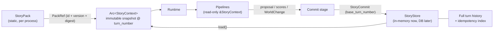

# Story 动态数据（StoryContext）— Design

> **Date**: 2026-10-04
> **Author**: Opus (Claude)
> **Status**: Draft
> **Prior doc**: [AISE 技术架构设计 v3.1](./2026-08-04-Architecture-gpt.md)、[Story Pack Design v3.0](./2026-08-06-StoryPackDesign-gpt.md)、[World Info Entry Activation Design](./2026-09-05-world-info-entry-activation-design-gpt.md)

---

## Context

### 现状

- `crates/aise-core/src/core/story.rs` 中并存两套模型：
  - 一组 `*Info` 类型（`StoryOpeningInfo`、`StoryTurnInfo`、`RoleStateInfo`、`StorySnapshotInfo`、`StoryHistoryInfo`），语义互相重叠，`sequence` 与 `turn_number` 表达同一概念，`base_revision` 与 Turn 轮次重复。
  - 一个只有 `story_id` 的 `StoryContext` 占位类型。
- `crates/aise-core/src/pipeline/runtime/runtime.rs:60-73` 在每个 Pipeline Input 中重新构造 `StoryContext { story_id }`；Input 实现 `Serialize`，会被完整写入 trace。
- `CommitPipeline` 只是把字符串原样返回（`pipeline/commit/commit.rs`），没有任何权威状态写入；`CommittedTurnInfo` 中的 `turn_number`、`story_revision` 在 `runtime.rs:150-157` 被硬编码为 1。

### 问题

1. 没有 Story 动态数据模型：Pipeline 无法读取前文、当前世界状态和 summary，故事无法连续。
2. 没有提交语义：没有版本校验、幂等和原子写入，`TurnCommitter` 的保证（`R-AISE-05`）无从实现。
3. 世界状态既有需要确定性判断的数据（地点、Graph 节点、sticky/cooldown），也有大量自由文本叙事状态（关系描述、物品现状、隐患），缺少统一的表示和更新方式。

### 为什么现在做

Baseline 已经接入 Prompt Library，下一步 Plan / Generate / Extract / Commit 都依赖 Story 数据。先定下 StoryContext 的结构和读写契约，后续 Pipeline 才有稳定的输入。

### Constraints & assumptions

- 静态数据（Story Pack）进程内只有一份，启动时加载，不考虑热更新；本文不展开 Story Pack 结构，只通过 `PackRef` 引用。
- 动态数据当前放在内存，后续迁移到数据库；接口设计必须对两种实现都成立。
- 一个故事通常为几万字，过长的故事不可玩；单个故事的数据量按“不到 1 MB”估算（见附录 A）。
- 本文不修改 [架构文档 v3.1](./2026-08-04-Architecture-gpt.md)；与其冲突之处在附录 C 列出，统一并入架构 2.0 文档。
- 遵循 aise 硬重构原则（`R-REFACTOR-01/02`）：`story.rs` 中的 `*Info` 旧类型在同一变更中删除，不保留兼容层。

---

## Principles

1. **静态与动态分离**：Story Pack 是不可变模板；StoryContext 是一次游玩的动态数据，通过 `PackRef` 固定所用 Pack 的版本与摘要。
2. **快照只读，提交原子**：StoryContext 是某一轮提交后的不可变快照；Pipeline 只读，唯一写入口是 Turn Commit，由 `StoryStore` 原子应用。
3. **turn number 即版本**：每次成功提交恰好推进一轮，不再设置独立的 revision。
4. **确定性数据强类型，叙事数据键值化**：被代码逻辑读取的状态必须类型化；其余叙事状态使用“结构化外壳 + 自由文本内容”的条目，按 key 整条替换。
5. **有界**：StoryContext 只保留 summary 与最近 N 轮；条目数、文本长度、每轮操作数、单故事轮数都有配置上限（`R-ARCH-04`）。
6. **概念不混名**：`lifecycle` 表示故事生命周期，`world` 表示世界内容，`TurnStatus` 表示单轮提交结果；全模型不再出现含义模糊的 `state` / `status` 混用。

---

## Options

本设计包含四个相互独立的选择点。

### 选择点 1：世界状态的表示方式

#### Option A：通用 `HashMap<String, serde_json::Value>`

- **Idea**：所有状态都是字符串 key 加任意 JSON 值。
- **Pros**：灵活，LLM 输出直接写入。
- **Cons**：没有 Schema，key 拼写错误、类型漂移只能在运行时暴露；Graph 条件和确定性 Validation 无法可靠读取；遍历顺序不确定。
- **Risk**：状态被 LLM 输出逐渐污染，无法校验。

#### Option B：全部强类型字段

- **Idea**：为每种状态定义结构体字段。
- **Pros**：类型安全，校验简单。
- **Cons**：叙事状态种类无法穷举（关系的微妙变化、伤势描述、谣言的扩散程度），每新增一种都要改代码和 Prompt。
- **Risk**：模型被迫把叙事信息塞进不合适的字段，或者干脆丢失。

#### Option C：两层模型（采用）

- **Idea**：第一层是少量强类型核心状态，只放确定性逻辑需要读取的数据；第二层是键值化叙事条目，key 和归属对象结构化，内容可以是自由文本。
- **Pros**：确定性逻辑有类型保证；叙事状态可扩展；更新语义统一为 Set / Remove，不需要合并文本。
- **Cons**：需要明确划定哪些状态属于第一层。
- **Risk**：第一层边界划得过宽，会退化成 Option B。用划分规则约束（见 Design §3.2）。

### 选择点 2：版本号

#### Option A：独立 `revision`

- **Pros**：能覆盖 Turn 之外的写入，以及回退或分支造成的 ABA 问题（数值相同、内容不同）。
- **Cons**：当前只有 Turn Commit 一个写入口，revision 与已提交轮数永远一一对应，两个字段并存只会多一处不一致的可能。

#### Option B：用 turn number 作为版本（采用）

- **Pros**：字段少；与 World Info 的 sticky/cooldown 按“成功提交的 Turn 数”计数的口径一致。
- **Cons**：前提是“StoryContext 只能由 Turn Commit 修改”；一旦出现 Turn 之外的写入或回退，需要重新引入 revision（见附录 B）。

### 选择点 3：历史放在哪里

#### Option A：StoryContext 持有完整 turn history

- **Pros**：读取简单；单故事不到 1 MB。
- **Cons**：每个 Turn 都携带用不到的全量历史；迁移到数据库后，每次加载都要读取全量历史。

#### Option B：StoryContext 只持有最近 N 轮，完整历史由 Store 持有（采用）

- **Pros**：StoryContext 有界且只包含当前 Turn 需要的数据；完整历史按需从 Store 读取。
- **Cons**：幂等查找不能只遍历窗口，需要 Store 维护全量索引。

### 选择点 4：opening 的位置

#### Option A：opening 作为第 0 轮放进 turn 窗口

- **Cons**：第 0 轮没有玩家输入和幂等键，`StoryTurn` 只能引入枚举或 `Option`，与普通轮次的逻辑不统一。

#### Option B：opening 不进入 StoryContext，按 summary 是否存在选择前文（采用）

- **Idea**：summary 不存在时，前文为“Pack opening + 最近轮次”；summary 存在时，前文为“summary + 最近轮次”。opening 从固定版本的 Pack 读取。
- **Pros**：`StoryTurn` 结构统一，每一轮都有玩家输入；opening 不重复存储。
- **Cons**：需要两条配套规则保证不丢内容（见 Design §5.3）。

### Choice

**四个选择点分别采用：两层世界状态、turn number 作为版本、最近 N 轮窗口、opening 不入 Context。**

**Rationale**：以“只读快照 + 单一写入口 + 有界窗口”为基础，保证内存实现与数据库实现语义一致；牺牲的是 Turn 之外的写入能力和直接回退能力，这两项当前都没有需求，需要时按附录 B 扩展。

---

## Design

### 1. Target structure



对象所有权：

| 对象 | 所有者 | 生命周期 |
|---|---|---|
| `StoryPack` | 进程级 Pack 注册表 | 进程 |
| `StoryContext` 当前快照 | `StoryStore` | 直到被下一次提交替换 |
| `Arc<StoryContext>` 读副本 | 当前 Turn 的 Runtime | 单个 Turn |
| 完整历史、幂等索引 | `StoryStore` | 故事 |
| `StoryCommit` | Commit 阶段，提交后交给 `StoryStore` | 单次提交 |

### 2. Core types & responsibilities

#### 2.1 StoryContext

```rust
pub struct StoryContext {
    pub story_id: StoryId,
    pub pack: PackRef,
    pub cast: BTreeMap<RoleId, RoleBinding>,
    pub player_role: RoleId,
    pub turn_number: TurnNumber,
    pub lifecycle: StoryLifecycle,
    pub world: WorldState,
    pub summary: Option<StorySummary>,
    pub recent_turns: VecDeque<Arc<StoryTurn>>,
}

pub struct PackRef {
    pub pack_id: PackId,
    pub version: SemanticVersion,
    pub digest: Sha256Digest,
}

pub struct RoleBinding {
    pub character_id: CharacterId,
    pub character_asset: FrozenCharacterAssetRef,
    pub controller: RoleController,
}

pub enum StoryLifecycle {
    Active,
    Ended,
}

pub struct StorySummary {
    pub text: String,
    pub covered_through: TurnNumber,
}
```

| 字段 | 含义 | 不负责 |
|---|---|---|
| `pack` | 固定本故事所用 Pack 的版本与内容摘要 | 不复制 Pack 内容 |
| `cast` | 实例化时完成的选角，key 为 StoryRole，创建后不变；`RoleBinding` 内不重复存 `RoleId` | 不保存角色运行状态 |
| `player_role` | 玩家扮演的 StoryRole | 不表示玩家账号 |
| `turn_number` | 最近一次已提交的轮次；创建时为 0；同时作为 CAS 版本号 | — |
| `lifecycle` | 故事是否还接受新的 Turn | 不承载世界内容 |
| `world` | 当前世界状态的最终值（见 §3） | 不保存历史变化 |
| `summary` | `None` 表示故事刚开始、尚未生成摘要；`covered_through` 是摘要水位线 | 不用空字符串表示“无” |
| `recent_turns` | 水位线之后的最近若干轮，长度不超过 `StoryConfig` 中的窗口上限 N | 不保存全量历史 |

`StoryLifecycle` 的其他取值（例如 Archived）留待需求出现时再加：`TBD`。

#### 2.2 StoryTurn

```rust
pub struct StoryTurn {
    pub turn_number: TurnNumber,
    pub idempotency_key: IdempotencyKey,
    pub player_contribution: PlayerContribution,
    pub segment: StorySegment,
    pub world_change: WorldChange,
    pub evaluation: TurnEvaluation,
    pub status: TurnStatus,
}

pub struct StorySegment {
    pub text: String,
}

pub struct TurnEvaluation {
    pub scores: Vec<ScoreRecord>,
    pub repair_rounds: u32,
}

pub enum TurnStatus {
    Accepted,
    Rejected,
}
```

- `player_contribution` 复用 `core/turn.rs` 中已有的 `PlayerContribution { raw, processed }`，分别是玩家的原始输入和处理后的输入。
- `world_change` 是本轮对世界状态的变化记录（见 §3.4），用于审计以及从初始状态重放。
- `TurnStatus::Rejected` 表示 Validate 判定 Reject 后，从验证历史中选出评分最高的版本兜底提交。
- `turn_id`、`request_digest`、LLM 用量、`committed_at_ms` 暂不加入，需要时追加：`TBD`。

#### 2.3 StoryCommit 与 StoryStore

```rust
pub struct StoryCommit {
    pub story_id: StoryId,
    pub base_turn_number: TurnNumber,
    pub turn: StoryTurn,
    pub summary: StateChange<StorySummary>,
}

pub enum StateChange<T> {
    Unchanged,
    Replace(T),
}

pub trait StoryStore: Send + Sync {
    async fn create(&self, story: StoryContext) -> Result<(), StoryStoreError>;
    async fn load(&self, story_id: &StoryId) -> Result<Arc<StoryContext>, StoryStoreError>;
    async fn find_committed(&self, story_id: &StoryId, key: &IdempotencyKey) -> Result<Option<CommittedTurnInfo>, StoryStoreError>;
    async fn commit(&self, commit: StoryCommit) -> Result<CommittedTurnInfo, StoryStoreError>;
}
```

| 类型 | 职责 | 不负责 |
|---|---|---|
| `StoryCommit` | 一次提交的完整输入：本轮记录、世界变化（在 `turn.world_change` 中）、summary 变化 | 不包含 LLM 原始输出 |
| `StoryStore` | 加载快照、幂等查找、原子应用提交、维护完整历史 | 不调用 LLM，不做叙事判断 |
| `StoryStoreError` | 区分 NotFound、TurnConflict、IdempotencyConflict、InvariantViolation、StoryEnded 等（`thiserror`，`R-OBS-05`） | — |

`StoryStore` 以 trait 形式注入 Engine 的组合根，与 `LlmGateway` 一样，Pipeline 不自行创建。

### 3. WorldState 两层模型

#### 3.1 结构

```rust
pub struct WorldState {
    pub core: WorldCore,
    pub entries: BTreeMap<StateKey, StateEntry>,
}

pub struct WorldCore {
    pub scene: SceneState,
    pub roles: BTreeMap<RoleId, RoleCoreState>,
    pub narrative: NarrativeRuntimeState,
    pub activation: ActivationTimers,
}
```

#### 3.2 第一层：强类型核心状态

**划分规则**：只有被 Narrative Graph 条件、World Info 激活规则或确定性 Validation 读取的状态才进入第一层。其余状态一律进入第二层。

| 分区 | 内容 | 读取方 |
|---|---|---|
| `scene: SceneState` | 当前场景 key、地点 key、时间 | Graph 条件、Validation（例如“角色不在场却发言”）、Baseline |
| `roles: BTreeMap<RoleId, RoleCoreState>` | 每个角色所在的地点 | Graph 条件、Validation、在场角色判定 |
| `narrative: NarrativeRuntimeState` | Graph 各节点状态（Inactive / Active / Completed / Skipped），以及节点被激活时的轮次 | `NarrativeDirector` |
| `activation: ActivationTimers` | 每个 World Info 条目的 sticky、cooldown 截止轮次 | World Info 激活 |

- 时间先用 Pack 中的展示文本（例如“黄昏”）；是否结构化为可比较的时间值：`TBD`。
- `delay_turns` 相对故事创建计算，可以直接由 `turn_number` 推出，不需要额外状态。
- `NarrativeRuntimeState` 不再使用 Story Pack 设计中的 `graph_revision`，统一用 `turn_number` 表示版本。

#### 3.3 第二层：键值化叙事条目

```rust
pub struct StateKey {
    pub subject: StateSubject,
    pub name: StateName,
}

pub enum StateSubject {
    World,
    Role(RoleId),
    Relation(RoleId, RoleId),
    Item(ItemKey),
}

pub struct StateEntry {
    pub value: StateValue,
    pub updated_at_turn: TurnNumber,
}

pub enum StateValue {
    Text(String),
    Number(i64),
    Flag(bool),
}
```

- **外壳结构化**：`subject` 指明条目属于谁，`name` 是该对象下的条目名，组合起来唯一定位一条状态。`Relation(a, b)` 是有向的，表示 a 对 b 的关系。
- **内容可以是自由文本**：绝大多数叙事状态使用 `Text`；`Number` 和 `Flag` 供 Graph 条件使用，例如判断“信任度达到某个值”。
- **使用 `BTreeMap`**：遍历顺序确定，写入 prompt、trace 和测试快照时结果稳定。
- **不提供任意 JSON**：只开放上述三种值类型，避免 Schema 漂移。
- `ItemKey` 的来源（取自 Pack 定义，还是允许运行时新建）：`TBD`。

示例（概念）：

| subject | name | value |
|---|---|---|
| `Relation(role.guardian, role.visitor)` | `attitude` | `Text("开始信任，但仍隐瞒仪式真相")` |
| `Relation(role.guardian, role.visitor)` | `trust` | `Number(45)` |
| `Role(role.visitor)` | `injury` | `Text("左臂被结界灼伤，尚未处理")` |
| `World` | `ward_unstable` | `Flag(true)` |

#### 3.4 WorldChange：变化列表

```rust
pub struct WorldChange {
    pub scene: StateChange<SceneState>,
    pub roles: Vec<(RoleId, RoleCoreState)>,
    pub narrative: StateChange<NarrativeRuntimeState>,
    pub activation: StateChange<ActivationTimers>,
    pub entries: Vec<EntryOp>,
}

pub enum EntryOp {
    Set { key: StateKey, value: StateValue },
    Remove { key: StateKey },
}
```

- **第一层按分区整体替换最终值**：`StateChange::Unchanged` 表示该分区本轮没有变化。不能用空对象表示“没变”，否则会把已有状态覆盖成空值。`roles` 只列出本轮有变化的角色。
- **第二层只有 Set 和 Remove 两种操作**：自由文本不做追加或合并。状态变化时，由 LLM 输出该 key 的完整新值，整条覆盖旧值。
- **当前值与变化记录都保存**：`StoryContext.world` 是当前最终值，由 Commit 在同一次提交中更新；`StoryTurn.world_change` 是本轮的变化记录。

#### 3.5 变化的产生与校验

1. Extract 阶段把当前 `world.entries`（带 key）和本轮最终段落交给 LLM，产出 `WorldChange` 提案。
2. 确定性校验：
   - `Remove` 的 key 必须已经存在；
   - `StateSubject` 引用的 `RoleId` 必须在 `cast` 中；
   - 第一层分区的引用（地点、场景、Graph 节点）必须在 Pack 中定义；
   - 单条文本长度、条目总数、每轮操作数不超过 `StoryConfig` 上限。
3. 校验失败的处理方式（返回 Turn 错误，还是进入 Repair）：`TBD`。
4. 通过校验的 `WorldChange` 放入 `StoryTurn`，随 `StoryCommit` 一起提交。

### 4. 配置与上限

全部配置收进 `StoryConfig`（`R-CODE-06`），具体取值：`TBD`。

| 配置项 | 约束对象 |
|---|---|
| `recent_turn_window` | `recent_turns` 的最大长度 N |
| `max_turns_per_story` | 单故事总轮数；超过后 `lifecycle` 进入 `Ended`，或拒绝新 Turn |
| `max_world_entries` | `world.entries` 的条目数 |
| `max_entry_text_bytes` | 单条 `Text` 的长度 |
| `max_entry_ops_per_turn` | 每轮 `EntryOp` 的数量 |
| `max_summary_bytes` | summary 文本长度 |
| `max_loaded_stories` | 内存 Store 同时加载的故事数 |

### 5. Key flows

#### 5.1 创建故事

1. 根据 `pack_id` 取得已加载的 Story Pack，记录 `PackRef`。
2. 玩家选择可玩的 StoryRole；其余角色按 Pack 的默认选角生成 `cast`。
3. 由 Pack 的 `start`、各 StoryRole 的初始状态和 Seed 条目，确定性地生成初始 `WorldState`。
4. `turn_number = 0`，`summary = None`，`recent_turns` 为空，`lifecycle = Active`。
5. 调用 `StoryStore::create`。

#### 5.2 执行一轮 Turn

1. Engine 拿到该故事的串行 permit（`StoryTurnCoordinator`）。
2. 调用 `find_committed(story_id, idempotency_key)`。如果已经提交过，直接返回原结果，不调用 LLM。
3. 调用 `load`，得到 `Arc<StoryContext>`，记下 `base_turn_number = ctx.turn_number`。`lifecycle` 不是 `Active` 时直接失败。
4. 各 Pipeline 通过 `execute` 的独立参数 `&StoryContext` 只读访问。Input 只携带本阶段的数据；trace 只记录 `story_id`、`turn_number` 等标识字段，不序列化整份 Context。
5. Validate / Repair 结束：Accept 时 `status = Accepted`；Reject 时从验证历史中取评分最高的版本，`status = Rejected`。
6. Extract 产出 `WorldChange`，并完成 §3.5 的确定性校验。Rejected 的版本同样必须通过这一步。
7. 组装 `StoryCommit`，其中 `turn.turn_number = base_turn_number + 1`，并调用 `commit`。
8. 发送 `TurnEvent::Committed`，携带 `TurnStatus`；然后释放 permit。

#### 5.3 前文选择与 summary 规则

Baseline 选择前文的规则：

| `summary` | 前文 |
|---|---|
| `None` | Pack `start.opening` + `recent_turns` |
| `Some(s)` | `s.text` + `recent_turns` |

配套规则：

1. **summary 第一次生成之前，窗口不淘汰任何轮次。** 被挤出窗口的轮次必须已经被 summary 覆盖。
2. **第一次生成 summary 时，输入必须包含 opening。** 之后更新 summary 的输入是“上一版 summary + 本次要被挤出窗口的轮次”。
3. **summary 在 Commit 中同步更新**，与本轮记录作为同一次提交写入（`StoryCommit.summary`）。
4. 生成 summary 的 LLM 调用归属哪个阶段（Extract，还是在 Commit 之前新增一个 Summarize 阶段）：`TBD`。该调用必须经过 `LlmGateway`（`R-CONC-04`），Commit 本身不调用 LLM。

触发条件：如果本轮追加后窗口长度会超过 N，本轮就必须产出 `StateChange::Replace(StorySummary)`。

#### 5.4 Store 应用提交

在一段同步临界区内完成：

1. 加锁。
2. 校验：
   - `lifecycle == Active`；
   - `stored.turn_number == base_turn_number`，否则返回 `TurnConflict`；
   - `turn.turn_number == base_turn_number + 1`；
   - 幂等键尚未出现在索引中。
3. 克隆当前快照：
   - 应用 `turn.world_change`：第一层按分区替换，第二层逐条执行 Set / Remove，并写入 `updated_at_turn`；
   - 应用 `summary`；
   - 追加本轮记录，`turn_number` 加 1。
4. 从 `recent_turns` 头部淘汰 `turn_number <= covered_through` 的轮次。
5. 校验窗口不变量：
   - 长度不超过 N；
   - `summary` 为 `None` 时，窗口第一轮是第 1 轮；
   - `summary` 存在时，窗口第一轮是 `covered_through + 1`，且满足 `previous covered_through <= covered_through <= turn_number`。

   任一项不满足就返回 `InvariantViolation`，并整体放弃本次提交。
6. 写入完整历史和幂等索引，换入新的 `Arc<StoryContext>`。
7. 释放锁，返回 `CommittedTurnInfo`。

锁不跨 `.await`（`R-CONC-01`），持锁期间不发送事件、不做 I/O（`R-CONC-03`）。正在执行的 Turn 继续持有旧快照，不受影响。

内存实现的形态（概念）：

- 当前快照：`Mutex<HashMap<StoryId, Arc<StoryContext>>>`；
- 完整历史：`StoryId -> Vec<Arc<StoryTurn>>`；
- 幂等索引：`(StoryId, IdempotencyKey) -> TurnNumber`。

### 6. Key decisions

- **Commit 是否直接修改 StoryContext？** 不修改。Commit 产出 `StoryCommit`，由 Store 原子应用并生成新快照。这样 Pipeline 读取时不需要加锁，内存实现和数据库实现的语义也一致。
- **版本号用什么？** 用 `turn_number`。前提是 StoryContext 只能由 Turn Commit 修改。
- **历史放在哪里？** StoryContext 只保留最近 N 轮，完整历史和幂等索引由 Store 持有。
- **opening 放在哪里？** 不进入 StoryContext，按 summary 是否存在选择前文。
- **世界状态如何表示？** 两层模型：第一层整体替换最终值，第二层按 key 执行 Set / Remove；同时保存当前值和每轮变化记录。
- **Reject 之后怎么办？** 仍然提交验证历史中评分最高的版本，`status = Rejected`；该版本的 `WorldChange` 也必须通过确定性校验。
- **`state` 与 `status` 是否合并？** 不合并，改名区分：`lifecycle` 表示生命周期，`world` 表示世界内容，`TurnStatus` 表示单轮提交结果。
- **StoryContext 如何传给 Pipeline？** 作为 `execute` 的独立参数，不放进 Input，避免每个阶段都克隆和序列化整份 Context。

---

## Impact

- **Code**：
  - `crates/aise-core/src/core/story.rs`：删除全部 `*Info` 类型，换成本文的类型。`WorldState` 相关类型较多，可以拆到 `core/world.rs`（文件划分：`TBD`）。
  - `crates/aise-core/src/core/ids.rs`：新增 `TurnNumber`（数值类型，不复用字符串 ID 宏）、`StateName`、`ItemKey`、地点和场景 key 等。
  - `crates/aise-core/src/core/turn.rs`：`CommittedTurnInfo` 删除 `story_revision`，增加 `TurnStatus`。
  - `crates/aise-core/src/pipeline/common/pipeline.rs`：`Pipeline::execute` 增加 `&StoryContext` 参数。
  - `crates/aise-core/src/pipeline/*`：各 Input 删除 `story_ctx` 字段。
  - `crates/aise-core/src/pipeline/runtime/runtime.rs`：每个 Turn 加载一次 StoryContext；Reject 分支产出 `TurnStatus::Rejected`；Commit 阶段调用 `StoryStore`。
  - 新增 `StoryStore` trait 及其内存实现，`AiseEngine::new` 注入 `Arc<dyn StoryStore>`。
- **Config**：新增 `StoryConfig`（见 Design §4）。
- **Data**：内存结构见 Design §5.4；数据库表结构不在本文范围内。
- **External interface**：`TurnEvent::Committed` / `TurnResult` 中的 `CommittedTurnInfo` 去掉 `story_revision`，增加 `TurnStatus`。

---

## Risks & mitigations

| Risk | Likelihood | Impact | Mitigation |
|---|---|---|---|
| 第一层边界不断扩张，退化为全部强类型 | med | med | 坚持 §3.2 的划分规则：没有确定性读取方的状态不进第一层 |
| LLM 产出的 `EntryOp` 引用不存在的 key 或角色 | high | med | §3.5 的确定性校验；条目数和文本长度设硬上限 |
| 叙事条目数量随轮次持续增长 | med | med | `max_world_entries` 上限；Extract 的 Prompt 要求合并或删除过时条目；超限时校验失败 |
| summary 没有及时生成，导致轮次既不在窗口里也不在 summary 里 | med | high | 窗口不变量在 Commit 时强制校验，失败时返回诊断错误，不静默截断 |
| 第一次生成 summary 时遗漏 opening 信息 | med | med | 规则 §5.3.2：第一次生成的输入必须包含 opening |
| 以后出现 Turn 之外的写入，turn number 无法发现并发修改 | low | high | 在架构 2.0 中写死不变量“只有 Turn Commit 能修改 StoryContext”；需求出现时按附录 B 引入 revision |
| 活跃故事过多导致内存压力 | low | med | `max_loaded_stories`；迁移到数据库后按空闲时间换出 |

---

## Roadmap

- **Phase 0**：在 `core` 中定义类型并删除 `*Info` 旧类型；实现 `StoryStore` 及其内存版；Runtime 加载快照并传给 Pipeline；Commit 写入 `StoryTurn`（`WorldChange` 先为空）。对应 spec：`doc/exec/2026-10-04-story-context-data-phase-0-spec-opus.md`（`TBD`）。
- **Phase 1**：Extract 产出 `WorldChange` 并完成确定性校验；Baseline 按 §5.3 选择前文；生成 summary 并实施窗口不变量。
- **Phase 2**：接入 Narrative Graph 状态和 World Info 激活计时；`StoryStore` 的数据库实现。

---

## Appendix

### A. 内存估算

按单故事 10 万汉字、300 轮估算：

| 内容 | 估算 |
|---|---|
| 生成的段落：10 万汉字 × 3 字节（UTF-8） | 约 300 KB |
| 玩家原始输入与处理后输入：300 轮 × 2 份 × 200 字 × 3 字节 | 约 360 KB |
| 评分、`WorldChange`、`world.entries`、ID 等 | 几十 KB |
| **单故事完整历史合计** | **不到 1 MB** |

StoryContext 本身只包含最近 N 轮，远小于这个数。100 个活跃故事的完整历史约 100 MB，1000 个约 1 GB；内存压力主要来自活跃故事的数量，由 `max_loaded_stories` 约束。

### B. 已知局限与扩展点

- **在 Turn 之外修改数据**（结束或归档故事、后台修正状态、异步重建 summary）：此时需要独立的 revision。
- **回退、重玩或分支**：可以从固定版本的 Pack 初始状态出发，依次应用第 1 到第 k 轮的 `WorldChange`，重放出第 k 轮的状态。但回退之后轮次号会重复，同一个数值可能对应不同内容（ABA），也需要 revision 或分支 ID 来区分。
- **角色 Memory**：这是故事动态数据，但会持续增长，不放入 StoryContext；由 Store 持有，按需检索。存储结构：`TBD`。

### C. 与架构文档 v3.1 的差异（并入架构 2.0）

| 位置 | v3.1 | 本设计 |
|---|---|---|
| §4.3、§8.1、§14、§15 | `base_revision` / `story_revision`，提交时“推进 Story revision” | 用 `turn_number` 作为版本，提交时 CAS 校验 `base_turn_number` |
| §2 不变量 | — | 新增“StoryContext 只能由 Turn Commit 修改” |
| §2 第 7 条、§5、§7、§8.2、§13、§14.1、§21 第 7 条 | Reject 后本轮失败，不提交 | Reject 后提交评分最高的版本，标记为 `TurnStatus::Rejected`；该版本仍须通过确定性校验 |
| §8.1 | “Context 不直接持久化” | 明确这条只针对 `TurnExecutionContext`；`StoryContext` 是 Store 拥有的权威快照 |
| §10.1 `StoryContinuity` | Summary + Recent Segments | `Option<StorySummary>` + `recent_turns`；summary 为 `None` 时用 opening 代替 |
| Story Pack 设计 §6.2 | `NarrativeRuntimeState.graph_revision` | 删除这个字段，统一使用 `turn_number` |
