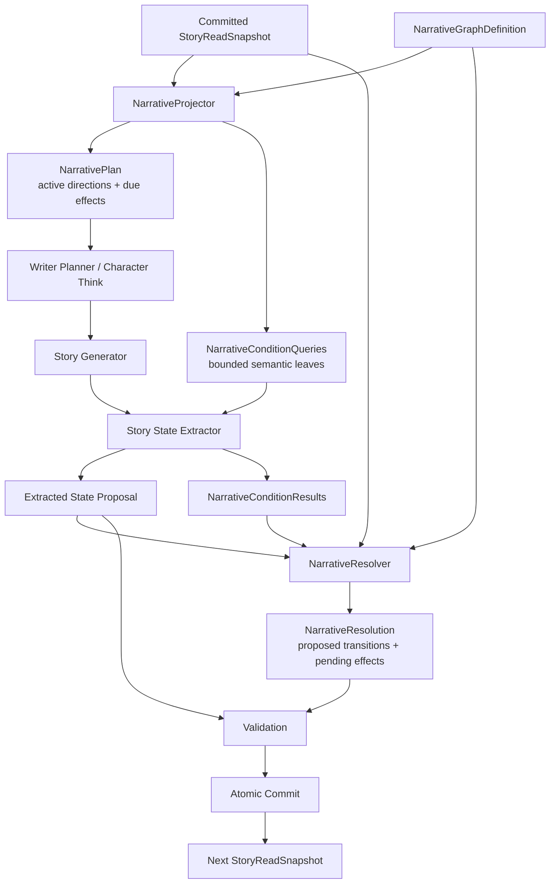

# NarrativePlan 与节点语义触发机制 — Design 2.0

> **Date**: 2026-08-13
> **Author**: GPT-5 Codex
> **Status**: Draft
> **Prior doc**: [NarrativePlan 与可选 Dramatic Focus — Design](2026-08-13-narrative-plan-design-gpt.md)

---

## Context

当前 Narrative Graph 使用类型化条件 AST。`NarrativeDirector::evaluate()` 在 Writer Planner 调用模型前读取 committed `StoryReadSnapshot`，同时计算活动节点、Effect 和 `proposed_transitions`。[`crates/aise/src/planning/writer_planner.rs:68-105`](../../crates/aise/src/planning/writer_planner.rs) [`crates/aise/src/domain/narrative_graph/director.rs:96-169`](../../crates/aise/src/domain/narrative_graph/director.rs)

其中 `EventOccurred` 和 `PlayerActionOccurred` 依赖 Snapshot 中预先存在的 canonical key。[`crates/aise/src/domain/narrative_graph/definition.rs:45-88`](../../crates/aise/src/domain/narrative_graph/definition.rs) [`crates/aise/src/domain/narrative_graph/director.rs:243-305`](../../crates/aise/src/domain/narrative_graph/director.rs) 当前闭环并不成立：验证阶段只会把 Narrative 自己产生的 World Event key 写入 `occurred_event_keys`，没有对应路径可靠地产生 `player_action_event_keys`。[`crates/aise/src/validation/validation_pipeline.rs:204-217`](../../crates/aise/src/validation/validation_pipeline.rs)

更根本的问题是，玩家输入、AI 角色思考和 Story Generator 输出都具有开放语义。即使保留模型生成的 Story Events，它们也只是模型对故事的自由归纳，无法可靠匹配作者在 Narrative Graph 中预定义的 key。依赖字符串或 key 相等会产生漏触发、误触发，并迫使 Story Generator 同时承担正文创作和 Narrative 状态判定两项职责。

AISE 后续计划删除 Story Events。本设计因此不再把 Story Events 作为 Narrative 条件、状态或中间协议的一部分。节点触发改为：模型只判断最终故事是否满足作者声明的语义条件，引擎再根据该判断、结构化状态和 Graph AST 确定性计算节点变换。

本版本继承上一版已经确定的语义：

- `dramatic_focus` 完全可选；未设置时节点仍可参与条件、路由、状态变换和 Effect。
- 玩家行动、语言、想法和关键选择保持自主；Player Input 是尝试，不是保证结果。
- AI 角色的决定来自 Character Think；Character Impulse 只能影响其思考，不能保证行为。
- Director 只通过 `WorldEventIntent` 和 `CharacterImpulse` 影响故事，不直接控制角色。
- `NarrativePlan` 是 Turn-scoped 派生数据，不是持久化权威状态。

现在完成该设计，可以为 Story Generator 与 Story State Extractor 的职责拆分、Story Events 删除以及 Narrative Graph 后续实现提供统一边界。

### Constraints & assumptions

- Story State Extractor 读取当前候选故事文本，并输出该文本建立的结构化状态；生成或修复后的每个新版本都必须重新提取。
- Narrative Graph 仍是有界、类型化的有向无环图，不允许脚本、SQL、正则或任意工具调用条件。
- LLM 只能判断引擎提供的候选语义条件，不能创建条件 key、选择节点状态或直接输出迁移。
- `criterion` 属于 StoryPack 数据，只能出现在 Runtime Context 数据区；其中任何命令式文本都不能覆盖 Story State Extractor 的 CSI/FTI。
- 所有节点迁移、结构化状态变化、Effect 生命周期变化必须通过 Validation，并与 Story 原子提交。
- 持久叙事事实必须进入 typed state 或 Fact；不能依赖已删除的 Story Event 历史。
- 所有候选条件、证据文本、单 Turn 迁移数和 Graph 遍历深度必须有配置上限。

---

## Principles

1. **模型理解语义，引擎执行规则**：LLM 只回答“条件是否被故事满足”，节点状态机始终由确定性代码控制。
2. **以最终故事为事实来源**：触发依据是生成或修复后的候选故事及其最终结构化状态，不是 Player Input、Character Thought 或 Writer Plan 中的意图。
3. **不依赖 Story Events**：Narrative 条件不读取通用事件列表，也不要求生成文本携带 canonical event key。
4. **能确定就不调用模型**：Turn、节点状态、角色状态、关系、控制权和 Fact 等结构化条件由引擎直接判断。
5. **未知不触发**：缺少证据不能等同于条件不成立；语义条件使用三态结果，只有最终表达式为 `Satisfied` 才能触发迁移。
6. **有界且可追溯**：只评估当前 Graph frontier 中的候选语义条件，每个肯定结果保留证据和来源版本。
7. **Effect 恰好一次**：节点迁移在当前 Turn 末结算；由迁移产生的 Effect 进入持久化 pending 状态，在后续成功 Turn 中消费一次。

---

## Options

### Option A: 继续匹配模型生成的 Story Event key

- **Idea**：要求 Story Generator 或状态提取模型生成 Story Events，再用 `event_key` 匹配 Narrative 条件。
- **Pros**：
  - 与当前 `EventOccurred` 数据结构表面兼容。
  - Director 可以继续进行布尔匹配。
- **Cons**：
  - 自由故事语义与作者预定义 key 没有可靠对应关系。
  - Story Generator 必须记住并正确复制与正文创作无关的 Graph key。
  - Story Events 即将删除，会形成新的临时依赖。
- **Risk**：静默漏触发最难诊断；允许模糊匹配又会引入不可控误触发。

### Option B: 增加独立 Narrative Condition Evaluator 模型调用

- **Idea**：Story Generator 之后单独调用一个模型，只负责判断 Narrative 语义条件。
- **Pros**：
  - Prompt 职责集中，便于独立选择模型、重试和评测。
  - Narrative 输出契约与其他状态提取完全隔离。
- **Cons**：
  - 与 Story State Extractor 重复阅读和理解同一段故事。
  - 增加每 Turn 延迟、成本和 LLM 并发压力。
  - 两次语义理解可能对相同故事事实给出不一致判断。
- **Risk**：为尚未证明存在的质量问题提前增加永久调用成本。

### Option C: 嵌入 Story State Extractor，迁移由引擎结算

- **Idea**：Story State Extractor 在提取角色、场景、知识和感知状态时，同时返回候选 Narrative 语义条件的判断；`NarrativeResolver` 再确定性求值 AST 并产生迁移。
- **Pros**：
  - 一次模型调用完成对同一故事文本的统一理解。
  - 不增加默认 Turn 的 LLM 调用次数。
  - 模型输出仍是受限事实判断，不获得 Graph 状态机控制权。
  - 逻辑输出契约可独立测试，未来仍能拆成专用调用。
- **Cons**：
  - Story State Extractor 的输入输出契约更大。
  - 必须限制候选条件数量，避免把整个 Graph 放入 Prompt。
  - 状态提取和条件判断需要分别评测，防止一项质量掩盖另一项。
- **Risk**：条件描述过多或含糊时，会降低提取稳定性。

### Choice

**Adopt option C.**

**Rationale**：Story State Extractor 已经负责解释最终故事建立了哪些状态，Narrative 语义条件属于同一种“从故事到结构化事实”的工作。将其作为 Extractor 内部独立契约，可以避免重复调用，同时保留将来拆分为专用 Evaluator 的架构边界。Story Events key 匹配和模型直接输出节点迁移均不保留。

---

## Design

### 1. Target structure



该结构把当前 `NarrativeDirector::evaluate()` 的两项职责拆开：

- `NarrativeProjector` 在 Story 生成前投影当前活动节点、可选方向、待消费 Effect 和候选语义条件。
- `NarrativeResolver` 在 Story State Extractor 之后，根据候选最终状态和语义判断结算节点。

### 2. Core types & responsibilities

| Type / Module | Responsibility | Out of scope |
|---|---|---|
| `NarrativeNodeDefinition` | 定义节点生命周期条件、Effect 和可选 `dramatic_focus` | 不规定玩家或 AI 角色必须执行的行为和结果 |
| `NarrativeCondition` | 组合确定性条件与受限语义条件 | 不执行副作用，不直接调用 LLM |
| `SemanticNarrativeCondition` | 用稳定 `condition_key` 和作者提供的 `criterion` 描述需要故事理解的事实 | 不是 Story Event，不表示节点状态或迁移目标 |
| `NarrativeProjector` | 从 committed state 产生当前 `NarrativePlan`、到期 Effect 和有界条件查询集 | 不判断本 Turn 尚未生成的故事结果，不产生 post-story 迁移 |
| `NarrativePlan` | 为当前 Turn 提供 `active_nodes`、`active_directions`、`world_event_intents`、`character_impulses` 和 Effect disposition | 不保存 `proposed_transitions`，不直接持久化 |
| `NarrativeConditionQuery` | 向 Story State Extractor 提供一个允许判断的 `condition_key` 与 `criterion` | 不暴露满足条件将激活、完成还是跳过哪个节点 |
| `StoryStateExtractor` | 从候选故事输出最终结构化状态和 `NarrativeConditionResult` | 不选择节点，不执行 Graph AST，不提交状态 |
| `NarrativeConditionResult` | 返回候选条件的三态判断及证据，并绑定当前 Story Proposal 版本 | 不创建新 key，不跨 Turn 充当通用事件日志 |
| `NarrativeResolver` | 用 candidate final state、三态语义结果和 Graph AST 确定性计算合法迁移 | 不调用 LLM，不修改 Story，不直接提交 |
| `NarrativeResolution` | 保存待验证的节点迁移和由迁移产生的 pending Effect | 不作为下一段故事的写作目标 |
| `NarrativeRuntimeState` | 持久化节点状态、Graph revision、激活信息和未消费 Effect | 不持久化 `active_directions` 或通用 Story Events |

### 3. Narrative condition model

#### 3.1 Deterministic conditions

以下条件直接对 candidate final state 求值，不发送给模型：

- `StoryStarted`
- `NodeState`
- `FactStateEquals`
- `CharacterStateEquals`
- `RelationshipReaches`
- `TurnReaches`
- `RoleControllerIs`
- `All`、`Any`、`Not` 的组合逻辑

这里的 candidate final state 是 committed Snapshot 加上本次 Story State Extractor 提出的、已通过结构校验的最终值。这样角色状态、关系或 Fact 在当前故事中发生变化时，可以在同一 Turn 结算 Narrative，而不必等待下一 Turn。

#### 3.2 Semantic conditions

`EventOccurred` 和 `PlayerActionOccurred` 不进入目标模型。两者统一由受限的语义条件表达，例如：

```json
{
  "type": "semantic",
  "condition_key": "condition.traveler_identified_visitor",
  "criterion": "最终故事已经明确建立：旅人通过可观察证据确认了门外来者的身份。"
}
```

`condition_key` 只用于稳定关联 Definition、Query 和 Result；它不是 Story Event key。`criterion` 描述可由故事证据判断的事实，不得写成对 Writer、玩家或角色的命令。

语义条件适合表达：

- 玩家输入的尝试是否在最终故事中真正实现。
- AI 角色通过 Character Think 形成的决定是否最终表现为行动或对白。
- 某项揭示、拒绝、和解、冲突结果或其他难以预先结构化的叙事事实是否成立。

需要跨 Turn 长期读取的结果，应由 Story State Extractor 写入 typed state 或 Fact，再由确定性条件判断。语义结果本身不承担通用历史事件存储职责。

#### 3.3 Three-state result

每个候选语义条件返回：

| Status | Meaning | Resolver semantics |
|---|---|---|
| `Satisfied` | 最终故事中有充分证据支持条件 | `True` |
| `Unsatisfied` | 最终故事明确没有达成该条件，或明确建立了相反结果 | `False` |
| `Unknown` | 信息不足、表达含糊或无法可靠判断 | `Unknown` |

三态组合规则如下：

- `Not(Unknown)` 仍为 `Unknown`。
- `All` 只有全部为 `True` 才是 `True`；任何一项为 `False` 则为 `False`，其余为 `Unknown`。
- `Any` 只要一项为 `True` 即为 `True`；全部为 `False` 才是 `False`，其余为 `Unknown`。
- 激活、完成、跳过和边条件只有最终结果为 `True` 才能触发。

`Satisfied` 必须带有当前故事中的有界证据；`Unsatisfied` 和 `Unknown` 可以提供简短原因。对于互斥分支，作者应优先声明两个正向语义条件，例如“明确接受”和“明确拒绝”，而不是依赖 `Not(接受)` 把沉默解释成拒绝。

### 4. Bounded condition queries

Story State Extractor 不接收完整 Narrative Graph。`NarrativeProjector` 只选择当前 frontier 中可能影响本 Turn 结算的语义叶子：

- Active 节点的 `complete_when` 和 `skip_when`。
- Active 节点出边的 `when`。
- 本 Turn 可能到达的直接后继节点的 `activate_when`。
- StoryInstance 初始化时 entry nodes 所需的条件。

查询集按 `condition_key` 去重并保持稳定顺序。模型只看到 `condition_key`、`criterion` 和判断所需的数据，不看到该结果对应的节点、迁移方向或 Effect，从而减少“为了推进剧情而判定满足”的偏差。

候选数、单条 criterion 长度、总字节数和单 Turn 最大迁移数都由 typed config 限制。超过上限必须产生可诊断错误，不能静默截断，也不能退化为扫描并发送整个 Graph。

### 5. Key flows

#### 5.1 StoryInstance bootstrap

StoryInstance 创建时先对 entry nodes 执行一次无 LLM 的确定性 bootstrap。满足 `StoryStarted` 或初始 typed state 条件的 entry node 直接进入初始 Active 状态，并将 `on_activate` Effect 记为 first Turn pending。需要语义判断的条件不能在 bootstrap 中被假定满足；此类 entry node 会保持 Inactive，直到后续故事和 Story State Extractor 提供证据。StoryPack 作者通常应让首个 entry node 使用确定性启动条件，确保第一 Turn 可以获得 `dramatic_focus` 和 Effect。

#### 5.2 Turn 前投影

1. `NarrativeProjector` 读取 committed `NarrativeRuntimeState` 和 Graph Definition。
2. 它将当前已 Active 节点投影为 `active_nodes`；仅为设置了 `dramatic_focus` 的节点生成 `active_directions`。
3. 它读取上次已提交迁移产生但尚未消费的 Effect，生成本 Turn 的 `WorldEventIntent` 或目标角色对应的 `CharacterImpulse`。
4. 它构造本 Turn 有界的 `NarrativeConditionQueries`。
5. `NarrativePlan` 交给 Writer Planner、Character Think 和 Story Generator；Condition Queries 只交给 Story State Extractor。

没有 `dramatic_focus` 的节点仍会进入条件查询和生命周期结算，只是不产生 Writer-side direction。

#### 5.3 Story 生成与语义提取

1. Writer Planner 根据当前局势生成即时 `story_goal`，但不能保证 Narrative 条件一定满足。
2. Character Think 可以接受、拒绝、延迟或重新解释 Character Impulse。
3. Story Generator 根据 Player Input、Writer Plan、Character Thoughts 和 Runtime Context 生成一个候选故事片段。
4. Story State Extractor 读取该候选故事，输出角色、关系、场景、知识、感知等最终结构化状态。
5. 同一次调用中，Extractor 对允许的 `NarrativeConditionQueries` 返回三态判断；Player Input 只用于理解玩家尝试，实际是否成立仍以候选故事为准。

例如玩家输入“我告诉他真相”，但故事写成角色在开口前被打断，则“玩家已经揭示真相”不能返回 `Satisfied`。

#### 5.4 节点结算与原子提交

1. Validation 先校验 Extractor 输出的 schema、稳定 ID、数量限制和 Story Proposal 版本。
2. `NarrativeResolver` 使用 validated candidate final state 计算所有确定性叶子，并读取允许的语义结果。
3. Resolver 按 Graph AST、节点当前状态和 graph revision 产生 `Inactive -> Active`、`Active -> Completed` 或 `Active -> Skipped` 候选迁移；`complete_when` 与 `skip_when` 同时满足时维持现有“完成优先”语义。
4. Resolver 在配置上限内处理后继节点，单个节点在一个 Turn 中最多发生一次生命周期迁移。
5. Validation 检查迁移合法性、来源 revision、Graph 上限和 Effect 定义，并将相应 `on_activate`、`on_complete` Effect 写入 pending 状态。
6. Story、提取状态、Narrative 迁移、新 pending Effect 和本 Turn 已消费 Effect 的确认一起原子提交。

节点在当前故事结束后被激活，因此其 `dramatic_focus` 和 `on_activate` Effect 从下一 Turn 开始可见；节点完成后产生的 `on_complete` Effect 同样在下一 Turn 执行。这避免把故事已经生成后才得知的 Effect 追溯性地塞回当前片段。

#### 5.5 Repair 与重试

1. Story Repairer 只要改变候选故事文本，既有状态提取、Condition Results 和 Narrative Resolution 全部失效。
2. Story State Extractor 必须针对新候选版本重新运行，Resolver 重新结算。
3. Condition Results 必须绑定 Story Proposal 版本或内容摘要；版本不一致时 Validation 拒绝。
4. pending Effect 只有在对应 Turn 成功原子提交后才标记为已消费；失败和重试不会丢失或重复提交 Effect。

### 6. NarrativePlan and NarrativeResolution

目标 `NarrativePlan` 只描述当前 Turn 已经可以使用的叙事投影：

| Field | Semantics |
|---|---|
| `active_nodes` | Turn 开始时权威状态为 Active 的节点 |
| `active_directions` | Active 节点中明确设置了 `dramatic_focus` 的软方向；允许为空 |
| `world_event_intents` | 由先前已提交迁移产生、当前待执行的世界干预 |
| `character_impulses` | 由先前已提交迁移产生、当前可发送给 AI 角色的内在推动 |
| `effect_dispositions` | Effect 在当前 Turn 的待处理、不适用或已消费状态 |

`proposed_transitions` 从 `NarrativePlan` 移除。它属于 Story 生成后的 `NarrativeResolution`：

| Field | Semantics |
|---|---|
| `condition_results` | 本次候选故事的受限语义判断 |
| `proposed_transitions` | Resolver 根据完整 AST 推导的候选节点迁移 |
| `pending_effects` | 迁移成功提交后、供后续 Turn 消费的一次性 Effect |
| `expected_graph_revision` | 用于检测并发或陈旧 Resolution |

两者都属于单 Turn 运行数据，不直接作为数据库实体持久化；只有经过验证的节点状态、revision 和 pending Effect lifecycle 进入 `NarrativeRuntimeState`。

### 7. Key decisions

- **节点条件是否继续读取 Story Events？** → 否 → Story Events 将被删除，且自由生成事件无法与作者 key 稳定匹配。
- **是否需要 LLM 参与节点触发？** → 只参与语义叶子判断 → 结构化条件和最终迁移仍由确定性引擎处理。
- **模型调用放在哪里？** → 嵌入 Story State Extractor → 它已经读取最终故事，不重复增加一次默认调用。
- **模型是否知道满足条件会导致什么迁移？** → 不知道 → Query 不携带 node、transition 或 Effect 信息，减少目标导向误判。
- **`proposed_transitions` 是否仍属于 `NarrativePlan`？** → 否 → Plan 在生成前产生，无法知道当前故事真正建立的结果。
- **新激活节点何时影响故事？** → 下一 Turn → 当前 Turn 的故事已生成，不能追溯性应用方向和 Effect。
- **首个 entry node 如何在第一 Turn 生效？** → StoryInstance 创建时确定性 bootstrap → 不为启动流程增加 LLM 调用，也不等待第一段玩家续写后才获得方向。
- **长期条件如何保存？** → typed state 或 Fact → 不使用通用事件日志充当隐式状态存储。
- **`dramatic_focus` 是否仍可省略？** → 是 → 缺失只表示没有 Writer-side 方向，不影响节点条件和状态机。
- **何时拆出专用 Evaluator？** → 只有独立评测证明嵌入式输出存在稳定质量冲突时 → 保留逻辑契约，但不预付额外调用成本。

---

## Impact

- **Code**:
  - `crates/aise/src/domain/narrative_graph/definition.rs`: 保留类型化 AST；删除 `EventOccurred / PlayerActionOccurred` 目标语义，增加稳定、受限的 semantic condition；将 `objective` 改为可选 `dramatic_focus`。
  - `crates/aise/src/domain/narrative_graph/director.rs`: 将当前混合职责拆为 pre-story `NarrativeProjector` 与 post-extraction `NarrativeResolver`；从 `NarrativePlan` 移除 `proposed_transitions`。
  - `crates/aise/src/domain/narrative_graph/state.rs`: 扩展一次性 Effect 的 pending/consumed 生命周期，保证 retry-safe exactly-once 语义。
  - `crates/aise/src/story/instance_factory.rs`: 在实例化时执行 entry-node deterministic bootstrap，并创建 first-Turn pending Effect。
  - `crates/aise/src/domain/story_instance/snapshot.rs`: Narrative 条件不再依赖 `occurred_event_keys / player_action_event_keys`；保留或统一可被确定性条件读取的结构化 Fact view。
  - Story State Extractor 的 domain contract、Prompt projector 和 output validator：加入有界 `NarrativeConditionQueries / Results`。
  - `crates/aise/src/validation/validation_pipeline.rs`: 从 `NarrativeResolution` 接收迁移；删除 World Event key 写入 Narrative condition state 的路径。
  - Turn Runtime：在 Story Generator 之后执行 Story State Extractor 和 Narrative Resolver；Repair 改变文本后重新执行两者。
- **Config**:
  - 增加 semantic condition 数量、criterion 字节、evidence 字节、AST 深度、Graph frontier 和单 Turn 迁移数上限。
  - Story State Extractor CSI/FTI 明确：只判断提供的条件、不得创建 key、不得输出节点状态或迁移。
- **Data**:
  - StoryPack Narrative schema 发生破坏性变化：`objective` 改为可选 `dramatic_focus`，event-based conditions 改为 semantic 或 typed-state conditions。
  - StoryInstance Narrative runtime 需要保存 pending Effect lifecycle。
  - Narrative 不再需要 Story Event key 集。Story Events 整体删除由对应设计或执行变更处理，本设计不为其保留兼容路径。
- **External interface**:
  - StoryPack 作者接口需要一次性迁移；不保留旧条件与新条件双路径。
  - Turn HTTP/WebSocket 对外协议不需要暴露 Condition Results 或 Narrative Resolution，除非后续增加调试接口。

---

## Risks & mitigations

| Risk | Likelihood | Impact | Mitigation |
|---|---|---|---|
| LLM 将含糊故事误判为条件满足 | medium | high | 三态结果；`Satisfied` 强制证据；模型不见迁移目标；Validator 拒绝未知 key 和无证据肯定结果 |
| Story State Extractor contract 过大影响状态提取质量 | medium | medium | 只发送有界 frontier 条件；分开评测两个输出区；达到明确质量阈值后才拆专用 Evaluator |
| 整个 Graph 被放入 Prompt 导致成本随故事规模增长 | medium | high | Query Builder 只选择当前 frontier；typed config 限制数量与总字节；超限显式失败 |
| Repair 后沿用旧 Condition Results | medium | high | 结果绑定 Story Proposal 版本或摘要；任何文本变化都使提取和 Resolution 失效并重跑 |
| 迁移改到 Turn 末后，`on_activate / on_complete` Effect 丢失或重复 | medium | high | 在 atomic commit 中创建 persistent pending Effect；成功消费时与 Turn 一起确认；失败保持 pending |
| 语义条件被用作长期历史数据库 | medium | medium | 明确其 Turn-scoped 语义；需要长期读取的事实写入 typed state 或 Fact |
| 作者把 criterion 写成推动剧情的命令 | medium | high | Schema 文档要求 criterion 描述可验证事实；作者工具 lint；Extractor 不接收节点迁移目的 |
| 旧 event-based 与新 semantic 条件并存造成语义分叉 | low | high | 采用一次性硬迁移，删除旧 schema、代码、fixtures、Prompt 和文档路径 |

---

## Roadmap

- **Phase 0 — Contract design**：定稿 Story State Extractor、semantic condition、三态结果和 pending Effect lifecycle 的执行 Spec。
- **Phase 1 — Runtime split**：实现 `NarrativeProjector / NarrativeResolver`，调整 Turn 顺序、Validation 和原子提交。
- **Phase 2 — Hard migration**：迁移 StoryPack、Prompt、fixtures 和测试，删除 event-based Narrative condition 旧路径。
- **Phase 3 — Evaluation**：建立语义触发准确率、Unknown 比例、误触发率、Prompt 规模和 Turn 延迟基线；只有评测证明必要时才拆出独立 Evaluator 调用。

---

## Appendix

### Example: player attempt and actual outcome

Narrative condition：

```json
{
  "type": "semantic",
  "condition_key": "condition.player_revealed_key_origin",
  "criterion": "最终故事明确建立：玩家角色已经向守林人说出了黄铜钥匙的来源。"
}
```

Player Input：

```text
我准备告诉他钥匙是从壁炉下面找到的。
```

如果最终故事写成玩家刚开口就被屋外巨响打断，Result 应为 `Unsatisfied` 或 `Unknown`，节点不变换；如果最终故事明确写出这句话并让守林人听见，Result 才能为 `Satisfied`，并附上对应故事证据。这个机制只观察玩家尝试的实际结果，不替玩家添加新决定，也不要求故事为了满足 Graph 而让尝试成功。

### Glossary

| Term | Definition |
|---|---|
| Dramatic Focus | 作者可选声明的矛盾、悬念、主题或局面焦点 |
| Narrative Plan | Story 生成前、供当前 Turn 使用的 Narrative 投影 |
| Semantic Narrative Condition | 需要模型根据故事语义判断的、具有稳定 key 的受限事实条件 |
| Narrative Condition Result | Story State Extractor 对候选语义条件给出的三态判断和证据 |
| Narrative Resolution | Story 生成和状态提取后，由确定性 Resolver 产生的节点迁移结果 |
| Pending Narrative Effect | 由已提交迁移产生、等待后续成功 Turn 消费一次的 Effect |
| Story State Extractor | 从候选故事中提取最终结构化状态，并判断受限 Narrative 语义条件的模型阶段 |
