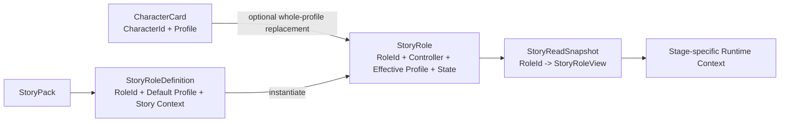

# Character Card 与 Story Role Profile — Design

> **Date**: 2026-08-14
> **Author**: GPT-5
> **Status**: Draft
> **Prior doc**: [AISE Story Pack Design v3.0](./2026-08-06-StoryPackDesign-gpt.md)

---

## Context

Story Pack v3.0 将 `CharacterCard`、`StoryRole` 和 `RoleBinding` 设计为三个正交对象：人物卡负责姓名与人格等基础身份，故事角色负责目标、关系、记忆和初始状态，绑定对象负责本次游玩中的选角与控制权。[`2026-08-06-StoryPackDesign-gpt.md`](./2026-08-06-StoryPackDesign-gpt.md):48-60

当前实现忠实落地了这套模型，但也暴露出不必要的复杂度：

- `CharacterCard` 使用 `CharacterAssetKey`，并把人物画像拆成 `description`、`personality`、`values`、`fears` 以及包含 `register`、`verbosity`、`traits` 的 `SpeakingStyle`。[`character_card.rs`](../../crates/aise/src/domain/asset/character_card.rs):7-57
- `StoryPack` 分别保存 `character_assets`、`roles` 和 `default_cast`；`StoryRole` 自身没有默认人物画像，必须依赖一张人物卡才能实例化。[`story_pack.rs`](../../crates/aise/src/domain/asset/story_pack.rs):15-23 [`story_pack.rs`](../../crates/aise/src/domain/asset/story_pack.rs):70-89
- `RoleBinding` 再次保存 `StoryRoleKey`、实例级 `CharacterId`、人物卡引用和 Controller。[`binding.rs`](../../crates/aise/src/domain/story_instance/binding.rs):13-21
- 实例工厂为每个 Role 生成形如 `story-...:character:protagonist` 的 `CharacterId`，再同时构造 Binding 和 Character State。[`instance_factory.rs`](../../crates/aise/src/story/instance_factory.rs):124-177
- `StoryReadSnapshot` 需要维护并交叉校验 Role Definition、Role Binding、Character Card、Character State 四张平行 Map。[`snapshot.rs`](../../crates/aise/src/domain/story_instance/snapshot.rs):39-49 [`snapshot.rs`](../../crates/aise/src/domain/story_instance/snapshot.rs):126-155
- Prompt 将这些内部拆分直接暴露为 `character_id`、`story_role`、`control`、`values`、`fears` 和三项 Speaking Style，导致 Runtime Context 看起来像存储结构的转录，而不是面向模型的语义视图。[`writer_planner_prompt.rs`](../../crates/aise/src/planning/writer_planner_prompt.rs):278-293 [`story_generator_prompt.rs`](../../crates/aise/src/story/story_generator_prompt.rs):101-109 [`story_generator_prompt.rs`](../../crates/aise/src/story/story_generator_prompt.rs):643-663

问题不在于结构化数据本身。稳定字段名通常比把所有内容改写成“玩家角色名字叫……”更容易约束、裁剪和测试。真正的问题是同一概念拥有多个身份、同一角色被拆成多个必须 Join 的对象，以及只供 Prompt 使用的自然语言被过度分类。

本设计收敛角色领域模型：在故事中，运行时 Character 始终是 `StoryRole`；`CharacterCard` 只是可选的跨故事人物画像来源。Story Role 自带完整默认画像，玩家选择人物卡时只替换画像，不替换任何故事经历或状态。

这项调整应在继续扩展 Runtime Context、角色记忆和动态角色生成之前完成。否则当前 `CharacterId -> RoleBinding -> StoryRole` 的间接关系会继续扩散到 Prompt、Knowledge、Narrative Graph、API 和持久化层。

### Constraints & assumptions

- Story Pack、Character Card、存档和玩家输入仍是不可信数据，不能提供或修改 System Prompt。
- Story Pack 是不可变模板；Story Instance 保存一次游玩的冻结画像与可变状态。
- 角色背景、世界事实与角色认知继续分离；“写在角色背景中”不等于“角色知道”。
- 可替换人物卡的 Story Role 应避免把默认姓名或默认外貌硬编码进不可替换的故事正文。
- 名字用于展示和叙事，不承担唯一标识职责，也不假设故事中永远不会重名。
- 本次采用硬重构：不保留 `CharacterAssetKey`、`StoryRoleKey`、`RoleBinding` 与新模型并行运行的兼容路径。

---

## Principles

1. **Story Role 是故事内唯一角色主体**：控制权、故事身份、当前状态、关系、记忆和 Prompt 引用都以 Role 为中心。
2. **按生命周期划分数据**：跨故事稳定的人物呈现属于 Character Profile；只在当前故事成立的经历与状态属于 Story Role。
3. **整份画像择一，不做字段级拼接**：使用人物卡时采用完整 Card Profile；不使用时采用完整 Default Profile，避免产生来源不明的混合人物。
4. **只有两个角色 ID 域**：`CharacterId` 标识跨故事人物卡，`RoleId` 标识一个故事中的角色；名字不作 ID。
5. **Prompt 面向语义而非存储结构**：保留有助于模型引用的 `role_id`，删除可由章节和上下文推断的字段及无意义的内部 GUID。
6. **实例必须可重放**：Story Instance 创建时冻结最终画像；人物卡之后被编辑不会改变已有故事。

---

## Options

### Option A: 保留 CharacterCard、StoryRole 与 RoleBinding 三分模型

- **Idea**：继续让 Character Card 独占人物画像、Story Role 独占故事数据，并通过独立 Role Binding 连接二者。
- **Pros**:
  - 两类静态资产的字段完全不重叠。
  - 当前实现、存储和已有文档已经采用该模型。
- **Cons**:
  - Story Role 无法独立提供默认人物，连模型生成的临时角色也必须先制造一张人物卡。
  - 同一个故事角色同时拥有 Role Key、实例 Character ID 和 Character Asset Key。
  - Snapshot、Knowledge、Graph 和 Prompt 都必须反复解析 Binding。
- **Risk**：每增加一个角色相关能力，都要同步修改多份平行数据和引用路径。

### Option B: Story Role 与 Character Card 按字段合并

- **Idea**：两边都允许声明姓名、外貌、性格和说话方式；实例化时由 Character Card 的非空字段逐项覆盖 Story Role。
- **Pros**:
  - 人物卡可以只覆盖少量字段。
  - 故事作者可以精细控制每个默认值。
- **Cons**:
  - `null`、空字符串、空列表和“继承默认值”需要额外语义。
  - 最终人物可能由两份不协调的画像拼接而成，例如卡片姓名配上默认角色的外貌和语气。
  - 每个 Prompt 字段都需要追踪来源，验证和调试成本高。
- **Risk**：看似灵活，实际把冲突处理推迟到运行时并使结果难以解释。

### Option C: Story Role 默认画像 + Character Card 整体替换

- **Idea**：`StoryRoleDefinition` 必须提供 `default_profile`；Character Card 可选。选卡时整份 Card Profile 替换 Default Profile，故事背景与状态始终来自 Story Role。实例内不再建立独立 Role Binding。
- **Pros**:
  - 没有人物卡时 Story Role 仍是完整、可运行的角色。
  - Profile 只有一个共享结构和一个最终来源，没有字段级合并规则。
  - 运行时可以直接按 RoleId 读取角色，不再维护 Binding Join。
  - 玩家自带人物卡与模型生成默认人物使用同一条实例化路径。
- **Cons**:
  - Story Role 与 Character Card 都会持有一个 `CharacterProfile` 值。
  - 自定义人物卡必须作为一份完整画像接受，不能隐式继承默认人物的个别字段。
  - 现有 ID、存储和 Prompt 契约需要一次破坏性迁移。
- **Risk**：若故事作者把默认人物姓名或固定外貌写死在背景正文中，换卡后仍可能出现语义冲突。

### Choice

**Adopt option C.**

**Rationale**：该方案把运行时真正使用的对象与领域概念对齐：故事里只有 Story Role，Character Card 只是可选画像。它牺牲字段级定制的灵活度，换取单一最终来源、稳定身份和更小的 Prompt。共享 `CharacterProfile` 值对象可以避免 Schema 代码重复；Story Instance 冻结最终画像可以避免跨版本漂移。

---

## Design

### 1. Target structure



最终关系不是“演员通过 Binding 扮演角色”，而是“Story Role 可采用一张 Character Card 的画像”。Character Card 不成为故事状态的所有者，也不参与 Role、Memory、Relationship 或 Narrative Graph 的运行时寻址。

### 2. Core types & responsibilities

| Type / Module | Responsibility | Out of scope |
|---|---|---|
| `CharacterProfile` | 表示可跨故事复用的人物呈现：姓名、基础外貌、人格、说话方式和可选对话示例 | 出身、人物志、当前目标、关系、记忆、位置、伤势和剧情秘密 |
| `CharacterCard` | 以全局 `CharacterId` 保存一份可复用 Profile，以及作者、版本、标签等目录元数据 | Story Role 身份、Controller、Story State、Prompt 指令 |
| `StoryRoleDefinition` | 以故事内 `RoleId` 定义角色位置、默认 Profile、故事背景、叙事职责和初始状态 | 跨故事人物身份、运行中可变状态 |
| `StoryRole` | Story Instance 中的角色聚合：Controller、冻结后的 Effective Profile、可选来源 CharacterId、故事背景与当前状态 | 独立 Role Binding、运行时 Character Asset Join |
| `StoryRoleView` | Snapshot 提供给 Turn Runtime 的一致性只读角色视图 | 持久化所有权、跨 Turn 缓存、Prompt 字符串 |
| Stage-specific Prompt View | 按 Pipeline 选择 Role 的必要语义并编码为有界 Runtime Context | 暴露 Card 版本、Digest、内部存储键或冗余 Controller |

`CharacterProfile` 是共享值对象，不是第三种身份。目标字段如下：

| Field | Shape | Semantics |
|---|---|---|
| `name` | 单个有界文本 | 人物显示名；可重名，不作引用键 |
| `appearance` | 单个有界自然语言文本 | 跨故事稳定的基础外貌；替代含义模糊的 `description` |
| `personality` | 单个有界自然语言文本 | 性格、长期倾向、价值取向、稳定恐惧与行为边界的综合描述 |
| `speaking_style` | 单个有界自然语言文本 | 语域、详略、措辞、节奏和口头习惯的综合描述 |
| `dialogue_examples` | 有界列表，可选 | 只用于展示稳定声音的情境与回应示例 |

因此：

- 删除独立 `values` 和 `fears`。它们当前没有确定性业务语义，只是 Prompt 描述，应写进 `personality`。
- 删除 `SpeakingStyle.register`、`verbosity` 和 `traits` 分类，合并为一个 `speaking_style` 文本。
- 将 `description` 收窄并改名为 `appearance`，防止把故事背景、当前场景和人物行为重复塞入同一字段。
- 当前服装、伤势、伪装、年龄变化等故事内呈现属于 Story Role State 或 Scene，不回写 Card 的基础外貌。

### 3. Data ownership

| Information | Character Card | Story Role Definition / Instance | Resolution |
|---|---|---|---|
| 姓名、基础外貌、人格、说话方式、对话示例 | 可提供 | 必须提供 Default Profile | Card 存在时整份 Profile 替换；否则使用 Default Profile |
| 出身、人物志、在本故事中的身份与经历 | 不允许 | 唯一所有者 | 永远来自 Story Role，不被 Card 覆盖 |
| `role_label`、`narrative_function` | 不允许 | 唯一所有者 | 永远来自 Story Role |
| 初始位置、目标、Attributes | 不允许 | 唯一所有者 | 实例化后成为可变 Role State |
| 当前服装、伤势、伪装、情绪等 | 不允许作为跨故事事实 | Story Instance / Scene | 随已验证剧情更新 |
| Relationship、Memory、Knowledge scope | 不允许 | Story Instance，以 RoleId 关联 | 不通过 CharacterId 关联 |
| Player / AI Controller | 不允许 | Story Instance Role | 创建实例时确定 |
| 作者、版本、标签、内容摘要 | Card 目录元数据 | Pack / Instance 冻结元数据 | 不进入模型人物描述 |

“Card 覆盖 Role”只表示替换 `default_profile`，不表示覆盖整个 Story Role。背景、目标、关系、记忆、属性和控制权都不参与覆盖。

### 4. Identity model

| ID | Scope | Identifies | Used by |
|---|---|---|---|
| `CharacterId` | 全局 | 一张可跨故事复用的人物卡所代表的同一人物 | Character Library、Card 更新与来源追踪 |
| `RoleId` | Story 内唯一 | 本故事中的一个角色主体 | Scene、State、Relationship、Memory、Graph、Proposal、Prompt 输出引用 |

规则如下：

1. `CharacterId` 使用全局唯一 GUID/UUID，并在同一人物卡的生命周期内保持不变。Card 的版本或内容摘要是修订元数据，不是新的 ID 类型。
2. `RoleId` 替代 `StoryRoleKey`，并替代当前用 `story-...:character:...` 表示的实例级 `CharacterId`。
3. 需要跨 Story Instance 寻址 Role 时使用 `(StoryId, RoleId)`，不再制造第三种 Character Instance ID。
4. `name` 只用于展示和叙事。即使当前内容没有重名，也不得把它升级为持久化、Graph 或 LLM 输出协议中的主键。
5. 删除 `CharacterAssetKey`、`RoleKey` 和 Card ID 等同义身份；不再存在独立 `RoleBinding` 领域对象。
6. Story Role 可以没有 `CharacterId`。只有采用可复用 Character Card 时，实例 Role 才记录可选的来源 `CharacterId`。

### 5. Profile resolution flow

创建 Story Instance 时一次性解析人物画像：

1. 从 `StoryRoleDefinition` 读取完整、有效的 `default_profile` 与全部故事数据。
2. 若玩家或 Story Pack 没有选择 Character Card，复制并冻结 Default Profile 作为 Effective Profile。
3. 若选择 Character Card，验证 Card Profile 后，整份复制并冻结为 Effective Profile；不从 Default Profile 补齐任一字段。
4. 把 Controller 和可选来源 `CharacterId` 直接记录在实例 Story Role 中。
5. 以 `RoleId` 物化位置、目标、Attributes、Relationship 和 Seed Memory。
6. 后续 Turn 只读取冻结 Effective Profile 与当前 Role State，不再访问可变 Character Library。

| Case | Effective Profile | Source CharacterId | Story background/state |
|---|---|---|---|
| 使用 Role 默认人物 | `default_profile` 的冻结副本 | 无 | 保留 |
| 使用玩家人物卡 | Card Profile 的冻结副本 | 有 | 保留 |
| AI 生成临时角色 | 创建 Role 时生成并冻结的 Default Profile | 无 | 由已验证 Proposal 创建 |

`dialogue_examples` 可以为空，`appearance` 等允许 Schema 明确规定为可选的字段也可以缺失；“整份替换”指最终 Profile 的所有字段都来自同一份合法 Profile，而不是要求每个可选字段必须非空。

Story Pack 生成器可以替作者补全 Default Profile，但必须发生在 Pack 创作或导入阶段。Turn Runtime 不得因为字段缺失而临时调用模型生成 Profile，否则同一 Story Instance 将无法确定性重放。

### 6. Story background and character knowledge

Story Role 使用一个有界自然语言 `background` 表达只在本故事成立的出身、人物志和既往经历。它不拆成 Character Card Background 与 Role Background，也没有覆盖策略。

`background` 的存在不改变真相与认知边界：

| Content | Authority | Character Think visibility |
|---|---|---|
| Role Background | 故事作者提供的角色叙事背景 | 不自动可见；按 Pipeline 需要投影 |
| World Fact | 可用于确定性判断的世界事实 | 只有角色获得授权认知时可见 |
| Seed Memory | 角色主观记忆，可能残缺或错误 | 只对对应 RoleId 可见 |
| Current State | 已提交的角色当前位置、目标和属性 | 对对应阶段按权限可见 |

例如角色背景可以写明旅人昨夜参与过仪式，但如果当前设定是失忆，Character Think 只能收到相应的残缺 Memory，不能因为 `background` 存在就知道完整真相。需要被 Narrative Graph 确定性判断的内容仍应建模为 Fact 或结构化状态，而不是从 Background 文本解析。

### 7. Runtime aggregate and references

目标 Snapshot 的角色主视图收敛为：

```text
StoryReadSnapshot
└── roles: RoleId -> StoryRoleView
    ├── role definition fields
    ├── controller
    ├── effective profile
    ├── optional source CharacterId
    └── current state
```

所有故事内引用统一改为 RoleId：

- `CurrentScene.present_role_ids`
- Relationship 的 `source_role_id` / `target_role_id`
- Memory owner
- Current Perception owner
- Narrative Graph target
- Character Impulse、Character Thought 与 Character State Change target
- Retrieval audience 与 Runtime Context index

持久化层可以为了查询效率拆表，但 Domain 和 `StoryReadSnapshot` 不再暴露独立 Role Binding，也不要求调用方在四张 Map 之间 Join 才能得到一个角色。一个实例 Story Role 只有一个明确所有者和一个实例生命周期。

### 8. Runtime Context and Prompt representation

Runtime Context 继续使用稳定、紧凑的结构化字段；复杂含义放进自然语言值，不改写成重复的完整句子。对于 Writer Planner，玩家角色可以呈现为：

```text
## Player Character

role_id: "protagonist"
name: "旅人"
role: "在林中木屋醒来的失忆旅人"
appearance: "沾着湿泥的深色旅行外套，左袖有一道干涸血迹。"
personality: "谨慎而好奇；重视真相与自身安全，面对未知时先观察再行动。"
speaking_style: "言简意赅，常用试探性问题，不轻易暴露结论。"
background: "昨夜曾进入灰林深处，但相关经历在醒来后变得模糊。"
location: "lodge_hall"
goals: ["查明自己为何在此"]
attributes: {health: 10, sanity: 8}
```

该视图遵守以下裁剪规则：

- `Player Character` 章节已经表达 Controller，删除 `control: player`。
- `Scene Characters`、`Referenced Characters` 和 Character Index 若契约已限定为 AI Role，也不重复输出 `control: ai`；只有真正混合 Controller 的集合才保留该字段。
- 删除全局 `CharacterId`。模型在故事内只需要 `role_id` 来稳定引用角色。
- 当 `role` 与 `name` 完全相同且没有额外叙事信息时，省略 `role`，不重复“旅人”。
- 不向模型输出来源 CharacterId、Card 版本、Digest、绑定时间和其他资产元数据。
- `personality`、`speaking_style` 使用完整自然语言，不再展开为 Prompt-only 分类数组。
- 每个 Pipeline 只接收它会消费的字段。例如 Writer Planner 不需要对话示例时不注入；Character Think 不会自动收到未知的 Background；Story Generator 可以按预算接收 Speaking Style 或 Dialogue Examples。

结构化标签不是问题来源。与“玩家角色名字叫‘旅人’，他是……”相比，上述形式更短、字段边界更明确，也能由代码稳定生成和做 Contract Test。优化目标是减少冗余和内部实现泄漏，而不是消除结构。

### 9. Key decisions and invariants

1. **谁是故事里的 Character** → `StoryRole` → 只有 RoleId 参与故事运行时寻址。
2. **人物卡是什么** → 可选的跨故事 Profile 来源 → 不拥有故事状态。
3. **人物卡如何覆盖默认人物** → 整份 Profile 替换 → 不做字段级 Merge 或 fallback。
4. **背景冲突如何处理** → Story Role Background 始终权威 → Card 根本不携带故事背景。
5. **Values、Fears 如何处理** → 写入自然语言 Personality → 当前没有独立规则消费者，不保留伪结构。
6. **Speaking Style 如何处理** → 一个自然语言字段 → 不再区分 Register、Verbosity、Traits。
7. **已有故事如何抵抗 Card 更新** → 冻结 Effective Profile → Instance 不追随 Character Library。
8. **如何处理名字重复** → 名字允许重复，所有引用使用 RoleId → 不依赖内容假设维持一致性。
9. **如何避免换卡后的文本冲突** → 可换卡内容用 RoleId 或运行时姓名占位引用 → 不在固定正文中硬编码默认人物名。
10. **如何防止背景泄漏** → Prompt Projection 按阶段和知识权限选择字段 → Background 不等于 Memory。

---

## Impact

- **Code**: 影响 `domain/asset/character_card.rs`、`domain/asset/story_pack.rs`、`domain/asset/ids.rs`、`domain/ids.rs`、`domain/story_instance/`、`story/instance_factory.rs`、Knowledge 与 Narrative Graph 中的角色引用、各 Pipeline Prompt Projection 及相关测试。
- **Config**: Character Card 与 Story Pack Schema、示例资产、Prompt Runtime Context 模板和字段预算需要同步更新；System Prompt 的信任边界不变。
- **Data**: Story Pack 必须增加 Role Default Profile 与 Background；Story Instance 以 RoleId 保存状态并冻结 Effective Profile。现有 `CharacterAssetKey`、实例级 CharacterId 和 Role Binding 数据需要一次性迁移，不保留双读双写。
- **External interface**: Character Library 接口继续使用全局 `character_id`；故事运行时 API、事件和 LLM 输出协议中的角色目标改用 `role_id`。任何暴露 `role_key` 或实例 `character_id` 的接口都需要破坏性版本更新。
- **Docs**: 本文在 Character / Role / Binding、ID 和 Prompt Profile 范围内取代 Story Pack v3.0 的相应章节；后续 Refactor 与 Spec 必须同步删除旧术语，不能让两套模型同时成为规范。

---

## Risks & mitigations

| Risk | Likelihood | Impact | Mitigation |
|---|---|---|---|
| 自定义 Card Profile 与 Role Background 在语义上冲突 | med | high | 可替换 Role 不硬编码默认 Profile 事实；实例化 UI 展示最终 Profile 与 Background；本版不做隐式字段合并 |
| CharacterId 到 RoleId 的迁移遗漏 Knowledge、Graph 或 Proposal 引用 | high | high | 以角色引用清单做一次硬迁移，并用 Snapshot 一致性、持久化和全 Pipeline Contract Test 覆盖 |
| Card 更新改变旧存档中的人物表现 | low | high | Story Instance 保存 Effective Profile 冻结副本与来源修订信息，不在 Turn 时读取 Library 最新值 |
| Background 被误投影给失忆或受限认知角色 | med | high | Background 默认仅 Writer-facing；Character Think 只读授权 Memory、Perception、State 和必要 Profile |
| 合并 Personality 后文本变长或含义重复 | med | med | 对 Profile 字段设独立字节与 token 上限；Card/Pack 校验重复空字段；Prompt 按阶段裁剪 |
| Default Profile 与 Card Profile 共用结构却被实现成两套 Schema | med | med | 两者复用同一个 `CharacterProfile` 值对象与同一套验证规则 |

---

## Roadmap

- **Phase 0**: 定义 Character Profile、CharacterId、RoleId、Story Role Definition 与资产 Schema 的目标契约 → spec `doc/exec/2026-08-14-character-role-profile-spec-phase-0-gpt.md`
- **Phase 1**: 迁移 Story Instance、Snapshot、Persistence、Knowledge 和 Narrative Graph 的 RoleId 寻址，删除 RoleBinding → spec `doc/exec/2026-08-14-character-role-profile-spec-phase-1-gpt.md`
- **Phase 2**: 收敛各 Pipeline Prompt View，删除冗余身份、Controller 与 Prompt-only 分类字段 → spec `doc/exec/2026-08-14-character-role-profile-spec-phase-2-gpt.md`

---

## Appendix

### A. SillyTavern reference

[SillyTavern 官方文档](https://github.com/SillyTavern/SillyTavern-Docs#character-cards)将 Character Card 描述为控制 LLM 行为的一组 Prompt；通用 [Character Card V2 规范](https://github.com/malfoyslastname/character-card-spec-v2/blob/main/spec_v1.md)包含 `name`、`description`、`personality`、`scenario`、`first_mes` 和 `mes_example` 等字段。

AISE 借鉴其“用少量自然语言字段描述可复用人物”的做法，但不直接复制字段边界：

| SillyTavern-style content | AISE owner | Reason |
|---|---|---|
| Name、Description、Personality、Example Dialogue | Character Profile | 可跨故事复用；其中 Description 收窄为 Appearance |
| Scenario | Story Pack / Story Role / Current Scene | 属于当前故事，不应随 Card 跨故事携带 |
| First Message / Greeting | Story Start 或 Scene | 属于故事开场，不是人物永久属性 |
| System Prompt / Post-history Instructions | 项目内部 Prompt Module | Story 内容不能改变可信指令 |

因此，SillyTavern 证明自然语言人物画像对模型有效，但 AISE 不应把“人物 Prompt 包”直接当成完整故事运行时模型。AISE 已经拥有 Story Pack、Knowledge、Narrative Graph 和 Story Instance，Character Card 应只保留跨故事 Profile。

### B. Terminology

| Term | Meaning |
|---|---|
| Default Profile | Story Role Definition 自带、无需 Character Card 即可运行的人物画像 |
| Card Profile | Character Card 中可跨故事复用的人物画像 |
| Effective Profile | Story Instance 创建时从 Default Profile 或 Card Profile 二选一并冻结的最终画像 |
| Story Background | 只在当前故事成立的出身、人物志和经历；不自动成为角色记忆 |
| Source CharacterId | Effective Profile 来自 Character Card 时保留的可选来源信息；不用于故事内寻址 |
