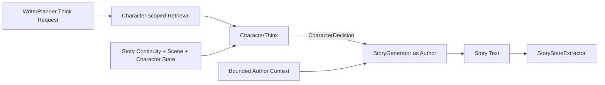

# CharacterThink 决策输出更新 — Design

> **Date**: 2026-08-14
> **Author**: GPT-5
> **Status**: Draft
> **Prior doc**: [CharacterThink CSI–RC–FTI Prompt Spec 3.0](../exec/CSI-RC-FTI/2026-08-12-character-think-csi-rc-fti-prompt-spec-gpt.md)
> **Related doc**: [StoryGenerator 与 StoryStateExtractor 拆分](./2026-08-14-story-state-extractor-split-design-gpt.md)

---

## Context

当前 `CharacterThink` 为每个目标 AI 角色输出四个字段：`perception`、`emotion`、`goal` 和 `possible_action`（`crates/aise/src/domain/turn/character.rs:5-21`）。CharacterThink Pipeline 对四个字段逐一验证后存入 Turn Context（`crates/aise/src/character/character_think_pipeline.rs:89-114`），StoryGenerator 再完整渲染这四项（`crates/aise/src/story/story_generator_prompt.rs:739-757`）。

这个输出把 CharacterThink 同时当成了感知摘要器、情绪解释器、目标解释器和行动候选生成器。但 StoryGenerator 的职责是“作者”，其当前上下文已经包含角色资料、角色状态、故事连续性、场景和 Writer Knowledge（`crates/aise/src/story/story_generator_prompt.rs:20-34`）；在有界召回范围内，它可以读取所有与当前写作相关的角色信息，包括角色私有 Rumor 和 Memory。

因此，CharacterThink 没有必要向作者重复解释角色看见了什么、感觉如何或当前目标是什么。它真正不可替代的价值是维护角色独立能动性：站在该角色有限认知和个性立场上，决定角色接下来想做什么。

CharacterThink 应从 `CharacterThought` 更新为最小化的 `CharacterDecision`。StoryGenerator 读取全局作者上下文和各角色决策，负责协调冲突、决定实际结果并写成最终故事。

### Constraints & assumptions

- CharacterThink 继续每次调用只处理一个由 WriterPlanner 请求的 AI 控制角色。
- CharacterThink 不模拟 Player Character，也不能决定 Player Character 的行动、语言或内心状态。
- Story Summary 和 Recent Story 继续作为连续性上下文，但不自动等于目标角色知道其中全部内容。
- 角色做决策时只能使用其能够感知、得知、记住或合理推断的信息。
- Relevant Character Knowledge 继续只包含该角色获授权的 Rumor 和 Memory。
- StoryGenerator 拥有作者视角，可以读取当前 Turn 中所有相关角色信息，但必须区分“作者知道”和“角色知道”。
- CharacterDecision 只存在于当前 Turn，不持久化为角色状态、Knowledge 或世界事实。
- 本设计不修改 Narrative Character Impulse 的来源与语义。

---

## Principles

1. **决策而非复述**：CharacterThink 只回答“角色决定做什么”，不重复故事、场景和角色状态。
2. **角色认知有限，作者视角完整**：CharacterThink 遵守角色知识边界；StoryGenerator 可以读取全部相关信息并负责正确使用。
3. **角色决定不等于故事结果**：Decision 表达意图和能动性，实际行动结果只能由最终故事建立。
4. **输出最小化**：删除下游可直接读取或推断的字段，降低 token、Schema 和语义冲突。
5. **Turn 内短生命周期**：Decision 只服务本次 StoryGenerator，提交后即释放。

---

## Options

### Option A: 保留四字段 CharacterThought

- **Idea**：继续输出 Perception、Emotion、Goal 和 Possible Action。
- **Pros**：
  - StoryGenerator 可以直接读取一份角色主观状态摘要。
  - 与当前实现和 Prompt Spec 完全兼容。
- **Cons**：
  - 大量内容与 Story、角色状态、Rumor 和 Memory 重复。
  - `possible_action` 只是候选，不足以表达角色已经作出的决定。
  - 多个字段可能彼此矛盾，也可能与 StoryGenerator 可见的原始信息不一致。
  - CharacterThink 输出成本和失败面不必要地扩大。
- **Risk**：StoryGenerator 逐渐依赖二手摘要，而不是直接使用完整作者上下文。

### Option B: 收缩为 CharacterDecision

- **Idea**：输出一个必填角色决策，以及一条可选的角色口吻台词建议。
- **Pros**：
  - 职责与角色能动性直接对应。
  - 输出更短、更稳定，Schema 更简单。
  - StoryGenerator 可以基于原始信息自行推断感知、情绪和目标。
  - 明确区分“角色想做什么”与“故事中最终发生什么”。
- **Cons**：
  - StoryGenerator 需要自行完成更多人物表现推断。
  - Decision 过于抽象时可能缺少可写作的行为细节。
- **Risk**：如果 StoryGenerator 无法看到完整相关角色信息，删除摘要字段会降低人物表现。

### Option C: 删除 CharacterThink，由 StoryGenerator 统一决定角色行为

- **Idea**：StoryGenerator 直接根据作者上下文决定所有 AI 角色行为。
- **Pros**：
  - 少一次或多次 CharacterThink 模型调用。
  - 所有角色行为由一个模型统一协调。
- **Cons**：
  - 角色独立能动性被 Writer Goal 和整体剧情目标吞没。
  - 多角色复杂场景中，弱势角色更容易被忽略或被剧情“操纵”。
  - 无法为单个角色提供隔离的 Memory/Rumor 决策上下文。
- **Risk**：角色更像作者的剧情工具，而不是根据自身认知作出选择的 Agent。

### Choice

**Adopt option B.**

**Rationale**：CharacterThink 的独特价值是角色决策，而不是替 StoryGenerator 压缩其已经能够读取的信息。保留最小 Decision 可以维持角色能动性，同时显著减少重复和输出歧义。

---

## Design

### 1. Target structure



CharacterThink 与 StoryGenerator 的信息权限不同：

```text
CharacterThink
    target character identity/state
    + Story Summary / Recent Story as continuity
    + current scene
    + target-authorized Rumor / Memory
    + thinking focus
    -> one character-local decision

StoryGenerator
    complete bounded writer context
    + all relevant character cards/states
    + all relevant Fact / Rumor / Memory
    + all requested Character Decisions
    + player input and writer constraints
    -> final story segment
```

“完整作者视角”表示 StoryGenerator 不受某个角色的认知边界限制；它仍受 Turn Context 的召回范围和 token budget 限制，不要求无界加载整个 Knowledge Store。

### 2. Core types & responsibilities

| Type / Module | Responsibility | Out of scope |
|---|---|---|
| `CharacterThinkRequest` | 指定需要决策的 AI 角色和本次 Thinking Focus | 规定角色必须采取的行动 |
| `CharacterThinkPipeline` | 构建角色隔离上下文并执行一次角色决策 | 写故事、判断行动结果、提交状态 |
| `CharacterDecisionOutput` | 模型返回的最小结构化决策 | `character_id`、Perception、Emotion、Goal、世界结果 |
| `CharacterDecision` | 引擎绑定目标角色 ID 后形成的 Turn 内决策 | 持久化角色思想或直接修改角色状态 |
| `StoryGenerator` | 读取作者上下文与所有 Character Decisions，协调并写作 | 把作者知识无条件赋予故事角色 |

### 3. CharacterDecision output contract

模型只输出两个字段：

| Field | Required | Semantics |
|---|:---:|---|
| `decision` | Yes | 角色此刻决定采取的一个行动、回应、等待或拒绝意图 |
| `suggested_utterance` | No | 当角色决定说话时，按其说话风格给 StoryGenerator 的一句台词建议 |

引擎在解码成功后绑定 `CharacterThinkRequest.character_id`，模型不返回也不选择 `character_id`。最终 Turn 内对象由以下信息组成：

| Field | Source |
|---|---|
| `character_id` | Engine-bound request target |
| `decision` | Model output |
| `suggested_utterance` | Optional model output |

#### `decision`

- 必须是一个非空、有界、角色自身可执行的即时决定。
- 可以是行动、回应、拒绝、等待、隐藏、离开、调查或暂不行动。
- 描述角色的意图，不保证行动成功，也不决定其他角色或世界如何响应。
- 必须基于角色性格、当前状态、Story Continuity 中角色可知的部分、当前场景以及其 Rumor/Memory。
- 不能包含链式推理、长篇内心独白、最终故事正文或状态 patch。

#### `suggested_utterance`

- 仅在角色决定说话且一句口吻样例能帮助写作时提供。
- 应符合角色说话风格，但不是最终台词，也不要求 StoryGenerator 原样采用。
- StoryGenerator 可以为节奏、视角、语言一致性和多角色协调进行改写、缩短或省略。
- 不能替 Player Character 生成台词。

### 4. Removed fields

| Current field | Decision | Reason |
|---|---|---|
| `perception` | Delete | StoryGenerator 直接读取故事、场景和角色信息；不需要 CharacterThink 再生成感知摘要 |
| `emotion` | Delete | StoryGenerator 可根据角色资料、状态、Memory、Rumor 和故事推断并表现情绪 |
| `goal` | Delete from output | 当前目标已经属于 Character State；CharacterThink 只需给出本次决定 |
| `possible_action` | Replace with `decision` | 角色需要作出选择，而不是只列一个可能候选 |

这不要求模型停止内部理解情境、情绪或目标；这些仍是形成决策的必要推断，只是不再作为独立输出字段。

### 5. Input and epistemic boundary

CharacterThink RC 继续提供：

1. Target Character。
2. Current Character State。
3. Story Summary 与 Recent Story。
4. Current Scene。
5. 该角色获授权的 Rumor 与 Memory。
6. 当前 Thinking Focus。
7. Player Input。
8. 现有 Narrative Character Impulse，如当前独立 Narrative 设计要求。

Story Summary 和 Recent Story 是为了让模型理解故事连续性，不代表角色自动知道全部叙述内容。只有满足以下任一条件的信息才能影响 `decision`：

- 角色在当前或过去场景中亲历或感知；
- 信息已经进入该角色的 Memory；
- 信息作为 Rumor 被该角色得知；
- 信息是当前场景中该角色可合理观察到的公开情况；
- 角色可以基于已知信息合理推断。

CharacterThink 不需要 `Current Perception` 输入，也不产生 Perception 输出。Current Scene 是权威场景上下文，不是额外持久化的角色感知状态。

### 6. StoryGenerator author contract

StoryGenerator 是作者，不是任何单一角色。它可以读取当前 Turn 中所有与写作相关的信息，包括：

- 所有相关角色资料与当前状态；
- Writer 侧召回的 Fact、Rumor 和各角色 Memory；
- 所有请求得到的 Character Decisions；
- Story Summary、Recent Story、Current Scene、Player Input 和有效约束。

作者权限不等于角色权限。StoryGenerator 必须：

- 使用全局信息保证因果、连续性和人物表现；
- 只让角色基于其自身可知信息作出言行；
- 不让一个角色因为作者读取了另一个角色的 Memory 而突然获得该信息；
- 不依赖 CharacterDecision 转述 Perception、Emotion 或 Goal；
- 把 `suggested_utterance` 视为风格参考，而不是必须逐字复制的脚本。

### 7. Decision reconciliation

CharacterDecision 是角色在故事生成开始时的真实选择，不只是任意候选。StoryGenerator 应尽量实现其核心意图，但仍负责处理世界规则、多个角色决策之间的冲突和实际结果。

| Situation | StoryGenerator behavior |
|---|---|
| Decision 与 Writer Goal 兼容 | 同时实现角色决定和叙事推进 |
| Decision 阻碍 Writer Goal | 保留角色决定，允许当前片段只取得部分叙事进展 |
| 多角色 Decision 冲突 | 根据场景因果协调先后、对抗或失败结果，不静默改写角色选择 |
| Decision 在世界中无法成功 | 可以让行动失败，但故事必须表现尝试及失败原因 |
| 新事件足以改变 Decision | 可以表现角色受到新信息或压力后改变决定，必须在故事中建立因果过程 |

Decision 本身不提交为世界事实，也不直接产生角色状态。只有 StoryGenerator 最终写出的内容，经过 StoryStateExtractor 与 Validation 后，才能形成权威变化。

### 8. Key flows

#### Character decision

1. WriterPlanner 为一个现有 AI 角色产生 CharacterThink Request。
2. Retrieval 为该角色准备隔离的 Rumor/Memory 上下文。
3. CharacterThink 读取角色资料、状态、连续性、场景、知识和 Thinking Focus。
4. 模型返回 `decision` 与可选 `suggested_utterance`。
5. 引擎绑定请求中的 `character_id`，验证边界后写入 Turn Context。

#### Author realization

1. StoryGenerator 读取完整有界作者上下文和全部 Character Decisions。
2. StoryGenerator 协调 Player Input、角色决定、世界规则和写作目标。
3. 核心 Decision 被实现、因果阻止或通过故事内新事件改变。
4. Suggested Utterance 可以被采用或改写。
5. StoryGenerator 只输出故事正文；状态由后续 StoryStateExtractor 提取。

### 9. Key decisions

- **是否保留 Perception 输出** → 删除 → 作者可直接读取并理解故事与角色信息。
- **是否保留 Emotion 输出** → 删除 → 情绪表现属于 StoryGenerator 的作者工作。
- **是否保留 Goal 输出** → 删除 → 长期或当前目标来自 Character State，本阶段只输出即时选择。
- **Possible Action 还是 Decision** → Decision → CharacterThink 的价值是角色作出选择，而不是提供候选列表。
- **是否提供台词** → 仅提供可选 Suggestion → 保留角色口吻帮助，同时让 StoryGenerator 掌握最终措辞。
- **StoryGenerator 是否受角色认知边界限制** → 作者本身不受限 → 但它必须保证故事中的每个角色只使用自己可知的信息。
- **Decision 是否持久化** → 不持久化 → 它是当前 Turn 的中间作者输入，最终故事才是权威结果。

---

## Impact

- **Domain**：`CharacterThought` / `CharacterThoughtOutput` 更新为 `CharacterDecision` / `CharacterDecisionOutput`；删除四个旧字段。
- **Turn Context**：`thoughts` 集合和相关访问器更新为 `character_decisions`，仍保持 Turn 内有界生命周期。
- **CharacterThink Prompt**：CSI Objective 改为角色决策；FTI Schema 只保留 `decision` 和可选 `suggested_utterance`；RC 不增加 Perception。
- **StoryGenerator Prompt**：`AI Character Thoughts` 改为 `AI Character Decisions`；作者侧召回应允许包含当前写作需要的任意角色 Rumor/Memory，并保留所有权标记。
- **Validation**：验证 Decision 非空、长度有界、目标角色由引擎绑定、可选台词类型正确，并防止 Player Character 输出。
- **Observability**：指标字段从 Thought 四字段长度改为 Decision 总大小和可选台词存在性；日志不得记录私有决策正文。
- **Tests**：替换四字段 JSON、Prompt golden、投影、角色隔离、作者信息边界和 Decision reconciliation 测试。
- **External interface**：CharacterDecision 是内部 Turn 数据，不暴露为持久化 API。

---

## Risks & mitigations

| Risk | Likelihood | Impact | Mitigation |
|---|---|---|---|
| 删除 Emotion/Goal 后人物表现变薄 | Medium | Medium | 确保 StoryGenerator 获得完整相关角色资料、状态和 Knowledge，并用评测覆盖人物一致性 |
| Decision 过于抽象，难以写成具体动作 | Medium | Medium | Prompt 要求一个即时、可执行的选择；允许可选台词样例提供表现细节 |
| StoryGenerator 使用作者私有信息造成角色越权 | Medium | High | Prompt 明确作者/角色知识边界，并增加跨角色 Memory 泄漏评测 |
| StoryGenerator 静默覆盖角色 Decision | Medium | High | 建立 Decision reconciliation 规则，要求实现、因果阻止或显式改变 |
| 类型更名遗留旧 Prompt 或测试路径 | High | Medium | 按硬重构一次删除 `CharacterThought`、旧字段、模板变量和兼容路径 |

---

## Roadmap

- **Phase 0**：基于本设计生成新的英文 CharacterThink codegen spec，并声明替代现有 Spec 3.0 的相关章节。
- **Phase 1**：硬更新 Domain、Turn Context、CharacterThink Pipeline 与 CSI–RC–FTI。
- **Phase 2**：更新 StoryGenerator 作者上下文、Character Decisions 渲染和协调规则。
- **Phase 3**：补齐角色知识边界、角色能动性、可选台词和多角色冲突评测。

---

## Appendix

本设计不修改：

- WriterPlanner 选择哪些角色进入 CharacterThink 的策略；
- Narrative Character Impulse 的产生和节点触发机制；
- Character State 中长期目标的领域模型；
- Story Summary 和 Recent Story 的独立维护流程；
- StoryStateExtractor 的具体 Schema，见关联设计文档。
