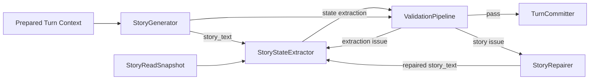

# StoryGenerator 与 StoryStateExtractor 拆分 — Design

> **Date**: 2026-08-14
> **Author**: GPT-5
> **Status**: Draft
> **Prior doc**: [AISE 架构设计](./2026-08-04-Architecture-gpt.md)
> **Related doc**: [CharacterThink 决策输出更新](./2026-08-14-character-think-decision-design-gpt.md)

---

## Context

当前 `StoryGenerator` 同时生成故事正文和结构化状态。`StoryProposalOutput` 包含 `story_text`、Events、角色变化、关系变化、Knowledge 变化、Perceptions、场景变化和 Summary（`crates/aise/src/domain/turn/proposal.rs:15-28`），完整 JSON Schema 被注入 StoryGenerator 的 FTI（`crates/aise/src/story/story_generator_prompt.rs:294-302`）。

这个结构把两个不同任务绑定在一次模型输出中：

1. 创作连贯、有表现力的故事正文。
2. 从最终故事中识别需要提交的权威状态。

只要任一结构化字段类型错误、引用错误或遗漏，整份输出就可能无法解码或通过验证，即使 `story_text` 本身可用。StoryRepairer 也无法清晰区分“故事有问题”和“状态提取有问题”，容易为了修复结构化数据而重写已经合格的正文。

当前 Validation 还承担 patch 合并工作：角色字段在 Snapshot 上逐项覆盖，关系使用 `trust_delta` 计算最终值（`crates/aise/src/validation/validation_pipeline.rs:125-169`）。Knowledge 目前只生成新增项（`crates/aise/src/validation/validation_pipeline.rs:170-185`），无法表达已有 Fact、Rumor 或 Memory 的修改与删除。

因此需要将 StoryGenerator 收缩为纯故事生成阶段，并增加独立的 `StoryStateExtractor`，专门读取候选故事和当前 Snapshot，输出故事结束时需要提交的结构化状态。

### Constraints & assumptions

- 采用硬拆分，不保留旧 `StoryProposalOutput` 双路径或兼容适配层。
- StoryGenerator 只负责故事正文；StoryStateExtractor 不拥有改写正文的权限。
- 故事正文与状态变化仍作为同一个 Turn 原子提交。
- StoryStateExtractor 只读取有界上下文，输出数量、单项大小、重试次数和总 token 都必须有上限。
- Summary 由后续独立流程负责，不属于 StoryGenerator 或 StoryStateExtractor 输出。
- Narrative 由独立设计负责，不属于 StoryStateExtractor 输出。
- 通用 Story Events 和持久化 Perceptions 不再属于 Turn 的故事状态提取契约。
- `StoryRevision` 可以继续作为 StoryInstance 的内部并发控制版本，但不由模型生成，也不表示 Knowledge 内容版本。

---

## Principles

1. **创作与提取分离**：StoryGenerator 优化故事质量，StoryStateExtractor 优化状态完整性和结构正确性。
2. **最终故事是提交依据**：计划、角色决策和模型内部意图都不能直接成为权威状态，只有最终故事实际建立的结果可以被提取。
3. **输出最终值而非 patch**：角色、关系和场景返回完整最终状态，避免模型生成 delta，也避免 Validation 再执行语义合并。
4. **状态归属稳定**：角色实例只保存角色运行时状态；Memory 和 Rumor 继续归 Knowledge Store；Perception 不形成独立持久化状态。
5. **失败隔离且原子提交**：提取错误不能迫使系统重写合格故事；任何未通过验证的故事或状态都不能部分提交。

---

## Options

### Option A: 继续使用统一 StoryProposal

- **Idea**：StoryGenerator 一次返回正文和所有结构化字段。
- **Pros**：
  - 只需要一次模型调用。
  - 当前 Pipeline 顺序无需增加新阶段。
- **Cons**：
  - 大型 Schema 挤占创作提示和输出预算。
  - 一个结构错误会使故事正文与全部状态一起失败。
  - StoryRepairer 必须同时承担文本修复与状态修复。
  - 模型需要在创作时同步维护 Events、引用和多类状态，任务冲突明显。
- **Risk**：随着状态类型增加，输出失败率和修复成本继续上升。

### Option B: StoryGenerator 与 StoryStateExtractor 分离

- **Idea**：StoryGenerator 只生成 `story_text`；StoryStateExtractor 在其后读取正文和 Snapshot，生成结构化状态。
- **Pros**：
  - StoryGenerator Prompt 和输出显著简化。
  - 状态失败可以独立重试，不改写正文。
  - Extractor 可以针对 ID、最终状态和 Knowledge 操作使用更严格的小型 Schema。
  - 两个阶段可以分别选择模型、预算和验证策略。
- **Cons**：
  - 每个 Turn 增加一次顺序模型调用。
  - Runtime、Validation 和 Repair Loop 需要增加明确的阶段状态。
- **Risk**：Extractor 漏提取状态时，需要可靠的跨文本一致性验证和有界重试。

### Option C: 使用纯确定性规则提取状态

- **Idea**：不调用第二个模型，使用规则、正则或代码从故事正文生成状态。
- **Pros**：
  - 延迟和模型成本最低。
  - 输出完全确定。
- **Cons**：
  - 无法可靠理解自然语言中的隐含状态、关系变化、传闻和记忆形成。
  - 规则会与语言、题材和写作风格强耦合。
- **Risk**：大量合法故事无法被正确提交，迫使 StoryGenerator 为规则而写作。

### Choice

**Adopt option B.**

**Rationale**：额外一次有界提取调用换来职责清晰、Prompt 简化和故障隔离。确定性代码仍负责 Schema、ID、边界、状态一致性和提交验证，但不承担自然语言语义提取。

---

## Design

### 1. Target structure



目标 Turn 工作流为：

```text
TurnInitializer
    -> BaselineContextBuilder
    -> WriterPlanner
    -> ContextRetrievalPipeline
    -> CharacterThinkPipeline
    -> StoryGenerator
    -> StoryStateExtractor
    -> ValidationPipeline / StoryRepairer / bounded re-extraction
    -> TurnCommitter
```

`TurnExecutionContext` 分别保存候选 `story_text` 与 `StoryStateExtractorOutput`，不再保存同时拥有两者的 `StoryProposalOutput`。

### 2. Core types & responsibilities

| Type / Module | Responsibility | Out of scope |
|---|---|---|
| `StoryGenerator` | 根据作者上下文生成一个候选故事片段 | 状态提取、Summary、Narrative 状态输出 |
| `StoryGeneratorOutput` | 只承载非空、有界的 `story_text` | Events 和任何状态字段 |
| `StoryStateExtractor` | 根据候选故事与当前 Snapshot 识别最终状态 | 创作、润色或修复故事正文 |
| `StoryStateExtractorOutput` | 承载角色、关系、Knowledge 和场景结果 | Story、Events、Perceptions、Summary、Narrative |
| `ValidationPipeline` | 验证正文、提取结果及两者的一致性，并分类问题归属 | 创作新内容或猜测缺失状态 |
| `StoryRepairer` | 根据故事类问题修复 `story_text` | 直接编辑结构化状态 |
| `TurnCommitter` | 对通过验证的正文和状态执行原子提交 | 接受未验证模型输出 |

### 3. StoryStateExtractor output contract

`StoryStateExtractorOutput` 只包含以下四个顶层字段：

| Field | Cardinality | Semantics |
|---|---:|---|
| `character_states` | 0..N | 只列出本 Turn 实际发生变化的现有角色；每项是该角色完整的可变最终状态 |
| `relationship_states` | 0..N | 只列出本 Turn 实际发生变化的现有有向关系；每项包含完整最终值 |
| `knowledge_changes` | 0..N | 对 Fact、Rumor 和 Memory 执行显式新增、修改或删除操作 |
| `current_scene` | 1 | 故事片段结束时完整的最终 `CurrentScene` |

#### Character final state

角色状态项包含：

- 精确 `character_id`；
- 最终 `location`；
- 完整最终 `goals`；
- 完整最终 `attributes`。

`role_key` 等不可变绑定不由模型控制。未变化角色不进入数组；一旦进入数组，就必须给出全部可变最终字段，不能使用 `location: null`、部分 `attribute_updates` 或其他 patch 语义。

Memory 不进入 `CharacterInstanceState`。当前角色实例只保存角色运行时状态；Memory 作为带 `owner` 的独立 Knowledge Entry 保存，现有归属关系可见于 `crates/aise/src/domain/knowledge/memory.rs:10-22`。

#### Relationship final state

关系表示两个角色之间的有向关系，身份由以下三项共同确定：

- `source_character_id`；
- `target_character_id`；
- `kind`。

输出包含最终 `trust`，不再包含 `trust_delta`。当前 `RelationshipState` 已使用相同的有向身份和最终 `trust` 表达（`crates/aise/src/domain/story_instance/state.rs:55-62`）。本设计只处理已有关系的状态更新；关系创建、删除和关系模型扩展不在本设计范围内。

#### Knowledge operations

| Knowledge kind | Add | Update | Delete | Delete semantics |
|---|:---:|:---:|:---:|---|
| Fact | Yes | Yes | No | 已有事实发生变化时更新为最终事实，不通过删除表达 |
| Rumor | Yes | Yes | Yes | 传闻被明确辟谣并退出当前有效传闻集合 |
| Memory | Yes | Yes | Yes | 所属角色遗忘或该记忆不再作为当前有效记忆保存 |

操作规则：

- 修改或删除必须引用 Snapshot 中已有条目的精确稳定 ID。
- 新增项不伪造 ID，由引擎在提交时分配。
- 新增与修改携带该 Knowledge Entry 的完整最终内容，不使用字段 patch。
- 删除 Rumor 不自动删除角色已经形成的相关 Memory；故事若建立了“角色得知辟谣”，应同时新增或修改对应角色 Memory。
- 删除表示从当前有效视图移除；Turn 提交记录仍可承担审计职责。
- Fact、Rumor、Memory 继续作为三个不同 Knowledge 类型保存（`crates/aise/src/domain/knowledge/entry.rs:12-18`）。

#### Final scene

`current_scene` 每次都返回故事结束时的完整最终场景，包含：

- `scene_key`；
- `location_key`；
- `time`；
- `description`；
- `present_character_ids`。

这些字段与当前 `CurrentScene` 权威结构一致（`crates/aise/src/domain/story_instance/state.rs:27-35`）。即使场景没有发生语义变化，Extractor 也返回与 Snapshot 相同的完整最终值，避免 `scene_change` 与 patch 语义。

### 4. Explicit exclusions

| Removed field / concept | New owner or reason |
|---|---|
| `story_text` | `StoryGeneratorOutput` |
| `events` | 删除通用故事事件输出；Story Summary 与 Recent Story 已保存实际故事信息 |
| `perceptions` | 删除；模型直接从故事上下文理解当前情境，不持久化第二份感知摘要 |
| `summary_text` | 后续独立 Summary 流程 |
| Narrative signals / transitions / intents | 独立 Narrative 设计，不由 StoryStateExtractor 生成 |
| `source_event_index` / `source_event_id` | 随通用 Events 输出一起删除 |
| `story_revision` / `observed_at_revision` | 引擎内部提交与并发控制信息，不属于模型输出 |

这项排除只定义 StoryStateExtractor 契约。现有 Narrative 流程是否保留自己的事件类型、触发记录或持久化结构，由 Narrative 专项设计决定，本设计不修改其语义。

### 5. Key flows

#### Normal generation

1. StoryGenerator 根据完整作者上下文生成一个候选 `story_text`。
2. StoryStateExtractor 读取候选正文、当前 Snapshot、可用稳定 ID 和有界 Knowledge 索引。
3. Extractor 只输出正文实际建立的四类最终状态。
4. Validation 分别验证正文、结构、ID、状态边界以及正文与状态的一致性。
5. TurnCommitter 在同一事务中提交故事正文和全部状态结果。

#### Story repair

1. Validation 将问题分类为故事问题。
2. StoryRepairer 只修复 `story_text`。
3. 旧的状态提取立即失效并被丢弃。
4. StoryStateExtractor 必须针对修复后的完整正文重新执行。
5. 重新进入 Validation；重试次数受统一 Repair Budget 约束。

#### State re-extraction

1. Validation 确认正文可保留，但发现状态缺失、非法 ID、Schema 错误或正文不一致。
2. 同一 `story_text` 与结构化问题反馈重新交给 StoryStateExtractor。
3. StoryGenerator 和 StoryRepairer 均不执行。
4. 新提取结果替换旧结果并重新验证。
5. 预算耗尽时 Turn 失败，不提交正文或部分状态。

### 6. Key decisions

- **是否保留统一输出** → 不保留 → 统一输出让创作失败和状态失败互相污染。
- **状态是否输出 patch** → 不输出 → 变化对象返回完整最终值，Validation 不再计算业务 delta。
- **场景是否可选** → 不可选 → 每次提供完整最终场景，消除“未输出是未变化还是遗漏”的歧义。
- **Memory 是否嵌入角色状态** → 不嵌入 → Memory 独立增长、检索、修改和遗忘，继续由 Knowledge Store 管理。
- **是否持久化 Perception** → 不持久化 → Story Continuity、当前场景、Rumor 和 Memory 已足够支持模型理解与决策。
- **是否输出 Events** → 不输出 → 当前核心消费依赖可以由故事正文和专属领域流程替代，避免模型维护脆弱的跨字段索引。
- **是否输出 Summary** → 不输出 → Summary 有独立生命周期和压缩边界，应由专门流程负责。
- **是否输出 Narrative 数据** → 不输出 → Narrative 有独立触发与状态演进设计。
- **是否由模型输出 revision** → 不输出 → `StoryRevision` 只服务内部一致性和并发控制，模型只处理当前最终版本。

---

## Impact

- **Code**：需要拆分 `domain/turn/proposal.rs`，新增 StoryStateExtractor Pipeline 与输出域类型，调整 `TurnExecutionContext`、`TurnStage`、`TurnRuntime`、Validation、StoryRepairer 和 Committer。
- **Prompts**：StoryGenerator FTI 删除大型状态 Schema；新增独立 StoryStateExtractor CSI–RC–FTI；StoryRepairer 只修复正文。
- **Knowledge**：从仅新增扩展为 Fact/Rumor/Memory 的显式新增、修改和受限删除；Knowledge source 由引擎绑定当前 `turn_id`，不再依赖 proposal-local event index。
- **Data**：删除 Current Perception 当前视图及相关 Snapshot、配置和提交路径；通用 proposal event 的存储依赖需要清理，但 Narrative 自有事件不在此文档范围内。
- **Validation**：问题需要区分 story、extraction 和 cross-consistency 三类；故事修复后必须重新提取。
- **Observability**：分别记录 StoryGenerator 与 StoryStateExtractor 的延迟、token、输出大小、失败类型和重试次数，不记录故事全文或私有 Knowledge 正文。
- **External interface**：Turn API 仍只在原子提交成功后返回结果；不暴露中间提取结果。

---

## Risks & mitigations

| Risk | Likelihood | Impact | Mitigation |
|---|---|---|---|
| 新增一次 LLM 调用增加延迟与费用 | High | Medium | 使用更小的 Extractor Prompt、专用低延迟模型和独立 token 上限 |
| Extractor 漏掉正文已建立的状态 | Medium | High | 增加正文—状态一致性校验、字段级问题反馈和有界重提取 |
| StoryRepair 后误用旧提取结果 | Medium | High | 正文发生任何变化时强制清空并重新生成全部提取结果 |
| 删除 Events 后遗留引用失效 | High | High | 同一次硬重构删除 `source_event_index`、Perception 和旧 Knowledge evidence 路径 |
| 最终值覆盖未提供给模型的旧字段 | Medium | High | Extractor 必须读取完整当前状态；输出 Schema 要求变化对象包含全部可变字段 |
| Knowledge 删除造成历史信息丢失 | Low | Medium | 删除只影响当前有效视图，Turn commit history 保留审计来源 |

---

## Roadmap

- **Phase 0**：基于本设计生成英文 codegen spec，明确类型、Prompt、迁移和测试契约。
- **Phase 1**：硬拆分 StoryGenerator 与 StoryStateExtractor，删除旧统一输出路径。
- **Phase 2**：完成 Knowledge update/delete、Perception 清理、event-reference 清理和持久化迁移。
- **Phase 3**：为两类 Repair 分支补齐评测、指标与失败预算测试。

---

## Appendix

本设计不定义以下能力：

- Summary 的触发、压缩边界和 Pipeline 顺序；
- Narrative 节点触发、Narrative Signals 或 Narrative Events；
- 新角色创建；
- 新关系创建、删除或多维关系模型；
- Knowledge 历史审计查询接口。
