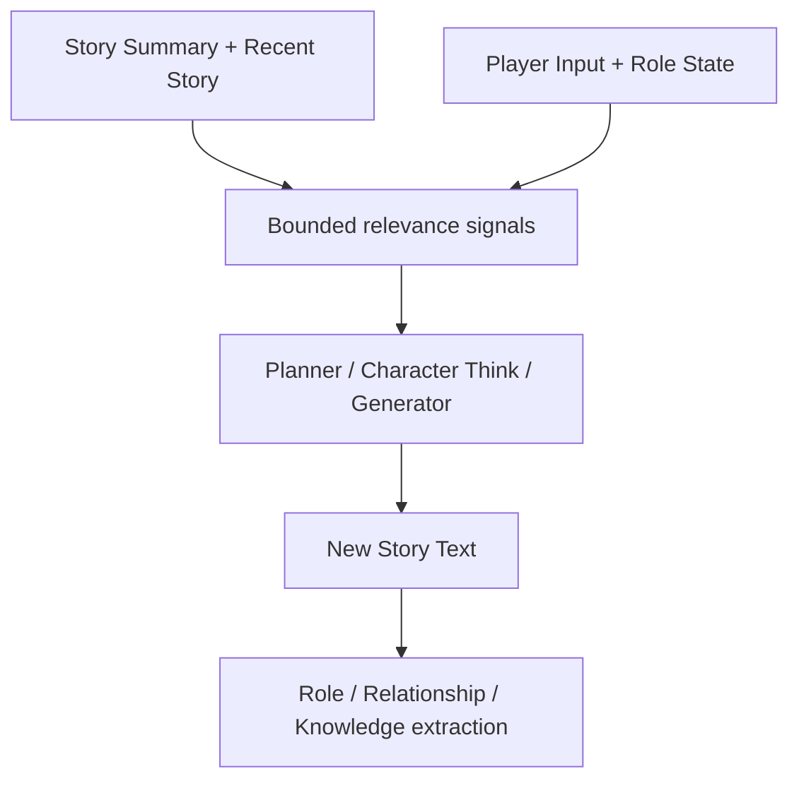

# Current Scene Removal — Design

> **Date**: 2026-08-17
> **Author**: GPT-5
> **Status**: Draft
> **Prior docs**: [Context Preparation and Retrieval](2026-08-08-context-preparation-retrieval-design-gpt.md) · [Story State Extractor Split](CSI-RC-FTI/2026-08-14-story-state-extractor-split-design-gpt.md) · [Character Think Decision](CSI-RC-FTI/2026-08-14-character-think-decision-design-gpt.md)

---

## Context

当前运行时将 `CurrentScene` 作为独立权威状态，包含 `scene_key`、`location_key`、`time`、`description` 和 `present_role_ids`（`crates/aise/src/domain/story_instance/state.rs:25-33`）。它被复制到 `StoryReadSnapshot`、`BaselineContext`、五类 LLM Runtime Context、`StoryStateExtractorOutput`、`ValidatedChangeSet`、SQLite、Story API 和前端。

这套结构与 `Story Summary + Recent Story` 形成两个对当前叙事状态的自然语言解释。最新 trace `2026-08-17-10_36_58_564.json` 中，StoryGenerator 已经写出玩家开门、发现脚印并听到树后人物说话，但 StoryStateExtractor 仍原样返回 Turn 前的场景描述“屋外传来一阵脚步声”。该结果通过校验并提交。下一 Turn 因而可能同时收到最新 `Recent Story` 和过期的“权威” `Current Scene`，而 CSI 又要求不得违背后者。

问题不止是 Prompt 重复。当前场景缓存还驱动场景角色选择和检索：`BaselineContext` 同时保存 `current_scene`、`scene_roles` 与 `referenced_roles`（`crates/aise/src/domain/turn/baseline.rs:102-119`）；`RetrievalSignalBuilder` 从场景描述和 `present_role_ids` 构造高优先级信号（`crates/aise/src/context/retrieval_signal_builder.rs:21-55`）；StateExtractor 每 Turn 必须返回完整 `current_scene`（`crates/aise/src/domain/turn/extraction.rs:29-36`）。只删除模板区块会留下继续影响检索、提交和外部显示的陈旧状态源。

现在删除该路径，可以在继续优化 CSI-RC-FTI 之前确立单一叙事事实源，避免后续 Prompt、校验和状态迁移继续围绕错误抽象扩展。

### Constraints & assumptions

- `Story Summary` 表示压缩后的长期连续性，`Recent Story` 表示按顺序保留的最新已提交正文；两者必须连续且不重叠。
- `StoryRoleState.location`、角色目标、属性、关系和 Knowledge 仍是结构化运行时状态，不因本设计删除。
- `StoryStart` 是不可变 Story Pack 的初始作者数据，不是逐 Turn 的 `CurrentScene`；其资产结构本次不变。
- 本变更遵守 `R-REFACTOR-01/02`：一次性删除旧路径，不保留兼容字段、双写或回退。

---

## Principles

1. **单一叙事事实源**：当前情境由 `Story Summary + Recent Story` 的连续正文表达，不再维护第二份场景摘要。
2. **只显式提供不可可靠推导的信息**：Prompt 保留稳定 ID、角色状态、Knowledge、约束和 Narrative Guidance，不重复解释最新正文。
3. **相关性不等于在场性**：代码只选择 `Relevant Characters`，是否在场由模型从连续正文判断，Engine 不持久化 `present_role_ids`。
4. **结构化状态各归其主**：角色位置归 `StoryRoleState`，关系归 `RelationshipState`，世界知识归 Fact/Rumor/Memory；不再由聚合型场景对象重复持有。
5. **有界且确定性**：相关角色和检索信号仍由代码有界选择，删除 `CurrentScene` 不引入额外 LLM 调用或无界扫描。

---

## Options

### Option A: 只从生成 Prompt 删除 `Current Scene`

- **Idea**：保留持久化 `CurrentScene`、StateExtractor 输出和现有检索，只从 WriterPlanner、CharacterThink、StoryGenerator、StoryRepairer 的 RC 中删除区块。
- **Pros**：改动小；不影响数据库和 API。
- **Cons**：过期场景仍会影响角色选择、Knowledge 召回、StateExtractor 和外部显示；系统仍有两个事实源。
- **Risk**：错误从显式 Prompt 冲突转为更隐蔽的上下文选择错误。

### Option B: 保留仅含 ID 的结构化场景状态

- **Idea**：删除 `description/time`，保留 `scene_key/location_key/present_role_ids`。
- **Pros**：保留场景索引和精确在场列表。
- **Cons**：这些字段仍需由 LLM 从正文提取；`location_key` 与角色位置重复，`present_role_ids` 仍是容易过期的场景缓存。
- **Risk**：字段更少，但双重状态和同步问题没有消失。

### Option C: 端到端删除运行时 `CurrentScene`

- **Idea**：删除类型、Snapshot/Baseline 字段、Prompt 区块、Extractor 输出、校验、提交、持久化和 API 字段；用连续正文、角色状态和相关性选择承担各自职责。
- **Pros**：只有一个叙事事实源；彻底消除同步问题；Prompt 和状态提取合同更小。
- **Cons**：需要数据库迁移和 API 破坏性更新；相关角色选择必须重新定义。
- **Risk**：若相关性选择过窄，未被最近正文点名的角色资料可能无法预加载。

### Choice

**Adopt option C.**

**Rationale**：Option A 和 B 都保留了产生 trace 缺陷的第二状态源，只是减少其可见字段。端到端删除才能使“最新正文定义当前情境”成为可验证的架构事实。相关角色遗漏由 `Character Index`、按需 Retrieval 和 Character Think 对任意现有 AI Role 的直接解析处理，不需要重新引入在场缓存。

---

## Design

### 1. Target structure

`CurrentScene` 不再出现在任何节点。正文负责叙事现场；结构化类型只负责无法安全依赖自然语言保存的独立状态。

### 2. Core types & responsibilities

| Type / Module | Responsibility | Out of scope |
|---|---|---|
| `StoryContinuity` | 提供连续的 Summary 与 Recent Segments，作为当前叙事语义来源 | 不保存稳定 Role/Knowledge ID |
| `StoryRoleState` | 保存每个 Role 的位置、目标和属性 | 不声明角色是否处于当前镜头 |
| `RetrievalSignalBuilder` | 从 Player Input、玩家 Role State 和有界 Recent Story 提取 Entity/Topic 信号 | 不生成场景摘要 |
| `BaselineContext.relevant_roles` | 保存正文或输入明确相关的有界角色视图 | 不声明 `scene` / `off_scene` presence |
| `StoryStateExtractorOutput` | 输出发生变化的 Role/Relationship 和 Knowledge mutation | 不输出或维护当前场景 |
| `StoryReadSnapshot` | 提供一致的角色、连续性、Knowledge、Narrative 和约束视图 | 不包含 `CurrentScene` |

### 3. Key flows

#### Baseline preparation

1. Snapshot 加载 Story Profile、Instance Settings、Roles、Relationships、Story Continuity、Knowledge/Narrative 状态和约束。
2. Signal Builder 从 Player Input 提取最高优先级信号，从玩家 Role ID 与 `StoryRoleState.location` 提取结构化信号，再扫描配置允许的有界 Recent Segments。
3. 匹配到的非玩家 Role 按最低信号优先级和 `role_id` 排序，前 `max_relevant_roles` 个进入 `relevant_roles`。
4. 其余 Role 进入有界 `Character Index`；不产生 `scene_roles`、`referenced_roles` 或 presence 标签。
5. Knowledge 继续按 Entity/Topic 和 Audience 召回。

#### Planning and generation

1. WriterPlanner 读取 Story Continuity、Player Character、Relevant Characters、Knowledge、Narrative Plan、Constraints 和 Player Input。
2. Character Think 可针对任意现有 AI-controlled Role；Projector 直接从 Snapshot 解析目标，而不检查“是否在场”。
3. StoryGenerator 的 AI Characters 是 Relevant Characters、Character Think targets 和 Narrative Character Impulse targets 的有界并集。
4. WriterPlanner、CharacterThink、StoryGenerator 和 StoryRepairer 的 CSI、RC、FTI 均不出现 `Current Scene` 或 presence 权威声明。

#### Extraction and commit

1. StoryStateExtractor 读取 Story Text、Turn 前 Role/Relationship/Knowledge、Narrative Condition Queries 和修正信息。
2. 输出仅包含变化后的 Role states、Relationship states、Knowledge changes 和 Narrative Condition judgments。
3. Validation 不再校验 scene key、scene location、scene description 或 present Role IDs。
4. `ValidatedChangeSet` 与 SQLite commit 不再携带或写入场景状态。

### 4. Key decisions

- **是否保留自由文本场景摘要** → 不保留 → 它与 Recent Story 重复且 trace 已证明会过期。
- **是否保留结构化 `present_role_ids`** → 不保留 → 在场性属于对最近正文的语义判断，不应成为独立提交状态。
- **如何决定 Character Think 资格** → 任意现有 AI-controlled Role 均可 → 是否值得思考由 WriterPlanner 判断，而不是由场景缓存决定。
- **如何保留地点相关 Knowledge 召回** → 使用玩家 `StoryRoleState.location` 作为结构化 Location 信号 → 不需要 `CurrentScene.location_key`。
- **是否修改 `StoryStart` 资产合同** → 不修改 → 它是初始静态作者数据，资产格式清理另行设计。

---

## Impact

- **Code**：`domain/story_instance`、`domain/turn`、`context`、`planning`、`character`、`story`、`validation`、`persistence`、`turn`。
- **Config**：删除 `content.max_scene_bytes`；将 `context.max_scene_roles` 硬改名为 `context.max_relevant_roles`；更新 `config/aise_config.toml`。
- **Prompts**：删除五个 RC slot 的 `current_scene`，删除相关 CSI/FTI 规则；WriterPlanner 将 Scene/Referenced Characters 合并为 Relevant Characters。
- **Data**：新增迁移删除 `stories.current_scene`；旧值不转换，因为 Story Continuity 已保存权威正文。
- **External interface**：`StoryInstanceView` 和 `StoryView` 删除 `current_scene`；前端删除“当前场景”展示块。

---

## Risks & mitigations

| Risk | Likelihood | Impact | Mitigation |
|---|---|---|---|
| Relevant Role 未在最近正文中再次点名 | Medium | Medium | 保留 Character Index；Planner 可按 exact Role target 召回；Think target 直接从 Snapshot 解析 |
| 地点 Knowledge 召回下降 | Low | Medium | 从玩家 `StoryRoleState.location` 生成高优先级 Location signal |
| API 客户端仍读取 `current_scene` | High | Medium | 作为明确 breaking change 同步更新 server tests 和内置前端；不保留兼容字段 |
| 升级数据库仍含旧列 | Low | Low | 新增顺序迁移 `ALTER TABLE stories DROP COLUMN current_scene` 并覆盖 fresh/upgrade migration tests |
| Prompt 文案仍暗示 Current Scene 权威 | Medium | High | 对 CSI/RC/FTI 和 `slots.yaml` 做零匹配验收 |

---

## Roadmap

- **Phase 0**: 一次性完成 Runtime、Prompt、Extractor、Persistence、API 和测试硬删除 → spec `doc/exec/2026-08-17-current-scene-removal-spec-gpt.md`

---

## Appendix

### Supersession

本设计仅在 `CurrentScene`、Scene/Referenced Character presence 和相关 Prompt/Extractor 合同上取代 Prior docs；其余 Story Continuity、Knowledge、Narrative 和 Character Decision 设计继续有效。

### Comparable systems

- [SillyTavern Prompt Manager](https://docs.sillytavern.app/usage/prompts/prompt-manager/) 组合 Scenario、Chat History、Summary 和按需注入，不维护自动更新的独立 Current Scene。
- [SillyTavern Prompts](https://docs.sillytavern.app/usage/prompts/) 明确说明消息历史更新较早 Prompt 中的事件与关系。
- [AI Dungeon Context](https://help.aidungeon.com/faq/what-goes-into-the-context-sent-to-the-ai) 使用 Story Summary、Recent Story 和 Last Action 表达连续性，没有独立 Current Scene。
