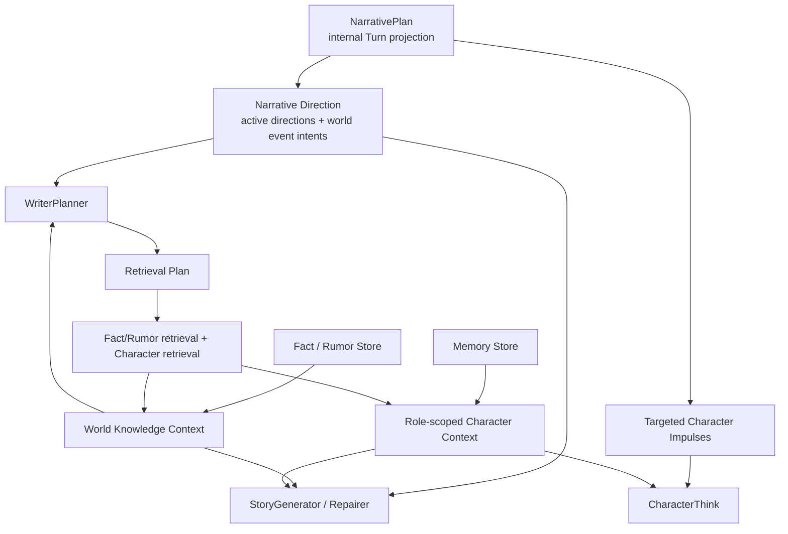

# Narrative、Knowledge 与 Retrieval Context 收敛 — Design

> **Date**: 2026-08-17
> **Author**: GPT-5
> **Status**: Draft
> **Prior docs**: [NarrativePlan Design 2.0](CSI-RC-FTI/2026-08-13-narrative-plan-design-gpt-v2.md) · [Context Preparation and Retrieval](2026-08-08-context-preparation-retrieval-design-gpt.md) · [Character Card 与 Story Role Profile](CSI-RC-FTI/2026-08-14-character-role-profile-design-gpt.md)

---

## Context

最新 trace `2026-08-17-10_36_58_564.json` 暴露出三个互相关联的问题。

第一，WriterPlanner 与 StoryGenerator 对同一个 `NarrativePlan` 使用了不同的模型可见结构。WriterPlanner 收到 `active_directions`、`character_impulses` 和 `world_event_intent_count`，StoryGenerator 收到 `active_goals` 和 `event_intents`。其中 `active_goals` 实际来自 `NarrativeDirection.dramatic_focus`，并不是 Writer Goal；WriterPlanner 只看到 World Event Intent 数量，无法据此规划；Character Impulse 又被同时泄露给 Planner，而 Narrative v2 的职责边界要求它只进入对应 CharacterThink。当前实现位于 `crates/aise/src/planning/writer_planner_prompt.rs:366-388` 和 `crates/aise/src/story/story_generator_prompt.rs:238-252,703-711`。

权威的后置文档已经解决了 Domain 所有权，却没有同步清理旧 Prompt 术语：[NarrativePlan Projection and Semantic Resolution Spec](../exec/CSI-RC-FTI/2026-08-13-narrative-plan-resolution-spec-gpt.md) 将 `NarrativePlan` 放在 `TurnExecutionContext.narrative_projection()`，并要求每个有效 `WorldEventIntent` 以完整语义交给 StoryGenerator，而不是只给数量或隐藏 key；旧 StoryGenerator Prompt Spec 仍保留 `WriterPlan.narrative_plan`、`active_goals` 和 `event_intents`，已经过时。

第二，Knowledge 的模型可见结构在复制内部存储模型。trace 中一个已经召回的 Fact 被渲染为 `entry_id + title + kind + scope + content`；其中 `title` 为空，`entry_id` 包含 Story UUID，只有 `content` 真正参与写作。Planner 的 Knowledge Index 又把同一长 ID 同时作为 `target_id` 和 `title`，而 `retrieval_hint` 只有笼统的 `objective fact entry`。结果模型只能根据长 ID 和无信息 hint 猜测是否召回，甚至为一句很短的 Fact 增加一次不必要检索。

第三，Memory 虽然始终以 `RoleId` 为 owner，仍与 Fact、Rumor 一起通过扁平 `ContextItem` 流动。`RetrievedContext` 允许 Global Writer 分区直接保存 Memory，CharacterThink 再根据 `audience + memory_owner` 二次验证。这个结构把“角色拥有的认知”当成“世界知识的一种显示标签”，容易造成跨角色泄露，也迫使每个 Prompt 重复输出 `kind`、`scope` 和 owner。

Knowledge ID 的长度进一步放大了这些问题。Seed ID 当前形如 `story-<uuid>:seed:fact:<key>`，运行时 ID 形如 `<turn-uuid>:fact:<ordinal>`。Fact、Rumor 和 Memory 的身份本来只需在一个 StoryInstance 内稳定；把 StoryId 或 TurnId 嵌进每次模型引用既不增加正确性，又消耗 token。另一方面，CharacterCard 的 `CharacterId` 确实是跨故事身份，Story/Turn/Trace ID 也承担持久化、幂等和诊断职责，不能因为 Prompt 太长而一并改成局部序号。

本设计在 Current Scene、Premise、Story Continuity 和空值清理之后，统一 Narrative 的阶段投影、World Knowledge 与 Character Cognition 的边界、检索索引格式和模型可见 ID。

### Constraints & assumptions

- [Current Scene Removal](../exec/2026-08-17-current-scene-removal-spec-gpt.md)、[Story Context Simplification](../exec/2026-08-17-story-context-simplification-spec-gpt.md) 和 [Runtime Context Empty Elision](../exec/2026-08-17-runtime-context-empty-elision-spec-gpt.md) 先实施；本设计使用它们的最终 RC 结构。
- WriterPlanner 输出仍只有 `story_goal`、`context_gaps` 和 `character_think_requests`；Narrative Direction 是输入，不重新加入 Planner 输出。
- 不新增 LLM 调用。角色记忆召回仍由 Retrieval Pipeline 完成，角色决定仍由 CharacterThink 完成。
- 已加载 Knowledge 的 Prompt 表示可以删除 ID；检索索引、更新和删除目标仍必须有稳定 ID。
- 内部 provenance、revision、source、rank、evidence 和权限信息继续保留，但不因调试方便进入模型可见 RC。
- StoryGenerator 是作者视角，但角色是否知道某项信息仍由角色分区决定；Writer 可见不自动等于 Character 可知。
- 采用一次性硬重构，不保留长 Knowledge ID、Prompt alias、扁平 Memory 分区或旧 Narrative 字段的双路径。

---

## Principles

1. **内部 Plan 不等于模型视图**：`NarrativePlan` 保存引擎执行所需的完整 Turn 投影，每个模型阶段只接收自己能消费的语义子集。
2. **两条 Narrative 干预通道**：World Event Intent 进入 WriterPlanner 与 StoryGenerator；Character Impulse 只进入目标 CharacterThink。
3. **加载后只给内容，加载前只给发现元数据**：Relevant Knowledge 只呈现正文；Index 只呈现一个稳定 target ID 和一个有意义的 retrieval hint。
4. **世界知识与角色认知分区**：Fact/Rumor 属于 World Knowledge；Memory 永远位于 owner Role 下，不能出现在全局 Knowledge 列表。
5. **一个对象只有一个模型可见 ID**：Index 不同时暴露 `target_id`、`entry_id`、`role_id` 和 title；target 直接使用 canonical Story-scoped ID。
6. **全局身份不为 Prompt 优化让路**：CharacterCard、Story、Turn 和 Trace 的内部全局 ID 保持不变，只禁止其泄露到无须引用它们的 RC。

---

## Options

### Option A: 只修改 Markdown renderer

- **Idea**：保留所有 Domain 和 Retrieval 类型，只在 Prompt 中隐藏 `entry_id/title/scope`，把现有列表按 kind 分组。
- **Pros**：改动集中在 renderer 和模板；不涉及 Persistence 或 ID 迁移。
- **Cons**：Memory 仍能进入 Global Writer 分区；Character target 仍被当成 Knowledge entity 检索；长 canonical ID 和冗余 `RetrievalTargetId` 继续存在。
- **Risk**：Prompt 表面变短，但权限、召回和身份的根本歧义没有消失。

### Option B: 保留长 canonical ID，增加 Turn-scoped 短 alias

- **Idea**：内部继续使用 UUID 派生 Knowledge ID，Prompt 临时映射为 `fact_0001`、`rumor_0002`。
- **Pros**：无需迁移数据库；模型看到的 ID 很短。
- **Cons**：同一对象同时拥有 canonical ID、retrieval target ID 和 prompt alias；trace、retry、repair 与跨阶段映射必须保存额外表。
- **Risk**：为了删除一个长 ID 又创建第四种身份，违背角色模型已经确定的“减少同义 ID”原则。

### Option C: 统一阶段投影、类型化分区与 Story-scoped canonical ID

- **Idea**：建立共享 Narrative Direction Prompt View；把 Retrieved Context 分为 World 与 Role；Relevant Knowledge 内容化；Index 元数据化；Knowledge canonical ID 改为短的 Story-scoped ID。
- **Pros**：模型看到的结构与语义边界一致；不需要 alias；Memory 权限由容器表达；Planner 精确 target 直接对应真实对象。
- **Cons**：需要更新 Prompt、Turn DTO、Retrieval、Knowledge Schema、Persistence 和测试。
- **Risk**：若迁移不完整，旧 ID 可能残留在 Knowledge 子表、Extractor target 或 fixture 中。

### Choice

**Adopt option C.**

**Rationale**：Option A 只能优化显示，Option B 用新的间接层掩盖旧问题。Option C 让模型视图、权限分区和 canonical identity 同时收敛：已加载内容不再携带发现元数据，未加载目标保留最小可执行引用，Memory 的 owner 由 Role 容器保证，Knowledge ID 不再复制 Story/Turn UUID。

---

## Design

### 1. Target structure



`NarrativePlan` 继续保存 `active_nodes`、`active_directions`、`world_event_intents`、`character_impulses` 和 `effect_dispositions`，但不直接序列化到任何 Prompt。共享 Prompt 投影只暴露 `active_directions` 和完整的 World Event Intent 语义；Character Impulse 按 `RoleId` 单独投影。

Retrieved Context 不再是 `writer: Vec<ContextItem> + roles: Map<RoleId, Vec<ContextItem>>` 的任意组合，而是两个具有不变量的分区：

```text
RetrievedContext
├── world
│   ├── facts
│   └── rumors
└── characters: RoleId -> CharacterContext
    ├── optional retrieved Role view
    ├── known rumors
    └── memories
```

World 分区不能保存 Memory；Character 分区不能保存 Fact；Memory owner 必须等于 Map key。StoryGenerator 可以读取这些 Role-scoped 内容作为作者上下文，但只能让相应角色因果性地使用它们。

### 2. Core types & responsibilities

| Type / Module | Responsibility | Out of scope |
|---|---|---|
| `NarrativePlan` | 保存完整、内部的 Turn Narrative 投影和 Effect disposition | 不直接决定 Prompt 字段或标题 |
| Shared Narrative Direction Prompt View | 为 WriterPlanner、StoryGenerator 和 Repairer生成同一份 Active Direction 与 World Event Intent 语义 | 不包含 active node、Effect ID、disposition、Character Impulse |
| Character Impulse Prompt View | 只为目标 Role 的 CharacterThink 提供 goal、emotion、urgency 和 reason | 不成为 Planner/Generator 的角色命令 |
| Relevant World Knowledge | 内部按 Fact/Rumor 保存已加载正文及 provenance | Prompt 不显示 ID、hint、rank、source 或 scope 标签 |
| Character Context | 以 `RoleId` 聚合可选 Role view、Known Rumor 和 Memory | 不允许其他 Role 的 Memory |
| Character Index | 发现尚未提供的 Role | 每项只显示 target ID 和 retrieval hint |
| Knowledge Index | 发现尚未提供的 Fact/Rumor | 不包含 Memory、正文、title、kind 行或第二个 ID |
| Knowledge Entry | 保存短 Story-scoped ID、正文、retrieval hint、来源、索引元数据和 revision | Retrieval hint 不作为正文或角色记忆 |
| StoryStateExtractor target view | 为 update/delete 提供短 ID 与当前正文 | 不应用 Relevant Knowledge 的“隐藏 ID”规则 |

### 3. Narrative projection

#### 3.1 Shared Narrative Direction

WriterPlanner、StoryGenerator 与 StoryRepairer 使用同一语义视图和同一 renderer：

```markdown
## Narrative Direction

### Active Directions

- "探查木屋，逐步弄清当前处境。"

### World Event Intents

- category: "arrival"
  participants: ["role:forest_keeper"]
  location: "lodge_entrance"
  description: "守林人抵达木屋外，但暂时不主动表明身份。"
```

规则：

- Active Direction 只呈现 `dramatic_focus`，不呈现 source node。
- World Event Intent 呈现 category、非空 participants、可选 location 和必填 description；不呈现 effect ID、source node 或 hidden event key。
- 两个子组独立省略；都为空时整个 Narrative Direction 省略。
- WriterPlanner 不再收到 `world_event_intent_count`，StoryGenerator 不再使用 `active_goals/event_intents` 这组旧名称。
- `story_goal` 仍是 WriterPlanner 输出的单个即时转场目标，并在 StoryGenerator 中单独呈现。

#### 3.2 Character Impulse

Character Impulse 只发送给匹配 `target_role_id` 的 CharacterThink。代码把每个有效 AI Role impulse 确定性合并进 `character_think_requests`：若 Planner 已请求该 Role，保留 Planner reason；否则根据 impulse goal/reason 生成一次请求。重复 impulse 仍只触发一次 CharacterThink，但目标角色收到全部有效 impulse。

WriterPlanner 和 StoryGenerator 都不显示 Character Impulse。StoryGenerator 只接收 CharacterThink 产生的 Character Decision，避免它绕过角色自主性直接执行 Director 的内在推动。

### 4. Loaded Knowledge representation

WriterPlanner、StoryGenerator 与 StoryRepairer 的已加载 World Knowledge 只按类型显示正文：

```markdown
## Relevant Knowledge

### Facts

- "木屋位于人迹罕至的密林深处。"
- "黄铜钥匙可以打开地窖的内门。"

### Rumors

- "村民传说月圆之夜会有人在灰林中呼唤迷路者的名字。"
```

每个 bullet 对应一个 bounded Knowledge entry，并保留原始文本边界。Prompt 不显示 `entry_id`、`title`、`kind`、`scope`、`source`、revision、rank 或 retrieval hint。Facts 与 Rumors 标题已经表达类型；Rumor 仍是 claim，不因进入 Writer RC 变成客观事实。

StoryGenerator 必须合并 Planner 前确定性加载的 World Knowledge 与 Planner 后召回的 World Knowledge；当前只读取 `ctx.retrieved().writer()` 会丢失 Baseline Relevant Knowledge，属于需要修复的断层。合并按 canonical ID 去重，保留确定性顺序，但 ID 不进入最终文本。

### 5. Character knowledge representation

Memory 不再出现在 `Relevant Knowledge`。在需要它的阶段，Memory 直接嵌入对应 Role：

```markdown
## Target Character

role_id: "forest_keeper"
name: "守林人"
personality: "寡言、警惕，但不会无故伤害迷路者。"

### Known Rumors

- "木屋的上一任主人把某件东西藏在壁炉附近。"

### Memories

- "三天前，他在林中见过旅人独自走向木屋。"
```

- CharacterThink 只读取目标 Role 的 Known Rumors 与 Memories，并删除独立的 `Relevant Character Knowledge / Memory` section。
- StoryGenerator/Repairer 把已召回的 Role-scoped Knowledge 合并进对应 Player/AI Character block；它是作者信息，但只授权该 Role 在故事中因果使用。
- Memory 永远不能移动到另一个 Role。owner 不再作为可空展示字段重复输出，容器本身表达 owner。
- Fact 不直接进入 Character Context；角色对事实的认知必须来自 Continuity、可观察故事、Memory、Known Rumor 或故事内获得信息的过程。

### 6. Retrieval indexes

Character Index 只保留 scope 和每个 target 的一个 ID/hint：

```markdown
## Character Index

scope: complete

### Retrievable Characters

- target_id: "forest_keeper"
  retrieval_hint: "木屋与周边树林的看守者，了解此地近期异常。"
```

Knowledge Index 按类型分组，排除已加载正文和全部 Memory：

```markdown
## Knowledge Index

scope: prefiltered

### Retrievable Facts

- target_id: "fact_0001"
  retrieval_hint: "木屋的位置与周边交通。"

### Retrievable Rumors

- target_id: "rumor_0002"
  retrieval_hint: "当地人关于夜间铃声的说法。"
```

`scope` 继续区分完整空集与预筛选结果。空子组省略；两个子组都为空时 Index 仍保留 scope。Index 不显示 `entry_id`、`role_id`、name、role label、title 或单独的 kind 行。`target_id` 直接等于 canonical `RoleId`、`FactId` 或 `RumorId`，不再包装为 `role:<id>` 或 `knowledge:<kind>:<id>`。

Knowledge `retrieval_hint` 是一等 metadata：WorldBook 作者为 seed Fact/Rumor 提供，StoryStateExtractor 为新建或更新的 Fact/Rumor 生成。它必须简短说明“召回后会得到哪类信息”，不能复制 Prompt 指令，也不能代替正文。Memory 不进入 Knowledge Index，因此没有 retrieval hint。

### 7. Retrieval flow

1. Baseline Builder 根据 Turn signals 确定性加载有界 Fact/Rumor 正文，并建立未提供的 Character/Knowledge Index。
2. WriterPlanner 优先使用已加载内容；确切命中 Index 时复制唯一 `target_id`，否则给出 bounded `query_text`。
3. Character target 产生独立 Character Retrieval Request，从 Snapshot 加载完整 Role view，并确保一次该 Role 的 bounded Rumor/Memory cognition request；它不再退化为一个无 owner 语义的通用 Knowledge entity 查询。
4. Fact/Rumor target 产生精确 Knowledge Request；Memory 没有 target index。
5. 每个 CharacterThink request 也自动确保该 Role 的 bounded Memory/Rumor cognition request，不要求 Planner 再输出一个仅用于记忆的重复 context gap；与 Character target 命中同一 Role 时按 Role 去重。
6. Retrieval Pipeline 将 Fact/Rumor 放入 World 或目标 Character 的 Known Rumors，将 Memory 放入 owner Role 的 Memories；任何错误分区都返回 typed error。
7. CharacterThink 读取自己分区；StoryGenerator 合并 World 与 Character 分区；StoryStateExtractor 只把可修改目标暴露为带 ID 的结构。

Character-scoped `context_gap` 仍要求同 Role 的 CharacterThink request，但反向不再要求：一个 Think request 本身已经触发基础的角色认知召回。这样 Planner 只在需要额外特定语义查询时创建 gap。

### 8. ID model

ID 按生命周期分层：

| ID | Scope | Final policy | Model visibility |
|---|---|---|---|
| `CharacterId` | 全局 CharacterCard | 保留 UUID | 不进入 Story Prompt |
| `StoryId` / `TurnId` / `TraceId` | Persistence、幂等、诊断 | 保持现有内部策略 | 不进入 RC |
| `RoleId` | StoryInstance | 保持短、稳定、可读 | 角色引用和 Character Index target |
| `FactId` | StoryInstance | `fact_<sequence>` | 仅 Index 与修改 target |
| `RumorId` | StoryInstance | `rumor_<sequence>` | 仅 Index 与修改 target |
| `MemoryId` | StoryInstance | `memory_<sequence>` | 仅 owner Role 下的修改 target |

三类 Knowledge 共用一个 StoryInstance 级单调递增序号，例如 `fact_0001`、`rumor_0002`、`memory_0003`。序号 `1..9999` 左侧补零为恰好四位，`10000` 起使用无前导零的自然十进制表示，保证每个数只有一个 canonical 字符串。创建 StoryInstance 时，Seed Fact、Rumor、Memory 按固定 kind 顺序与稳定 key 顺序分配初始序号；运行时只为最终通过验证的 Add 操作按稳定操作顺序继续分配。

`story_instances.knowledge_id_high_water` 持久化已分配的最大序号。Validation 从不可变 Snapshot 读取 high-water 并构造候选 ID；Commit 在既有 Story revision 乐观校验通过后，于同一事务写入新 Knowledge 与新 high-water。删除不回退 high-water，Update 保留原 ID，因此序号不会复用。相同 base Snapshot 与相同已验证 change set 会产生相同候选 ID；并发提交仍由现有 Story 级 Turn 串行化和 revision 校验拒绝冲突。

ID 不含 Story UUID、Turn UUID、revision、Role owner、正文片段、hash 或随机数。它无需临时 alias，并能在 retry/trace/persistence 中保持同一 canonical identity。`KnowledgeSource::CommittedTurn` 继续保存内部 TurnId 作为 provenance；它不参与 ID 字符串。

由于 Planner 的 exact target 只复制一个 `target_id`，StoryInstance 校验额外保留 `fact_<canonical-sequence>`、`rumor_<canonical-sequence>`、`memory_<canonical-sequence>` 这三种完整字符串给 Knowledge ID 使用。`RoleId` 的一般语法和生命周期不变，但不能完整匹配这三种形状；Prompt projector 仍保留跨 target domain collision 检查作为防御性不变量。

### 9. StoryStateExtractor exception

“已加载 Knowledge 不显示 ID”只适用于只读写作/规划内容。StoryStateExtractor 必须知道哪些现有对象可以 update/delete，因此使用专门 target view：

```markdown
## Pre-turn Roles

- role_id: "forest_keeper"
  name: "守林人"
  location: "lodge_entrance"
  memories:
  - id: "memory_0003"
    content: "三天前在林中见过旅人。"

## Modifiable Knowledge

### Facts

- id: "fact_0001"
  content: "木屋位于人迹罕至的密林深处。"

### Rumors

- id: "rumor_0002"
  content: "村民传说夜间铃声会引来迷路者。"
```

Memory ID 与正文只出现在 owner Role 下；Fact/Rumor target 按类型分组。这里仍不需要 title、scope、source 或 owner sentinel。新建 Knowledge 不由模型指定 ID，由 Validation 使用 Snapshot 中的 Story-local high-water 分配下一个序号。

### 10. Key decisions

- **Prompt 中继续叫 Narrative Plan 吗？** → 否 → `NarrativePlan` 是内部聚合，Writer-facing 共享 section 统一为 `Narrative Direction`。
- **WriterPlanner 是否看到 Character Impulse？** → 否 → 它属于 Director 的角色内在干预通道，代码确定性触发 CharacterThink。
- **WriterPlanner 是否只看 World Event 数量？** → 否 → Planner 与 Generator 都读取同一完整语义投影。
- **Relevant Knowledge 是否保留 ID 方便追踪？** → 否 → provenance 留在 typed context/trace；只读 Prompt 只需要内容。
- **Index 是否保留 title/name/kind？** → 否 → retrieval hint 承担发现语义，分组标题承担 kind，一个 canonical target ID 承担执行引用。
- **Memory 是否属于 World Knowledge？** → 否 → 它始终属于 owner Role；全局 Memory 是不变量错误。
- **所有 UUID 都改短吗？** → 否 → 只缩短 Story-scoped Role/Knowledge 引用；全局和基础设施 ID 保持内部稳定性。
- **用 canonical short ID 还是 Prompt alias？** → canonical short ID → 避免同一对象再出现一层同义身份。

---

## Impact

- **Code**：Narrative Prompt projection、WriterPlanner plan merge、Baseline/Context Retrieval、CharacterThink、StoryGenerator/Repairer、StoryStateExtractor、Knowledge Domain、Validation 和 Store adapter。
- **Config**：不增加配置项；Fact/Rumor retrieval hint 使用固定 Domain byte bound，避免持久化数据的合法性随部署配置漂移。
- **Prompts**：WriterPlanner/Generator/Repairer 统一 Narrative Direction；Relevant Knowledge 分组；Character Knowledge 嵌入 Role；Index 和 Extractor target 使用新格式。
- **Data**：WorldBook Fact/Rumor 增加 required retrieval hint；Knowledge ID 和 Persistence schema 破坏性变化。
- **External interface**：Turn HTTP/WS 不变；WorldBook asset version 升级；调试输出会看到新的短 Knowledge ID。

---

## Risks & mitigations

| Risk | Likelihood | Impact | Mitigation |
|---|---|---|---|
| StoryGenerator 因隐藏 ID 而无法区分冲突条目 | Low | Medium | Fact/Rumor 分组并逐条保留正文；内部仍按 ID 去重，语义冲突不合并 |
| Memory 被错误放进另一个 Role | Medium | High | Typed Character Context + owner/map-key invariant；Global Memory 直接失败 |
| retrieval hint 太笼统，Planner 继续误召回 | Medium | Medium | Seed 与动态 Fact/Rumor 都要求 bounded semantic hint；增加 hint 质量 fixtures |
| 短 ID 在同一 Story 内碰撞或删除后复用 | Low | High | 持久化 Story-local high-water；同事务递增；Validation 和 Persistence 同时校验唯一性 |
| Character Impulse 不再给 Planner 后丢失 | Low | High | 代码确定性合并 Think request；对 impulse-only Turn 建立端到端测试 |
| Baseline Knowledge 未进入 Generator | High | High | 明确合并 Baseline + Retrieved World Knowledge，并按 ID 去重测试 |
| 旧 UUID 派生 Knowledge ID 残留 | Medium | High | 单次硬迁移；旧构造器、SQL、fixtures、goldens 和文档一起删除 |
| StateExtractor 隐藏 ID 后无法 update/delete | Low | High | Modifiable target view 作为明确例外，保留短 ID 并按 Role/Kind 分组 |

---

## Roadmap

- **Phase 0**：一次性实现 Narrative projection、Knowledge/Memory 分区、Index、short ID、Persistence 和 Prompt hard refactor → spec `doc/exec/2026-08-17-narrative-knowledge-retrieval-spec-gpt.md`

---

## Appendix

### Supersession

本设计覆盖以下旧合同中的冲突部分：

- WriterPlanner Prompt Spec 中模型可见 `Narrative Plan`、扁平 Relevant Knowledge 和双 ID Index 表示。
- StoryGenerator Prompt Spec 中 `WriterPlan.narrative_plan`、`active_goals/event_intents` 和 metadata-rich Writer Knowledge 表示。
- Context Retrieval Design/Specs 中允许 Global Writer Memory 和扁平 `RetrievedContext` 的部分。
- Runtime Context Empty Elision Spec 中仍保留 `StoryGeneratorKnowledgePromptView.entry_id/kind/scope` 的部分。

未被本设计明确覆盖的 CSI、FTI、阶段职责、Output Schema、Budget、Narrative condition 和空值省略规则继续有效。
