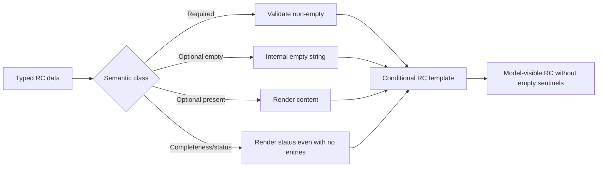

# Runtime Context Empty Elision — Design

> **Date**: 2026-08-17
> **Author**: GPT-5
> **Status**: Draft
> **Prior docs**: [Current Scene Removal](2026-08-17-current-scene-removal-design-gpt.md) · [Story Context Simplification](2026-08-17-story-context-simplification-design-gpt.md)

---

## Context

AISE 的五类 Runtime Context 目前使用字符串 `None.` 表示空集合或缺失值。最新 trace `2026-08-17-10_36_58_564.json` 中，WriterPlanner 同时收到空的 Story Summary、Scene Characters、Referenced Characters、Relevant Knowledge、Character Index entries 和 Active Story Constraints；StoryGenerator 收到空的 AI Characters、Constraints、event intents、Character Decisions，以及 Knowledge item 中的 `title: None.`；StoryStateExtractor 又收到空的 Relationships、Condition Queries、Previous Extraction、Validation Issues 和不适用于 Fact 的 `memory_owner: None.`。

这些值分散在各阶段 renderer 中，而不是单一模板问题。当前代码至少在 WriterPlanner、CharacterThink、StoryGenerator/Repairer 和 StoryStateExtractor 的 RC 投影路径中生成 `None.`（`crates/aise/src/planning/writer_planner_prompt.rs:210-415`、`crates/aise/src/character/character_think_prompt.rs:402-533`、`crates/aise/src/story/story_generator_prompt.rs:572-801`、`crates/aise/src/story/story_state_extractor_prompt.rs:365-528`）。固定 RC 模板无条件输出所有标题，因此一个空值同时占用标题和 sentinel 两层空间。

显式空值通常不提供模型无法自行判断的语义。缺少 `AI Characters` 章节已经表示没有可用 AI Character；`suggested_utterance` 不存在已经表示该角色没有台词建议。重复输出 `None.`、`[]`、`{}` 或仅用于表达空集合的 `0` 会增加 token 和视觉噪声，并让模型把注意力分配给无内容的类别。

但不能机械删除所有空值。`Character Index.scope = complete` 即使没有 entries 也告诉 Planner“确实没有其他候选”，与“索引被预算截断或预筛选”不同；数值 `0`、布尔 `false` 也可能是角色属性或关系状态的真实值。结构化 LLM 输出中的空数组则属于固定 JSON Schema 合同，不是 RC 展示噪声。

在 Current Scene、Premise 和 Story Continuity 格式清理后，现在适合建立一条覆盖全部 RC 的统一空值语义，避免各阶段继续自行发明 sentinel。

### Constraints & assumptions

- 本设计在 [Current Scene Removal Spec](../exec/2026-08-17-current-scene-removal-spec-gpt.md) 和 [Story Context Simplification Spec](../exec/2026-08-17-story-context-simplification-spec-gpt.md) 之后实施，并以它们定义的最终 RC 字段为基线。
- CSI、FTI 和所有结构化输出 JSON Schema 保持不变；本设计只改变模型输入 RC 的可见表示。
- `slots.yaml` 中 RC 变量继续为 required string；Projector 仍提供每个已声明 key，空的可选值在内部表示为 `""`。
- 缺失、预算截断、检索失败和真实空集合必须保持可区分；错误不能伪装成空内容。
- 本变更不修改 Domain、Persistence、HTTP API 或配置合同。

---

## Principles

1. **只呈现存在的语义**：可选内容为空时不输出字段、标题或 sentinel。
2. **显式保留歧义消除信息**：完整性、范围和截断状态即使对应集合为空也必须保留。
3. **必填为空即失败**：Required 数据不能通过省略掩盖上游不变量破坏。
4. **真实标量不等于空值**：`0`、`false` 和空集合计数必须按字段语义判断，不能做通用 truthy 过滤。
5. **输出合同独立**：RC 可省略空输入，但 Planner、CharacterThink、Generator 和 Extractor 的 JSON 输出仍遵守固定 Schema。
6. **统一且可测试**：五个阶段使用同一语义规则，旧的 `None.` 路径一次性删除。

---

## Options

### Option A: 保留显式 `None.`

- **Idea**：固定输出每个章节和字段，用 `None.`、`[]` 或 `{}` 表示空值。
- **Pros**：模板结构稳定；无需修改 renderer 和测试。
- **Cons**：无内容区块持续占用注意力和 token；不同 renderer 已产生不一致的空表示。
- **Risk**：随着 RC 扩展，空章节数量线性增长。

### Option B: 只省略空的顶层章节

- **Idea**：模板按变量是否为空隐藏标题，但对象内部继续输出 `title: None.`、空 goals、空 attributes 和空 optional fields。
- **Pros**：能移除 trace 中最显眼的空章节；实现相对小。
- **Cons**：同一问题仍存在于每个非空对象内部；`None.` 合同继续存活。
- **Risk**：开发者无法确定何时应在 Projector、renderer 或模板处理空值。

### Option C: 建立端到端 RC Empty Elision 合同

- **Idea**：Projector 用空字符串表示空的可选 section；模板条件渲染 section；item renderer 省略空的可选 field；必填值和完整性状态使用独立规则。
- **Pros**：模型只看到真实内容；五类 RC 语义一致；空值、失败和截断保持可区分。
- **Cons**：需要逐个更新模板、renderer、Prompt contract tests 和 section-order tests。
- **Risk**：错误的通用 truthy 过滤可能删掉有意义的 `0` 或 `false`。

### Choice

**Adopt option C.**

**Rationale**：Option B 只清理标题，无法消除对象字段中的 sentinel。Option C 将空值处理放在正确的三层：Projector 决定数据是否存在，item renderer 决定字段是否适用，模板决定章节是否可见。同时为完整性状态、Required 数据和真实标量建立明确例外，避免“所有 falsy 值都删除”的错误实现。

---

## Design

### 1. Target structure

Empty Elision 只发生在模型可见表示层。Typed Context 继续保存真实集合、Option 和标量；Runtime Prompt Vars 继续包含模板声明的 key；模板只把非空 section 写入最终 RC。

### 2. Core types & responsibilities

| Type / Module | Responsibility | Out of scope |
|---|---|---|
| Prompt Context structs | 保存阶段所需的 typed data，包括空集合和 `Option` | 不决定 Markdown 标题是否出现 |
| Stage Projector | 验证 Required 数据和阶段不变量；将可选空 section 投影为空字符串 | 不用 `None.` 代替错误或截断 |
| Item renderer | 输出非空、适用的对象字段；保留真实标量 | 不输出空字段 sentinel |
| RC `.md.j2` template | 根据字符串是否非空决定是否渲染整个 section | 不检查 `None.` 字符串或推断业务语义 |
| Index renderer | 始终输出 `scope`，仅在有 entries 时输出 entries | 不把 empty 与 incomplete 混为一谈 |
| FTI / JSON Schema | 定义模型结构化输出，包括必需的空数组或 nullable 字段 | 不采用 RC Empty Elision 规则 |

### 3. Semantic classes

#### Required sections

Required sections 始终渲染；上游已保证非空，或 Projector 在不变量破坏时返回 typed error。典型内容包括 Story Profile、Player Character、Player Input、Immediate Story Goal、Target Character、Current Character State、Story Text、Pre-turn Roles、Previous Story Text 和 Repair Validation Issues。

#### Optional sections

Optional section 的集合为空、Option 为 `None` 或文本 trim 后为空时，Projector 仍提供变量 key，但 value 为 `""`；模板同时省略标题和 body。典型内容包括 Relevant Characters、Knowledge、Constraints、Narrative Guidance、AI Characters、Character Decisions、Relationships、Condition Queries 和 retry-only context。

#### Completeness sections

Character Index 与 Knowledge Entry Index 即使没有 entries 也保留 `scope`。空 entries 不输出 `entries:`。检索或索引失败不能返回空 section，必须沿现有 typed error 路径终止 Turn。

#### Optional object fields

对象存在但某字段不适用或为空时，只省略该字段。例如 Suggested Utterance、Impulse emotion/reason、Validation Location、role goals/attributes、Knowledge title 和非 Memory Knowledge 的 memory owner。父对象的身份、类型和正文等 Required 字段继续输出。

#### Scalar values

角色属性、关系 trust、优先级和任何业务布尔值中的 `0` 或 `false` 必须保留。只有“非空集合的数量”这类派生字段可以在数量为零时省略，例如 `world_event_intent_count`；正数继续输出。

### 4. Key flows

#### Project and render

1. Projector 从已验证 Snapshot/Turn Context 构造 typed Prompt Context。
2. Required 数据为空时返回现有或新增的 typed invariant error。
3. Section renderer 对真实空集合返回 `""`；对非空集合按现有确定顺序输出。
4. Item renderer 只追加存在且非空的 optional field，不为其生成 placeholder。
5. RC template 使用 MiniJinja 条件包裹 Optional section 的标题和变量。
6. Prompt budget 对最终字符串计数；省略内容不占 token。

#### Validation and repair

1. StoryRepairer 只在 Repair 决策且 Validation Issues 非空时运行，因此 Previous Story Text 与 Validation Issues 始终渲染。
2. Validation Issue 没有 Location 时只输出 Code 与 Message，不输出 `Location: None.`。
3. StoryStateExtractor 首次提取省略 Previous Extraction 与 Validation Issues；Re-extraction 只在对应数据存在时呈现。
4. Memory Knowledge 缺少 owner 是不变量错误；Fact/Rumor 没有 owner 是正常情况并省略该字段。

### 5. Key decisions

- **空 section 的内部表示** → `Value::String("")` → 保持 required slot key 和 strict var validation，不向模板引入 nullable 类型。
- **模板是否比较字符串 `None.`** → 不比较 → 彻底删除 sentinel，模板只检查空字符串。
- **索引为空是否省略整节** → 不省略 → `scope` 能区分完整空集与预筛选结果。
- **Required 内容为空如何处理** → typed error → 不能让模型在缺少关键上下文时继续。
- **是否过滤所有 falsy value** → 不过滤 → `0` 与 `false` 可能是权威状态。
- **结构化输出是否也省略空数组** → 不省略 → 输出由 JSON Schema 决定，必须保持 deterministic contract。
- **是否引入通用 Prompt DSL** → 不引入 → 使用现有 Stage renderer 和 MiniJinja，减少新的抽象与依赖。

---

## Impact

- **Code**：WriterPlanner、CharacterThink、StoryGenerator、StoryRepairer、StoryStateExtractor Prompt projector/renderer 与专用测试。
- **Config**：无变化；Prompt budget 会因空内容减少而自然下降。
- **Prompts**：五个 RC `.md.j2` 按 section presence 条件渲染；`slots.yaml` 的 required string vars 保持不变。
- **Data**：无数据库、Story Pack、Snapshot 或输出 Schema 迁移。
- **External interface**：无 HTTP/WS 变化；仅 LLM 输入 RC 更紧凑。

---

## Risks & mitigations

| Risk | Likelihood | Impact | Mitigation |
|---|---|---|---|
| 误删真实 `0` 或 `false` | Medium | High | 只按 Option/collection/text emptiness 省略；增加标量保留测试 |
| 空索引被误认为未提供 | Medium | High | Index section 始终输出 scope；empty entries 只省略 entries 字段 |
| 必填数据被静默隐藏 | Low | High | Required section 不加条件；Projector 对空值返回 typed error |
| 五个模板条件行为漂移 | Medium | Medium | 建立跨 Profile contract test，覆盖 populated/empty 两组 RC |
| Prompt section-order 旧测试失效 | High | Low | 对完整 fixture 验证顺序，对空 fixture 验证 section absence |
| Story 文本本身包含 `None.` | Low | Low | 测试 renderer 生成的结构行，不禁止用户正文中的自然文本 |

---

## Roadmap

- **Phase 0**: 在两个前置 Context 清理 spec 之后，一次性更新五类 RC renderer、模板和测试 → spec `doc/exec/2026-08-17-runtime-context-empty-elision-spec-gpt.md`

---

## Appendix

### Supersession

本设计统一取代 Prior Prompt specs 中“空集合渲染为 `None.`”的展示规则，但不改变它们的阶段职责、数据可见性、预算、检索、输出 Schema 或安全边界。
