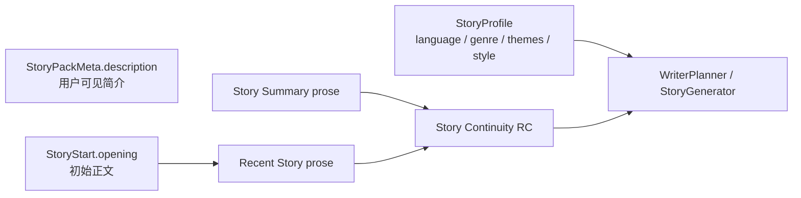

# Story Context Simplification — Design

> **Date**: 2026-08-17
> **Author**: GPT-5
> **Status**: Draft
> **Prior doc**: [Current Scene Removal](2026-08-17-current-scene-removal-design-gpt.md)

---

## Context

在 Current Scene 删除后，`Story Summary + Recent Story` 将成为模型理解叙事连续性的唯一正文来源。但当前 Runtime Context 仍把连续正文投影成存储结构：WriterPlanner 和 StoryGenerator 将 Recent Story 渲染为 `sequence + text` 列表，CharacterThink 将它渲染为 `text` 列表；Story Summary 则作为 JSON 字符串输出，而不是直接呈现正文（`crates/aise/src/planning/writer_planner_prompt.rs:72-75,210-225`、`crates/aise/src/story/story_generator_prompt.rs:467-472,584-592`、`crates/aise/src/character/character_think_prompt.rs:347-352,425-433`）。

`sequence`、`StorySegment.text` 和 `StorySummary.summarized_through` 对内部连续性校验、排序、压缩边界和持久化有用，但模型只需要按时间顺序排列的故事内容。把这些字段名、列表符号和 JSON 引号暴露给模型，不会增加语义，反而把故事正文表现成记录对象，并浪费注意力和 token。

Story Pack 的 `StoryProfile.premise` 也存在相同问题。当前 `premise` 同时进入 StoryPack 资产、Baseline、WriterPlanner、StoryGenerator、Story API 和前端（`crates/aise/src/domain/asset/story_pack.rs:51-59`、`crates/aise-server/src/api/story.rs:46-56`）。示例故事中的“在木屋醒来，门外有脚步声”已经由 `StoryStart.opening` 完整表达；当玩家打开门或离开木屋后，静态 Premise 不再准确，却仍会在每 Turn 重复注入。

现在应在 Current Scene 删除之后继续收紧上下文职责：Story Profile 只保存写作要求，Story Start 提供初始正文，Story Continuity 提供已发生故事，Narrative 与 Constraints 提供未来方向或硬性要求。

### Constraints & assumptions

- 本设计在 [Current Scene Removal Spec](../exec/2026-08-17-current-scene-removal-spec-gpt.md) 之后实施；不重新定义该 spec 的场景、角色相关性或持久化变更。
- Story Summary 与 Recent Story 仍是两个独立章节；Summary 是压缩后的较早历史，Recent Story 是高保真的最新正文。
- `StorySegment.sequence`、`StorySegment.origin`、`StorySummary.summarized_through` 和连续性校验继续保留在 Domain 与 Persistence 中。
- `StoryStart.opening`、`StoryStart.description` 和 `StoryPackMeta.description` 保留；本设计不删除静态 Story Start。
- 资产合同采用硬切换，不保留 Story Pack v4 解析、别名、默认 Premise 或运行时兼容逻辑。

---

## Principles

1. **模型只接收语义**：排序编号、字段名和序列化包装由确定性代码处理，不进入 Runtime Context。
2. **连续正文优先**：Summary 和 Recent Story 直接以自然语言正文呈现，不转换成 YAML、JSON 或对象列表。
3. **职责唯一**：Story Profile 描述语言与文风；开篇归 Story Start；历史归 Story Continuity；方向与约束归 Narrative/Constraints。
4. **内部不丢信息**：Prompt 简化不能删除排序、压缩边界、来源或持久化所需的 Domain 元数据。
5. **一次性硬切换**：Premise 从资产、运行时、API、UI、测试和示例同时删除；不保留双合同。

---

## Options

### Option A: 保留现状

- **Idea**：继续向模型输出 `sequence/text` 结构，并在每 Turn 注入 `premise`。
- **Pros**：不修改资产版本、API 或 Prompt 测试。
- **Cons**：模型持续看到可由代码确定的存储元数据；Premise 与开篇、Summary 和 Recent Story 重复并可能过期。
- **Risk**：Current Scene 删除后仍保留另一个静态的当前情境暗示，削弱单一叙事事实源。

### Option B: 只隐藏 Prompt 字段

- **Idea**：Prompt 不再输出 Premise、`sequence` 和 `text` 标签，但 `StoryProfile.premise` 继续存在于 Story Pack、Snapshot、API 与 UI。
- **Pros**：Prompt 更简洁；不需要资产版本迁移。
- **Cons**：Premise 仍是一个无独立职责的公共合同；未来代码可能重新使用它，API 与创作工具仍需解释它和 Opening 的区别。
- **Risk**：形成“数据存在但不应消费”的隐式禁令，长期容易回退。

### Option C: 删除 Premise，并将 Story Continuity 统一为纯正文投影

- **Idea**：发布 Story Pack v5，端到端删除 `StoryProfile.premise`；Summary 原样输出，Recent Story 按内部顺序取出正文并以空行连接，内部元数据保持不变。
- **Pros**：Story Profile 职责清晰；Prompt 只包含叙事语义；资产、API 与运行时合同一致；不会重新引入过期 Premise。
- **Cons**：Story Pack 合同和 Story API 发生破坏性变更；已有 v4 Pack 必须重新制作并导入。
- **Risk**：若直接修改已存 Pack JSON，会破坏不可变资产 Digest 与内容的一致性。

### Choice

**Adopt option C.**

**Rationale**：Option B 只解决当前 Prompt 表象，却留下无责任的数据合同。Option C 同时确立 Story Profile、Story Start 和 Story Continuity 的边界。已有 Pack 不在数据库中原地改写；升级迁移遇到旧 Pack 时明确失败，由作者按 v5 合同重新导入，从而保持 Digest 的内容寻址语义。

---

## Design

### 1. Target structure



`premise` 不存在于目标结构。Story Continuity 的 Prompt 投影只包含两个可选自然语言区块：

```text
### Story Summary

较早历史的自然语言摘要。

### Recent Story

第一段最新正文。

第二段最新正文。
```

### 2. Core types & responsibilities

| Type / Module | Responsibility | Out of scope |
|---|---|---|
| `StoryProfile` | 保存 `language`、`genre`、`themes` 和 `style` 写作要求 | 不保存开篇、当前情境或剧情方向 |
| `StoryStart` | 保存不可变初始场景元数据与 Opening；Opening 成为首个 Story Segment | 不在每 Turn 重复注入独立 Premise |
| `StorySummary` | 保存较早历史摘要和内部 `summarized_through` 边界 | 不向 Prompt 暴露边界字段 |
| `StorySegment` | 保存内部顺序、来源和原始正文 | 不向 Prompt 暴露 `sequence`、`origin`、`text` 标签 |
| Prompt projectors | 将 Summary 原文与按序 Segment 正文投影为纯文本 | 不重新总结、重排或解析故事 |
| `NativeAssetImporter` | 只接受 Story Pack v5，并拒绝已删除的 Premise | 不兼容或自动升级 v4 Pack |

### 3. Key flows

#### Story Pack import

1. Importer 只接受 `spec = aise_story_v5` 与 `spec_version = 5.0`。
2. `StoryProfile` 反序列化时只接受语言、类型、主题和风格字段。
3. 包含 `/story/premise` 的 Pack 以明确 Schema 错误拒绝。
4. 通过验证的 v5 manifest 生成新的 Digest 并按现有不可变资产流程保存。
5. 数据库升级不改写 v4 Pack 或 Digest；存在旧 Pack/Instance 时迁移失败并要求清理后重新导入。

#### Prompt projection

1. Baseline 继续验证 Summary 与 Recent Segments 连续、无重叠、无缺口且顺序正确。
2. Summary 非空时，projector 将 `StorySummary.text` 原样赋给 `story_summary`；空 Summary 使用空字符串。
3. Recent Story 按 Domain 已验证顺序提取每个 `StorySegment.text`，使用两个换行连接；不排序、不编号、不加标签、不加引号。
4. RC 模板只在对应字符串非空时渲染 Summary 或 Recent Story 子章节；两者都为空时省略 Story Continuity 整节。
5. WriterPlanner、CharacterThink、StoryGenerator 与 StoryRepairer 使用完全相同的文本合同。

#### External views

1. Story API 不再返回 `premise`。
2. Story Pack 详情 UI 删除“前提”行，继续显示 `meta.description`、写作配置、初始场景和 Opening。
3. 不添加由 Opening、Summary 或 Recent Story计算出的兼容 Premise。

### 4. Key decisions

- **是否把 Summary 与 Recent Story 合并为一个字段** → 不合并 → 两者精度和时间范围不同，保留章节边界才能明确由较新的 Recent Story 覆盖旧 Summary。
- **是否删除内部 Sequence** → 不删除 → 它负责顺序、连续性、摘要边界和分页，但没有模型语义。
- **多段 Recent Story 如何连接** → 保留每段原文并用一个空行分隔 → 模型按上下顺序理解，无需 Turn 编号。
- **空连续性如何表示** → 省略空章节 → 不输出 `None.`、空标签或虚构文本。
- **Premise 的既有用途如何分流** → UI 简介使用 `meta.description`；开篇使用 `start.opening`；客观事实使用 Knowledge；硬要求使用 Constraints；未来方向使用 Narrative。
- **是否原地迁移 v4 Pack** → 不迁移 → 修改 canonical 内容但保留旧 Digest 会破坏不可变资产身份。

---

## Impact

- **Code**：`domain/asset`、`domain/turn`、`planning`、`character`、`story`、`persistence` 和相关测试。
- **Config**：保留 `content.max_story_profile_bytes`，但其计算不再包含 Premise；不新增配置。
- **Prompts**：四个 RC 模板条件渲染 Story Continuity；三个 projector 删除 JSON/YAML 风格包装；StoryRepairer 复用相同投影。
- **Data**：Story Pack 从 v4 硬切到 v5；新增顺序迁移守卫，禁止带旧 Pack/Instance 的数据库进入中间状态。
- **External interface**：Story API 删除 `premise`；内置前端删除 Premise 展示；示例与测试 Pack 改为 v5。

---

## Risks & mitigations

| Risk | Likelihood | Impact | Mitigation |
|---|---|---|---|
| v4 Pack 无法继续导入 | High | Medium | 明确发布 v5 合同并更新所有仓库示例/fixture；不提供隐藏兼容 |
| 已有数据库包含不可迁移 Pack | Medium | High | 迁移守卫在启动时明确失败；不自动删除或伪造新 Digest |
| 四个 RC 的格式发生漂移 | Medium | Medium | 对每个 Prompt Profile 做相同的精确渲染测试和跨 Profile 合同测试 |
| 原始正文包含类似指令的文字 | Low | High | 正文仍只进入 RC；CSI 的 Runtime Data Boundary 与 CSI/FTI 隔离保持不变 |
| 删除 Premise 后作者无处表达长期要求 | Low | Medium | 文档明确使用 Knowledge、Constraints 或 Narrative，而不是恢复 Premise |

---

## Roadmap

- **Phase 0**: 在 Current Scene Removal 之后一次性完成 Story Pack v5、Premise 硬删除、纯正文 Story Continuity、API/UI 与测试更新 → spec `doc/exec/2026-08-17-story-context-simplification-spec-gpt.md`

---

## Appendix

### Supersession

本设计只取代 Prior docs 中关于 `StoryProfile.premise` 和 Story Continuity 模型可见格式的内容。内部连续性、Story Start、Narrative、Constraints、Knowledge 和 Current Scene Removal 的其他决定保持不变。
