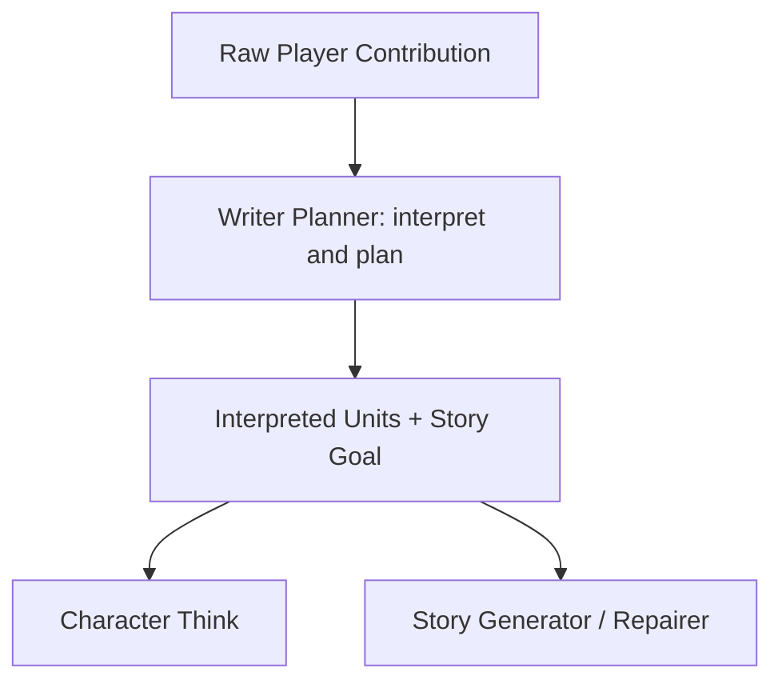

# Player Contribution Interpretation — Design

> **Date**: 2026-08-19
> **Author**: GPT-5.6 Sol
> **Status**: Accepted
> **Prior doc**: [Player Contribution Realization — Design](CSI-RC-FTI/2026-08-19-player-contribution-realization-design-gpt.md)

---

## Context

The current implementation carries one raw `player_contribution` string through Writer Planner, Character Think, Story Generator, and Story Repairer. Writer Planner returns only `story_goal`, retrieval gaps, and Character Think requests (`crates/aise/src/planning/planner_output.rs:6-15`). Story Generator therefore receives both the raw contribution and a free-form goal that has already interpreted it (`crates/aise/src/story/story_generator_prompt.rs:25-36`).

Trace `2026-08-19-14_15_01_697.json` demonstrates the resulting double interpretation. The player submits `我有点害怕`. Writer Planner rewrites it as the Player Character saying “我有点害怕” inside `story_goal`, and Story Generator then realizes that incorrect public utterance. The classification error originates in planning and becomes stronger when the free-form goal is passed downstream.

The current prompt contract makes this coupling explicit: Writer Planner must include both contribution realization and subsequent progress in `story_goal` (`crates/aise/assets/prompts/context-v2/fti/writer-planner.md.j2:8`), while Story Generator independently classifies the raw text again (`crates/aise/assets/prompts/context-v2/csi/story-generator.md.j2:16-18`). The same prompt also forbids adding Player Character speech or action when the contribution contains only private thought (`crates/aise/assets/prompts/context-v2/csi/story-generator.md.j2:17`), which is stricter than the desired co-authoring behavior.

The system now needs one contextual semantic interpretation before downstream generation. Established dialogue understanding systems represent a turn as structured semantic units rather than leaving every downstream stage to reinterpret the same text. Multi-intent NLU decomposes one utterance into multiple labeled spans, and role-playing research separates natural-language player intent from subsequent narration. The required architecture can adopt that pattern without adding a new LLM call: Writer Planner is already the first contextual LLM stage and can jointly produce the interpretation and the plan.

### Constraints & assumptions

- The player continues to submit one bounded, free-form `player_contribution` string.
- Interpretation is probabilistic. The implementation aims for high accuracy but does not claim perfect classification.
- Writer Planner performs contextual semantic interpretation in its existing LLM call; no new pipeline or LLM request is added.
- A contribution may contain any ordered combination of speech, action, private state, and requested outcome.
- Story Generator receives only the structured interpretation, not the raw contribution text.
- Structured units determine how supplied material enters the story; they do not prohibit Story Generator from inventing additional Player Character behavior when it improves the story.
- `story_goal` returns to one responsibility: directing the immediate story transition.
- This change adds structural contract validation only. It does not add a semantic classifier validator, cross-field validator, retry policy, or Validation Pipeline rule.
- The raw contribution remains Turn-owned and persisted as existing audit/history metadata; deleting it from downstream prompts does not delete it from the Turn contract or database.

---

## Principles

1. **One contextual interpretation**: Writer Planner classifies the contribution once; downstream LLM stages consume that result instead of reclassifying raw text.
2. **Ordered multi-unit semantics**: Mixed input is decomposed into ordered units so `说`, `做`, `想`, and external outcome requests can coexist in one turn.
3. **Supplied modality, open-ended authorship**: `unit.kind` fixes the modality of that unit's content, but Story Generator may add plausible Player Character speech, action, or private state for narrative quality.
4. **Direction is not interpretation**: `story_goal` accounts for the current turn but never quotes, paraphrases, or classifies the player contribution.
5. **Typed downstream context**: Character Think, Story Generator, and Story Repairer receive the structured interpretation; only Writer Planner receives raw text.
6. **Bounded single-path refactor**: the Writer Planner contract moves from v1 to v2 in one change, with no compatibility output shape or dual prompt path.

---

## Options

### Option A: Strengthen raw-text prompts only

- **Idea**: Keep `writer_planner_output.v1` and add more instructions and examples to Writer Planner and Story Generator.
- **Pros**:
  - No Rust/domain contract change.
  - Smallest implementation diff.
- **Cons**:
  - Writer Planner and every downstream model still classify the same text independently.
  - A free-form `story_goal` can continue to override the intended modality.
  - Classification cannot be inspected or consumed consistently by Character Think and Story Repairer.
- **Risk**: Model-specific prompt tuning improves individual examples but leaves the error-amplification path intact.

### Option B: Add a dedicated Player Contribution Interpreter pipeline

- **Idea**: Insert a new LLM pipeline between Baseline Context Builder and Writer Planner.
- **Pros**:
  - Cleanest runtime responsibility boundary.
  - Interpretation can use a specialized model or independent evaluation later.
- **Cons**:
  - Adds one LLM call, latency, failure mode, and configuration surface per Turn.
  - Duplicates context projection already required by Writer Planner.
- **Risk**: The additional stage makes the front half of the Turn slower before evidence shows that a separate call materially improves accuracy.

### Option C: Add a typed interpretation to Writer Planner output

- **Idea**: Upgrade Writer Planner output to include an ordered `interpreted_player_contribution.units` array alongside a direction-only `story_goal`.
- **Pros**:
  - Establishes a single typed semantic result with no additional LLM call.
  - Uses full story and character context when resolving ambiguous language.
  - Allows all downstream prompts to consume the same classification.
  - Prevents `story_goal` from becoming an accidental modality channel.
- **Cons**:
  - Makes Writer Planner output larger and semantically more important.
  - An incorrect classification propagates downstream because raw text is intentionally removed from their prompts.
- **Risk**: Planner classification errors remain possible; contrastive prompt examples, explicit labels, structured output, and later empirical evaluation are required.

### Choice

**Adopt option C.**

**Rationale**: It provides the semantic-parser architecture needed for high recognition accuracy while preserving the current number of LLM calls. The structured interpretation is logically independent even though the first implementation produces it inside Writer Planner. A dedicated interpreter remains a future optimization only if measured accuracy justifies its latency and complexity.

---

## Design

### 1. Target structure

Only Writer Planner sees `Raw Player Contribution`. `Interpreted Units` becomes the downstream semantic authority for supplied player material. `Story Goal` is an independent directional field and has no authority to change a unit's kind.

### 2. Core types & responsibilities

| Type / Module | Responsibility | Out of scope |
|---|---|---|
| `PlayerContributionKind` | Closed semantic label: `speech`, `action`, `private_state`, or `requested_outcome` | Confidence scoring or provider-specific labels |
| `PlayerContributionUnit` | One ordered semantic unit with a non-empty normalized `content` value | Retaining a source span or raw input copy |
| `InterpretedPlayerContribution` | Own the non-empty, bounded ordered unit collection | Persisting a replacement for raw Turn metadata |
| `WriterPlannerOutputDto` | Return interpretation, direction, retrieval gaps, and think requests in contract v2 | Story prose |
| `WriterPlan` | Carry the validated interpretation and direction through the Turn | Reclassifying contribution text |
| `WriterPlannerPromptContextProjector` | Supply raw contribution once, clearly delimited as data | Supplying raw contribution to downstream stages |
| `CharacterThinkPromptContext` | Consume typed units while respecting Target Character knowledge boundaries | Treating private state or requested outcome as observed knowledge |
| `StoryGeneratorPromptContext` | Consume typed units as the only contribution representation | Reading or reconstructing the raw contribution |
| `StoryRepairerPromptContext` | Reuse the same typed generation context | Reinterpreting raw contribution during repair |

### 3. Semantic unit contract

| `kind` | Planner interpretation | Required treatment of supplied `content` |
|---|---|---|
| `speech` | Content the player intends the Player Character to say aloud | Realize it as Player Character speech; wording and staging may be adapted |
| `action` | Voluntary Player Character behavior or an attempted action | Realize the behavior or attempt; success and consequences remain causal |
| `private_state` | Thought, emotion, sensation, belief, suspicion, intention, or hope internal to the Player Character | Realize it as private experience; it is not automatically public or factual |
| `requested_outcome` | A request that the world or another character produce an outcome | Treat it as non-authoritative direction; accept, adapt, defer, complicate, or reject it through story causality |

Classification uses the complete Runtime Context and linguistic evidence together. It is not a keyword or punctuation classifier. Quotes and speech verbs are useful evidence but are not mandatory; emotional or cognitive semantics can establish `private_state` without `心想`. Conversely, Runtime Context delimiters surrounding raw input are never evidence of Player Character speech.

Required contrastive cases:

| Raw contribution | Ordered interpretation |
|---|---|
| `我有点害怕` | `private_state("玩家角色感到些许害怕")` |
| `我说：“我有点害怕。”` | `speech("我有点害怕")` |
| `我后退一步，问“你是谁”，心想他可能认识我` | `action("后退一步")`, `speech("你是谁")`, `private_state("对方可能认识玩家角色")` |
| `让门外的人立刻投降` | `requested_outcome("门外的人立刻投降")` |

### 4. Key flows

#### 4.1 Writer planning

1. Writer Planner receives raw `Pending Player Contribution` in a literal data block, not as a quoted prose value.
2. It uses Story Continuity, Player Character, scene context, linguistic cues, and contribution semantics to split the raw input into ordered units.
3. Every material component is represented exactly once by the best matching `kind`; mixed clauses produce multiple units.
4. It normalizes each unit into concise semantic `content` while preserving essential meaning.
5. It independently produces `story_goal` as the desired immediate narrative direction without quoting, paraphrasing, or classifying the contribution.
6. Existing retrieval-gap and Character Think planning continues in the same output.

#### 4.2 Downstream projection

1. `RetrievalPlanBuilder` converts the DTO interpretation into domain types and stores it on `WriterPlan`.
2. Character Think reads typed units instead of raw contribution. It may react only to content the Target Character could perceive; `private_state` and `requested_outcome` never become Target Character knowledge by themselves.
3. Story Generator receives `Interpreted Player Contribution`, `Immediate Story Goal`, and the rest of its existing context. It has no raw contribution slot.
4. Story Repairer inherits the same interpretation from the generation context and does not receive raw contribution.

#### 4.3 Story realization and creative expansion

1. Story Generator realizes each supplied unit according to `unit.kind`.
2. The kind controls only how that supplied content enters the prose; it does not define an allowlist for the complete segment.
3. Story Generator may add plausible Player Character speech, actions, reactions, or private states when they follow from context and improve narrative quality, including when the supplied input contains only `private_state`.
4. Added behavior must remain consistent with committed continuity, character identity, the interpreted units' essential meaning, hard constraints, and story causality.
5. `story_goal` guides progress after and around unit realization but cannot override or reclassify a unit.
6. Requested outcomes remain non-authoritative: Generator may choose the narratively strongest causal handling rather than guaranteeing or ignoring them mechanically.

### 5. Key decisions

- **Interpretation stage**: independent pipeline or Writer Planner field → Writer Planner field now → no extra latency, clean type boundary retained.
- **Classification form**: one whole-turn label or ordered units → ordered units → mixed contributions are first-class.
- **Raw downstream text**: keep as fallback or remove → remove from downstream prompts → prevents conflicting reclassification.
- **Raw persistence**: delete globally or retain as metadata → retain → audit, replay, history, and request identity remain unchanged.
- **Story Goal**: combined realization instruction or direction only → direction only → restores one responsibility.
- **Creative autonomy**: units as exhaustive behavior allowlist or supplied-content modality → supplied-content modality → preserves co-authoring freedom and story quality.
- **Ambiguity handling**: confidence/fallback flow or best single interpretation → best single interpretation → no clarification or validator is added in this phase.

---

## Impact

- **Code**: `domain/turn/planning.rs`, Writer Planner output/building, Character Think projection, Story Generator projection, Story Repairer inherited context, config limits, and their unit/integration tests.
- **Config**: Writer Planner output contract becomes `writer_planner_output.v2`; prompt slots for Character Think, Story Generator, and Story Repairer replace raw `player_contribution` with `interpreted_player_contribution`.
- **Prompts**: Writer Planner gains context-aware multi-unit semantic parsing and contrastive examples; downstream CSI/RC/FTI assets consume typed units; Story Generator's thought-only prohibition is removed; `story_goal` becomes direction-only.
- **Data**: no database migration and no persisted schema change; raw `StoryTurn.player_contribution` remains unchanged.
- **External interface**: no HTTP, history JSON, trace, or web-client contract change.

---

## Risks & mitigations

| Risk | Likelihood | Impact | Mitigation |
|---|---|---|---|
| Writer Planner assigns the wrong kind | Medium | High | Context-aware instructions, closed labels, ordered decomposition, and contrastive examples |
| Removing raw text prevents downstream recovery from a Planner mistake | Medium | Medium | Intentional single-source contract; retain raw metadata for future diagnostics and regeneration |
| Normalized content loses important nuance | Medium | High | Require exhaustive units, preserved essential meaning, non-empty content, and bounded but generous aggregate size |
| Planner output grows beyond budget | Low | Medium | Bound unit count and aggregate interpreted-content bytes in `PlannerConfig` and the output contract |
| Story Generator treats kinds as a behavior allowlist | Medium | High | Explicitly state that kinds govern supplied content only and allow compatible creative expansion |
| Character Think uses private units as observable facts | Medium | High | Typed epistemic rules in Character Think CSI/FTI and prompt regression tests |
| No semantic validator catches disagreement between interpretation and raw input | Certain | Medium | Accepted phase constraint; rely on regeneration UX now and defer measured validation work |

---

## Roadmap

- **Single phase**: add Planner interpretation contract v2, propagate typed units, remove raw downstream prompt slots, restore direction-only `story_goal`, update prompts and tests → spec `doc/exec/2026-08-19-player-contribution-interpretation-spec-gpt.md`.
- **Future**: evaluate classification accuracy from real traces and consider a dedicated interpreter, calibrated ambiguity handling, or semantic validation only when measured error rates justify them.

---

## Appendix

### Related prior art

- [FIREBALL: structured role-play intent and narration tasks](https://aclanthology.org/2023.acl-long.229.pdf)
- [Sequential dialogue context modeling for semantic-frame accuracy](https://aclanthology.org/W17-5514.pdf)
- [Multi-label, multi-intent detection with span extraction](https://aclanthology.org/2024.findings-emnlp.919.pdf)
- [Rasa LLM command generators and ordered command representation](https://rasa.com/docs/reference/config/components/llm-command-generators/)
