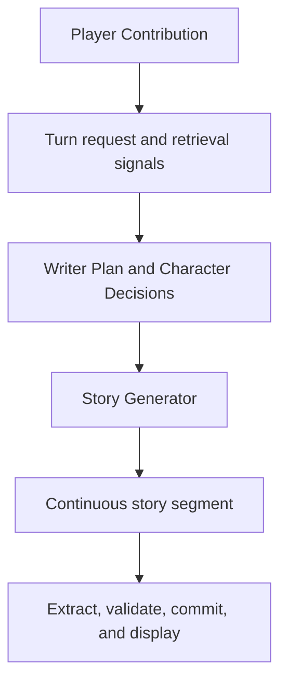

# Player Contribution Realization — Design

> **Date**: 2026-08-19
> **Author**: GPT-5.6 Sol
> **Status**: Accepted
> **Prior doc**: [Story Generator CSI-RC-FTI Prompt Spec](../exec/CSI-RC-FTI/2026-08-12-story-generator-csi-rc-fti-prompt-spec-gpt.md)

---

## Context

The current Turn contract calls the player's latest text `Player Input` from the HTTP request through prompt projection and persistence. Story Generator receives that text as the final Runtime Context section, but its objective says to “respond meaningfully” to it and its realization rule does not require the supplied material to appear in the generated prose. See `crates/aise/assets/prompts/context-v2/csi/story-generator.md.j2:8-17` and `crates/aise/assets/prompts/context-v2/rc/story-generator.md.j2:59-61`.

Trace `2026-08-19-11_56_38_199.json` exposes the failure. `Recent Story` ends before the Player Character speaks, the player supplies `“你是谁”`, Writer Planner plans to respond to the question, and Story Generator starts with the other character's answer without ever narrating the Player Character asking it. The model preserves the input's intent semantically but treats the input as an off-page chat message or an event that has already happened.

The same framing is reinforced outside Story Generator:

- Writer Planner treats the input as a basis for the next transition but does not state that it is not yet narrated (`crates/aise/assets/prompts/context-v2/csi/writer-planner.md.j2:14-17`).
- Character Think receives the same raw field and needs a sharper distinction between externally observable contribution components and private Player Character thoughts (`crates/aise/assets/prompts/context-v2/csi/character-think.md.j2:16-23`).
- Story Repairer preserves only the input's essential intent, so a repair can preserve or introduce the same omission.
- The web client separately renders `你：${turn.player_input}` before each generated segment and optimistically appends the same chat-style line while generation is pending (`crates/aise-server/assets/app.js:402-406`, `crates/aise-server/assets/app.js:471-480`).
- Active Rust, prompt-slot, JSON, trace, configuration, and database contracts all use `player_input`, so changing only a heading would leave the old mental model in code.

This must be fixed while the `TurnInitializer` through `StoryGenerator` path is being debugged, because every later prompt and state stage depends on the generated prose being a continuous, authoritative story segment.

### Constraints & assumptions

- The player continues to submit one bounded free-form text value per Turn; no separate speech/action/thought fields are introduced.
- A contribution may contain Player Character speech, attempted action, private thought, or any combination of them.
- A requested world or NPC outcome is not an authoritative Player Character contribution and is never guaranteed by the field.
- Story Generator may stage, reorder, paraphrase, and lightly elaborate supplied material, but elaboration must support rather than replace every explicit contribution component.
- Player-controlled attempts remain subject to committed state, hard constraints, character agency, and story causality.
- The rename is a hard refactor: no compatibility aliases, dual JSON fields, dual database columns, fallback prompt variables, or deprecated symbols remain.
- Historical migration files and archived design/spec documents remain immutable evidence; only active contracts and a new forward migration change.

---

## Principles

1. **Pending story material, not chat**: the latest player text has not occurred in committed continuity and must first be realized inside the next story segment.
2. **Explicit content is non-skippable**: every supplied utterance, attempted action, and private thought must appear on the page; inferred or invented material cannot substitute for it.
3. **Authority follows semantic type**: speech/action establishes the Player Character's contribution or attempt, thought establishes only a subjective private state, and desired external results establish nothing about the world.
4. **Epistemic isolation remains intact**: Writer Planner and Story Generator may read the whole contribution, while Character Think may use only what its Target Character could perceive or causally infer.
5. **One concept, one name**: active code, prompt variables, API, trace, configuration, persistence, and UI use `player_contribution`; prompts qualify the pre-commit value as `Pending Player Contribution`.
6. **Continuous story is authoritative**: downstream extraction, validation, summary, continuity, and display consume generated `story_text`, not a separately echoed chat line.

---

## Options

### Option A: Prompt-only clarification

- **Idea**: Strengthen Story Generator CSI/FTI while keeping `Player Input` and all existing runtime names.
- **Pros**:
  - Small change limited to prompt assets and prompt tests.
  - No API or persistence migration.
- **Cons**:
  - Writer Planner, Character Think, Story Repairer, trace, and UI retain conflicting semantics.
  - `respond to Player Input` and chat-style display continue to prime the wrong interaction model.
  - Future code is likely to reintroduce the ambiguity.
- **Risk**: The observed omission may improve for one model but remain unstable across providers and repair paths.

### Option B: End-to-end Player Contribution contract

- **Idea**: Rename the canonical concept to `Player Contribution`, label it `Pending Player Contribution` in pre-commit prompts, update all consuming pipelines, and make generated prose the only continuous-story display.
- **Pros**:
  - Aligns planning, epistemics, generation, repair, storage, trace, API, and UI around one lifecycle meaning.
  - Removes the chat-response framing instead of compensating for it only in one prompt.
  - Provides exhaustive old-name deletion checks and a durable database migration.
- **Cons**:
  - Breaks the current JSON, trace, configuration, and history-field names.
  - Touches more tests and persistence code.
- **Risk**: An incomplete rename could leave a missing prompt variable or stale client field; exhaustive search checks and full-workspace tests are required.

### Option C: Structured contribution classification

- **Idea**: Add a parser or LLM stage that converts free-form input into typed speech, action, thought, and requested-outcome components before planning.
- **Pros**:
  - Gives later stages explicit component boundaries.
  - Could support deterministic per-component tracking in the future.
- **Cons**:
  - Adds latency, failure modes, schema/version work, and another probabilistic interpretation before the currently debugged generation path.
  - Ambiguous language such as “我希望她相信我” still requires contextual judgment.
- **Risk**: The classifier becomes a new source of player-intent loss and blocks debugging of the simpler front path.

### Choice

**Adopt option B.**

**Rationale**: The defect is a system-wide concept mismatch, not only weak Story Generator wording. A single canonical rename plus stage-specific prompt semantics fixes the causal boundary without introducing a new LLM stage. Structured classification remains unnecessary until evidence shows the free-form contract cannot be handled reliably.

---

## Design

### 1. Target structure

The Turn-local value is pending until `story_text` is committed. The generated segment must contain the contribution's explicit in-world components before or while showing their immediate causal response. After commit, history keeps the original contribution for audit and replay, while continuity and the player-facing story use `story_text`.

### 2. Core types & responsibilities

| Type / Module | Responsibility | Out of scope |
|---|---|---|
| `TurnRequest.player_contribution` | Own the normalized, bounded, request-digested player contribution | Classifying speech/action/thought |
| `TurnExecutionContext::player_contribution()` | Expose the single Turn-owned value to pipelines | Persisting a second mutable copy |
| `RetrievalSignalOrigin::PlayerContribution` | Mark entity/topic signals extracted from the contribution | Treating the contribution as committed story evidence |
| `WriterPlannerPromptContextProjector` | Render the contribution as not-yet-narrated planning material | Writing its prose realization |
| `CharacterThinkPromptContext.player_contribution` | Supply the pending contribution under Target Character epistemic rules | Revealing private Player Character thought |
| `StoryGeneratorPromptContext.player_contribution` | Supply authoritative Player Character source material for on-page realization | Guaranteeing attempted outcomes |
| `StoryRepairerPromptContext` | Reuse the generation context and preserve or restore contribution realization in replacement prose | Replanning the Turn |
| `StoryTurn.player_contribution` | Persist the original normalized contribution with the committed Turn | Becoming part of Story Continuity by itself |
| `StoryTurnView.player_contribution` | Expose audit/history metadata | Rendering a separate chat transcript line |
| `TurnData.player_contribution` | Record the bounded value under the existing trace-content policy | Bypassing trace redaction/truncation policy |

### 3. Key flows

#### 3.1 Request and context preparation

1. The client submits `player_contribution`; request validation trims it, applies the existing character bound, and computes the same digest from the normalized bytes.
2. `TurnExecutionContext` owns the validated value for exactly one Turn.
3. `BaselineContextBuilder` passes it to `RetrievalSignalBuilder`, which extracts writer-side entity/topic signals tagged `PlayerContribution`.
4. The value is not copied into `BaselineContext`, `StoryReadSnapshot`, or committed continuity.

#### 3.2 Planning and private character decision

1. Writer Planner treats the value as pending material that Story Generator still must place on the page.
2. `story_goal` covers both its in-story realization and the immediate causal transition; it must not phrase only the aftermath as if the contribution already occurred.
3. Character Think may respond to impending speech or action only when the Target Character could perceive it in the scene.
4. Character Think must ignore private Player Character thought and unsupported desired world outcomes as character knowledge.

#### 3.3 Generation and repair

1. Story Generator identifies every explicit speech, attempted-action, and private-thought component without emitting a separate classification artifact.
2. It realizes each component in continuous prose, adapting person, tense, order, staging, and non-consequential details as needed.
3. It resolves action success and consequences through continuity, constraints, world facts, and character agency.
4. It treats thoughts as subjective and treats requested external outcomes as non-authoritative.
5. It then shows the immediate causal response and stops at the normal player interaction boundary.
6. Story Repairer returns a complete segment that continues to satisfy the same realization contract; if the previous draft skipped an explicit component, the replacement restores it.

#### 3.4 Commit, history, and display

1. Turn Committer persists `player_contribution` as Turn metadata and the generated segment as `story_text`.
2. A forward SQLite migration renames the live `story_turns.player_input` column while preserving all rows and idempotency data.
3. Story history returns both fields, but the game story view concatenates only opening and committed `story_text` values.
4. The client no longer appends or reloads a separate `你：...` line; the contribution appears through the generated prose itself.

### 4. Key decisions

- **Canonical name**: `Player Contribution` / `player_contribution`; `Pending` is a pre-commit prompt qualifier, not a second stored field.
- **No classifier**: stage prompts interpret the free-form value according to one shared semantic contract; no new pipeline or output schema is added.
- **Speech**: explicit speech is rendered directly or indirectly; if continuity makes it impossible, the attempt and obstacle are rendered instead of silently omitted.
- **Action**: the Player Character owns the attempt, while success and effects remain causal outcomes.
- **Thought**: explicit thought is authoritative only as the Player Character's subjective private state, never as objective truth or AI-character knowledge.
- **Requested outcome**: a first-person hope may be rendered as thought, but a command that the world or another character produce a result has no authority and is not guaranteed.
- **Downstream authority**: Story State Extractor, Validation, Summary, and Narrative resolution continue to inspect final story/state artifacts rather than raw `player_contribution`.
- **Compatibility**: JSON names, config names, trace fields, Rust symbols, prompt variables, DOM identifiers, and the live database column change in one hard refactor.

---

## Impact

- **Code**: Turn contracts/context/trace, context preparation and retrieval signals, Writer Planner, Character Think, Story Generator, Story Repairer prompt projection, persistence/history, server DTOs, web client, and their tests.
- **Config**: `StoryHistoryConfig.max_player_input_bytes` becomes `max_player_contribution_bytes`; all four active prompt profiles replace the `player_input` slot with `player_contribution`.
- **Data**: a new migration renames `story_turns.player_input` to `story_turns.player_contribution` without changing stored values.
- **External interface**: Turn POST JSON and story-history JSON use `player_contribution`; trace content uses the same field. Old field names are rejected rather than aliased.
- **Display**: the committed story view no longer renders the contribution as a separate chat message.
- **Unaffected data flow**: Story State Extractor, deterministic Validation, Narrative resolution, Story Summary, and Story Continuity continue to consume final story/state artifacts only.

---

## Risks & mitigations

| Risk | Likelihood | Impact | Mitigation |
|---|---|---|---|
| A stale `player_input` symbol leaves one stage unbound | Medium | High | Exhaustive `rg` checks over all active code/assets plus full-workspace tests |
| Existing databases lose or hide Turn input metadata | Low | High | Forward rename migration with fresh-schema and upgrade-with-data tests |
| Old clients fail after the JSON rename | High | Medium | Intentional hard break; update bundled client and reject old field in the same change |
| Character Think uses a private thought as observable input | Medium | High | Stage-specific CSI/FTI wording and mixed-contribution prompt tests |
| Story Generator still occasionally skips a component | Medium | Medium | CSI + FTI + NEVER coverage, exact prompt-contract tests, and a provider regression matrix based on the observed trace |
| Continuous display temporarily hides the submitted text while generation runs | High | Low | Keep the input control disabled/pending until the Turn terminates; display only committed story prose |
| Historical migrations still contain `player_input` | Certain | Low | Treat pre-0022 migrations as immutable history and scope zero-match checks to active code/assets |

---

## Roadmap

- **Single phase**: land the semantic prompt changes, end-to-end rename, database migration, continuous-story UI, and all tests together → spec `doc/exec/2026-08-19-player-contribution-realization-spec-gpt.md`.

---

## Appendix

### Canonical terminology

| Context | Required term |
|---|---|
| Product/domain concept | Player Contribution |
| Pre-commit RC heading | Pending Player Contribution |
| Rust field/function/local variable | `player_contribution` |
| Rust enum variant | `PlayerContribution` |
| Prompt variable / JSON / trace / config / database | `player_contribution` |
| Web DOM id / JavaScript variable | `player-contribution` / `playerContribution` |

### Representative corrected transition

Given committed continuity ending with the door latch moving and the contribution `“你是谁”`, the next segment must first include the Player Character's question, for example `你按住钥匙，隔着门问：“你是谁？”`, and only then or concurrently render the person outside answering. Additional staging is allowed; replacing the supplied question with staging is not.
