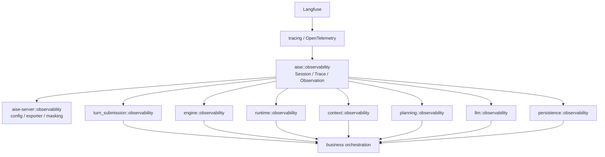
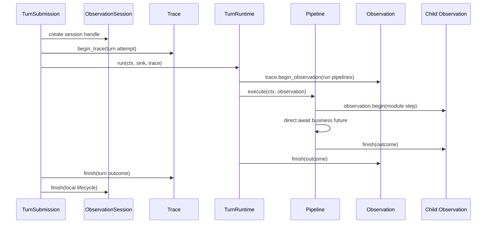

# Langfuse Observability 数据模型对齐 — Refactor

> 本文中的 Future instrumentation 方案已由
> [Observation Future Instrumentation Removal](../exec/2026-09-25-observability-explicit-parent-remediation-spec-gpt.md)
> 取代。当前实现必须直接等待业务 Future，并显式传递 `&Trace` 或 `&Observation`。

> **Date**: 2026-09-25
> **Author**: GPT-5.6 Sol
> **Status**: Draft
> **Scope**: `crates/aise/src/observability/`、各业务模块的 `observability/`、`crates/aise-server/src/observability/`、Turn 执行接口
> **Prior doc**: [Langfuse Trace 系统重构](../design/2026-09-23-langfuse-trace-system-design-gpt.md)

---

## Context

现有系统已经能向 Langfuse 导出可用数据，但本地抽象没有与 Langfuse 的 `Session → Trace → Observation` 数据模型一一对应。当前实现把 Trace 根、Observation、业务步骤注册表和内容采集放在 `turn::observability`，并依赖隐式 tracing scope 传播父子关系。这使基础设施层知道全部业务步骤，也使业务调用点仍然承担 Observation 组装。

Langfuse 官方数据模型规定：

- Session 可选地聚合多条 Trace，典型语义是一次多轮用户交互。
- Trace 表示一次请求或操作，包含共享同一 `trace_id` 的全部 Observation。
- Observation 表示 LLM、工具、检索或普通执行步骤，并可递归嵌套。
- Session 不是 Observation，也不是 OpenTelemetry Span；本地 `session.finish()` 不得导出伪造的 Session Span。

参考：[Langfuse Observability Data Model](https://langfuse.com/docs/observability/data-model)。

### 1. 本地类型没有对齐 Langfuse 三层模型

- `crates/aise/src/turn/observability/mod.rs:1-8` 只公开 `ObservationTrace` 和 `ObservationSpan`，缺少显式 Session 抽象，Trace 与 Observation 的命名也混入 OpenTelemetry Span 实现。
- `crates/aise/src/turn/observability/trace.rs:14-21` 的 `ObservationTrace` 同时拥有根 Span、baggage、内容编码器和晚绑定属性，职责跨越 Trace、根 Observation 与内容采集。
- `crates/aise/src/turn/observability/span.rs:26-60` 的 `ObservationSpan` 才是实际 Langfuse Observation，但对业务暴露的是底层 Span 语义。
- `crates/aise/src/turn/observability/step.rs:25-147` 由基础模块集中枚举全部业务步骤、显示名称和 Observation 类型，导致基础模块反向知道 submission、runtime、context、planning、LLM 和 persistence 的业务结构。

### 2. 顶层 observability 混入业务知识

- `crates/aise/src/turn/observability/fields.rs:20-62` 集中定义 Story、Turn、角色、激活、提交等业务 metadata key。
- `crates/aise/src/turn/observability/span.rs:267-326` 通过全局 `match` 创建每一种业务 Span，新增业务步骤必须修改共享基础模块。
- `crates/aise/src/turn/observability/trace.rs:114-152` 直接提供 `bind_session`、`bind_request`、`bind_turn`，把 AISE Turn 语义固化进通用 Trace。
- 模块位于 `turn` 下，使 server observability、LLM、context 和 persistence 都依赖 `turn::observability`，与其跨模块基础能力身份不一致。

### 3. 业务编排仍暴露 Trace 组装细节

- `crates/aise/src/context/baseline_ctx_builder.rs:88-97` 在主业务流程中显式执行 `begin → direct await → finish`。
- `crates/aise/src/runtime/turn_runtime.rs:30-60`、`crates/aise/src/runtime/turn_runtime.rs:161-174` 直接组装 `ObservationFields`、状态、错误和 skip metadata。
- `crates/aise/src/engine.rs:133-210` 直接创建协调、Story 读取和幂等检查 Observation。
- `crates/aise-server/src/turn_submission/service.rs:77-228` 同时负责 Session 查询、Trace 根构造、内容采集、三个 Observation 和跨 task Trace ownership 转移。
- `crates/aise/src/llm/gateway.rs`、`crates/aise/src/persistence/turn_committer.rs`、`crates/aise/src/planning/writer_planner.rs` 也直接依赖共享字段与步骤枚举。

这些调用点违反 `R-CODE-08` 的目标：编排函数应只展示业务步骤，字段映射、内容编码、错误归类和结束状态应由本模块 observability 封装负责。

### 4. 父子关系依赖隐式 scope，而不是显式 Observation 传播

- 旧实现曾使用 Future instrumentation 建立当前 tracing scope；该路径已删除。
- `crates/aise/src/runtime/turn_runtime.rs:31-33` 只提取一次 `RunTurnPipelines` Context，后续所有 stage 都使用同一个父 Context。
- `TurnExecutionPipeline::execute` 当前只接收 `&mut TurnExecutionContext`，内部子步骤依赖外层 `in_scope` 的隐式当前 Span。
- `crates/aise/src/turn/turn_context.rs:912-1011` 把 `ObservationStep` 放入 `TurnLlmCallScope`，通过阶段到 LLM 步骤的第二份映射补偿没有显式父 Observation 的问题。

结果是数据流中看不到父 Observation，跨 task、并行分支或新增子模块时容易把节点挂到错误父级。

### 5. Pipeline 契约采用显式 Observation 参数

本重构确定修改 `R-AISE-02` 与 `TurnExecutionPipeline` 契约：Pipeline 通过 `&mut TurnExecutionContext` 交换业务状态，同时通过独立的 `&Observation` 接收显式观测父节点。`Observation` 只用于建立 Trace 层级和记录观测数据，不得承载业务状态，也不得存入 `TurnExecutionContext`。该决策消除了对隐式当前 Span 的依赖，并保持业务状态只有一个交换通道。

---

## Refactor principles

1. **模型一一对应**：本地只保留 `ObservationSession`、`Trace`、`Observation` 三个生命周期类型，分别对应 Langfuse Session、Trace、Observation。
2. **Session 不伪装成 Span**：`ObservationSession` 只保存分组身份和 Trace 公共属性；`finish` 只结束本地生命周期并做完整性诊断，不向 Langfuse 导出 Session Observation。
3. **一次 Turn attempt 一条 Trace**：application Session 聚合多个 Turn Trace；Pipeline、Job、LLM、Retriever、Tool 和 Evaluator 都是该 Trace 下的 Observation，不把普通 Pipeline stage 错拆成独立 Trace。
4. **显式父对象传播**：需要继续建立子链路的调用必须显式接收 `&Trace` 或 `&Observation`；不得以 `Span::current()`、全局变量或 `TurnExecutionContext` 隐藏父节点。
5. **基础模块无业务知识**：`crates/aise/src/observability/` 只依赖 std、serde、tracing/OpenTelemetry 和 Langfuse 属性契约，不导入 `turn`、`runtime`、`context`、`planning`、`character`、`story`、`validation`、`persistence` 或 `domain`。
6. **业务模块自封装**：每个需要 Trace 的模块拥有自己的 `observability/`，可强依赖本模块类型和顶层 observability；业务名称、输入输出 DTO、metadata、错误映射和 finish 组装全部放入该目录。
7. **编排只保留生命周期调用**：业务函数中允许出现 `begin`、`trace`、传递父对象和 `finish`，但不允许出现 Langfuse key、`ObservationFields`、内容编码、usage/cost JSON 或错误分类组装。
8. **硬重构**：不保留 `turn::observability` re-export、兼容 adapter、旧 `ObservationStep`、双签名 Pipeline 或基于当前 Span 的 fallback。
9. **单次合并、分阶段实现**：阶段可独立提交和测试，但在同一个合并变更内完成切换与旧路径删除，不部署双路径。

---

## Change list

| # | File / Module | Change | Priority | Phase | Note |
|---|---|---|---|---|---|
| 1 | `crates/aise/src/observability/` | add | P1 | Phase 1 | 新建无业务知识的 Session、Trace、Observation、内容与字段基础抽象 |
| 2 | `crates/aise/src/lib.rs` | migrate | P1 | Phase 1 | 声明顶层 `observability` |
| 3 | `crates/aise/src/turn/observability/` | delete | P1 | Phase 4 | 新调用面全部迁移后删除旧实现与测试 |
| 4 | `crates/aise/src/turn/mod.rs` | rewrite | P1 | Phase 4 | 删除旧 observability 声明 |
| 5 | `crates/aise/src/turn/turn_pipeline.rs` | rewrite | P1 | Phase 2 | Pipeline `execute` 增加显式 `&Observation` |
| 6 | `crates/aise/src/turn/turn_context.rs` | rewrite | P1 | Phase 3 | 删除 encoder 和 `ObservationStep` 状态及 stage 映射 |
| 7 | `crates/aise/src/runtime/observability/` | add | P1 | Phase 2 | 封装 Turn Trace、runtime 与 stage Observation |
| 8 | `crates/aise/src/runtime/turn_runtime.rs` | rewrite | P1 | Phase 2 | 显式传递父 Observation，移除字段与错误组装 |
| 9 | `crates/aise/src/context/observability/` | add | P1 | Phase 3 | 接管 baseline 输入输出、错误和 metadata 映射 |
| 10 | `crates/aise/src/context/baseline_observation.rs` | delete | P1 | Phase 3 | 由 context 自有 observability 目录替代 |
| 11 | `crates/aise/src/context/baseline_ctx_builder.rs` | rewrite | P1 | Phase 3 | 子任务显式接收并继续传递 Observation |
| 12 | `crates/aise/src/llm/observability/` | add | P1 | Phase 3 | 封装 generation、embedding、usage、cost、provider 错误 |
| 13 | `crates/aise/src/llm/gateway.rs` | rewrite | P1 | Phase 3 | 接收父 Observation，删除共享步骤枚举依赖 |
| 14 | `crates/aise/src/planning/observability/` | add | P1 | Phase 3 | 封装 narrative projection 与 writer planning |
| 15 | `crates/aise/src/planning/writer_planner.rs` | rewrite | P1 | Phase 3 | 仅保留简洁生命周期调用 |
| 16 | `crates/aise/src/persistence/observability/` | add | P1 | Phase 3 | 封装 persist-turn 与 commit outcome |
| 17 | `crates/aise/src/persistence/turn_committer.rs` | rewrite | P1 | Phase 3 | 显式传父 Observation，移除字段组装 |
| 18 | `crates/aise/src/engine.rs` | migrate | P1 | Phase 2 | 迁移为 `engine/mod.rs` 索引与 `engine/service.rs` 实现 |
| 19 | `crates/aise/src/engine/observability/` | add | P1 | Phase 2 | 封装 Story 协调、加载、幂等和 Trace 终态 |
| 20 | `crates/aise-server/src/turn_submission/observability/` | add | P1 | Phase 2 | 封装 Session、Trace、提交前置 Observation |
| 21 | `crates/aise-server/src/turn_submission/service.rs` | rewrite | P1 | Phase 2 | 删除原始字段组装和 `ObservationTrace` oneshot 转移 |
| 22 | `crates/aise-server/src/observability/` | rewrite | P1 | Phase 1 | 只保留配置、OTel runtime、Langfuse export/masking |
| 23 | `crates/aise-server/src/app.rs` | migrate | P2 | Phase 4 | 改用顶层内容采集类型 |
| 24 | 各 `tests/` | rewrite | P1 | Phase 1-4 | 分层验证模型、父子关系和模块映射 |
| 25 | `AGENTS.md` 与架构文档 | rewrite | P1 | Phase 0 | 调整 `R-AISE-02` 和 Pipeline 契约，记录 observability 基础依赖 |
| 26 | `doc/design/2026-09-23-langfuse-trace-system-design-gpt.md` | update | P2 | Phase 4 | 将旧 `ObservationTrace`/`ObservationSpan` 设计标记为已被本重构替代 |

### Deletions

- `crates/aise/src/turn/observability/` — 被顶层 Langfuse 数据模型抽象替代。
- `crates/aise/src/context/baseline_observation.rs` — 被 `context/observability/` 替代。
- 全局 `ObservationStep` 与 `ObservationStep::ALL` — 业务名称和类型回归各模块所有。
- `TurnExecutionContext.observation_encoder`、`TurnLlmCallScope.observation_step`、`observation_step_for_stage` — 父节点与内容能力改由显式 Observation 传递。
- 仅用于旧 API 的 `observe_result` 和未使用的 `LlmObservation`。
- `TurnSubmissionService` 中传递 `ObservationTrace` 的 oneshot channel — Trace 在拥有 Turn task 的作用域内创建和结束。

### Additions

- `crates/aise/src/observability/session.rs` — Langfuse Session 本地句柄。
- `crates/aise/src/observability/trace.rs` — Trace 生命周期、Trace 公共属性和根 Observation。
- `crates/aise/src/observability/observation.rs` — 可递归嵌套且可显式传递的 Observation。
- `crates/aise/src/observability/model.rs` — 通用 spec、kind、status、error、usage、cost 和 attribute value。
- `crates/aise/src/observability/content.rs` — 有界内容采集。
- 各业务模块的 `observability/mod.rs` 与职责文件；`mod.rs` 只做声明和 re-export。

### Renames

- `ObservationTrace` → `Trace` — 与 Langfuse Trace 直接对应。
- `ObservationSpan` → `Observation` — Langfuse 将 Span 称为 Observation，避免把 OTel 实现细节暴露给业务。
- `ObservationFields` → `ObservationSpec` — 表达创建参数。
- `ObservationFinish` → `ObservationOutcome` — 表达终态数据。
- `ContentCaptureLimits` → `ObservabilityContentConfig` — 配置命名与运行时状态分离。

---

## Target structure

### 1. Module relationships



依赖方向固定为“业务 observability → 顶层 observability → tracing/OpenTelemetry/Langfuse 属性契约”。顶层 observability 不得导入任何业务模块。`aise-server::observability` 是外层运行时和 exporter，不是业务 Trace 组装位置。

目标目录：

```text
crates/aise/src/observability/
  mod.rs
  session.rs
  trace.rs
  observation.rs
  model.rs
  content.rs
  tests/

crates/aise/src/runtime/observability/
  mod.rs
  turn.rs
  stage.rs
  tests/

crates/aise/src/context/observability/
  mod.rs
  baseline.rs
  tests/

crates/aise/src/llm/observability/
  mod.rs
  generation.rs
  tests/
```

planning、persistence、engine 和 turn_submission 使用同样的目录式模块布局。

### 2. Core type definitions

```rust
pub struct ObservationSession {
    context: SessionContext,
    finished: bool,
}

pub struct Trace {
    root: Observation,
    context: TraceContext,
    finished: bool,
}

pub struct Observation {
    span: tracing::Span,
    context: opentelemetry::Context,
    content: ContentCapture,
    finished: bool,
}

pub struct SessionSpec {
    pub id: Option<String>,
    pub user_id: Option<String>,
    pub metadata: Vec<Attribute>,
}

pub struct TraceSpec {
    pub name: &'static str,
    pub input: Option<BoundedContent>,
    pub metadata: Vec<Attribute>,
    pub tags: Vec<String>,
}

pub struct ObservationSpec {
    pub name: &'static str,
    pub kind: ObservationKind,
    pub input: Option<BoundedContent>,
    pub metadata: Vec<Attribute>,
}

impl ObservationSession {
    pub fn begin_trace(&self, spec: TraceSpec) -> Trace;
    pub fn finish(self, outcome: SessionOutcome);
}

impl Trace {
    pub fn begin_observation(&self, spec: ObservationSpec) -> Observation;
    pub fn finish(self, outcome: TraceOutcome);
}

impl Observation {
    pub fn begin(&self, spec: ObservationSpec) -> Observation;
    pub fn finish(self, outcome: ObservationOutcome);
}
```

约束：

- `finish` 消费句柄，编译期禁止正常路径重复结束；`Drop` 仍以 `incomplete` 结束未完成 Trace/Observation。
- `Observation::begin` 必须使用自身保存的 OTel Context 设置显式父节点，不查询 `Span::current()`。
- 业务 Future 由编排函数直接 `.await`；业务 metadata 和 outcome 映射由模块 observability helper 提供。
- `ObservationSession` 不创建 Span。它向 `Trace` 提供 session id、user id 和 session metadata；`finish` 不产生 OTLP 节点。
- `Trace` 的 root 同时是 Langfuse Trace 的根 Observation。Trace 级属性由 exporter 传播到该 Trace 的全部 Observation。
- `Trace` 和 `Observation` 不暴露原始 `tracing::Span` 或 `opentelemetry::Context` 给业务模块。

### 3. Business module facade

每个业务 observability 模块提供语义化 facade，不向业务文件暴露 `ObservationSpec` 和 `ObservationOutcome`：

```rust
pub fn begin_load_story_snapshot(
    parent: &Observation,
    ctx: &TurnExecutionContext,
) -> LoadStorySnapshotObservation;

impl LoadStorySnapshotObservation {
    pub fn observation(&self) -> &Observation;
    pub fn finish(
        self,
        ctx: &TurnExecutionContext,
        outcome: &Result<StoryReadSnapshot, StoreError>,
    );
}
```

业务调用保持一个抽象层级：

```rust
let observation = context_observability::begin_load_story_snapshot(parent, ctx);
let outcome = self.store.load_story_snapshot(&story_id, limits).await;
observation.finish(ctx, &outcome);
```

若 store 本身不创建子 Observation，则不增加无意义参数：

```rust
let outcome = self.store.load_story_snapshot(&story_id, limits).await;
```

是否继续传递 Observation 由被调模块是否需要创建子节点决定，不要求所有底层函数机械增加参数。

### 4. Key flow



AISE 的标准树固定为：

```text
Application interaction Session
└── Turn attempt Trace
    └── run-turn-pipelines Observation
        ├── prepare-context Observation
        │   ├── load-story-snapshot Observation
        │   └── activate-world-info Observation
        ├── plan-turn Observation
        │   ├── project-narrative Observation
        │   └── generate-writer-plan Generation
        └── ...
```

Pipeline stage 是 Observation，不是 Trace。只有可独立作为一次请求或操作、需要独立 trace id 的工作才允许 `session.begin_trace`。

### 5. Turn contract adjustment

目标签名：

```rust
async fn execute(
    &self,
    ctx: &mut TurnExecutionContext,
    observation: &Observation,
) -> Result<(), TurnExecutionError>;
```

`R-AISE-02` 采用以下约束：Pipeline 只通过 `&mut TurnExecutionContext` 读写和交换 Turn 业务状态，并且必须通过独立的只读 `&Observation` 参数接收显式观测父节点；不得通过 Observation 读写业务状态，也不得把 Observation 存入 `TurnExecutionContext`。

---

## Migration steps

1. **建立顶层三层模型**：新增 `aise::observability` 和独立测试，不接入业务路径 — 验收：Session 不产生 Span；一个 Session 可创建多条不同 trace id 的 Trace；Observation 可递归形成正确 parent id。
2. **迁移 composition root、submission、engine 与 runtime**：创建 application Session、Turn Trace 和 runtime Observation，修改 Pipeline trait — 验收：成功、前置失败、取消和 admission failure 各有且只有一条 Turn Trace；无 `ObservationTrace` oneshot。
3. **迁移各业务模块 facade**：依次迁移 context、planning、LLM、character/story 调用点、validation 和 persistence — 验收：业务编排文件不再出现通用 fields/outcome/key 组装，子节点全部通过显式 `&Observation` 建立。
4. **删除旧路径并校验架构规则**：删除 `turn::observability`、Context 内观测状态、全局步骤枚举和兼容 import，确认实现符合已更新的 `R-AISE-02` — 验收：`rg 'turn::observability|ObservationTrace|ObservationSpan|ObservationStep' crates/` 无结果。
5. **端到端与性能验证**：向 Langfuse 测试项目发送多 Turn Session，校验树、状态、usage、cost、内容策略和 exporter 故障隔离 — 验收：Session/Trace/Observation 层级与官方模型一致，关闭和 exporter 故障时业务结果不变。

所有步骤属于同一硬重构。中间提交可以不具备完整业务功能，但最终合并提交不得包含旧新双路径。

---

## External impact

- **HTTP / WS URLs**：无 URL 变化；请求与 SSE 业务协议不变。
- **DB schema / storage**：无数据库迁移；application Session ID 继续作为 Langfuse session id。
- **Prompt assets**：无变化。
- **Config files**：现有 Langfuse/OTel 环境变量语义保持不变；Rust 配置类型从旧 fields 模块迁到顶层 content/config 类型。
- **Langfuse data**：不迁移历史数据；新 Trace schema version 必须从 `1` 提升到 `2`，便于区分重构前后的名称与树结构。
- **Downstream**：所有 `TurnExecutionPipeline` 实现和测试 double 必须增加 `&Observation` 参数；`AiseEngine` 与 `TurnSubmissionService` 的内部 Trace 参数变化，但公共 HTTP API 不变。
- **Architecture rules**：`R-AISE-02` 和依赖矩阵已先行修改，允许 Pipeline 显式依赖顶层 observability leaf module。

---

## Risks & rollback

| Risk | Mitigation | Rollback cost |
|---|---|---|
| 把 Pipeline stage 错建成多条 Trace，破坏单次 Turn 全链路 | 固定“一 Turn attempt 一 Trace”，增加 trace id/tree 快照测试 | high |
| Session 被实现成伪根 Span | Session 无 Span 单测；exporter 断言不存在 session observation type | low |
| 显式参数迁移遗漏导致节点丢父级 | 禁止 `Span::current()` fallback；in-memory exporter 校验每个节点 parent id | medium |
| Pipeline 实现遗漏新的 Observation 参数 | trait 编译约束覆盖全部实现，测试 double 与业务 Pipeline 同步迁移 | medium |
| 各模块重复定义名称或 key | 通用 Langfuse key 留在顶层，业务名称/metadata key 由模块拥有并做局部快照测试 | medium |
| facade 过厚并复制业务逻辑 | facade 只做输入输出投影、内容编码和状态映射，不做业务决策或 I/O | medium |
| `Trace`/`Observation` 跨 task 所有权错误 | 明确唯一 owner，优先在 task 内创建 Trace；需要转移时只允许一次 move | medium |
| 内容限制在父子 Observation 间失效 | 每个 Observation 保持独立硬上限，Trace 级总预算继续有界并测试 | medium |
| schema version 变化影响 saved view/evaluator | 版本提升为 `2`，保留稳定名称；上线前审计 saved views | medium |

这是硬重构，不提供运行时 rollback 或兼容开关。失败时回退整个提交范围；不得恢复旧 API 与新 API 并存。

---

## Acceptance checklist

- [ ] `aise::observability` 公开 `ObservationSession`、`Trace`、`Observation`，三者语义与 Langfuse 官方数据模型一致。
- [ ] `ObservationSession` 不创建 OpenTelemetry Span，`finish` 不导出伪 Session 节点。
- [ ] 同一 application Session 的多个 Turn 具有相同 session id、不同 trace id。
- [ ] 每次 Turn attempt 只有一条 Trace；Pipeline、LLM、Retriever、Tool 和 Evaluator 均为嵌套 Observation。
- [ ] 所有子 Observation 由显式 `&Trace` 或 `&Observation` 创建，不依赖 `Span::current()` 推断父级。
- [ ] `TurnExecutionPipeline::execute` 显式接收 `&Observation`，`TurnExecutionContext` 不保存 Observation、OTel Context 或内容 encoder。
- [ ] 顶层 observability 不导入任何 AISE 业务模块，不包含 Story、Turn、角色、Pipeline 名称或错误码。
- [ ] 各需要 Trace 的业务模块拥有自己的 `observability/`，所有 Trace 组装位于其中。
- [ ] 业务编排文件不直接构造通用 `ObservationSpec`、`ObservationOutcome` 或 Langfuse 属性 key。
- [ ] `rg 'turn::observability|ObservationTrace|ObservationSpan|ObservationStep' crates/` 无结果。
- [ ] `cargo fmt --all -- --check`、workspace test 和 clippy 通过且无 warning。
- [ ] in-memory exporter 测试覆盖 Session 聚合、Trace 隔离、三层父子关系、跨 task、早退和 `incomplete`。
- [ ] Langfuse 端到端验证可按 session 回放多 Turn，并可在单条 Trace 中查看完整 Turn Observation 树。
- [ ] exporter 阻塞、队列满或不可达时不改变业务结果，也不让业务 future 等待网络。
- [ ] `AGENTS.md`、架构设计和原 Langfuse 设计文档已同步。

---

## Appendix

### A. 不采用的方案

1. **只重命名 `ObservationTrace` 和 `ObservationSpan`**：不能移除全局业务步骤枚举、隐式父级和模块组装泄漏。
2. **把 Observation 放入 `TurnExecutionContext`**：保持了旧 Pipeline 签名，但形成隐藏共享状态，与显式传递目标冲突。
3. **每个 Pipeline 建一条 Trace**：会把一次 Turn 请求拆散，无法在单 Trace 中查看端到端延迟和错误传播，不符合 Langfuse 对 Trace 的定义。
4. **让各模块直接写 Langfuse key**：会复制协议知识，使 exporter/schema 升级需要修改全部业务模块。

### B. 保留在顶层的通用内容

- Langfuse/OTel attribute contract。
- `ObservationKind`、状态、错误、usage、cost 的通用载体。
- 有界内容编码与 capture policy。
- RAII incomplete、显式 parent context、future instrumentation。
- Trace 级 session/user/tags/environment/release/schema version 传播。

### C. 必须下沉到业务模块的内容

- Observation 稳定名称。
- Story、Turn、角色、Pipeline、重试和提交 metadata key。
- 输入输出投影 DTO。
- 本模块错误到 observation status/error code 的映射。
- 哪些函数开始子 Observation、何时 finish、哪些 outcome 字段可记录。
